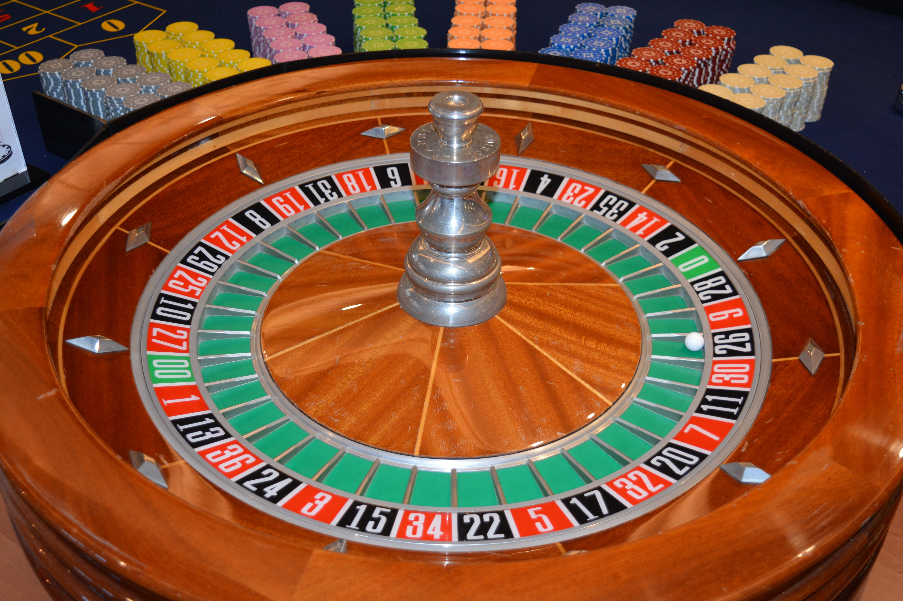
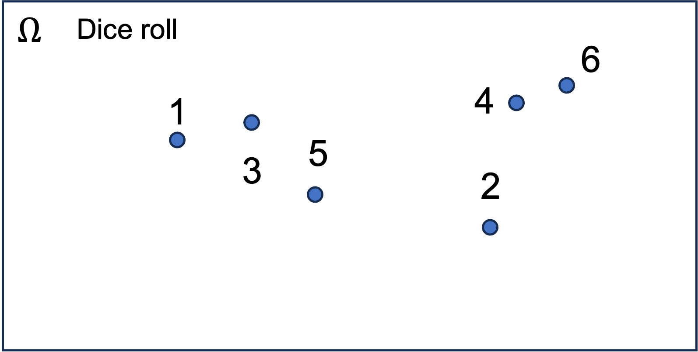
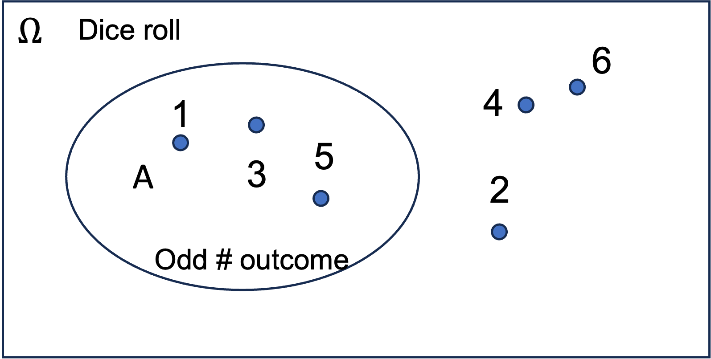
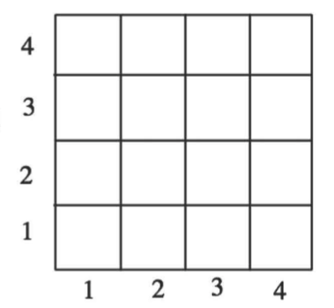
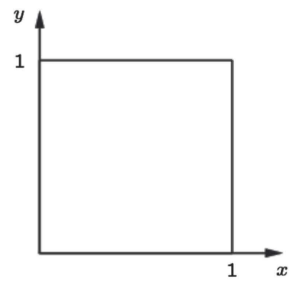
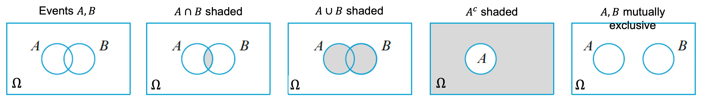

```{css, echo=FALSE}
.bluebox {
  padding: 1em;
  background: SteelBlue;
  color: white;
  border: 2px solid orange;
  border-radius: 10px;
}
.center {
  text-align: center;
}
```

<script type="text/javascript">
<!--
function toggle_visibility(id) {
  var e = document.getElementById(id); 
  if(e.style.display == 'none')
    e.style.display = 'block';
  else
    e.style.display = 'none';
}

function answer_top(name){
  var injection1 = '<a onclick=toggle_visibility("' + name + '")><b><u>Show answer</b></u></a>\n'
  document.write(injection1 + "\n")
  var injection2 = '<div id="' + name + '"style=display:none>'
  document.write(injection2 + "\n")
}

function answer_bottom() {
  document.write("</div>" + "\n")
}
//-->
</script>  

<div style="display:none">
  $
\newcommand{\imp}{\Longrightarrow}
\newcommand{\cprob}[1]{\Pr( #1 )}
\newcommand{\aleq}[1]{\begin{align*}#1\end{align*}}
\newcommand{\real}{{\mathbb R}}
\newcommand{\set}[1]{\{#1\}}
\newcommand{\Set}{\text}
\newcommand{\qed}{\blacksquare}
\newcommand{\comp}{\overline}
  $
</div>


```{r setup, include=FALSE}
knitr::opts_chunk$set(echo = TRUE,message=FALSE,fig.align="center",fig.width=7,fig.height=2.5)
pacman::p_load(
       car
      , ggplot2
      , ggExtra
      , learnr
      , reshape2
      , corrplot
      , RColorBrewer
      , lubridate
      , AmesHousing
      )
```

```{css, echo=FALSE}
.bluebox {
  padding: 1em;
  background: SteelBlue;
  color: white;
  border: 2px solid orange;
  border-radius: 10px;
}
.center {
  text-align: center;
}
```


```{r,echo=FALSE}
# Global parameter
show_code <- TRUE
```
## Introduction
### Roadmap

Module  |  Topic                                      | What you should know                         |
--------|---------------------------------------------|----------------------------------------------|
**M1**  | **Why Probability? What is Probability?**   | **Probability Is Essential For Logic**       |
M2      | Conditioning, Bayes Rule, and Independence  | Understand why you can learn by conditioning |
M3      | Counting and Simulation                     | Learn how to count probability by simulation |
M4      | RV and Discrete Distributions               | Learn the d,p,q,r functions of probability   |
M5      | Continuous Distributions and Multiple RVs.  | Know how to work with Normal distribution    |
M6      | Joint, Marginal, Conditional, Independence  | Can manipulate joint distribution            |
M7      | Summarizing Random Variables.               | Able to Calculate Expectation and Variance   |
M8      | Simulation (multiple RV) and Limit Theorems | Understand Sampling distribution and CLT     |
M9      | Point Estimation                            | Maximum likelihood and Method of Moment      |
M10     | Classical Inference and Bootstrap           | Bootstrap, P-value, Confidence Interval, etc |                 
M11     | Bayesian Inference                          | Use Stan to do Bayesian Inference            |

### Overview of Module 1

In this first module, you will learn the basics of probability.  You can spend more than a semester going deep into probability theory.  The goal for us is not to become a probabilist, but to get sufficient clarity in the concept so that we can think about more advanced topics. The main message that we'd like you to understand is that probability calculation is not just about gambling or games but about logic and how to make sense of the world that is uncertain.  We will quickly dive into probability assuming you have the basic knowledge of notations set and logic.  If not, we also have review of propositional logic and set theory that you can reference.

The topics we will go over

- Propositional logic
- Set theory
- Probabilistic Model
- Mathematical description of uncertain situations
- Outcome Space, Event, Probability Law
- Elements of probability theory
- Probability Axioms
- 3 axioms for the completeness of a theory
- Perspectives of probability

### Why Study Probablility?

We'd like to think our life is well organized and predictable.  That nothing unexpected will happen, that good things happen to good people, and we will live a life happily ever after.  Yet, that is often not true.  You might trip on a stone that was happened to be in front of your foot while rushing to work.  Or a lottery might change your life.  Have you had to make decisions like the following?

- Do you go to one university or another?  
- Should you bet on red or black at a casino?
- How many products must you order to meet the demand next year?
- Which candidate should we hire for a position?
- Would your child enjoy chocolate or strawberry ice cream?  the list can go on and on...

One might say that all of what happens is pre-determined by a greater power beyond our imagination.  
This sort of discussion has happened countless number of times, in all corners of religion, phylosophy or physics.
However, the fact that we don't have a way to access that information, I think it's safe to say that on a practical level, we need to deal with the fact that randomness is ubiquitous in life.  What should we do when making decisions that are uncertain?

- Ask our intuition? 
- Rely on our past experience?
- Randomly choose?
- Or is there something else we can do?

If you are faced with an entirely random event, 
random choice is as good as any choice.  
You could try to build a logical argument like this one;

> - All the females that work for my company XYZ that graduated from BU MSSP has been great.
> - Anna is from BU MSSP.
> - So 
> - Is Anna also great?

We make this type of argument all the time.  Is it a valid argument?  Not really...
This is an example of a risky argument.  We can try to make this argument strong as possible.
But no matter how much you try,  there is NO way you can be 100% certain about an individual you've never worked with.  Your past may be a good proxy for the future but sometimes it will be different and that's the reality.  
Then should we give up trying to reason?  Well, not so fast.  If we can sort out what we can understand and what we cannot, that would increase the odds of making the **right** decision.

> Imagine you are giving a present to your grandmother.  She has a specific snack that she prefers to eat.
> It's Chocolate on Mondays, gummy bears on Tuesdays, cake on Wednesdays, etc.  But on any day, she has a craving for savory potato chips.  Today is Monday. What should you give her?  It's pretty clear at this point that it's chocolate or chips.  There is something that you can't control; your grandmother's mood.  But you've narrowed down the choice to 2 options using available information.  

Our goal in this class is to learn how to build probabilistic models for all situations involving random outcomes.  We will start by reviewing probability.  Probability theory can easily be seen as an extension of propositional calculus to deal with uncertainty.  I'm pretty sure you've seen some of the notations we will use but since you may not remember propositional logic and set theory we will review some of that as well.

### Summary and Rules

This will be a class about probability and using probability to think.
It's not a math class that teaches you proofs.  We will include some of the proofs as needed.
However, the most important quest you should be asking is "so what"?
We try to ground everything we teach in practice. Toy examples like coins and cards are used not because we care about gambling.  It's important to think of ways to connect examples to reality.

#### Rules

- It is not your responsibility to know everything, look smart, and pretend you are a good student.  
You have all the rights to be confused, frustrated and be demanding of the instructors. So raise the hands and say you don't understand.  As soon as possible and as often as possible.   
- If you cannot use what you've learned, you need to talk to the instructors right away because knowing is not enough.
- If you understand something, try to help your neighbors.  You will be surprised that every time you teach you learn something.

## Probability

<!-- What is a Probabilistic model? -->

<!-- - Assign a number to each outcome or a set of outcomes -->

<!-- - Mathematical description of an uncertain situation -->


<!-- 1. Experiment -->

<!-- 2. Observation: a random outcome -->

<!-- 3. All outcomes -->

<!-- 1. Flip two coins -->

<!-- 2. for example, $(H,H)$ -->

<!-- 3. $\{ (H,H), (H,T), (T,H), (T,T) \}$ -->


### Probabilistic Examples

You must have talked about probability, (testing one's) luck or chance (events). 
But what does it mean?  Let's think about examples.

#### Roulette

The often used example is gambling.  Here is a picture of a roulette.

```{r , echo=FALSE, out.width = '45%',fig.align="center"}

#```
```

It has 38 slots a ball can drop and they are colored red, black or green.
Participants will make a bet on where the ball will land.  If they get it right,
they win.

#### Insurance

You buy an insurance for things like car or house.  The insurance company will tell you how much you pay.
The insurance company makes money from you but it looses money if you get into an accident and they have to cover the cost.  So the insurance company is making a risky decision. 
They can do it because they have other customers that are also paying the premium (and other details that we will not get into).  As long as on the whole the amount they charge is above what they pay they are making profit.
Which means the insurance company is making a bet on the likeliness that you will have an accident or not.


#### 


In all the above, you may have noticed that you need to have a notion of what is possible.
Then you needed to know which of the possibility is more likely.  This is the first thing you need to understand 
about the elements of a probabilistic model.

### Elements of the Probabilistic Model

To define a probability you need the following two things

- Outcome Space $\Omega$: You need a list of all outcomes of interest well defined.  
- Probability Law $\cprob{\cdot}$: You need a rule that assigns numbers to each outcome of $\Omega$.

That sounds simple.  But can we have any list and any rule?  You know that you can't have probability 1000.
Question: What are the conditions of $\Omega$ and $\cprob{\cdot}$ under which their induced probability model becomes "legitimate"?


### 1. Outcome Space $\Omega$ and Events

To define a probability you need a clear definition of the outcome space.
Outcome space is the set of all outcomes of **my interest** expressed using $\Omega$ (Omega).

For example if we have a dice roll $\Omega=\{1,2,3,4,5,6\}$
```{r , echo=FALSE, out.width = '75%',fig.align="center" ,fig.cap='e.g. outcomes for a dice'}

```

The outcomes must follow the MECE principle.  

1. Mutually Exclusive: Two outcomes can't happen at the same time.  Dice example is an easy one where you can only have one face at a time.
2. Collectively Exhaustive: All the possible outcome combined will be all the outcome possible.  Again, for dice it's easy to see that there is no other possibility.  You can't say that you had a 10 faced dice after the probability is defined.  

Does that mean probability can only be defined on very simple cases?  Not necessarily.  In most realistic cases we don't always know exactly what $\Omega$ is and we end up defining it very vague like the positive integer or the real line.  Which is a source of complication that we will gloss over for now.  What matters is that we need to know all the possibilities for us to define a probability.

#### Geneder example to think about

The outcome space definition seems easy enought but it could get complicated easily.
For example, say you are interested in the gender of your next child and the probability.
You could say that the outcome space is male (XY) or female (XX) and that wouldn't be a problem in most cases.
However, there are rare cases were child has XXY or XYY genes.
Therefore, you should have at least a category to absorb the rare cases $\Omega=\{XX,XY, other\}$.
Is that always necessary?  It depends on the situation.

The situation could be even more complicated if you include the possibility of twins, triplets, etc.
If we are not careful we can complicate the problem finer and finer.  
That's why we need one more (very ambiguous) rule on top of MECE.

3. At the **right granularity** (not too concrete, not too abstract)

The last rule makes it clear that the probability is problem dependent.  
Depending on how you setup the query defines the outcome space.
So going back to the gender problem, you can say you are interested in the gender of your first child, 
which would remove the twin problem.  Or you can say that you will include up to twins and call the other possibilities "other".
$\Omega=\{XX,XY, (XX,XX), (XX, XY), (XY, XY), other\}$

It's important to note that when making these decisions, we are imposing some ignorance.
This will be OK mathematically but it is not saying that we can always ignore what is inconvinient.
That's a longer discussion.

#### Subset or event

A subset of $\Omega$ is often refereed to as an event in statistics.  More precisely an event is any collection (subset) of outcomes contained in the outcome space $\Omega$. An event is said to be simple if it consists of exactly one outcome and compound if it consists of more than one outcome. An outcome could be an event or a proposition.  Therefore we will use subset, event, or collection depending on what we are expressing.  Although it is a horrible notation it is customary to use large case alphabet $A$ and $B$ to represent the events.

```{r , echo=FALSE, out.width = '75%',fig.align="center",fig.cap='e.g. outcomes for a dice with A = {odd outcome}'}

```

Event $A$ is expressed as
$$A\subset\Omega; A=\{\omega|\omega\in A\cap\Omega\}$$
This is where probability meets set theory so you might want to go back to Set theory if you dont' understand what this expression represents.

#### Examples: Outcome Space $\Omega$

##### Coin flip

Think about toss of a coin: 
If we are only interested in the outcome of a flip of a coin.  The possible outcomes are

  - Head (H)
  - Tail (T)
  
So the outcome space is $\{H, T \}$
$$\Omega = \{H, T \}$$

##### Coin flip and Weather

What if you suddenly suspect that your special coin determines the weather?

  - Coin: Head(H) or Tail (T)
  - the weather: rain (R) or no rain(NR) 

Then your outcome space is $\{(H,R),(T,R), (H,NR), (T,NR) \}$ .

$$\Omega =\{(H,R),(T,R), (H,NR), (T,NR) \},$$
Note that physically nothing has changed.  But you've expanded the space of considerations, which expanded the outcome space.  You might think that it's ridiculous to think that two things are linked.  But it's OK. Outcome space is not about the truth or the correctness.  It's only concerned about what is possible.

##### Bus

You are in a new city.  You plan to take a bus to school.  
There are 2 bus options 7:45am and 8:00am.
You would like to take the 8am bus since it will give you 15 min more to relax.
But you also have concern since you know that 8am bus is popular and you might not be able to get on, which results in you being late to the class.  The probabilistic event is the number of people on the buss.  
However, would you care if there are 60 or 61? Not really.  All you care about is can you get on the bus or not.
The outcome space at the level of your interest is

- A: 8am bus is too crowded and cannot ride.
- B: 8am bus has some vacancy.

$$\Omega =\{ A, B\}$$
Note that these outcomes are propositions.  They can be true or false but they are mutually exclusive, since only one can happen and completely exhaustive assuming there's not a hidden option.

##### Two rolls of a tetrahedral die

If you roll two tetrahedral (4 sided) die the outcome space is a combination of 1 to 4 as illustrated as the intersection of the grid below.

```{r , echo=FALSE, out.width = '45%',fig.align="center"}

#
```

There are 16 outcomes that is a pair of two numbers.  

$$\Omega = \{(1,1), (1,2), \ldots, (4,4) \}$$
It's important to note that in this example, we are differentiating the 2 dies therefore the order of the numbers determine different possible outcome.

$$\Omega = \{(x,y)\mid x, y \in \{1,2,3,4\} \}$$

##### A needle in a plain

Imagine an experiment where you will drop a needle (darts) in a plain and you will record where it stuck.  The outcome of interest is the coordinate.  The outcome space would then be.

$$\Omega = \{(x,y) \in \real^2 \mid 0 \le x,y \le 1 \}$$

```{r , echo=FALSE, out.width = '50%',fig.align="center"}

#
```

Notice that unlike all previous examples, the last outcome space cannot be listed out. We can have outcome space that is infinite.  In reality you might not be able to measure below certain precision so it might not be truly infinite.  But that's more about the measurement than the definition of the outcome space.  

### 2. Probability Rules

Now that we have defined the possibilities, we need a rule to put numbers on each case.
More precisely we need to assign numbers to each subset/event/collection of $\Omega$.
We will call the subset an even or collection and use large case alphabet $A$ and $B$.
For a subset $A$ defined as
$$A\subset\Omega; A=\{\omega|\omega\in A\cap\Omega\}$$
Probability of an event $A$ is expressed as $\cprob{A}$.

For example, if we Roll a 6 faced die and ask "what is the probability of odd numbers?".
Then $\Omega=\{1,2,3,4,5,6 \}$ and you are interested $\cprob{A}$ where event $A$ is $A=\{1,3,5 \}$.
You can write it in many ways
$$\cprob{A}=\cprob{ \{1,3,5 \}}=\cprob{\text{odd outcome}},$$
and it's important to note that context $\Omega$ is important but not necessary explicit when we define the probability.

### How should we construct $\cprob{\cdot}$?

We need to construct the probability ($\cprob{\cdot}$) that naturally satisfies the intention of a probability theory designer. 
Surprisingly, we need just the following three rules (called axioms):

:::: {.bluebox data-latex=""}
::: {.center data-latex=""}
**Probability Axioms: **
:::
  - A1: Nonnegativity: $\cprob{A} \geq 0$ for any event $A \subset \Omega$
  - A2: Normalization: $\cprob{\Omega} = 1$
  - A3: Countable additivity: If $A_1, A_2, A_3, \ldots$ is an infite sequence of disjoint events, then $\cprob{A_1 \cup A_2 \cup \cdots} = \cprob{A_1} + \cprob{A_2} + \cdots.$
::::

  
Note that coming up with the above axioms is far from trivial so we will NOT even try.  However, with just this three, no other rule is necessary.


#### A1. Nonnegativity
The first axiom states that probability must be 0 or positive for any event.
$$\cprob{A} \geq 0\text{ for any event }A \subset \Omega$$
Which should be fairly intuitive.  That we can talk about a proability of something happening or not.  But we can't talk about probability of negative, which doesn't make sense.

#### A2: Normalization

The second axiom states that probability of all the outcome is 1 (100%).
$$\cprob{\Omega} = 1$$
Again, this is clear from the definition of the oucome space that $\Omega$ is MECE.

#### A3: Countable additivity: 

The last one is a little more involved.  What it says is that if we have infinite events that are disjoint, then the probability of the events jointly is equal to sum of the probability of the events.
If $A_1, A_2, A_3, \ldots$ is an infite sequence of disjoint events, then $\cprob{A_1 \cup A_2 \cup \cdots} = \cprob{A_1} + \cprob{A_2} + \cdots$.

It's important to note that the countable additivity axiom incorporates finite set of events.

#### Implied rules

Using the three axioms the implied rules are fairly intuitive.

1. Empty event: Probability of no event $\emptyset\subset\Omega$ is 0.
$$\cprob{\emptyset} = 0$$
This is not the probability of no event.  Since $\Omega$ we know that one of the outcome in $\Omega$ will happen.  However, if we create a set that contains nothing, the probability of that is 0 since we know that the complement of the empty set $\Omega$ will happen with probability 1.

2. ADDITION RULE: Probability of two events is the sum of two probabilities minus the overlap of the two.  (e.g. A={1,3,5},B={1,2,3})
$$\cprob{A \cup B} = \cprob{A} + \cprob{B} - \cprob{A \cap B}$$

3. Probability of two events less than the sum of the probability of each event.
$$\cprob{A \cup B} \leq  \cprob{A} + \cprob{B}$$

4. For two disjoint (intersection is empty) events $A$ and $B$, 
$$\cprob{A \cup B} = \cprob{A} + \cprob{B}$$

5.  If $A \subset B,$ then the probability of the subset is less than the larger set.
$$A \subset B\Rightarrow \cprob{A} \leq \cprob{B}$$

6. COMPLEMENT RULE: For any event $A$, probability of it is 1 minus the probability of it not happening.
$$P(A) = 1 - P(A^c)$$

### Proofs

To know that we are not lying to you, try to prove the following properties using the axioms.

(A1) Nonnegativity, 
(A2) Normalization, 
(A3) Finite additivity

- For any event $A,$ $\cprob{A} \leq 1$
<script type="text/javascript">answer_top("answer-aa-001")</script>
\aleq{
{1 \overset{\text{A2}}{=} \cprob{\Omega} = \cprob{A \cup A^c}} {\overset{\text{A3}}{=} \cprob{A} + \cprob{A^c}}{\Longrightarrow \cprob{A} = 1 - \cprob{A^c}} {\overset{\text{A1}}{\le} 1}
}
<script type="text/javascript">answer_bottom()</script>
- $\cprob{\emptyset} = 0$
<script type="text/javascript">answer_top("answer-aa-002")</script>
\aleq{
{\cprob{\Omega \cup \emptyset} \overset{\text{A3}}{=} \cprob{\Omega} + \cprob{\emptyset}} {\overset{\text{A2}}{=} 1+ \cprob{\emptyset}} {\overset{\text{from 1.}}{\Longrightarrow} \cprob{\emptyset} =0}
}
<script type="text/javascript">answer_bottom()</script>

- If $A \subset B,$ $\cprob{A} \leq \cprob{B}$
<script type="text/javascript">answer_top("answer-aa-003")</script>
\aleq{
{\cprob{B} \overset{\text{A3}}{=}} {\cprob{A} + \cprob{B \setminus A} \overset{\text{A1}}{\ge} \cprob{A}}
}
<script type="text/javascript">answer_bottom()</script>

### Probability Calculation Steps

Based on the above we know how to calculate the probability.

1. Specify the outcome space $\Omega$.
2. Specify the probability that meets the 3 axioms.
3. Identify an outcome of interest.
4. Calculate

Yey!?
But how do we specify the probability?  If you are confused, you are paying attention.
We usually come up with probability based on the following.

- from an earlier belief, 
- from data, 
- from expert's opinion, or
- from an imaginary repeated experiment

There is nothing about what is the correct way to specify a probability in the mathematics of the probability.
They give you guardrails but no specific on what's right or wrong.  This is why when it comes to the calculation of the probability there is often no disagreement but when it comes to how we understand and use the result, there is disagreement.  Anyway, we will come back to these issues later but for now assume the probability is given.

#### Examples

##### Toss a (biased) coin

1. Outcome space: $\Omega = \{H,T \}$ 
2. Pretend we know the bias: $\cprob{\{H \}} = 1/4,$ $\cprob{\{T \}} = 3/4,$
3. We want to know the probability of a head or tail
4. There is no calculation since we know from the rule: $\cprob{\{H \}} = 1/4$, $\cprob{\{T \}} = 3/4$

##### Dice roll

1. Outcome space: $\Omega = \{1,2,3,4,5,6 \}$ 
2. Pretend we know that it is not biased: $\cprob{\{1 \}} = 1/6, dots, \cprob{\{6 \}} = 1/6,$
3. We want to know the probability of a even outcome $A = \{2,4,6 \}$ 
4. Using the additivity rule: $Pr(A) = Pr(\{2,4,6 \})=Pr(2)+Pr(4)+Pr(6)=3/6=1/2$ 


### Problems 

1. Consider tossing a thumbtack in the air. When it comes to rest on the ground, either its point will be up (the outcome $U$) or down (the outcome $D$).  Write down the outcome space and assign a probability rule so that it follows the axiom. 

<script type="text/javascript">answer_top("answer-aa-004")</script>
The sample space for this event is $\Omega =\{U, D\}$ therefore. The axioms specify $\Pr(\Omega) = 1$, so the probability assignment will be completed by determining $\Pr(U)$ and $\Pr(D)$. Since $U$ and $D$ are disjoint and their union is $\Omega$, the foregoing proposition implies that
$$1=\Pr(\Omega)=\Pr(U)+\Pr(D)$$

It follows that $P(D) = 1 -P(U)$. One possible assignment of probabilities is $P(U) = .5$,
$P(D) = .5$, whereas another possible assignment is $P(U) = .75$, $P(D) = .25$. In fact, letting
$p$ represent any fixed number between 0 and 1, $P(U) = p$, $P(D) = 1 - p$ is an assignment consistent
with the axioms.

The appropriate or correct assignment depends on the nature of the thumbtack and also on one’s interpretation of probability.

<script type="text/javascript">answer_bottom()</script>

2. Consider testing batteries coming off an assembly line one by one until a battery having a voltage within prescribed limits is found. Let's use $F$ to represent failed battery and $S$ represent a satisfactory battery.
The simple events are $E_1 = \{S\}$, $E_2 = \{FS\}$, $E3 = \{FFS\}$, $E_4 = \{FFFS\}$,$\dots$. Suppose the probability of any particular battery being satisfactory is $0.99$. Show that  the probability assignment $P(E_1) = .99$, $P(E_2) = (.01)(.99)$, $P(E_3) = (.01)^2(.99)$, $\dots$ satisfies the axioms.

<script type="text/javascript">answer_top("answer-aa-004")</script>
Because the $E$s are disjoint and $\Omega=E_1\cupE_2\cupE_3\cup\dots$ we need to show that $\Pr(\Omega)=1$.

<script type="text/javascript">answer_bottom()</script>

It's important to note that the axioms do not completely determine an assignment of probabilities to events. The axioms serve only to rule out assignments inconsistent with our intuitive notions of probability. 


### Interpretation of Probability Theory

The mathematics of probability is solid.
There is usually no disagreement.
When it comes to the interpretation of what we mean by it or how to understand the implication, there are a few variations.

1. Probability is about understanding the limiting behavior of event frequencies.
This is a position often held by a group of people refereed to as the **frequentist**. 
The overall objective of this thought is to understand the stability of the probabilistic experiement.
When we are dogmatic about this position, it tends to be narrow in scope of what can have a probaiblity.
For example, if we take a coin flip.  The probability of head for an unbiased coin is $\cprob{H} = 1/2$.
This is based on the argument that we can flip a coin indefinitely and the proportion of the head will be half.
But if you have a coin in your hand and ask someone about the probability of it being head,
within the narrow scope you cannot define a probability of an even that has already happened.
Some people argue for a parallel universe to circumvent the limitation but that reqires assumptions that are not verifiable.


2. Probability is about beliefs.
This is a position that is held by people that identify as **Bayesian**.
In the purest view of this position, probability is the degree of our belief and the primary interest is in understanding how our beliefs get updated as we get more evidence.  When we get dogmatic in this thought one might argue that there is no objectivity in probability but probability is something that exists only in our mind. We call such a position a subjective view of probability. It is interesting to note that one could incorporate the first school of thought as part of this position.  

Under this view, not only can we talk about the probability of head of a coin that has been flipped, we can talk about things like the presidential election of a certain candidate, which can happen only once.

3. A narrow view: A probability is just a branch of math
  - axioms $\rightarrow$ theorems
  - Mathematicians work very hard to find the smallest set of necessary axioms (just like atoms in physics)


Whatever you believe, probabilistic reasoning is beneficial in understanding the world with many uncertain situations.  Some people are very dogmatic about all of this, which is unfortunate.  We will try to stay neutral in the discussion as we will need to converse with all parties.


### Additional note

What is the deal with this issue of **countably** infinite? 
Let's look at a situation when infinite additivity becomes a problem.
Here is a discrete but infinite oucome space defined on all the positive integers.
$$\Omega = \{1,2, 3, \ldots \},$$
Let's assign probability in the following way
$\cprob{\{ n \}} = \frac{1}{2^n},$ $n=1,2, \ldots$ 

Is the above probability law legitimate? 

- A1: check
- A2: check
$$\cprob{\Omega} = \frac{1}{2} + \frac{1}{2^2} + \cdots = \frac{1/2}{1-1/2} = 1$$

So then how about A3?
Let's calculate $\cprob{\text{even numbers}}$.

\begin{align*}
 \cprob{\text{even}} 
 &= \cprob{\{2,4, 6, \ldots \}} \cr    
 &= \frac{1}{2^2} + \frac{1}{2^4} + \frac{1}{2^6} + \cdots = 1/3
\end{align*}

Wait, I though there were equally even number as odd numbers.  What happened?
What this tells us is that we need some regulation on how we define the probability.
The details of this is a topic beyond what we will discuss in this class.

## Propositional Logic

### [Propositional Logic](https://en.wikipedia.org/wiki/Propositional_calculus)

Propositional Logic / Calculus is concerned with assessing the **TRUE** or **FALSE** of arguments.  
Our goal is learn the notations that are helpful when we want to express ideas in set and probability.  You might have come across some of the notations in your past courses.  Let's revisit these.

#### Propositions are TRUE or FALSE

In Propositional Calculus, we are concerned about propositions or statements.  Propositions or statements are either **TRUE** or **FALSE**.  We will use alphabets like $A$ or $B$ to express the propositions or a set of propositions. For example:

- $A$: It is rainy today.
- $B$: Financial market will be stable for the next six months.

The $A$ and $B$ above are both propositions.  The definition of what we mean by "rainy" or "stable" might require additional clarification, but with additional caveats, they can be TRUE or FALSE. Whether you know the TRUE/FALSE at the point the statement is made is not considered crucial.  If today comes and if "rainy" then $A$ is TRUE if not FALSE.  Can there be maybe?  NO. There can be no no ambiguity.

##### Boolean in R

In R there is no way to handle propositions.  However, R has boolean objects that take `TRUE` or `FALSE` values.  They must be capitalized, but you can use `T` and `F` for short.

```{r}
A = TRUE
B = FALSE
isTRUE (A)
isFALSE(B)
```


### logical connectives

We can create compound propositions using logical connectives. A compound proposition is also a proposition that will be either TRUE or FALSE. 

#### AND:  

AND evaluates the two propositions and returns TRUE when both propositions are true.
$$A\land B$$
If $A$ is "My cat meows." and $B$ is "My cat purrs." then $A\land B$ is TRUE.
But if $C$ is "My cat talks." then $A\land C$ is FALSE since $C$ is FALSE.

##### In R

And in R is `&`.
```{r}
A = TRUE
B = TRUE
C = FALSE
A&B
A&C

```

#### OR: 

OR, on the other hand, evaluates the two propositions and returns TRUE when either of the propositions is true.  Unless otherwise stated, it is inclusive or where the result is TRUE unless A and B are both FALSE.  
$$A\lor B$$
If $A$ is "My cat meows." and $B$ is "My cat purrs." then $A\lor B$ is TRUE.
But if $C$ is "My cat talks." then $A\lor C$ is TRUE since at least $A$ is TRUE.
But if $D$ is "My cat gambles." then $C\lor D$ is FALSE since neither $D$ nor $C$ is TRUE.

##### In R

Or in R is `|`.
```{r}
A = TRUE
B = TRUE
C = FALSE
D = FALSE
A|B
A|C
C|D
```
R also has exclusive OR, which evaluates to TRUE when only one TRUE exists.
```{r}
xor(A, B)
xor(A, C)
```


#### Negation: 

There are many times when we want to express the inverse or "not" something. To describe it in a short notation, we use the negation $$\neg A.$$ 
It's also worth noting that negation of negation $\neg (\neg A)$ is equivalent to $A$.

##### In R

Negation in R is `!`.
```{r}
A = TRUE
A
!A
```

#### Conditional Statement

When the TRUTH of one proposition $A$ results in the TRUTH of another proposition $B$, we say $A$ implies $B$ and express the relationship using an arrow.
$$A \implies B$$
An example of such might be;

It is raining, I am outside, and I don’t have my umbrella, then I’ll get wet.

The converse of $A \Rightarrow B$ is 
$$B \implies A$$
The contrapositive of $A \Rightarrow B$ is 
$$\neg B \implies \neg A$$

### Propositional Calculus Laws

There are a few very useful laws. 

- Commutative: 
  - $A \land B$ is equivalent to $B \land A$
  - $A \lor B$ is equivalent to $B \lor A$

- Associative: 
  - $C\land (A \land B)$ is equivalent to $(C\land A) \land B$
  - $C\lor (A \lor B)$ is equivalent to $(C\lor A) \lor B$

- Idempotent: 
  - $A \land A$ is equivalent to $A$
  - $A \lor A$ is equivalent to $A$

- Distributive:
  - $C\land (A \lor B)$ is equivalent to $(C\land A) \lor (C\land B)$
  - $C\lor (A \land B)$ is equivalent to $(C\lor A) \land (C\lor B)$

- Absorption: 
  - $A\lor (A \land B)$ is equivalent to $A$
  - $A\land (A \lor B)$ is equivalent to $A$

- DeMorgan’s Laws
  - $\neg(A \land B)$ is equivalent to $\neg A \lor \neg B$
  - $\neg(A \lor B)$ is equivalent to $\neg A \land \neg B$

### Argument

An argument is a set of propositions that can also be TRUE or FALSE.  
The propositions are grouped into premise(s) and conclusion(s).
Here is an example of an argument:

P1. If it's raining then it's cloudy.
P2. It's raining.
So:
C1. It's cloudy.

P1 and P2 are premises and C1 is a conclusion.
Notice that the truthfulness of the conclusion is dependent on the premises.

We can express the same argument as 

P1. $A\imp B$
P2. $A$
So
C1. $B$

or more succinctly as

$$\frac{A\imp B,A}{B}$$

#### Sound argument

We call an argument a valid argument when the truthfulness of the premise leads to the truthfulness of the conclusion.  Valid argument is not TRUE but it's truth preserving.  Meaning, that if the premises are true then it will lead to a conclusion that is true.  When the premises are true and the argument is valid then we call that a sound argument since it's guaranteed to be TRUE.  It is a risk free argument.  

When argument is not valid it is an invalid.  Invalid arguments are not reliable at all since you could get a result that might be wrong irrespective of the truthfulness of the premise or the conclusion.  

We like valid arguments but we don't like invalid arguments.    

### Deductive argument

### Inductive argument

### Summary

Propositions are TRUE or FALSE.  Arguments are made using propositions.

## Set theory

[Set theory](https://en.wikipedia.org/wiki/Set_theory) studies sets, which can be informally described as collections of objects. The set notations are helpful when discussing probability as defined by the collection of events.  You don't need to go in depth about what we will be doing in this class.  

### Definition

A **set** $S$ is any collection of definite, distinguishable objects of our intuition or of our intellect to be conceived as a whole. The objects are called the **elements** or **members** of $S$.

#### Example: 

$S=\{a, b, c\}$

#### In R

In R, everything is a vector.  So there is no clear notion of a set.  

```{r}
Sv1=c(1,2,3) # vector S
Sv1
Sv2=c("a","b","c") # vector S
Sv2
Sl1=list("hi",1, 1/3)
Sl1
```

#### The Basic Set Theory

##### Membership relation: 

If the object $x$ is a member of the set $A$. 
$$x \in A$$ 

If $x$ is not a member of $A$ then 
$$x \notin A.$$ 
We use 
$$x_1, x_2, \dots, x_n \in A$$ as a shorthand for $$x_1 \in A\mbox{ and }x_2 \in A\mbox{ and }\dots\mbox{ and }x_n \in A.$$
#### In R

```{r}
x <- c(1,2,5)
y <- c(5,1,8,9)
2 %in% x
2 %in% y

```


#### Equality: 

Two sets are equal if and only if they have the same members.
**Set equality**: The equality of two sets $X$ and $Y$ will be denoted by $$X = Y$$ and inequality of $X$ and $Y$ by $$X \neq Y.$$

#### In R

```{r}
setequal(x,y)
setequal(x,c(1,2,5))
```

Among the basic properties of this relation are:

- identity
$$X = X$$

- symmetry
$$X = Y \Rightarrow Y = X$$

- transivity
$$X = Y \mbox{ and } Y = Z \Rightarrow X = Z$$
for all sets $X, Y$, and $Z$.

### The intuitive principle of abstraction: 

There is a concise way to express a set.  If we want to define a set $A$ as a set made of all the prime numbers.  We can denote it as
$$A=\{x| x \mbox{ is prime}\}$$
You read this as "set $A$ is a set (comprised of elements that are) of all prime numbers".  If general if a formula $F(x)$ defines a set $A$, by the convention that the members of $A$ are exactly those objects $a$ such that $F(a)$ is a true statement, denoted by $$A = \set{x \mid F(x)}.$$
We read this as "the set of all x such that F(x)."

<!-- Note: $\set{x \in A \mid F(x)} := \set{x \mid x \in A \wedge F(x)}$.  -->
<!-- For a property $P$ and function $f$ we can write $\set{f(x)\mid P(x)} := \set{y \mid \exists x\colon P(x) \wedge y = f(x)}$. -->

The decision as to whether a given object a is a member of $\set{x| F(x) }$ is that of whether a possesses a certain property (or quality). Because of this, when a formula in $x$, $F(x)$, is applied to a set construction it is commonly called a property of $x$ and,
indeed, the defining property of $\set{x|F(x) }$. In other words, "every property determines a set.".

### Inclusion

If $A$ and $B$ are sets, then $A$ is **included in** $B$ iff each member of $A$ is a member of $B$. Symbolized: $$A \subseteq B.$$
We also say that $A$ is a **subset** of $B$. 

Equivalently, $B$ \textbf{includes} $A$, symbolized by $$B \supseteq A$$

The set $A$ is **properly included in** $B$ iff $$A \subseteq B\mbox{ and }A \neq B.$$
We can also say that $A$ is a \textbf{proper subset} of $B$ or  $B$ **properly includes** $A$  

The basic properties of the inclusion relation are

\begin{gather*}
X \subseteq X;\\ X \subseteq Y \wedge Y \subseteq Z \Rightarrow X \subseteq Z;\\ X \subseteq Y \wedge Y \subseteq X \Rightarrow X = Y.
\end{gather*}

### Privileged Sets

- empty set: $\set{x \in A \mid x \neq x}$ for any set $A$ is the set with no elements, symbolized by $\emptyset$.
- unit set: a set $\set{x}$ whose sole member is $x$.
- a collection of sets: a set whose members are sets.
- power set: the set of all subsets of a given set. $P(A) = \set{B \mid B \subseteq A}$ for a given set $A$.
- universal set: the set $\Omega$ such that all sets under consideration in a certain discussion are subsets of $\Omega$.

### Operations for Sets

#### union (sum or join): 

for sets $A$ and $B$, the set of all objects which are members of either $A$ or $B$. $A \cup B = \set{x \mid x \in A \text{ or } x \in B}$.     

##### In R

In R set union operation is expressed as `union`
```{r}
x <- c(1,2,5)
y <- c(5,1,8,9)
union(x,y)

```

#### intersection (product or meet): 

for sets $A$ and $B$, the set of all objects which are members of both $A$ and $B$. $A \cap B = \set{x \mid x \in A \text{ and } x \in B}$. 

##### In R
In R set intersectin operation is expressed as `intersect`
```{r}
x <- c(1,2,5)
y <- c(5,1,8,9)
intersect(x,y)
```

#### Lemma: 
For every pair of sets $A$ and $B$ the following inclusions hold: $$\emptyset \subseteq A \cap B \subseteq A \subseteq A \cup B.$$

##### Proof: 
Take $x \in \emptyset$. Since this is false, we can conclude $x \in A \cap B$ and so $\emptyset \subseteq A \cap B$. Now take $x \in A \cap B$. Then $x \in \set{y \mid y \in A \text{ and } y \in B}$ and so $x \in \set{y \mid y \in A} = A$ and thus $A \cap B \subseteq A$. Now take $x \in A$. Then we must have $x \in \set{y \mid y \in A \text{ or } y \in B} = A \cup B$. Then $A \subseteq A \cup B$. $\qed$

- disjoint: We say that sets $A$ and $B$ are disjoint iff $A \cap B = \emptyset$.
```{r}
x <- c(1,2,5)
y <- c(3,4,6)
intersect(x,y)
```
- intersect: Alternatively, we say sets $A$ and $B$ intersect iff $A \cap B \neq \emptyset$ .
- disjoint collection: A collection of sets is a disjoint collection iff each
distinct pair of its member sets are disjoint.
- partition: for a set $X$, a disjoint collection $A$ of nonempty and distinct subsets of $X$ such that each member of $X$ is a member of some (exactly one) member of $A$. For example, $\set{ [1, 2], [3], [4, 5]}$ is a partition of $\set{1,2,3,4,5}$.
- absolute complement:
The absolute complement of $A$ is the set of all members not in $A$.
: $$\comp{A} = \set{x \mid x \notin A}$$

- relative complement: 
The relative complement of $A$ for $X$ is the set of those members of $X$ which are not members of $A$.
$$X - A = X \cap \comp{A} = \set{x \in X \mid x \notin A}$$
```{r}
x<-1:10
a<-2:4
setdiff(x,a)
```

- symmetric difference of $A$ and $B$: $A + B = (A - B) \cup (B - A)$.\\


### Venn diagrams

Venn diagrams are often used to visually represent oucome spaces and events. To construct a
Venn diagram, draw a rectangle whose interior will represent the outcome space $\Omega$. Then any event $A$ is
represented as the interior of a closed curve (often a circle) contained in $\Omega$. 

```{r , echo=FALSE, out.width = '95%',fig.align="center"}

```

## Notations

### [Mathematical Logic Notations](https://www.math.ucdavis.edu/~anne/WQ2007/mat67-Common_Math_Symbols.pdf)

First-order logic or predicate calculus is a systematic way of turning English statements into unambiguous mathematical ones.  It is what we might call logic in a strict mathematical sense.  We will not go too deep into the topic but introduce the two notations.

$\therefore$: (three dots) means “therefore”

$\vdash$: A convenient shorthand for saying "infer that". 

$\ni$: (the such that sign) means “under the condition that”. However, it is much more common (and less ambiguous) to just abbreviate “such that” as “s.t.”.


$\imp$ (the implies sign) means “logically implies that”. (E.g., “if it’s raining, then it’s pouring” is equivalent to saying “it’s raining ⇒ it’s pouring.”)
 
$\iff$ (the iff sign) means “if and only if” and is used to connect logically equivalent statements. (E.g., “it’s raining iff it’s really humid” means simultaneously that “if it’s raining, then it’s

### Quantifier symbols

A quantifier is an operator that specifies how many individuals in the domain of discourse satisfy an open formula [wiki]. The most used quantifiers are $\forall$ and $\exists$.  If you have taken any proof-based mathematics, you should have encountered them.  Since this is not a math class, we will not use these symbols too much.  But it's important to know what they mean and that they are NOT propositional logic or set theory.  There is some confusion in the literature that mixes things up a bit.

#### Universal quantification $\forall$

For all $\forall$ is a universal quantification.

$\forall x F(x)$ expresses that everything in the domain satisfies the property denoted by F.

#### Existential quantification $\exists$

There exists $\exists$ is an existential quantification.

$\exists x F(x)$ expresses that there exists something in the domain which satisfies the property denoted by F.

### Other abbrebiations

- **i.e.**: (id est) means “that is” or “in other words”. (It is used to paraphrase a statement that was just made, not to mean“for example”, and is always followed by a comma.)

- **e.g.**: (exempli gratia) means “for example”. (It is usually used to give an example of a statement that was just made and is always followed by a comma.)

- **etc**: (et cetera) means “and so forth” or “and so on”. (It is used to suggest that the reader should infer further examples from a list has been started and is usually not followed by a comma.)

- **et al.**: (et alii) means “and others”. (It is used in place of listing multiple authors past the first and is never followed by a comma.) It’s also an abbreviation for et alibi means “and elsewhere”.

- a priori: means “from before the fact” and refers to reasoning done before an event happens. 

- a posteriori: means “from after the fact” and refers to reasoning done after an event happens.

- ad hoc: means “to this” and refers to reasoning that is quite specific to an event as it is happening. Such reasoning is usually considered to not generalize to other situations very well.

## Review Questions

- Explain what a probabilistic model is and why we need it. 

- What is the mathematical definition of an event?

- What are the key elements of the probabilistic model?

- List the probability axioms and explain them. Are you going
      to choose the same axioms to build up the probability theory?

- Why do we need countable additivity in the probability axioms?


- What is the probability of dropping a needle at $(0.5, 0.5)$ over the $1\times 1$ plane? 


## Reference

This tutorial is modification of slides that were originally created by

https://ocw.mit.edu/courses/res-6-012-introduction-to-probability-spring-2018/

Carlton, Matthew A., and Jay L. Devore. Probability with applications in engineering, science, and technology. Berlin: Springer, 2017.
