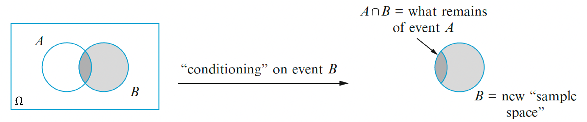
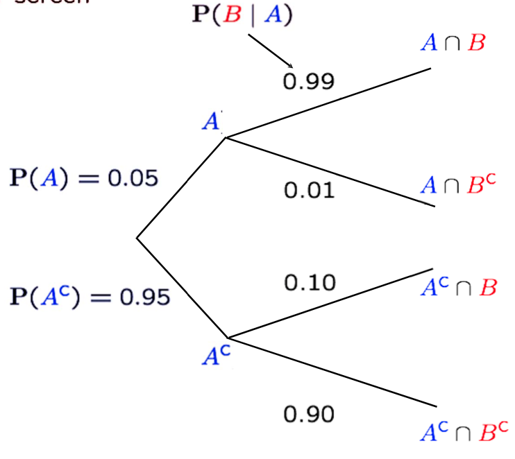
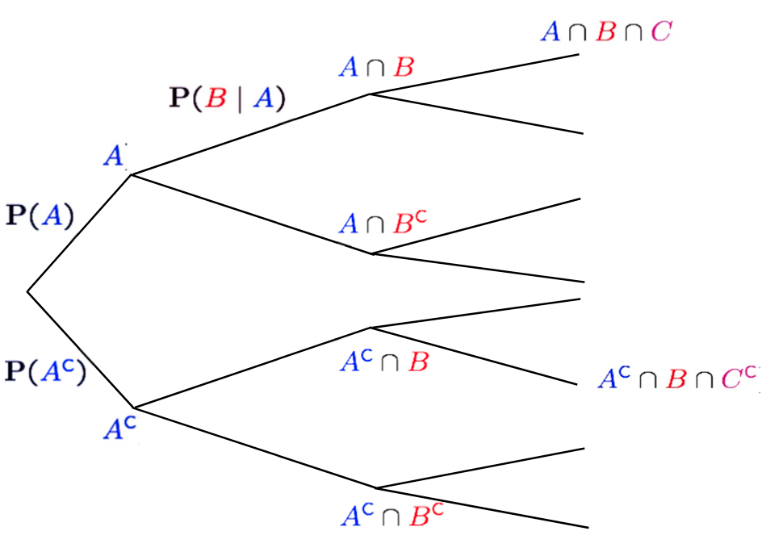
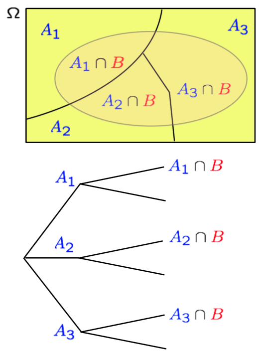

```{css, echo=FALSE}
.bluebox {
  padding: 1em;
  background: SteelBlue;
  color: white;
  border: 2px solid orange;
  border-radius: 10px;
}
.center {
  text-align: center;
}
```

<div style="display:none">
  $
\newcommand{\cbprob}[1]{\Pr\left( #1 \right)}
\newcommand{\aleq}[1]{\begin{align*}#1\end{align*}}
\newcommand{\real}{{\mathbb R}}
\newcommand{\set}[1]{\{#1\}}
\newcommand{\Set}{\text}
\newcommand{\qed}{\blacksquare}
\newcommand{\comp}{\overline}
%%% definition
\newcommand{\eqdef}{\ensuremath{\triangleq}}
%%% imply
\newcommand{\imp}{\Longrightarrow}
\newcommand{\indep}{\perp \!\!\! \perp}
%normal colored text
\newcommand{\redf}[1]{{\color{red} #1}}
\newcommand{\yellowf}[1]{{\color{yellow} #1}}
\newcommand{\bluef}[1]{{\color{blue} #1}}
\newcommand{\grayf}[1]{{\color{gray} #1}}
\newcommand{\magenf}[1]{{\color{magenta} #1}}
\newcommand{\greenf}[1]{{\color{green} #1}}
\newcommand{\cyanf}[1]{{\color{cyan} #1}}
\newcommand{\orangef}[1]{{\color{orange} #1}}
  $
</div>


```{r setup, include=FALSE}
knitr::opts_chunk$set(echo = TRUE,message=FALSE,fig.align="center",fig.width=7,fig.height=2.5)
pacman::p_load(
       car
       ,learnr
      , ggplot2
      , ggExtra
      , reshape2
      , corrplot
      , RColorBrewer
      , lubridate
      , AmesHousing
      )
```


```{r,echo=FALSE}
# Global parameter
show_code <- TRUE
```

## Introduction
### Roadmap

Module  |  Topic                                          | What you should know                             |
--------|-------------------------------------------------|--------------------------------------------------|
  M1    | Why Probability? What is Probability?           | Probability Is Essential For Logic               |
**M2**. | **Conditioning, Bayes Rule, and Independence**  | **Understand why you can learn by conditioning** |
M3      | Counting and Simulation                         | Learn how to count probability by simulation     |
M4      | RV and Discrete Distributions                   | Learn the d,p,q,r functions of probability       |
M5      | Continuous Distributions and Multiple RVs.      | Know how to work with Normal distribution        |
M6      | Joint, Marginal, Conditional, Independence      | Can manipulate joint distribution                |
M7      | Summarizing Random Variables                    | Able to Calculate Expectation and Variance       |
M8      | Simulation (multiple RV) and Limit Theorems     | Understand Sampling distribution and CLT         |
M9      | Point Estimation                                | Maximum likelihood and Method of Moment          |
M10     | Classical Inference and Bootstrap               | Bootstrap, P-value, Confidence Interval, etc     |
M11     | Bayesian Inference                              | Use Stan to do Bayesian Inference                |

### Overview of module 2

-  Conditional Probability
  -  How should I change my belief about event $A$, if I come to know that event $B$ occurs?
-  Bayes' Rule and Bayesian Inference
  -  prob. of $A$ given that $B$ occurs vs. prob. of $B$ given that $A$ occurs
-  Independence, Conditional Independence
  -  Can I ignore my knowledge about event $B$, when I consider event $A$? 

## Conditional Probability

### Conditional Probability: Definition

So far we have only looked at a probability of $A$ denoted as $\Pr(A)$. Or the joint probability of $A$ and $B$ denoted as $\Pr(A\cap B)$ or just $\Pr(A, B)$.  We will use an expression $\Pr(A|B)$ to denote the probability of the event $A$ occurring given (conditioned on) that the event $B$ has occurred.  

 The Conditional Probability is defined as

:::: {.bluebox data-latex=""}
::: {.center data-latex=""}
**Conditional Probability**
:::
$$ \Pr(A|B)=\frac{\Pr(A\cap B)}{\Pr(B)}.$$
::::

The expression might look puzzling at first but it's easier to comprehend if you look at the illustration of conditional probability concept.

```{r , echo=FALSE, out.width = '95%',fig.align="center"}

#
```

You should notice that 
$$ \Pr(A|B)\neq \Pr(A\cap B),$$ which is still part of the $\Omega$.
The probability of $A$ and the probability of $A^c$ conditioned on $B$ does not sum to 1 since there are all the other outcomes that are not $A$ nor $B$.
$$ 1 \neq \Pr(A\cap B)\cup\Pr(A^c\cap B).$$ 

The denominator $\Pr(B)$ in the definition of the conditional probability serves as the re normalization term, which implies that the outcome space narrowed down from $\Omega$ to $B$.  So 
$$ 1 = \Pr(A|B)\cup\Pr(A^c| B).$$ 
The conditional probability is a valid probability law and it should follow all the axioms of a probability.  Intuitively, if you look back at the picture, all we are doing is cutting out the margins of $B$ in $\Omega$ and treating $B$ as the new outcome space.  So everything that holds in $\Omega$ should hold within $B$.

- Nonnegativity: $\Pr(A|B) \geq 0$ for any event $A \subset B$
- Normalization: $\Pr(B|B)= 1$
- Countable additivity: If $A_1, A_2, A_3, \ldots$ is an infite sequence of disjoint events, then $\Pr(A_1 \cup A_2 \cup \cdots|B) =\Pr(A_1|B) + \Pr(A_2|B) + \cdots.$


It is important to note that conditional probability of $A$ given $B$ is not the same as probability of $A$ and $B$.  It's obvious if you look at the picture.
$$\Pr(A|B)\neq \Pr(B|A)$$

This doesn't sound like a big deal but we will see throughout the year that conditional probability is a REALLY big deal.  It allows us to work with probability in piece wise manner, which is not possible if we are only working with joint distributions.

Let's look at an example.

### Example: The rain in Boston

An unconditional probability that it is going to rain would be expressed as $\Pr(\text{rain})$.

A conditional probability would, be what is the probability it is going to rain **given** that you are in Boston, $\Pr(\text{rain}|\text{Ireland}),$

$$ \Pr(\text{rain}|\text{Boston})=\frac{\Pr(\text{rain} \bigcap \text{Boston})}{\Pr(\text{Boston})},$$

where the probability of rain is $\Pr(\text{rain})=0.3$, the probability of being in Boston is $\Pr(\text{Boston})=0.4)$ and the probability of being in Boston and it raining is $\Pr(\text{rain}\bigcap \text{Boston})=0.2$. Given these numbers we can calculate

$$ \Pr(\text{rain}|\text{Boston})=\frac{0.2}{0.4}=0.5,$$

You could be interested in the probability that you are in Boston **given** that it is raining, 
$$ \Pr(\text{Boston}|\text{rain})=\frac{\Pr(\text{rain}\bigcap \text{Boston})}{\Pr(\text{rain})}=\frac{0.2}{0.3}.$$

You can do the calculation using R
```{r}
Pr_Rain<-0.3
Pr_Boston<-0.4
Pr_Rain_and_Boston<-0.2

Pr_Rain_Given_Boston<-Pr_Rain_and_Boston/Pr_Boston
cat("Probability of Rain given Boston:", Pr_Rain_Given_Boston,"\n")
Pr_Boston_Given_Rain<-Pr_Rain_and_Boston/Pr_Rain
cat("Probability of Boston given Rain:",Pr_Boston_Given_Rain,"\n")
```

### Example: Airplane-Radar


```{r , echo=FALSE, out.width = '55%',fig.align="center"}
knitr::include_graphics("images/L2_radar.jpg")
#
```

You are at an airport and something registered on the radar screen.
Is it air plane is flying above or something else?

Let

-  $A:$ Airplane is flying above 
-  $B:$ Something registers on radar screen

And let's assume we know all the necessary probability.

- Probability of airplane flying above is 5%; $\Pr(A)=0.05$
- Probability of something registering on radar screen if the airplane is flying is 99%; $\Pr(B|A)=0.99$
- Probability of something registering on radar screen if it is not airplane is 10%; $\Pr(B|A^c)=0.10$

Calculate and write down what that is about.

- $\Pr(A \cap B)$
- $\Pr(B)$
- $\Pr(A|B)$

<script type="text/javascript">answer_top("answer-aa-001")</script>

#### Answer

\begin{eqnarray} 
\Pr(A \cap B) &= \Pr(A)\Pr(B|A) \\
            &=0.05\times 0.99 = 0.0495
\end{eqnarray}
\begin{eqnarray} 
\Pr(B) &=& \Pr(A \cap B) + \Pr(A^c \cap B)\\
&=& 5. 0.05\times 0.99 + 0.95\times 0.1 = 0.1445
\end{eqnarray}

\begin{eqnarray} 
\Pr(A|B) &=& \frac{\Pr(A \cap B)}{\Pr(B)}
&=& \frac{0.0495}{0.1445} \approx 0.34
\end{eqnarray}

<script type="text/javascript">answer_bottom()</script>

#### Tree

For a small problem like this one, we can draw a tree diagram to illustrate the conditioning as well.


```{r tree, echo=FALSE, out.width = '60%',fig.align="center"}

#
```

All the branches shows all the combined possibilities.

### Review questions

```{r quiz_b2,echo=FALSE}
quiz(
  question("Conditional probabilty of $B$ given $A$ is ",
    answer("Pr(B|A)" , correct = TRUE),
    answer("Pr(A|B)", correct=FALSE),
    answer("Pr(B and A)", correct=FALSE),
    answer("Pr(B or A)", correct=FALSE)
  )
)
```


### Additional cosequences of conditional probability

In the remainder of this module, we will look at few consequences of the conditional probability.

- Multiplication rule
- Total Probability Theorem
- Bayes Rule

### Multiplication Rule 

Multiplication rule just a consequence of conditional probability but it's a useful tool as we will soon see.
$$P(B|A) = P(A\cap B) /P(A) \rightarrow P(A\cap B) = P(B|A) P(A)$$
All it's saying is that if you want to know the proportion of $A$ and $B$ in the entire outcome space,
you can get it by determining the proportion of $A$ then the proportion of $B$ in $A$.

It's also important to highlight that since $P(A|B) = P(A\cap B) /P(B)$
$$P(A\cap B) = P(B|A) P(A)=P(A|B) P(B)$$
The multiplication rule applies when you have more than two sets $\Pr(A\cap B\cap C)$.
The key to do the same calculation by parts. Drawing a tree diagram is useful in highlighting the possibilities.
```{r , echo=FALSE, out.width = '85%',fig.align="center"}

#
```

So
\begin{eqnarray} 
\Pr(A\cap B\cap C) &=& \Pr( C| A\cap B) \Pr( A\cap B) \\
&=&\Pr( C| A\cap B) \Pr( B|A)\Pr( A)
\end{eqnarray} 
or
\begin{eqnarray} 
\Pr(A^c \cap B \cap C^c) &=&\Pr(A^c \cap B) \cdot \Pr(C^c | A^c \cap B)\\
 &=& $\Pr(A^c)\cdot \Pr(B | A^c) \cdot \Pr(C^c | A^c \cap B)
\end{eqnarray} 

Why is this useful? We often want joint distribution of multiple events such as $P(A\cap B)$ or $P(A\cap B\cap C)$, however, it is usually challenging to find the joint distribution.  The rule implies that if you want to know the joint distribution, you can get it by the product of the marginal and the conditional; $P(A)$ and $P(B|A)$ or $P(B)$ and $P(A|B)$.  This is particularly useful when we have a long sequence of events like $P(A_1\cap A_2\cap A_3\dots\cap A_n)$ since

$$\Pr(A_1 \cap A_2 \cap \cdots A_n)= \Pr(A_1) \cdot \Pr(A_2|A_1) \cdot \Pr(A_3|A_1,A_2) \cdots \Pr(A_n|A_1,A_2,\ldots, A_{n-1})$$
You might wonder when you might encounter such situation.  The most common example is a sentence.
If you think about a sentence you have words and you are trying to understand some probability of seeing certain combinations of the words.  The combinations of long sentence may be computationally daunting.  However by making use of the sequential nature of a sentence you can calculate the joint probability using the order in which the words appear.  This is what
Probabilistic Language Models tries to do.  We will come back to this later.


#### Example: Blood type

Four individuals have responded to a request by a blood bank for blood donations.
None of them has donated before, so their blood types are unknown. Suppose only type O+ is desired
and only one of the four actually has this type. If the potential donors are selected in random order for
typing, what is the probability that at least three individuals must be typed to obtain the desired type?

What we want to know is $\Pr(\text{at least three individuals are typed})$.
When thinking about problem of this kind, you need to think about what needs to happen.
At least 3 tests would mean that the outcome of interest is discovering the O+ on the 3rd or 4th outcomes.
Which translates to first two typed are not O+.   
$$\Pr(\text{at least three individuals are typed})=\Pr(\text{first two typed are not O+})$$
\begin{eqnarray} 
\Pr(\text{first two typed are not O+})&=&\Pr(\text{first type not O+}\cap\text{second type not O+})\\
&=&\Pr(\text{second type not O+}|\text{first type not O+})\Pr(\text{first type not O+})
\end{eqnarray} 

Since $\Pr(\text{first type not O+})=3/4$ and $\Pr(\text{second type not O+}|\text{first type not O+})=2/3$
The answer is $3/4*2/3=1/2$


### Total Probability Theorem

In situation where you can partition the outcome space $\Omega$ into three mutually exclusive and exhaustive sets $A_1,A_2,A_3$.  That is $A_1,\dots, A_3$ are mutually exclusive if no two have any common outcomes.
And exhaustive so that one of the $A_i$ must occur $$\Omega = A_1 \cup A_2 \cup A_3$$.
This also implies that
$$\imp \Pr(\Omega) = \Pr(A_1) +\Pr(A_2)+\Pr( A_3)$$

We have outcome of interest $B$ and we know: $\Pr(A_i)$ and $\Pr(B | A_i)$.
What is $\Pr(B)$? 

Here is an illustration of the situation.
```{r , echo=FALSE, out.width = '65%',fig.align="center"}

#
```

From the illustration it's not hard to see that 
$\Pr(B)=\Pr(A_1 \cap B) +\Pr(A_2 \cap B) +\Pr(A_3 \cap B)$.
Since we know from multiplication rule that 
$\Pr(A_i \cap B) = \Pr(A_i) \Pr(B | A_i)$

\begin{eqnarray} 
\Pr(B)&=&\Pr(A_1 \cap B) +\Pr(A_2 \cap B) +\Pr(A_3 \cap B)\\
&=&\Pr(B|A_1) \Pr(A_1)+\Pr(B|A_2) \Pr(A_2) +\Pr(B|A_3) \Pr(A_3)\\
\end{eqnarray} 


:::: {.bluebox data-latex=""}
::: {.center data-latex=""}
**Total Probability Theorem**
:::

In general, for partition of $\Omega$, $A_1,\dots, A_k$, ($A_1,\dots, A_k$ MECE)
$$\Pr(B) = \sum_{i}^{k} \Pr(A_i) \Pr(B | A_i)$$
::::


You could say that you are taking a weighted average from the point of $A_i$ knowledge. 
Looking at the picture it seems it's a trivial matter.  But again, this has extremely important practical consequence.

#### Example Spam

A student has three different e-mail accounts. Most of her messages, in fact 70%,
come into account #1, whereas 20% come into account #2 and the remaining 10% into account #3. Of
the messages coming into account #1, only 1% are spam, compared to 2% and 5% for account #2 and
account #3, respectively. What is the student’s overall spam rate, i.e., what is the probability a
randomly selected e-mail message received by her is spam?

<script type="text/javascript">answer_top("answer-aa-002")</script>

Let
$A_i = \{\text{message is from account i}\}$ for $i \in 1, 2, 3$; $B =\{\text{message is spam}\}$

Since $\Pr(A_1)=0.7,\Pr(A_2)=0.2,\Pr(A_3)=0.1$
and
$\Pr(B|A_1)=0.01,\Pr(B|A_2)=0.02,\Pr(B|A_3)=0.05$

$$\Pr(B)=\Pr(B|A_1)\Pr(A_1)+\Pr(B|A_2)\Pr(A_2)+\Pr(B|A_3)\Pr(A_3)=0.01*0.7+0.02*0.2+0.05*0.1=0.16$$
In the long run, 1.6% of her messages will be spam.
<script type="text/javascript">answer_bottom("answer-aa-002")</script>


## Bayes Rule

### Bayes Rule

Let's look at the same situation.

- We have partition of $\Omega$ into $A_1,A_2,A_3$.
- We know: $\Pr(A_i)$ and $\Pr(B | A_i)$ 

Now imagine that you've observed $B$ to be TRUE.
Then you ask, what is $\Pr(A_i | B)$?

You can say that this is a revised belief about $A_i,$ given $B$ occurs.

```{r , echo=FALSE, out.width = '85%',fig.align="center"}

#
```

This is the question Bayes Theorem helps us answer.
It is stated as  

:::: {.bluebox data-latex=""}
::: {.center data-latex=""}
**Bayes Theorem**
:::
$$\Pr(A|B)=\frac{\Pr(B|A)P(A)}{\Pr(B)},$$
::::

where $\Pr(B|A)$ is the probability of $B$ given $A$ and $\Pr(B)$ is the probability of $B$.
It's easy to show that this is true since 
$$\Pr(A\cap B)=\Pr(A|B)\Pr(B)=\Pr(B|A)P(A),$$
if we divide by $\Pr(B)$ we get the Bayes theorem.
Some people call this formula one of the most important equation of statistics.  
Others think of it as just a consequence of the conditional probability. 
For applied an statistician, this formula give us a way of learning from experience.
Lets look at illustrative examples to see its usefulness.

### Example: Diagnostic test

Assume we know that the probability that an individual has a rare disease is $\Pr(\text{Disease})=0.01$. 
The probability that a diagnostic test results in a positive (+) test \textit{given you have} the disease is $\Pr(+|\text{Disease})=0.95$. On the other hand, the probability that the diagnostic test results in a positive (+) test \textit{given you do not have} the disease is $\Pr(+|\text{No Disease})=0.1$. So if you are tested positive, there's still hope that you might not have the disease.

This raises the important question. 
If you are given a positive diagnosis, what is the probability you have the disease $\Pr(\text{Disease}|+)$? 

Before plugging in the numbers, it's good to look at the situation with some clarity.
This disease impacts one out of 100 individuals.  So it's not such a rare disease.
The test seems pretty accurate in detecting the disease since 95 out of 100 individuals who has the disease will test positive.  But the test also makes a lot of mistakes as it will say that 10 people out of 100 people that does not have the disease has the disease.  All evidence combined, it's not a definitive evidence to test positive on this test.  Can we put numbers on that?

From Bayes Theorem we have:
$$\Pr(\text{Disease}|+)=\frac{\Pr(+|\text{Disease})\Pr(\text{Disease})}{\Pr(+)}$$
The probability of a positive test, $\Pr(+)$ is,
$$\Pr(+)= \Pr(+|\text{Disease})\Pr(\text{Disease})+\Pr(+|\text{No Disease})\Pr(\text{No Disease}),$$
where $\Pr(+|\text{Disease})\Pr(\text{Disease})$ is the Probability of a positive test given the disease among the population of people with the disease and $\Pr(+|\text{No Disease})\Pr(\text{No Disease})$ is the Probability of a positive diagnosis given no diease among the population of people with the disease,
$\Pr(+)= 0.1085.$

Using Bayes Law we can now now calculate the probability of having the disease given a positive diagnosis $\Pr(\text{Disease}|+)$,
$$\Pr(\text{Disease}|+)=\frac{\Pr(+|\text{Disease})\Pr(\text{Disease})}{\Pr(+)}=\frac{0.95\times 0.01}{0.1085}\approx 0.0875.$$
The result means that the rest is only right 8.75% of the time so it is not good test.

This calculation can also be done in a simple table format, by assume a population of 10,000, from this we can divide the people into four groups, 

| **Group**      | **+ Diagnosis** | **- Diagnosis** | **Total** |
|----------------|-----------------|-----------------|-----------|
| **Disease**    | 95              | 5               | 100       |
| **No Disease** | 990             | 8,910           | 9,900     |
| **Total**      | 1,085           | 8,915           | 10,000    |

From the table we can calculate the same answer,
 $$\Pr(\text{Disease}|+)=\frac{\text{Number of people with the disease and + diagnosis}}{\text{Number of people with positive + diagnosis}}=\frac{95}{1085}\approx 0.0875.$$

There's something that happens when you tabulate the information, which is the realization of the base rate.  That being diagnosed and not having the disease is much higher than actually having the disease.  This intuition is **VERY** important when you want to understand a phenomena.  

### Confusion matrix

This result also gives insight into an important table called the confusion matrix.  
We define the terms true positives, true negatives, false positives and false negatives in the following way.

| **Group**      | **+ Diagnosis** | **- Diagnosis** | **Total** |
|----------------|-----------------|-----------------|-----------|
| **Disease**    | true positives  | false negative  |           |
| **No Disease** | false positives | true negatives  |           |
| **Total**      |                 |                 |           |

In general, a good test should aim to increase both true positives and true negatives and hence decrease false negatives and false positives.

### Bayesian Inference

From now on, using the theory of probability and conditional probability constructed so far, we will develop interesting properties and theorems which are very useful to answer some exciting questions.  That is using Bayes' Rule to make statistical inference .

Imagine you have unknown state/cause/original value that you want to infer about.
However, you cannot directly assess these values.
Instead you are able to get result/resulting action/noisy measurement that is tied to the quantity of interest.
The Bayesian inference is about making inference on the quantity of interest given the information at hand.
$$\Pr(\text{Interest} \mid \text{Data})$$

Here is an example.  Let's say you have a dog that is either happy or sad.  

  - $A_1$: Happy (:-)), 
  - $A_2$: Sad (:-()

However, you don't speak dog so you can only observe it's barking to determine it's state of mind.

  - $B$: Bark
  
The question you are after is
$$\Pr(\text{Happy} \mid \text{Bark}),\Pr(\text{Sad} \mid \text{Bark})$$

Can you do that?  Of course, with some caveat.

You will need to figure out the following information:
$$
\Pr(A_1), \quad \Pr(A_2), \quad \Pr(B | A_1), \quad\Pr(B | A_2).
$$
Then using the Bayes formula, 
$$\Pr(A_i|B)=\frac{\Pr(B|A_i)\Pr(A_i)}{\Pr(B)}=\frac{\Pr(B|A_i)\Pr(A_i)}{\Pr(B | A_1)\Pr(A_1)+\Pr(B | A_2)\Pr(A_2)}$$
you can answer the question: $\Pr(A_1 | B)$ and $\Pr(A_2 | B)$.

### Prior

How do you figure out the necessary information?
The unconditional probabilities $\Pr(A_1) and \Pr(A_2)$ are called the prior information.  
This needs to be specified before seeing the data.
How do you come up with one is a subject of long debate.
We will talk more about this in the last part of the bootcamp.

### Likelihood.

The items $\Pr(B | A_1)$ and $\Pr(B | A_2)$ are what's called the likelihood.  
They answer the question, how likely is it to see these events/results/evidence happen given the underlying state.


### Example: Happy/Sad-Bark

-  $A_1$: dog is happy, $A_2$: dog is sad
-  $B$: dog barks. 

-  Assume: 
$$
\Pr(A_1)=0.7, \ \Pr(A_2)=0.3,
$$
and
$$
\Pr(B | A_1) = 0.3, \ \Pr(B | A_2)=0.5.
$$

- Calculate $\Pr(A_1 | B)$ and $\Pr(A_2 | B).$

Since

\begin{eqnarray}
\Pr(A_1)\Pr(B|A_1)&=& 0.7(0.3)=0.21\\
\Pr(A_2)\Pr(B|A_2)&=& 0.3(0.5)=0.15\\
\Pr(B)&=& 0.21+0.15 = 0.36
\end{eqnarray}

therefore

\begin{eqnarray}
\Pr(A_1 | B) &=& \frac{(0.21)}{(0.36)} \approx 0.583 \\
\Pr(A_2 | B) &=& \frac{(0.15)}{(0.36) }\approx 0.417 
\end{eqnarray}


#### Example DVD player

Here is a motivating example:
A chain of electronics stores sells three different brands of DVD players. Of its DVD player sales, 50% are brand 1 (the least expensive), 30% are brand 2, and 20% are brand 3. Each manufacturer offers a 1-year warranty on parts and labor. It is known that 25% of brand 1’s DVD players require warranty repair work, whereas the corresponding percentages for brands 2 and 3 are
20% and 10%, respectively.

How would you formulate the following problems?

1. What is the probability that a randomly selected purchaser has bought a brand 1 DVD player that
will need repair while under warranty?

If we let $A_i =\{\text{brand i is purchased}\}$, for $i = 1, 2, 3$. Then 
the question is asking $\Pr(A_i)$ for $i = 1, 2, 3$.
- $\Pr(A_1) = 0.50$, 
- $\Pr(A_2) = 0.30$, and 
- $\Pr(A_3) = 0.20$.

2. What is the probability that a randomly selected purchaser has a DVD player that will need repair
while under warranty?

If we let $B =\{\text{needs repair}\}$ and $B^c =\{\text{doesn’t needs repair}\}$ Then 
the question is asking $\Pr(B|A_i)$ for $i = 1, 2, 3$.

- $\Pr(B|A_1) = 0.25$, 
- $\Pr(B|A_2) = 0.20$, and 
- $\Pr(B|A_3) = 0.10$.

3. If a customer returns to the store with a DVD player that needs warranty repair work, what is the
probability that it is a brand 1 DVD player? A brand 2 DVD player? A brand 3 DVD player?

The question is asking $\Pr(A_i|B)$ for $i = 1, 2, 3$, which can be calculated using Bayes rule

But how do we calculate? The probability a DVD player will need repair while under warranty $\Pr(B)$?
Assuming there is only 3 brands, B can happen under the 3 brands.

\begin{eqnarray}
\Pr(B) &=& \Pr(\text{brand 1 and repair or brand 2 and repair or brand 3 and repair})\\
&=&\Pr(\text{brand 1 and repair})+\Pr(\text{brand 2 and repair })+\Pr(\text{brand 3 and repair})\\
&=&\Pr(B|A_1)\Pr(A_1)+\Pr(B|A_2)\Pr(A_2)+\Pr(B|A_3)\Pr(A_3)\\
&=&0.25*0.5+0.20*0.3+0.10*0.2=0.205
\end{eqnarray}


<!-- % -  $\Pr(A \cap B}$ = \redblank{2}{$\Pr(B}\Pr(A | B}$} = \redblank{3}{$\Pr(A}\Pr(B | A}$} -->


## Independence


### Independence Definition:

Independence of $A$ and $B$, denoted as $$A \indep B,$$ implies that the occurrence of $A$ provides no new information about $B$. 
Thus, knowledge about $A$ does NOT change the probability of $B$.  Intuitive definition of independence is 
$$\Pr(B | A) = \Pr(B)$$
which is a result of the formal definition.  

:::: {.bluebox data-latex=""}
::: {.center data-latex=""}
**Independence**
:::
The events $A$ and $B$ are independent of one another if and only if
$$\Pr(B \cap A) = \Pr(A)\Pr(B)$$
::::

It sounds trivial and is a concept that we often take for granted in basic probability class.  It's either something that we assume or is given -- Like flips of a coin or rolls of a dice.  But in practice the independence assumption is rarely satisfied.  When the independence does not hold we often need to result to a more elaborate modeling.  Therefore, it is  important to know what is independence and more importantly the conditional independence.

#### Bad example

Here is a bad example that we often see:

  - Event $A$: I get the grade A in the probability class (my interest).
  - Event $B$: My friend is rich. 
  - $A$ and $B$ do not seem dependent on each other. So, (assume indepdence and) just forget $B$!

Independence makes our analysis and modeling much simpler, 
because it allows one to remove independent events in the analysis of what you are interested in.
But what if the reality is more complicated?

  - Proposition $B$: is TRUE because someone is from a wealthy family living in a wealthy neighborhood.
  - Because that someone's family is wealthy, he/she can get a tutor that would change the likeliness of $A$ happening.
  - So our assumption that $A$ and $B$ are unrelated is false.
  
This is an example of a backdoor pathway that we will think more about when we discuss conditional independence.

Better example might be

  - Event $A$: I get the grade A in the probability class (my interest).
  - Event $B$: Butterfly flaps it's wing in Mexico.
  
One might argue for a [nonlinear effect](https://en.wikipedia.org/wiki/Butterfly_effect).  But it's pretty hard to prove that the two are connected at all.  


### Properties of Independence

If we look at the definition of independence 
$$A \indep B\imp \Pr(A \cap B) = \Pr(A) \Pr(B)$$
it's easy to see that independence is symmetric. If $A$ is independent of $B$ then $B$ is independent of $A$.

$$A \indep B\Leftrightarrow  B\indep A$$
Going back to the definition of the conditional probability, we can get the intuitive definition.

$$ A \indep B\imp  \Pr(A|B)=\frac{\Pr(A\cap B)}{\Pr(B)}=\frac{\Pr(A)\Pr(B)}{\Pr(B)}=\Pr(A)$$

#### Disjoint does not imply independent

When $A$ and $B$ have no outcomes in common, they are said to be disjoint or mutually exclusive events. It's important to note that when $A$ and $B$ disjoint does NOT imply $A \indep B$.  Because if you know that $A$ occurred, then, we know that $B$ did not occur. 

If an experiment consists of observing the brand of the next car sold in a small city that has two automobile dealerships, then the events A = {Chevrolet,Buick} and B = {Ford, Lincoln} are mutually exclusive because the next car sold cannot be both a
GM product and a Ford product.  If $\Pr(A)=1$ then $\Pr(B)=0$.


### Conditional Independence

For a probability law $\Pr(\cdot),$ given some event $C$, $\Pr(\cdot | C)$ is a new probability law. 
Thus, we can talk about independence under $\Pr(\cdot | C)$.


Given that $C$ occurs, occurrence of $A$ provides no new information about $B$.
$$\Pr(B | A \cap C) = \Pr(B | C)$$
Using 

$$\Pr(A\cap B|C)=\frac{\Pr(B\cap (A\cap C))}{\Pr(C)} =\frac{\Pr(A\cap C)\Pr(B|A\cap C)}{\Pr(C)} =\Pr(A|C)\Pr(B|C)$$

:::: {.bluebox data-latex=""}
::: {.center data-latex=""}
**Conditional Independence**
:::
Conditional Independence of $A$ and $B$ given $C$, expressed as $A \indep B | C$
$$\Pr(A \cap B| C) = \Pr(A|C) \times \Pr(B |C)$$
::::


<!-- % \smallskip -->
<!-- %   7.  \redf{Q1.} If $A \indep B$,  then $A \indep B | C$? -->
<!-- % Suppose that $A$ and $B$ are independent. If you heard that $C$ occurred,  $A$ and $B$ are still independent?                                                          -->

<!-- %   8.  \redf{Q2.} If $A \indep B | C$, $A \indep B$? -->
<!-- \eci  -->

#### Does independence imply conditional independence?

This is a very important question from a practical perspective.  Does independence $A \indep B$ imply 
conditional independence $A \indep B | C$?  Think abou the example from ealier with slight modification.

  - Event $A$: I get the grade A in the probability class (my interest).
  - Event $B$: Butterfly dies in Mexico.

We can probably still argue $A \indep B$.  But what if we condition on 

  - Event $C$: Extreme heat hits the America continent.
  
Then we suddenly see connection between the two seemingly unrelated events.  So the answer is NO.

##### Example with coins.

If you thought the butterfly example was a little too extreme. Here is a little more simpler example.

Two independent coin tosses
  -  $H_1$: 1st toss is a head
  -  $H_2$: 2nd toss is a head
  -  $D$: two tosses have different results.

$\Pr(H_1 | D) = 1/2$ 
$\Pr(H_2 | D) = 1/2$  

But if you know that two two tosses have different results.
$\Pr(H_1 \cap H_2 | D) = 0$  

#### Does conditional independence imply independence?
How about the other way around?  Does conditional independence  $A \indep B | C$ imply independence $A \indep B$?
Imagine that you have two coins: Blue and Red. 
You will choose one at random, and proceed with two independent tosses. 

$\Pr(\text{head of blue}) = 0.9$ and 
$\Pr(\text{head of red}) = 0.1$ 

$H_i$: i-th toss is head, and $B$: blue is selected. 

  4.  $H_1 \indep H_2 | B$? \orangef{Yes}
$$
\Pr(H_1 \cap H_2 | B) = 0.9\times 0.9, \quad \Pr(H_1 |B) \Pr(H_2|B) = 0.9 \times 0.9
$$

  5.  $H_1 \indep H_2$? \orangef{No}
  
\begin{eqnarray}
\Pr(H_1) &= \Pr(B) \Pr(H_1 | B) + \Pr(B^c) \Pr(H_1 | B^c) \\
         &= \frac{1}{2} 0.9 + \frac{1}{2} 0.1 = \frac{1}{2}\\
\Pr(H_2) &= \Pr(H_1) \quad (\text{because of symmetry})\\
\Pr(H_1 \cap H_2) &= \Pr(B) \Pr(H_1 \cap H_2| B) + \Pr(B^c) \Pr(H_1 \cap H_2| B^c)\\
                  &= \frac{1}{2} (0.9\times 0.9) + \frac{1}{2} (0.1\times 0.1) \neq \frac{1}{2}
\end{eqnarray}


```{r , echo=FALSE, out.width = '70%',fig.align="center"}

#
```


### Independence of Multiple Events

If we have three events: $A_1, A_2, A_3.$ What are the conditions of ``their independence"?
It turns out that we need both Pairwise independence
\begin{align*}
\Pr(A_1 \cap A_2) = \Pr(A_1) \Pr(A_2), \\
\Pr(A_1 \cap A_3) = \Pr(A_1) \Pr(A_3), \\
\Pr(A_2 \cap A_3) = \Pr(A_2) \Pr(A_3)
\end{align*}
And also a three way  
$\Pr(A_1 \cap A_2 \cap A_3) = \Pr(A_1) \Pr(A_2) \Pr(A_3)$?

:::: {.bluebox data-latex=""}
::: {.center data-latex=""}
**Independence of Multiple Events**
:::
The events $A_1,A_2, \ldots, A_n$ ar said to be independent if
$$ \Pr\left(\bigcap_{i \in S} A_i\right) = \prod_{i \in S} \Pr(A_i), \quad \text{for every subset } S \text{ of } > \{1,2, \ldots, n \}$$
::::

### Summary

Independence is simple mathematically but in practice a delicate issue.  They are easy to construct but hard to prove in reality.

## Review Questions

-  What is conditional probability? Why do we need it?

-  What is the definition of conditional probability? Are you happy
  about the definition?

-  What is the meaning that the conditional probability is a new
  probability law?

-  What is Bayes' rule? What does it give us?

-  Explain the overall framework of Bayesian inference.

-  What is the total probability theorem?

-  What's the difference between independence and conditional independence?

## Reference

This tutorial is modification of slides that were originally created by

https://ocw.mit.edu/courses/res-6-012-introduction-to-probability-spring-2018/

Carlton, Matthew A., and Jay L. Devore. Probability with applications in engineering, science, and technology. Berlin: Springer, 2017.
