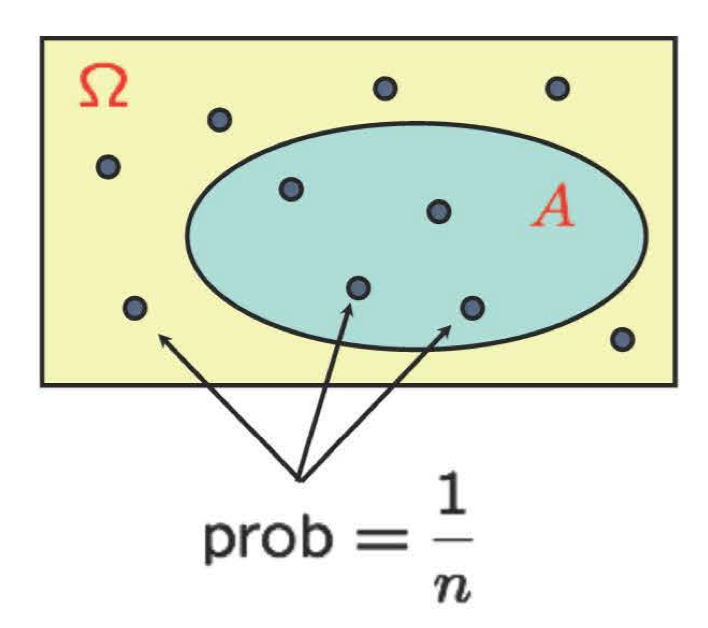
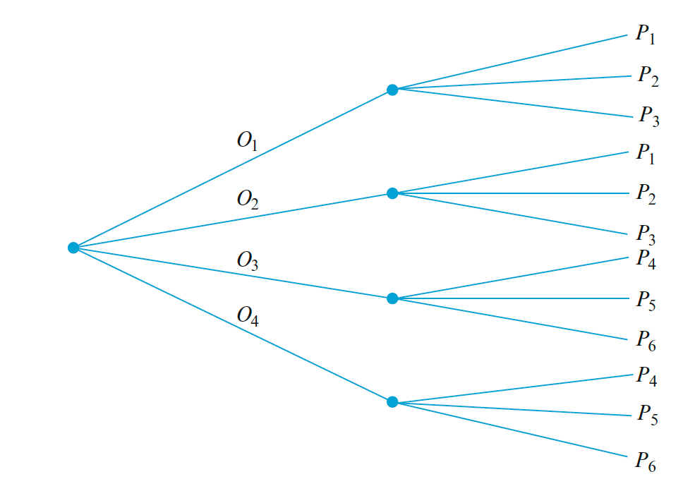

<div style="display:none">
  $
\newcommand{\cbprob}[1]{\mathbb{P}\left( #1 \right)}
\newcommand{\aleq}[1]{\begin{align*}#1\end{align*}}
\newcommand{\real}{{\mathbb R}}
\newcommand{\set}[1]{\{#1\}}
\newcommand{\Set}{\text}
\newcommand{\qed}{\blacksquare}
\newcommand{\comp}{\overline}
%%% definition
\newcommand{\eqdef}{\ensuremath{\triangleq}}
%%% imply
\newcommand{\imp}{\Longrightarrow}
\newcommand{\indep}{\perp \!\!\! \perp}
%normal colored text
\newcommand{\redf}[1]{{\color{red} #1}}
\newcommand{\yellowf}[1]{{\color{yellow} #1}}
\newcommand{\bluef}[1]{{\color{blue} #1}}
\newcommand{\grayf}[1]{{\color{gray} #1}}
\newcommand{\magenf}[1]{{\color{magenta} #1}}
\newcommand{\greenf}[1]{{\color{green} #1}}
\newcommand{\cyanf}[1]{{\color{cyan} #1}}
\newcommand{\orangef}[1]{{\color{orange} #1}}
\newcommand{\expect}[1]{\mathbb{E}[ #1 ]}
\newcommand{\var}[1]{\text{var}[ #1 ]}
%%%% indicator
\newcommand{\indi}[1]{\mathbf{1}_{ #1 }}
  $
</div>


```{r setup, include=FALSE}
knitr::opts_chunk$set(echo = TRUE,message=FALSE,fig.align="center",fig.width=7,fig.height=4.5)
pacman::p_load(
       car
       ,learnr
      , ggplot2
      , ggExtra
      , reshape2
      , corrplot
      , RColorBrewer
      , lubridate
      , AmesHousing
      )
```

```{r,echo=FALSE}
# Global parameter
show_code <- TRUE
```


```{css, echo=FALSE}
.bluebox {
  padding: 1em;
  background: SteelBlue;
  color: white;
  border: 2px solid orange;
  border-radius: 10px;
}
.center {
  text-align: center;
}

.infobox {
  padding: 1em 1em 1em 4em;
  margin-bottom: 10px;
  border: 2px solid orange;
  border-radius: 10px;
  background: #f5f5f5 5px center/3em no-repeat;
}

.question {
  background-image: url("images/question.png");
}
```

## Introduction

### Roadmap

Module  |  Topic                                          | What you should know                             |
--------|-------------------------------------------------|--------------------------------------------------|
  M1    | Why Probability? What is Probability?           | Probability Is Essential For Logic               |
M2      | Conditioning, Bayes Rule, and Independence.     | Understand why you can learn by conditioning.    |
**M3**  | Counting and Simulation                         | Learn how to count probability by simulation     |
M4      | RV and Discrete Distributions                   | Learn the d,p,q,r functions of probability       |
M5      | Continuous Distributions and Multiple RVs.      | Know how to work with Normal distribution        |
M6      | Joint, Marginal, Conditional, Independence      | Can manipulate joint distribution                |
M7      | Summarizing Random Variables.                   | Able to Calculate Expectation and Variance       |
M8      | Simulation (multiple RV) and Limit Theorems     | Understand Sampling distribution and CLT         |
M9      | Point Estimation                                | Maximum likelihood and Method of Moment          |
M10     | Classical Inference and Bootstrap               | Bootstrap, P-value, Confidence Interval, etc     |
M11     | Bayesian Inference                              | Use Stan to do Bayesian Inference                |

### Overview of module 3

### Counting implies probability

When the various outcomes of a trial are equally likely (the same probability is assigned to each simple event), the task of computing probabilities reduces to counting according to the discrete uniform law.  

:::: {.bluebox data-latex=""}
::: {.center data-latex=""}
**Discrete uniform law**
:::
- Assume the outcome space $\Omega$ consists of $n$ equally likely elememts
- Assume $A$ consists of $k$ elements
Then $$\Pr(A)=\frac{\text{number of elements of }A}{\text{number of elements of } \Omega}=\frac{k}{n}$$
::::
```{r , echo=FALSE, out.width = '50%',fig.align="center"}

```

Constructing such list is prohibitive in many situations.  Therefore, it is useful to know the basic rules of counting so that we can calculate the probabilities efficiently.  By exploiting some general counting rules, it is possible to compute probabilities without a listing of outcomes. To make use of these rules, you need to understand which approach is appropriate for the situation you are facing.

- Simulation

The basic counting methods are useful for large class of problems but they run into challenges when we start combining different processes.  For example, if you are interested in a sequence of events with each having certain probability, even though the counting method is still relevant, the calculation can become tedious if not impossible.  Computer simulation provides us an effective way to estimate probabilities of very complicated events without having to do the mathematics. However, the catch is that you will need to program.  


## Counting


Counting methods are shortcuts to listing out all possible outcomes.  In this section, we will review the counting methods. In particular we will review combination, permutation and partition.  These methods will be sufficient for most simple calculations we will do.

### Fundamental counting principle

The fundamental counting principle is the most basic rule for counting applicable when you have multiple things, each with a few options.  It's for siatuations like choosing your clothing or selecting your dinner items from pre-fixed course menu.

Suppose a set consists of ordered collections of k elements (k-tuples) and that there are $n_1$ possible choices for the first element; for each choice of the first element, there are $n_2$ possible choices of the second element;$\dots$; for each possible choice of the first $k - 1$ elements, there are $n_k$ choices of the kth element. Then there are $$n_1n_2\cdots n_k \text{ possible k-tuples (an ordered collection of k objects).}$$

:::: {.bluebox data-latex=""}
::: {.center data-latex=""}
**FUNDAMENTAL COUNTING PRINCIPLE (FCP)**
:::
Suppose a set consists of ordered collections of k elements (k-tuples) where there are $n_i$ choices at stage $i$ ($i \in 1:k$).
The number of all choices is : $$n_1 n_2\cdots n_k.$$
::::

#### Example: Choice of clothing to wear

The fundamental counting principle is easy if you think about an example.  Imagine that you have

- 4 shirts 
- 3 pants
- 2 jackets

What is the number of possible attires? 

Assuming there is no unacceptable combination.
For each shirt you have a choice of 3 pants.
And for each combination of a shirt and a pants, you have a choice of 2 jackets.
So in total there are 
$$4*3*2=24$$ ways to get dressed.

Note that you cannot have two shirts or no pants.  Although you could have "no pants" as another alternative if that is what you want to count.  You can do the multiplication in a different order and that will not change the outcome since pants is not a shirt.  

### Tree diagram

The Fundamental Counting Principle can also be illustrated by a tree diagram. Tree diagram is constructed by illustrating the branching out possibilities at each stage of choice.

Let's look at an example:

#### Example: obstetrician and a pediatrician choice

A family has just moved to a new city and requires the services of both an obstetrician and a pediatrician. There are two easily accessible medical clinics, each having two obstetricians and three pediatricians. The family will obtain maximum health insurance benefits by joining a clinic and selecting both doctors from that clinic. In how many ways can this be done? Denote the obstetricians by $O_1$, $O_2$, $O_3$, and $O_4$ and the pediatricians by $P_1,\dots, P_6$. Then we wish the number of pairs $(O_i, P_j)$ for which $O_i$ and $P_j$ are associated with the same clinic. Because there are four obstetricians, $n_1 = 4$, and for each there are three choices of pediatrician, so $n_2 = 3$. Applying the proposition gives $N = n_1n_2 = 12$ possible choices.

```{r , echo=FALSE, out.width = '60%',fig.align="center"}

```

The construction of a tree diagram does not depend on having the same number of second generation branches emanating from each first-generation branch. If the second clinic had four pediatricians, then there would be only three branches emanating from two of the first-generation branches and four emanating from each of the other two first-generation branches. A tree diagram can thus be used to represent experiments for which the Fundamental Counting Principle does not apply.

#### Example: Number plate

How many unique license plate number can you create with 2 letters (A-Z) followed by 3 digits (0-9)?
This is an example with 5 stages ($r=5$) with first two stages having 26 options ($n_1=26, n_2=26$) and the last 3 having 10 options ($n_3=10,n_4=10,n_5=10$).

So using FCP $n_1n_2n_3n_4n_5 =26\cdot 26\cdot 10\cdot 10\cdot 10$

```{r}
26*26*10*10*10
```

How would the result change if we put a restriction that you are not allowed to use the same digit more than once?  The number of stages is the same as before; 5 stages ($r=5$).  The first stage will have 26 options ($n_1=26$).  But now since you use one of the letter in your first option, you only have $n_2=26-1=25$ options in the second stage.  The 3rd stage will have 10 options again but the subsequent stages will have one option less ($n_3=10,n_4=9,n_5=8$).

So Number of license plates with 2 letters followed by 3 digits with restriction that you are not allowed to use the same digit more than once will be
So $n_1n_2n_3n_4n_5 =26\cdot 25\cdot 10\cdot 9\cdot 8$

```{r}
26*25*10*9*8
```

### Permutations: 

Permutation is the number of ways of ordering $k$ elements out of $n$ total.  Imagine you have fixed number of elements and fixed number of slots.  Your goal is to find how you match the two. If we imagine $n$ slots and $n$ balls, you have $n$ ways to choose what to put in the first slot.
After that has been chosen, you have $n-1$ slots and $n-1$ balls.
You can repeat the process so that there are $n!=n(n-1)(n-2)\dots 1$ options.  

:::: {.bluebox data-latex=""}
::: {.center data-latex=""}
**Permutations:**
:::
Any ordered sequence of $k$ objects taken without replacement from a set of n distinct objects is called a permutation of size $k$ of the objects. The number of permutations of size $k$ that can be
constructed from the $n$ objects is denoted by $$_{n}P_{k} = \dfrac{n!}{(n - k)!}.$$  We use expression $n!$ (n factorial) to represent $n!=n(n-1)(n-2)\dots 1$.  (e.g. $3!=3*2*1$)
::::

Now it's important to note that this is $_{n}P_{n} = \dfrac{n!}{(n - n)!}$.  The denominator is $0!$, which is actually 1 by definition.  Therefore $_{n}P_{n} =n!$.

Now instead of ordering all the observations, what if we only want $k$ of them.  Then using the same argument the number of permutation is $n(n-1)(n-2)\dots (n-k+1)$.  Going back to the definition of permutation we see that the result matches the definition.
$$_{n}P_{k} = \dfrac{n!}{(n - k)!}=\dfrac{n(n-1)(n-2)\dots(n-k+1)(n-k)(n-k-1)\dots 1}{(n - k)(n-k-1)\dots 1}=n(n-1)(n-2)\dots(n-k+1)$$


#### Example: Dice roll

Let's use the counting method to calculate the probability.
Find the probability that six rolls of a (six-sided) die all give different numbers.
(Assume all outcomes equally likely.)

Since there are 6 possible outcomes for each roll and 6 rolls, the number of possible outcomes are
$$6*6*6*6*6*6=6^6$$
for all of the rolls to have different digit it is equivalent to order each of the 6 sides.
That is $6!$

Therefore, the probability is
$$\frac{6!}{6^6}=\frac{720}{46656}=0.0154321$$
so you might get one in 100 tries.  Is that unexpected?


### Combinations

There are situations where we want to count the number of unordered subsets of size $k$ that can be formed from a set consisting of $n$ distinct objects.  If you want to form a committee of $k$ peoples out of $n$ candidates, the order in which committee members are listed is frequently unimportant.  Given a set of n distinct objects, any unordered subset of size k of the objects is called a combination. The number of combinations of size k that can be formed from n distinct objects will be denoted by ${k \choose n}=\frac{n!}{k!(n-k)!}$

:::: {.bluebox data-latex=""}
::: {.center data-latex=""}
**Combination**
:::
Combination is counting the number of $k$ element subset given $n$ element set. 
$$_{n}C_{k}={k \choose n}=\frac{n!}{k!(n-k)!}$$ 
::::

If you have 5 letters {A,B,C,D,E} how many ways can you form a set of 3 letters?

You can write out the combination
{A, B, C},{A, B,D},{A, B, E},{A, C,D},{A, C, E}
{A,D, E},{B, C,D},{B, C, E},{B,D, E},{C,D, E}

or do 
${3 \choose 5}=\frac{5!}{3!(5-3)!}=10$

### Combinations and permutation

Going back to the previous example.  
If you have 5 letters {A,B,C,D,E} and you want to form a set of 3 letters but if we cared about the order of the letters.  Then what do we do?  We can use permutation $_{5}P_{3} =5*4*3=60$. Or alternatively we can use combination then order.

In general there are two ways of constructing an ordered sequence of k distinct items. 

- Choose the k items one at a time (permutation $_{n}P_{k}$)
- Choose k items, then order them (combination then order)

Since there are $k!$ ways to order the $k$ items.  Selection then order will be 
$${k \choose n}\times k!=\frac{n!}{k!(n-k)!}k!=\frac{n!}{(n-k)!}=_{n}P_{k}$$

#### Binomial coefficient 

You will see this combination expression over and over throughout your carer when you encounter Binomial probability.  The combination ${k \choose n}$ is refered to as Binomial coefficient to Binomial probability and they serve as a way of counting up the number of possibility of independent coin flip trials.  The setup we will assume is that $n\geq 1$ independent coin tosses with $P(H)=\theta$ and $P(T)=1-\theta$.


- Based on independence it is easy to see that $P(HTTHHH)=\theta(1-\theta)(1-\theta)\theta\theta\theta=\theta^4(1-\theta)^2$

- Any particular sequence probability can be expressed as $P(\text{particular sequence}) =\theta^{(\text{# of heads})}(1-\theta)^{(\text{# of tails})}$
`
- Any particular sequence probability with k heads can be expressed as $P(\text{particular k-head sequence})=\theta^{k}(1-\theta)^{n-k}$

- But when your interest is in the probability of seeing $k$ heads in any order out of $n$ trials $P(\text{k heads out of n})$ then you need to know how many ways can this happen.  This is a combination problem.  How many ways out of $n$ total trials can you choose $k$ heads? There are  ${k \choose n}$ each with probability $\theta^k(1-\theta)^{n-k}$.  Therefore
$$P(\text{k heads out of n})={k \choose n}\theta^k(1-\theta)^{n-k}$$

### Example: coin tossing

Think about a coin tossing problem.  Given that there were 3 heads in 10 tosses what is the probability that the first two tosses were heads?

  - event A : the first 2 tosses were heads
  - event B : 3 out of 10 tosses were heads

<script type="text/javascript">answer_top("answer-aa-001")</script>

- First solution:
Assume $\Pr(Head)=\theta$ and each toss is independent.
Noting that "the first 2 tosses were heads" & "3 out of 10 tosses were heads" is 
$$\Pr(HH(\text{1 head in 3-10}))=\Pr(H)\Pr(H)\Pr(\text{1 head in 3-10})=\theta\theta{8 \choose 1}\theta^1(1-\theta)^{8-1}$$
and
$$\Pr(\text{3 out of 10 tosses were heads})={3 \choose 10}\theta^3(1-\theta)^{10-3}$$

We can solve the problem using the conditional probability formula.
$$ \Pr(A|B)=\frac{\Pr(A\cap B)}{\Pr(B)}=\frac{\theta\theta{8 \choose 1}\theta^1(1-\theta)^{8-1}}{{10 \choose 3}\theta^3(1-\theta)^{10-3}}=\frac{8}{120}.$$
- Second solution: Conditional probability law (on B) is uniform
Since all the outcomes are equally likely we can use the discrete uniform law.
There are in total $\Omega=2^10$ ways the outcome may end up.

How many ways can we have 3 heads in 10 flips?  If you think about this,
it's equivalent to asking the question: "I have 10 slots and 3Hs to allocate.  How many ways can I choose a different location?"  It's easy to see that this is a combination problem ${10 \choose 3}$.
Within the outcome space defined by $B$, $A$ is fixing the first 2 slots and asking "I have 8 slots and 1H to allocate.  How many ways can I choose a different location?"  And that's ${8 \choose 1}$.

$$ \Pr(A|B)=\frac{\Pr(A\cap B)}{\Pr(B)}=\frac{\text{# of }A\cap B}{\text{# of B}}=\frac{8}{120}.$$
<script type="text/javascript">answer_bottom()</script>

### Partitions

Combination is a special case of the partition problem when there are two possibilities.  But when we have a situation such as dice rolls, we want something a little more general.
Think about a situation where 

- There are $n \geq 1$ distinct items and $r \geq 1$ slots/persons.
- You want to give $n_i$ items to slot/person $i$.
-  $n_1, \dots, n_r$ are known. No negative integers 
- with $n_1 +\dots + n_r = n$

For example, imagine you have eight distinct cakes. You want to choose three for breakfast, two for lunch, and three for after dinner desert. How many ways to do that?  Or if you want to use games this is a setup for dice roll.  Think of 6 faces of the dice as 6 slots.  You roll the dice $n$ times with each face coming up $n_1, \dots, n_6$ times.  How many ways can this happen?

How can we count this?  Since $n_1 +\dots + n_r = n$ we can find ways to permute $n$ items and then assign the first $n_1$ to the first slot, the next $n_2$ to the 2nd slot, until the $r$th slot gets the last $n_r$ items. But this is over counting since we don't need to know the order of $n_i$ items once they are allotted. So we need to discount them.  The ways in which to order $n_i$ items is $n_i!$.  Since we have $r$ of these we have $n_1!n_2!\dots n_r!$ over counting.  By dividing $n!$ by $n_1!n_2!\dots n_r!$ we get the partition counts, which is often refered to as a multinomial coefficient.

:::: {.bluebox data-latex=""}
::: {.center data-latex=""}
**Partitioning (multinomial coefficient)**
:::
When there are $n \geq 1$ distinct items partitioned into $r \geq 1$ slots with $n_i$ items to each slot $i$.  The number can be counted as
$$\frac{n!}{n_1!n_2!\dots n_r!}$$
::::

Let's look at if this is true.  If we have 4 cakes (A,B,C,D) and we want to divide them into 2:1:1.  Then, that is $4!/(2!1!1!)=12$.  If we list out all the ways to choose 2 out of 4 we have $_{4}C_{2}=6$ since we have 2 ways to allocate the remaining 2 cakes to the other 2 slots the total is 12. 


#### Example: Ace in hands

- 52-card deck, dealt (fairly) to four players. (each player gets 13 cards)
- Find $\Pr(\text{each payer gets an ace})$

- This is a partition problem.  
- The number of outcomes are $\frac{52!}{13!13!13!13!}$

- How can we construct an outcome with one ace for each person:
- distribute the aces 4*3*2*1
- then distribute the remaining 48 cards $\frac{48!}{12!12!12!12!}$

Therefore:
$$\Pr(\text{each payer gets an ace})=4*3*2*1*\frac{48!}{12!12!12!12!}/\frac{52!}{13!13!13!13!}$$

```{r}
(4*3*2*1*factorial(48)/(factorial(12)*factorial(12)*factorial(12)*factorial(12)))/(factorial(52)/(factorial(13)*factorial(13)*factorial(13)*factorial(13)))
```

Alternatively, you can think of this as allocation problem.
If you have 4 aces at the top of your card deck, and you think about the number of ways you can place them in the 4 *13 slots.
The first card can go anywhere.  The second one needs to go the other 3*13 slots.
The third to the other 2*13 slots and so on.
So you have
(52/52)*(39/51)*(26/50)*(13/49)
which gives you the same solution.

```{r}
(52/52)*(39/51)*(26/50)*(13/49)
```

### Summary

In this section we've learned

- Discrete Uniform Law
- Permutation
- Combination and binomial coefficient
- Partition and multinational coefficient

Will you use these counting methods in practice?
These counting methods serves as the basis of understanding some of the probabilty distributions that we will use.  It's important to understand that this is just counting.

## Simulation I

### Simulation 

Suppose you wish to determine $\Pr(A)$ for some event $A$, but either the experiment on which $A$ is defined
or the $A$ event itself is so complicated that it is not easy to apply the probability rules and properties. 
Here are examples:

:::: {.infobox .question data-latex="question"}
A university warehouse has received a shipment of 25 printers, of which 10 are laser printers and 15 are inkjet models; a particular technician will check 6 of these 25 printers, selected at random. He/she finds that 3 of the 6 selected are inkjet printers and asks if this is an evidence that he/she needs to go through all the printers because this is a strong evidence that there is a concern.
::::

:::: {.infobox .question data-latex="question"}
Your friend asks you to participate in a game where you will shoot a hoop 25 times, winning $1.5 each time you make the shot and losing $1 each time you fail. However, you know your odds of making the shot is less than half in such a way that $P(shot) = .4$ and $P(miss) = .6$. Should you take him up on the offer?
::::

Although these are fairly simple problems, you can imagine that it could get complicated pretty quickly.
For the problems shown above, you can still do the calculation using the counting methods.  However, doing calculation would require some thought and experience. Computational simulation on the other hand requires less knowledge about the mathematics and more about programming of data generation process.

The general method for estimating a probability via computer simulation is as follows:
– Write a program that simulates (mimics) the underlying random experiment/process/ect.
– Run the program many times, with each run independent of all others.
– During each run, record whether or not the event $A$ of interest occurs.

If the simulation is run a total of n independent times, then the estimate of $\Pr(A)$, denoted by $\hat{Pr}(A)$, is


:::: {.bluebox data-latex=""}
::: {.center data-latex=""}
**Simulation Estimate of a Probability**
:::
$$\hat{Pr}(A)=\frac{\text{# of A}}{\text{number of runs}}=\frac{|A|}{n}$$
where $|A|$ is the number of times $A$ occurs in the simulation.
::::

### Random Number Generator

But, how do you simulate a random phenomena?  What does it mean to flip a coin on a computer?
This is where random number generator (RNG) comes in handy.  All modern software packages are equipped with a RNG function of some sort.  Most of RNG are Pseudo RNG (PRNG) since they are not truly random.   The linear congruential generator is most commonly used where one start with an initial value $X_0$ called the seed, then recursively generate a sequence using 
$$X_{n+1}=(aX_n+c)\mod m, n\geq 0$$
where a, c and m  are  positive integers that depends on the algorithm.  (When c=0 it is multiplicative congruential generator (MCG)). In case you are unfamiliar with modulo operator, $(aX_n+c)\mod m$ means remainder of $(aX_n+c)$ divided by $m$.  Since all the $X_n$ fall between 0 and $m−1$, $X_n/m\in [0,1]$

If we start with a seed of 123
```{r}
x0=123;
a=1664525.0;c=1013904223.0
m=2.0^32
x1=(a*x0+c)%%m
x2=(a*x1+c)%%m
x3=(a*x2+c)%%m
c(x0,x1,x2,x3)/m
```

We can do it for many times to see that this is uniformly distributed between 1 and 0.
```{r}
N=1000
x<-rep(NA,N)
x[1]<-12345
for (i in 2:1000){
x[i]<-(a*x[i-1]+c)%%m
}
hist(x/m)
```
You might notice that no matter how many times you run the algorithm, the results are identical.  This is why they are called Pseudo RNG.  This is good and bad.  It's bad because it's not a true random number but it's good in a sense that you can replicate the random number if you know where you start from.  Therefore, keeping track of the seed is very important as well as knowing what algorithm is being used to create the sequence.

You can look at how R does it by looking at

```{r}
?RNG
```

R uses `Mersenne-Twister` method from Matsumoto and Nishimura (1998) as default. The implementation is rather complicated so I refer you to the [wiki](https://en.wikipedia.org/wiki/Mersenne_Twister) for details.  There are many other methods that you can choose from.  

In summary, these RNG methods produce a sequence of numbers between 0 an 1 that are close to random as possible.  That is

1. Each number created by an RNG is as likely to be any particular number in the interval [0, 1) as it is to be any other number in this interval (up to computer precision, anyway).
2. Successive values created by RNGs are independent, in the sense that we cannot predict the next
value to be generated from the current value (unless we somehow know the exact parameters of the
underlying algorithm).

### Uniform RNG

Although it's nice to know all the algorithm behind RNG, you don't need to program it yourself since R has these already created for you.  The most fundamental RNG is the `runif` function.

```{r}
runif(5)
runif(5)
runif(5)
```

Notice that it gives you different 5 numbers every time you call the function. Since all of the RNG method used are Pseudo random number generator (PRNG), we can replicate the result by setting the seed.  In R you specify the see using `set.seed` function.

```{r}
set.seed(123)
runif(5)
set.seed(123)
runif(5)
set.seed(1234)
runif(5)
```

### Generating a coin flip

The basic event that occurs with a known probability, $p$, which we often refer to as coin flipping, is a good starting point to think about.  How can we make use of RNG to simulate such behavior?  Since RNGs produce values equally likely to be anywhere in the interval [0, 1), it follows that in the long run a proportion p of them will lie in the interval [0, p). So, suppose we need to simulate an event $B$ with $P(B) = p$. In each run of our simulation program, we can call for a single “random” number, which we’ll call $u$, and apply the following rules:
– If $0 \leq u < p$, then event $B$ has occurred on this run of the program.
– If $p \leq u < 1$, then event $B$ has not occurred on this run of the program.

Let's look at an example.  If we say $p=0.5$ then if we generate 100 random numbers, half should be above 0.5 and the other half should be below.  Let's try.
```{r}
set.seed(123)
table(runif(100)< 0.5)
```

So the result tells us that we have 47/100 that were above 0.5 and 53 were below.
That's not 50:50!  Did we mess up?  Let's do it 3 times.

```{r}
set.seed(123)
table(runif(100)< 0.5)
table(runif(100)< 0.5)
table(runif(100)< 0.5)
```

On the 2nd attempt it is exactly 50:50 but otherwise it's not exact.  Is this wrong?  
No, this is exactly what we want.  If you flip 100 fair coins do they always land 50:50?  
No, some will and some wouldn't.

If we say $p=0.6$ then if we generate 100 random numbers, about 40% should be above 0.6 and the other half should be below.  Let's try.
```{r}
set.seed(123)
table(runif(100)< 0.6)
```

#### Example problem 1

Suppose we have two independent devices which function with probabilities .6 and .7, respectively. What is the probability both devices function? That at least one device functions?

This is an easy example in which the exact probability can be obtained analytically. So there is really no reason to use a simulation but we will use it to verify that our simulation method works. 

Let $B_1$ and $B_2$ denote the events that the first and second devices function, respectively; we know
that $P(B_1) = .6$, $P(B_2) = .7$, and $B_1$ and $B_2$ are independent. 
Our goals are to find the probability of 
- $A_1 = B_1 \cap B_2$, the event that both devices function. 
- $A_2 = B_1 \cup B_2$, the event that at least one of the devices function. 

Analytically
$$Pr(A_1)=Pr(B_1 \cap B_2)=Pr(B_1)Pr(B_2)=0.6*0.7=0.42$$
$$Pr(A_2)=Pr(B_1 \cup B_2)=1-Pr(B_1^c \cap B_2^c)=1-(1-0.6)*(1-0.7)=0.88$$
Using simulation
```{r}
set.seed(123)
A1<-0
A2<-0
for(i in 1:10000){
  u1<-runif(1); 
  u2<-runif(1)
  if(u1<.6 && u2<.7){
    A1<-A1+1
  }
  if((u1>.6 && u2<.7 )||(u1<.6&&u2>.7)||(u1<.6 && u2<.7)){
    A2<-A2+1
  }
}
A1
A2
```

The results are close to the analytical result.

#### Example problem 2

Consider the following game: You’ll flip a coin 25 times, winning $1 each time it
lands heads (H) and losing $1 each time it lands tails (T). Unfortunately for you, the coin is biased in
such a way that P(H) ¼ .4 and P(T) ¼ .6. What’s the probability you come out ahead, i.e., you have
more money at the end of the game than you had at the beginning?


```{r}
A <- 0
for (i in 1:10000){
  dollar<-0
  for (j in 1:25){
    u<-runif(1)
    if (u<.4){
      dollar<-dollar+1
    }
    else{dollar<-dollar-1}
    }
    if (dollar>0){
      A<-A+1
  }
}
```

#### Example: How many girls in 400 births?

Suppose that 400 babies are born in a hospital in a given year.  How many girls do you expect to see?
Probability of a baby being a girl at birth is $48.8\%$.
```{r}
n_sims<-1000
n_girls <- rep(NA, n_sims)
for (s in 1:n_sims){
  birth_type <- sample(c("fraternal twin","identical twin","single birth"),
    size=400, replace=TRUE, prob=c(1/125, 1/300, 1 - 1/125 - 1/300))
  girls <- rep(NA, 400)
  for (i in 1:400){
    if (birth_type[i]=="single birth"){
      girls[i] <- rbinom(1, 1, 0.488)}
    else if (birth_type[i]=="identical twin"){
      girls[i] <- 2*rbinom(1, 1, 0.495)}
    else if (birth_type[i]=="fraternal twin"){
      girls[i] <- rbinom(1, 2, 0.495)}
  }
  n_girls[s] <- sum(girls)
}
```


```{r}
par(mar=c(3,3,1,1),  mgp=c(1.5,.5,0), tck=-.01)
hist (n_girls, main="", xaxt="n", yaxt="n", mgp=c(1.5,.5,0),prob=TRUE)
axis (1, seq(150,250,25), mgp=c(1.5,.5,0))
axis (2, seq(0,200,100), mgp=c(1.5,.5,0))
curve(dnorm(x,400*0.488,sqrt(400*0.488*(1-0.488))),add=TRUE)
```


#### Example: 60% Chance of scoring

- Let's say that a basketball player has a 60% chance of making a shot. He will keep taking shots until he misses two in a row.  For simplicity, let's also assume that his shots are independent.  That is, each shot has a 60% probability of success, irrespective of the outcome of the previous shot.

- What is the distribution of the total number of shots this player makes?
Try to write down how you would do this in R.  

There are many ways to program this.  Here is one implementation of a function that would keep shooting utill it misses two in a row and returns the total number of shots taken.

```{r sim60shots}
sim_shots<-function(){  
	ee <- TRUE 
	shots<- rbinom(1, 1, 0.6)  # First shot
	i=1  
	while( ee ) {   
		 i = i + 1    
		ashot<- rbinom(1, 1, 0.6)  # A shot
		if(shots[i-1]==0 && ashot==0){ 
			ee=FALSE 
		} 
		shots <- c(shots,ashot)  
	}  
	return(shots)
}
```

Let's try it out few times
```{r experiment3sim60shots}
sim_shots() 
sim_shots() 
sim_shots() 
```

You can see that the result differs everytime you call it.  With just a few experiment, it's hard to know the overall behavior of this process. The nice thing about this is that we can run the experiment multiple times without too much trouble.  Let's do it 100 times and see what we see.

```{r experiment100sim60shots}
n_samp   <- 100
totshots <- rep(NA,n_samp)
propshots<- rep(NA,n_samp)
for(i in 1:n_samp){  
	simshots    <- sim_shots()  
	totshots[i] <- length(simshots)
	propshots[i]<- mean(simshots)
}
```
Notice I am saving the total number of shots and the proportion of shots made.

Here is a histogram of the total shots taken.
```{r experiment100sim60shots_result}
hist(totshots)
```

You can solve this problem using mathematics pretty easily.

But simulation is nice in multiple ways.  For example, not only can you calculate the mean number of shots, but you can also calculate the standard deviation, quantiles, maximum, etc, using the simulated samples.
```{r}
summary(totshots)
```

You can also explore the relationships between the statistics.  Here is a plot of total shots vs the proportion of shots made.
```{r}
plot(totshots,propshots)
```

What makes simulation even more attractive, compared to mathematics, is its flexibility.  

What if we want the distribution until we see some other patterns.
    - Distribution of three misses in a row.
    - Distribution of two players with different probabilities shooting in turns until they both miss.
    - When a player gets affected by the previous shots.
    - etc. 

It might not be trivial to implement, but considering how hard it would be to get a mathematical solution, simulation can offer a relatively easy solution.


### Generating a dice

We can generalize the same idea an generate a simulation of a dice using PRNG.
If we want 4 sided dice, we can use the following rule.

– If $0 \leq u < 0.25$, then the dice landed on 1.
– If $0.25 \leq u < 0.50$, then the dice landed on 2.
– If $0.50 \leq u < 0.75$, then the dice landed on 3.
– If $0.75 \leq u < 1$, then the dice landed on 4.

By rolling 100 dies for 3 times we get
```{r}
set.seed(123)
table(cut(runif(100),c(0,0.25,0.5,0.75,1)))
table(cut(runif(100),c(0,0.25,0.5,0.75,1)))
table(cut(runif(100),c(0,0.25,0.5,0.75,1)))
```

There is a better implementation of the same algorithm in R using `sample` function.  Sample will sample from a vector of numbers with specified probability. So we can get a result from rolling 100 fair dies as

```{r}
table(sample(1:6,100,replace = TRUE, prob=c(1/6,1/6,1/6,1/6,1/6,1/6)))
```

or we can bias the result by specifying the probability.
```{r}
table(sample(1:6,100,replace = TRUE, prob=c(1/10,1/10,1/10,1/10,3/10,3/10)))
```


### Example problem 3

A university warehouse has received a shipment of 25 printers, of which 10 are laser printers and 15 are inkjet models. If 6 of these 25 are selected at random to be checked by a particular technician, what is the probability that exactly 3 of those selected are laser printers (so that the other 3 are inkjets)?

Of interest is the probability of the event $D_3 = \{\text{exactly 3 of the 6 selected are inkjet printers}\}$. 

Although the initial probability of selecting an inkjet printer is 15/25, successive selections are not independent (the conditional probability that the next printer is also an inkjet is not 15/25). So we can't solve this problem using just a random number.  But we can solve it using simulation.

0. Set a counter for the number of times D3 occurs to zero.
Repeat n times:
1. Sample 6 numbers, without replacement, from the integers 1 through 25. (1–15 correspond to the
labels for the 15 inkjet printers and 16–25 identify the 10 laser printers.)
2. Count how many of these 6 numbers fall between 1 and 15, inclusive.
3. If exactly 3 of these 6 numbers fall between 1 and 15, add 1 to the count of occurrences for $D_3$.

```{r}
set.seed(1234)
D3<-0
for (i in 1:10000){
  printers<-sample(25,6)
  inkjet<-sum(printers<=15)
  if (inkjet==3){
    D3<-D3+1
  }
}
D3/10000
```

which is fairly close to the analytical solution.

### Generating a random permutation

We seldom need to program up random permutation since `sample` function can generate a random permutation if you sample without replacement by specifying `replace = FALSE`.

```{r}
sample(1:6,size = 6,replace = FALSE, prob=c(1/6,1/6,1/6,1/6,1/6,1/6))
```

However, it's useful to know how one might do it if you only had an uniform RNG. 
We can do this easily by noting that if we let $U$ be uniformly distributed on $(0, 1)$ then $kU$ is uniform on $(0, k)$. So
$$\Pr(i−1<kU<i)=k1 i=1,...,k$$
so if we take $N_k = [kU] + 1$, where $[x]$ is the integer part of $x$ (that is, the largest integer less than or equal to $x$), then $N_k$ is an integer index between 1 to $k$.  By moving $N_k$ to the end of the list and reducing the list, we can create a random permutation in the following way. \cite[Ross]

1. Let $X(1),\dots,X(n)$ be any permutation of $1,2,...,n$. [we will set $X(i) = i$,$i = 1,\dots,n$.]
2. Let $I=n$.
3. Generate a random number $U$ and set $N = [IU] + 1$.
4. Interchange the values of $X(N)$ and $X(I)$. 
5. Reduce the value of I by 1,and if $I > 1$,goto step 3.
6. $X(1),\dots,X(n)$ is the desired random generated permutation.

If we implement it in R
```{r}
set.seed(1234)
n=6
random_seq <- c(1,2,3,4,5,6)
I=n
while( I>1){
  N=floor(I*runif(1))+1
  temp<-random_seq[N]
  random_seq[N]<-random_seq[I]
  random_seq[I]<-temp
  I=I-1
}
random_seq
```

You can see that the result is random permuted integer sequence.

## Review questions

#### TA Grading
Ten teaching assistants are available for grading papers in a particular course. The
first exam consists of four questions, and the professor wishes to select a different assistant to grade each question (only one assistant per question). In how many ways can assistants be chosen to grade the exam?

#### The Birthday Problem. 
Suppose a randomly selected individual is equally likely to have been born on any one of the other
365 days (Disregarding the possibility of a February 29 birthday). 
(a) If ten people are randomly selected, what is the probability that all have different birthdays? Use mathematics to solve this problem.
(b) Use simulation to solve this problem.
(c) How many people would you need to select to ensure that the probability that all have different birthdays is less than 1%?


#### Independent components
Imagine you have five independently operating components, each working properly with probability 0.8. Use simulation to estimate the probability that
(a) All five components work properly.
(b) At least one of the five components works properly.
(c) Calculate the estimated standard errors for your answers in (a) and (b).

#### Coin Flip Game
(a) Consider the following game: You’ll flip a coin 25 times, winning $\$1$ each time it
lands heads (H) and losing $\$1$ each time it lands tails (T). Unfortunately for you, the coin is biased in such a way that $P(H) = .4$ and $P(T) = .6$. 
Estimate the probability the player is ahead at any time during the 25 plays. [Hint: This occurs if the player’s dollar amount is positive at any of the 25 steps in the loop. So, you will need to keep track of every value of the dollar variable, not just the final result.]

(b) Estimate the probability that the player experiences a "swing" of at least $\$5$ during the game. That is, estimate the chance that the difference between the largest and smallest dollar amounts during the game is at least 5. (This would happen, for instance, if
the player was at one point ahead at $+\$2$ but later fell behind to $-\$3$.)