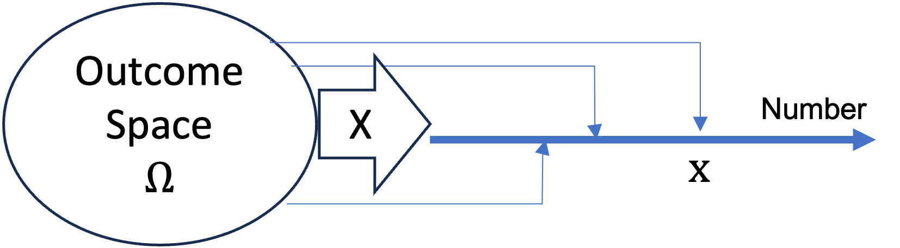
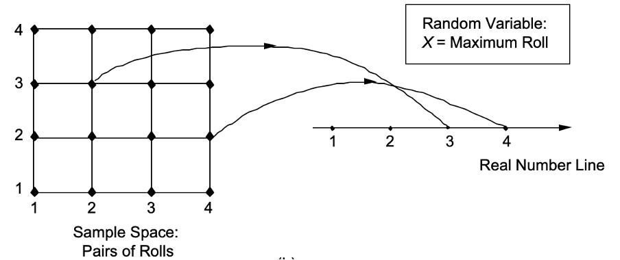
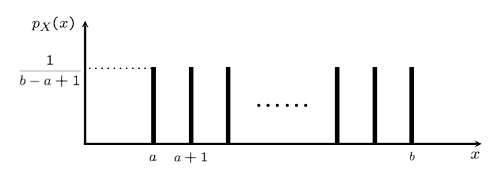
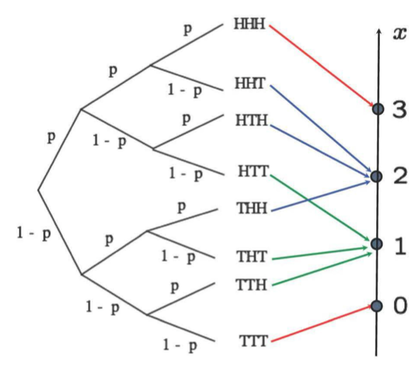
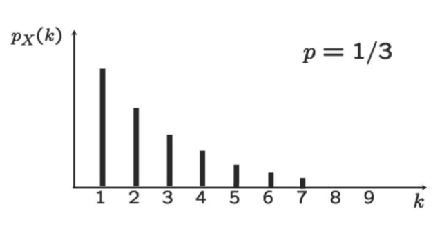
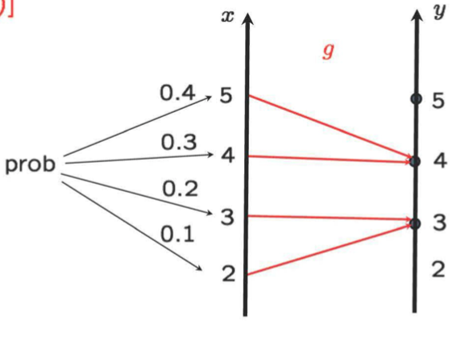

```{css, echo=FALSE}
.bluebox {
  padding: 1em;
  background: SteelBlue;
  color: white;
  border: 2px solid orange;
  border-radius: 10px;
}
.center {
  text-align: center;
}
```

<div style="display:none">
  $
\def\dist{\sim\xspace}
\newcommand{\mat}[1]{\boldsymbol{#1}}
\newcommand{\rv}[1]{\underline{#1}} 
\newcommand{\Exp}[1]{\exp\left\{#1\right\}}
\newcommand{\Log}[1]{\log\left\{#1\right\}}
\newcommand{\eqv}{\;\Longleftrightarrow\;}
\newcommand{\E}[2][]{E_{#1}\left[#2\right]}
\newcommand{\V}[2][]{V_{#1}\left[#2\right]}
\newcommand{\cov}[2][]{\mathrm{Cov}_{#1}\left[#2\right]}
\newcommand{\corr}[2][]{\rho_{#1}\left[#2\right]}
  \newcommand{\norm}{N\left(\mu,\sigma^2\right)}
  \newcommand{\bexpect}[1]{\mathbb{E}\Bl[ #1 \Br]}
  \def\giv{\,|\,}
\newcommand{\fx}{f_X(x)}
\newcommand{\Fx}{F_X(x)}
\newcommand{\fy}{f_Y(y)}
\newcommand{\Fy}{F_Y(y)}
\newcommand{\fz}{f_Z(z)}
\newcommand{\Fz}{F_Z(z)}
\newcommand{\fxA}{f_{X|A}(x)}
\newcommand{\fyA}{f_{Y|A}(y)}
\newcommand{\fzA}{f_{Z|A}(z)}
\newcommand{\fxy}{f_{X,Y}(x,y)}
\newcommand{\Fxy}{F_{X,Y}(x,y)}
\newcommand{\fxcy}{f_{X|Y}(x|y)}
\newcommand{\fycx}{f_{Y|X}(y|x)}
  \newcommand{\px}{p_X(x)}
\newcommand{\py}{p_Y(y)}
\newcommand{\pz}{p_Z(z)}
\newcommand{\pth}{p_{\Theta}(\theta)}
\newcommand{\pxA}{p_{X|A}(x)}
\newcommand{\pyA}{p_{Y|A}(y)}
\newcommand{\pzA}{p_{Z|A}(z)}
\newcommand{\pxy}{p_{X,Y}(x,y)}
\newcommand{\pxcy}{p_{X|Y}(x|y)}
\newcommand{\pycx}{p_{Y|X}(y|x)}
\newcommand{\cprob}[1]{\mathbb{P}( #1 )}
\newcommand{\cbprob}[1]{\mathbb{P}\left( #1 \right)}
\newcommand{\aleq}[1]{\begin{align*}#1\end{align*}}
\newcommand{\real}{{\mathbb R}}
\newcommand{\set}[1]{\{#1\}}
\newcommand{\Set}{\text}
\newcommand{\qed}{\blacksquare}
\newcommand{\comp}{\overline}
%%% definition
\newcommand{\eqdef}{\triangleq}
%%% imply
\newcommand{\imp}{\Longrightarrow}
\newcommand{\indep}{\perp \!\!\! \perp}
%normal colored text
\newcommand{\redf}[1]{{\color{red} #1}}
\newcommand{\yellowf}[1]{{\color{yellow} #1}}
\newcommand{\bluef}[1]{{\color{blue} #1}}
\newcommand{\grayf}[1]{{\color{gray} #1}}
\newcommand{\magenf}[1]{{\color{magenta} #1}}
\newcommand{\greenf}[1]{{\color{green} #1}}
\newcommand{\cyanf}[1]{{\color{cyan} #1}}
\newcommand{\orangef}[1]{{\color{orange} #1}}
\newcommand{\expect}[1]{\mathbb{E}[ #1 ]}
\newcommand{\bin}[1]{\textrm{Bin}\left(n,p\right)}
\newcommand{\dbin}[1]{\binom{n}{x}p^x\left(1-p\right)^{n-x}}
%%%% indicator
\newcommand{\indi}[1]{\mathbf{1}_{ #1 }}
% Bernoulli
\newcommandx\bern[1][1=p]{\textrm{Bern}\left({#1}\right)}
\newcommandx\dbern[2][1=x,2=p]{#2^{#1} \left(1-#2\right)^{1-#1}}
\newcommandx\pbern[2][1=x,2=p]{\left(1-#2\right)^{1-#1}}
% Binomial

% Multinomial
\newcommandx\mult[1][1={n,p}]{\textrm{Mult}\left(#1\right)}
\newcommandx\dmult[3][1=x,2=n,3=p]{\frac{#2!}{#1_1!\ldots#1_k!}#3_1^{#1_1}\cdots#3_k^{#1_k}}
% Hypergeometric
\newcommandx\hyper[1][1={N,m,n}]{\textrm{Hyp}\left({#1}\right)}
\newcommandx\dhyper[4][1=x,2=N,3=m,4=n]{\frac{\binom{#3}{#1}\binom{#2-#3}{#4-#1}}{\binom{#2}{#4}}}
% Negative Binomial
\newcommandx\nbin[1][1={r,p}]{\textrm{NBin}\left({#1}\right)}
\newcommandx\dnbin[3][1=x,2=r,3=p]{\binom{#1+#2-1}{#2-1}#3^#2(1-#3)^#1}
\newcommandx\pnbin[3][1=x,2=r,3=p]{I_#3(#2,#1+1)}

% Poisson
\newcommandx\pois[1][1=\lambda]{\textrm{Po}\left({#1}\right)}
\newcommandx\dpois[2][1=x,2=\lambda]{\frac{#2^#1 e^{-#2}}{#1!}}
\newcommandx\ppois[2][1=x,2=\lambda]{e^{-#2}\sum_{i=0}^#1\frac{#2^i}{i!}}
%%%% variance
\newcommand{\var}[1]{\text{var}[ #1 ]}
\newcommand{\bvar}[1]{\text{var}\Bl[ #1 \Br]}
\newcommand{\cvar}[1]{\text{var}( #1 )}
\newcommand{\cbvar}[1]{\text{var}\Bl( #1 \Br)}
  $
</div>


```{r setup, include=FALSE}
knitr::opts_chunk$set(echo = TRUE,message=FALSE,fig.align="center",fig.width=7,fig.height=2.5,out.width = "65%")
pacman::p_load(
       car
       , learnr
       , extraDistr
      , ggplot2
      , ggExtra
      , reshape2
      , corrplot
      , purrr
      , RColorBrewer
      , lubridate
      , mnormt
      , mvtnorm
      , MCMCpack
      )
```


```{r,echo=FALSE}
# Global parameter
show_code <- TRUE
```

```{r ,include=FALSE}
line_width = 1.3
point_size = 4
theme_set(theme_bw(base_size=20))
theme_update(legend.background=element_rect(fill=alpha("white", 0)),
             legend.key=element_rect(colour="white"),
             legend.key.width=unit(3, "lines"),
             plot.margin=unit(rep(0, 4), "lines"))

# FIXME: is it possible to move this statement into theme_update?
scale_color_discrete = function(...) scale_color_brewer(..., palette="Dark2")


make.dist.fn <- function(mode, dist) {
  if (mode == "cdf")
    eval(parse(text=paste("p", dist, sep="")))
  else if (mode == "pdf" || mode == "pmf")
    eval(parse(text=paste("d", dist, sep="")))
  else
    stop("invalid mode: must be 'cdf' or 'pdf/pmf'")
}

make.data <- function(mode, dist, theta, xseq) {
  dist.fn <- make.dist.fn(mode, dist)
  unary <- function(...) function(x) dist.fn(x, ...)
  data.fns <- apply(theta, 1, function(x) do.call(unary, as.list(t(x))))
  values <- data.frame(sapply(data.fns, function(f) f(xseq)))
  cbind(x=xseq, values)
}

plot.dist <- function(xseq, theta, dist, mode, title, lab.fn) {
  values <- make.data(mode, dist, theta, xseq)
  molten <- melt(values, 1)
  labels <- apply(theta, 1, function(x) do.call(lab.fn, as.list(t(x))))
  p <- ggplot(molten, aes(x=x, y=value, color=variable, linetype=variable)) +
       ggtitle(title) +
       ylab(toupper(mode)) +
       scale_color_discrete(labels=labels) +
       scale_linetype_discrete(labels=labels)

  # We position the legend for CDFs bottom-right and for P[MD]Fs top-right.
  if (mode == "cdf")
    p <- p + theme(legend.title=element_blank(),
                   legend.justification=c(1, 0),
                   legend.position=c(1, 0))
  else
    p <- p + theme(legend.title=element_blank(),
                   legend.justification=c(1, 1),
                   legend.position=c(1, 1))
  p
}

plot.discrete <- function(from, to, ...) {
  xseq <- seq(from, to)
  plot.dist(xseq, ...) +
    geom_line(size=line_width) +
    geom_point(size=point_size)
}

plot.continuous <- function(from, to, ...) {
  xseq <- seq(from, to, by=0.01)
  plot.dist(xseq, ...) +
    geom_line(size=line_width)
}

```   
## Introduction

### Roadmap

Module  |  Topic                                          | What you should know                             |
--------|-------------------------------------------------|--------------------------------------------------|
  M1    | Why Probability? What is Probability?           | Probability Is Essential For Logic               |
M2      | Conditioning, Bayes Rule, and Independence.     | Understand why you can learn by conditioning.    |
M3      | Counting and Simulation                         | Learn how to count probability by simulation     |
**M4**  | RV and Discrete Distributions                   | Learn the d,p,q,r functions of probability       |
M5      | Continuous Distributions and Multiple RVs.      | Know how to work with Normal distribution        |
M6      | Joint, Marginal, Conditional, Independence      | Can manipulate joint distribution                |
M7      | Summarizing Random Variables.                   | Able to Calculate Expectation and Variance       |
M8      | Simulation (multiple RV) and Limit Theorems     | Understand Sampling distribution and CLT         |
M9      | Point Estimation                                | Maximum likelihood and Method of Moment          |
M10     | Classical Inference and Bootstrap               | Bootstrap, P-value, Confidence Interval, etc     |
M11     | Bayesian Inference                              | Use Stan to do Bayesian Inference                |

### Overview of module 3

-  Random variable: Idea and formal definition

-  Popular discrete random variables

-  (Functions of) multiple random variables 


-  Summarizing random variables: Expectation and Variance

-  Conditioning for random variables

-  Independence for random variables 


## Random Variable
### Random Variable: Idea

Mathematically, a random variable (rv) $X$ is a function which maps from $\Omega$ to $\real$.  
$$X:\Omega \rightarrow\real$$
Note that random variables are often denoted using capital Roman letters.
It's a convenient way to convert real world events or propositions into numbers since 
probability calculations are easier to do on number than on concepts or objects.
```{r , echo=FALSE, out.width = '90%',fig.align="center"}

#\includegraphics[width=0.9\textwidth]{L3_RV_ex.png}
```


Imagine your outcome space is all the students in your class, so 
$$\Omega=\{\text{All the classmates}\}.$$
Depending on the interest of the observer, outcome might be a student or an event defined by a set of students.  For example if one were to be interest in knowing the weight of everyone in the class, the person will not care if the name of the student was Jane or Bob. All he/she need is the weight of Jane and the weight of Bob as a number measured in some unit like kg or lb.  If the gender was of interest he/she might want to map Bob to $0$ for Jane to $1$.

You can also define more than one random variable on the same outcome space. If the height of the individual was of interest then we can define a RV $Y$ that takes Jane and Bob and maps them onto their height.  We can even define a BMI random variable that is a function of $X$ and $Y$.

Another example is two rolls of tetrahedral dice.  There are $4 \times 4$ distinct outcomes comprised of pairs of numbers $(1,2), (2,3), \cdots, (4,4)$. One can treat the pair of numbers as a multivariate outcome RV.  Or you can define an RV on any quantity like sum, average, max, etc.  If you do a mapping of this sort, you have converted the unique pairs of numbers into 16 numbers that are not necessarily unique.  

```{r , echo=FALSE, out.width = '90%',fig.align="center"}

#\includegraphics[width=0.9\textwidth]{L3_RV_ex.png}
```


### Random Variable: More Formally

:::: {.bluebox data-latex=""}
::: {.center data-latex=""}
**Random Variable**
:::
For a given outcome space $\Omega$ of some thought experiment, a random variable (rv) $X$ is any rule (function) that associates a number ($\real$) with each outcome in $\Omega$. 
$$X:\Omega \rightarrow\real$$
::::

In mathematical language, a random variable is a function whose domain is the outcome space and whose range is some subset of real numbers.  We typically use uppercase Roman letters to represent random variables and lower case letter to represent the actual value.  So for RV $X$, a numerical value will be $x$.  You can think of a random variable as an abstract measurement device.  They help us bridge the gap between the reality and probability models.  So if you put in a outcome into a random variable they return a value. If $\omega\in \Omega$ we get
$$X(\omega) = x.$$ 
Conversely, for a fixed value $x,$ we can associate an event that a random variable $X$ has the value $x,$ i.e., 
$$\{ \omega \in \Omega \mid X(\omega) = x \}$$
As you can see there is no explicit rule that takes $\omega$ to $x$ defined for $X$. 
Compare it to how variables you know in algebra class is used. 
$$f(x,y)=x^2+y^2$$
These variables are place holders in a function but they are not function. We plug in the actual values into $x$ and $y$ to get a value out of it.  For a RV, we are not interested in doing the mapping like that of algebra but we are more interested in the probabilities associated with these RVs.

#### Notations 

It's also good to highlight the notations. The notations in probability and statistics are often not ideal, especially when you cross it with other divisions of math like linear algebra.  In linear algebra, capital letters tend to express a matrix and lower case letter expresses a vector or a scalar.  
$$
\mathbf{X}=\mathbf{X}_{r\times c}=
\left(
\begin{array}{ccc}
x_{11} & \dots & x_{1c}\\
\vdots & \ddots & \vdots\\
x_{r1} & \dots & x_{rc}\\
\end{array}
\right)
=[x_{ij}],
\begin{array}{c}
i=1,\dots,r\\
j=1,\dots,c
\end{array}
$$

$$
\mathbf{y}=
\left(
\begin{array}{ccc}
y_{1} & \cdots & y_{r} 
\end{array}
\right)^{T}
$$
In this class we will use bold face to differentiate something from linear algebra and something from probability.  Therefore it makes no sense to write expressions like $\mathbf{X}<\mathbf{x}$ in linear algebra but it makes perfect sense to write $X<x$ in probability.  Unfortunately, this get's even more confusing when we start dealing with a vector or matrix of RVs since each element of a matrix or vector can be a rv.  There has been proposal to use under line to represent (Hemelrijk 1966) what is random and what is not; $$\underline{X}\text{ or }\underline{\mathbf{X}}.$$  The expression is refereed to as the Dutch notation, which is not so popular despite it's usefulness.  We will make use of the notation when necessary especially when we have matrix notation from linear algebra.

### Example

Let's illustrate the idea of RV using rolls of a dice. 
If we are rolling a die then $$\Omega = \{1, 2, 3, 4, 5, 6 \}.$$
We can define a random variable $X$ that takes the face value of the outcome $$X\in\{1, 2, 3, 4, 5, 6 \}.$$
So if we have an outcome $\omega =5$ then $X(\omega)=5$.
We can express this as event $A$ where $A = \{X =i\}$, which is a short hand for
$$A = \{\omega \in \Omega \mid  X(\omega) = i \} = \{i \} \subset \Omega,$$

Multiple random variables can be defined on the same sample space. 
If we also define a random variable 
$$
X_b = \begin{cases}
0, & \text{if even numbers}\\
1, & \text{if odd numbers}
\end{cases}
$$
Then we have two events $A_1 = \{X_b =1\}$ and $A_0 = \{X_b =0\}$ 
Where $$A_0 = \{\omega \in \Omega \mid  X_b(\omega) = 1 \} = \{2,4,6 \} \subset \Omega,$$ and
$$A_1 = \{\omega \in \Omega \mid  X_b(\omega) = 0 \} = \{1,3,5 \} \subset \Omega,$$ 

Remember that the random variable $X$ is a $function$ from $\Omega$ to $\real$ that include integers.


### Random variables are often chosen not at random

Random variable can be any function.  For example, when the outcome is binary, it can be mapped to any two values $\{-1,1\}$,$\{0,1\}$, $\{0,100\}$, etc.  
 However, in most applied situations, we choose random variables in ways that it has convenient probability rule defined for them.  In order for you to know what to choose, you need to understand the probability models.  This will be the goal of the next section.

## PMF and CDF

### probability distribution or probability mass function (PMF)

Now that we defined random variable, we want to asign probabilities to them.  We will first start with a situation where the values $x$ are discrete (Finite or countably infinite) such as $1, 2, 3, \ldots$.
We will use $p_X(x)$ to represent the probability that random variable $X$ takes on the value $x$.   

$$
p_X(x) \ \triangleq\ \Pr(X = x) \ \triangleq\ \Pr(\{ \omega \in \Omega \mid X(\omega) = x \})
$$
For a discrete random variable $X$, we call $p_X(x)$ a probability mass function (PMF). 
The reason we keep emphasizing "discrete" is because for a continuous RV the situation is a little different.

:::: {.bluebox data-latex=""}
::: {.center data-latex=""}
**Probability Mass Function (PMF)**
:::
A function $p_X(x)$ for RV $X$ expresses the probability that $X$ takes on the value $x$ 
$$
p_X(x) \ \triangleq\ \Pr(X = x) \ \triangleq\ \Pr(\{ \omega \in \Omega \mid X(\omega) = x \})
$$
::::

### PMF as a probability rule.

The PMF $p_X(x)$ is a rule that converts any valid value $x$ and spits out a probability.
You can say that it's a conversion table. 


Using a dice as an example.  If we assume the probability of the 6 faces are all equally likely then,

| $\omega$ | $x$ |$p_X(x)$|
|:--------:|:---:|:------:|
|  1       |  1  |  1/6   |
|  2       |  2  |  1/6   |
|  3       |  3  |  1/6   |
|  4       |  4  |  1/6   |
|  5       |  5  |  1/6   |
|  6       |  6  |  1/6   |

Or using the odd (1) or even (0) outcome 

| $\omega$ | $x$ |$p_X(x)$|
|:--------:|:---:|:------:|
| {2,4,6}  |  0  |  3/6   |
| {1,3,5}  |  1  |  3/6   |

The $p_X(x)$ can be any table but it doesn't make sense to keep track of tables with arbitrary probability.

We would rather define a function that makes sense and agreeable.  There are variety of such functions or models that probability researchers have built in the past.  We call those the probability distributions. Most of the discrete distributions are built on the counting rules as you have seen earlier.  Some of the expression might look a little intimidating but they are just helpful way of looking up an entry in the probability table.

For a probability distribution $p_X(x)$ to be a valid probability they must follow the axioms, which we will not show.  But you are welcome to verify for yourself that for any probability distribution we will talk about.

- (A1) Nonnegativity: $p_X(x)>0$ for all values of $x$
- (A2) Normalization: $\Pr(\Omega)=\sum_{\omega\in \Omega}p_X(\omega) =1$
- (A3) Countable additivity: $\Pr(\cup_i x_i)=\sum_i p_X(x_i)$

### Cumulative Distribution Function (CDF)

For some fixed value $x$, we often wish to compute the probability that the observed value of RV $X$ will be at most $x$.  We define a function for this

:::: {.bluebox data-latex=""}
::: {.center data-latex=""}
**Cumulative Distribution Function**
:::
For RV $X$ with PMF $p_X(x)$, CDF $F_X(x)$ is defined as
$$F_X(x)=\Pr(X\leq x)=\sum_{y\leq x} p_X(y)$$
::::

Similar to PMF, CDF is just book keeping on the table for discrete probability.
Let $X$ be the number of heads in a toss of 3 coins.  Then the table will be

| $\omega$                 | $x$ |$p_X(x)$|$F_X(x)$|
|:------------------------:|:---:|:------:|:------:|
| {T,T,T}                  |  0  |  1/8   |  1/8   |
| {(H,T,T),(T,H,T),(T,T,H)}|  1  |  3/8   |  4/8   |
| {(H,H,T),(T,H,H),(H,T,H)}|  2  |  3/8   |  7/8   |
| {(H,H,H)}                |  3  |  1/8   |  8/8   |

So if we want to know the probability that # of heads is less than or equal to two, we know that it's 4/8.

Why is this useful?  Here's an example:

A store carries flash drives with 1, 2, 4, 8, or 16 GB of memory. The accompanying table gives the distribution of inventory for  
$X$ = the amount of memory in a purchased drive:

| $x$ |$p_X(x)$|$F_X(x)$|
|:---:|:------:|:------:|
|  1  |  0.05  |  0.05  |
|  2  |  0.10  |  0.15  |
|  4  |  0.35  |  0.50  |
|  8  |  0.40  |  0.90  |
|  16 |  0.10  |  1.00  |

What is the probability that the randomly selected memory is 4GB or less?
That is
$$F_X(4)=0.5$$
Graphically it's summing up the height of the bars up to 4GB.
```{r,fig.width=5,fig.height=3.5,echo=FALSE}
df<-data.frame(
memory=factor(1:5,labels=c(1,2,4,8,16)),
probability=c(0.05, 0.10, 0.35, 0.40, 0.10),
color=c("red","red","red","grey","grey"))
p<-ggplot(data=df, aes(x=memory, y=probability,fill=color)) +
  geom_bar(stat="identity")+geom_vline(xintercept=3.5,lty=2,col="red")+scale_fill_manual(values=c("grey", "red"))+ theme(legend.position="none")
p
```

But you might ask why only less than? It turns out that there is a useful result.

For a discrete random variable $X$ with CDF $F_X(x)$, if you want to know $Pr(a\leq X\leq b)$ for two numbers $a$ and $b$ with $a \leq b$
$$Pr(a\leq X\leq b)= F_X(b)-F_X(a-)$$
where "a-" represents the largest possible X value that is strictly less than a. In particular, if the
only possible values are integers and if a and b are integers, then
$$Pr(a\leq X\leq b)= F_X(b)-F_X(a-1)$$
We can also ask the opposite question
What is the probability that the randomly selected memory is more than 4GB ?
$$Pr(X>4)=1-Pr(X\leq4) = 1-F_X(4)=0.5$$

```{r,fig.width=5,fig.height=3.5,echo=FALSE}
df<-data.frame(
memory=factor(1:5,labels=c(1,2,4,8,16)),
probability=c(0.05, 0.10, 0.35, 0.40, 0.10),
color=c("grey","grey","grey","red","red"))
p<-ggplot(data=df, aes(x=memory, y=probability,fill=color)) +
  geom_bar(stat="identity")+geom_vline(xintercept=3.5,lty=2,col="red")+scale_fill_manual(values=c("grey", "red"))+ theme(legend.position="none")
p
```

We can also get a probability that $2<X\leq 8$
$$Pr(2<X\leq 8)=Pr(X\leq8)-Pr(X\leq2) = 0.9-0.15=0.75$$
```{r,fig.width=5,fig.height=3.5,echo=FALSE}
df<-data.frame(
memory=factor(1:5,labels=c(1,2,4,8,16)),
probability=c(0.05, 0.10, 0.35, 0.40, 0.10),
color=c("grey","red","red","red","grey"))
p<-ggplot(data=df, aes(x=memory, y=probability,fill=color)) +
  geom_bar(stat="identity")+geom_vline(xintercept=1.5,lty=2,col="red")+
  geom_vline(xintercept=4.5,lty=2,col="red")+
  scale_fill_manual(values=c("grey", "red"))+ theme(legend.position="none")
p
```

### Simulation from discrete probability

Another useful use of the CDF is in simulating from probability models.  Since we know how to generate uniform random variable using RNG, we can use the inverse of the CDF to convert the RNG to have certain probability distribution.  We already saw this when we generated random dice rolls.

Going back to the example of flash drives

| $x$ |$p_X(x)$|$F_X(x)$| $F^{-1}_X(x)$           |
|:---:|:------:|:------:|:-----------------------:|
|  1  |  0.05  |  0.05  |  0 \leq U < 0.05        |
|  2  |  0.10  |  0.15  |  0.05 \leq U < 0.15     |
|  4  |  0.35  |  0.50  |  0.15 \leq U < 0.50     |
|  8  |  0.40  |  0.90  |  0.50 \leq U < 0.90     |
|  16 |  0.10  |  1.00  |  0.90 \leq U \leq 1.00  |

If we want to simulate from this distribution, we can generate a uniform random number, then when the value falls within the rage of the CDF values you can claim that you have sampled from that particular $x$ value.  So if random number $U$ is $0 \leq U < 0.05$ you would return 1. If random number $U$ is $0.50 \leq U < 0.90$ you would return 8. 

In R it will look like this.
```{r}
discrete_inverse_sampling <- function( prob, x ) {
  U  <- runif(1)
  print(paste0("The value of random number is: ",U))
  pvec <- c(0,cumsum(prob))
  return(x[which(pvec[-length(pvec)]< U & U <= pvec[-1])])
}
```

When we try it out on the Memory example we get

```{r}
memory=factor(1:5,labels=c(1,2,4,8,16))
probability=c(0.05, 0.10, 0.35, 0.40, 0.10)
set.seed(123)
discrete_inverse_sampling(probability,memory)
discrete_inverse_sampling(probability,memory)
discrete_inverse_sampling(probability,memory)
```


### Probability distribution in R

When talking about probability distribution, we feel it's important to use computer programs. In R you will find almost any probability distribution available to humans.  
For any probability distribution `xyz` there are 4 functions defined that you should familiarize yourself with.

- Probability mass/density function: `dxyz()`
- Random number generation function: `rxyz()`
- Probability distribution function: `pxyz()`
- Inverse Cumulative Distribution Function: `qxyz()`

Here are the list of discrete probability distributions implemented in R.

|          Distribution          | Functions |           |           |           |
|:------------------------------:|:---------:|:---------:|:---------:|:---------:|
| Binomial/Bernoulli             | pbinom    | qbinom    | dbinom    | rbinom    |
| Discrete Uniform               | pdunif    | qdunif　  | ddunif    | rdunif    |
| Poisson                        | ppois     | qpois     | dpois     | rpois     |
| Geometric                      | pgeom     | qgeom     | dgeom     | rgeom     | 
| Hypergeometric                 | phyper    | qhyper    | dhyper    | rhyper    |
| Negative Binomial              | pnbinom   | qnbinom   | dnbinom   | rnbinom   |
| Multinomial                    |           |           | dmultinom | rmultinom |

#### Example: Binomial probabilities

Let's use the Binomial example to to illustrate the difference between the different functions.

For a random variable $X$ that follow binomial probability distribution. 
$$p_X(x) = {n \choose x} p^x (1-p)^{n-x}$$ 
If we use $n=5$ and $p=0.4$.

| $x$ |   $p_X(x)$           |$F_X(x)$               |
|:---:|:--------------------:|:---------------------:|
|  0  | `r dbinom(0,5,0.4)`  |  `r pbinom(0,5,0.4)`  |
|  1  | `r dbinom(1,5,0.4)`  |  `r pbinom(1,5,0.4)`  |
|  2  | `r dbinom(2,5,0.4)`  |  `r pbinom(2,5,0.4)`  |
|  3  | `r dbinom(3,5,0.4)`  |  `r pbinom(3,5,0.4)`  |
|  4  | `r dbinom(4,5,0.4)`  |  `r pbinom(4,5,0.4)`  |
|  5  | `r dbinom(5,5,0.4)`  |  `r pbinom(5,5,0.4)`  |

The `d` function `dbinom(x,size=n, prob=p)` is the same as ${n \choose x} p^x (1-p)^{n-x}$.
```{r,out.width="60%",fig.height=5,fig.width=6,echo=FALSE}
f = function(x) {
  dbinom(floor(x),5,0.4)
}
# specifying the domain of f(x)
x = seq(-1, 6, length.out = 100)
# creating a data frame that contains x and f(x)
dat = data.frame(x = x, y = f(x))
p = ggplot(dat, aes(x = x, y = y)) + 
  geom_step()+xlim(-0.5,6) +ylab("PMF")# geom_step creates a stairs plot
p
```

The `p` function `pbinom(x,size=n, prob=p)` returns the CDF function 
$$F_X(x)=\Pr(X\leq x)=\sum_{y\leq x} p_X(y)=\sum_i^x  {n \choose i} p^i (1-p)^{n-i}$$  
```{r,out.width="60%",fig.height=5,fig.width=6,echo=FALSE}
f = function(x) {
  pbinom(floor(x),5,0.4)
}
# specifying the domain of f(x)
x = seq(-1, 6, length.out = 100)
# creating a data frame that contains x and f(x)
dat = data.frame(x = x, y = f(x))
p = ggplot(dat, aes(x = x, y = y)) + 
  geom_step()+xlim(-0.5,6)+ylab("CDF") # geom_step creates a stairs plot
p
```

The `q` function `qbinom(p=x,size=n, prob=p)` returns the inverse of CDF $F^{-1}_X(x)$.
So if you pass it a probability, it will return the $x$ value.
```{r,out.width="60%",fig.height=5,fig.width=6,echo=FALSE}
f = function(x) {
  qbinom(x,5,0.4)
}
# specifying the domain of f(x)
x = seq(0, 1, length.out = 100)
# creating a data frame that contains x and f(x)
dat = data.frame(p = x, y = f(x))
p = ggplot(dat, aes(x = x, y = y)) + 
  geom_step()+xlim(-0.1,1.1)+ylab("Inverse CDF") # geom_step creates a stairs plot
p
```

Finally the `r` function will give you a sample, or an instance from this distribution.
If you recall, we simulated a coin flip using RNG.  The `rbinom` function will do that but does it $n$ times and count the number of 1s. 

```{r}
set.seed(12345)
sum(runif(5)< 0.4);sum(runif(5)< 0.4);sum(runif(5)< 0.4)
set.seed(12358)
rbinom(3,5,0.4)
```

## Discrete Probability Models

A discrete probability model or a discrete probability distribution (DPD) lists all possible values of a discrete random variable and gives their probabilities. We will display the most popular distributions that are often used.  
They are special because many real problem can be solved using these distributions.  You should learn them since they are the vocabulary you will use to construct a probability model.

### Bernoulli $X$ with parameter $p \in [0,1]$

Bernoulli distribution is often refereed to as the coin flip probability.  
It is defined for one binary value outcome ($\Omega=\{0,1\}$).
If RV $X$ is a realization of Bernoulli probability probability distribution, then $X$ takes one of the two values with probability defined as (w.p.: with probability)
$$
X = \begin{cases}
0, & \text{w.p.} \quad 1-p, \\
1, & \text{w.p.} \quad p
\end{cases}
$$
In other words, $p_X(0)=1-p$ and $p_X(1)=p$ from our PMF notation. 
Notice that the parameter $p$ can only take values in $[0,1]$ for this to comply with the probability axioms.

When RV $X$ follows Bernoulli distribution with parameter $p$, we express it as $$X\sim Bernoulli(p)\text{ or }X\sim Bern(p)$$

Bernoulli distribution is used to model a trial that results in binary results, (e.g., success/failure, head/tail, TRUE/FALSE).  The parameter $p$ is casually called the "success probability" or the "probability of a head".  Mathematically, however, there is no fixed rule on what value should be mapped to 1 or 0.  Thus, a success could be 0 and failure could be 1, but depending what you choose to map to 1, the interpretation of $p$ might reverse.  It's important to always be mindful of the mapping of the random variable so that $$\Pr(X=1)=p$$ makes sense.

It is useful for an indicator rv of a propsition $A$ where we define a rv $\indi{A}$ as:
$$
\indi{A} = 
\begin{cases}
1, & \text{if $A$ is TRUE}, \\
0, & \text{otherwise}
\end{cases}
$$

#### In R

There is no probability function for the Bernoullin distribution.  You can use the binomial distribution where Bernoullin is a special case where `size = 1`

```{r}
rbinom(n=10, size = 1, prob = 0.6)
dbinom(x=1, size = 1, prob = 0.6)
pbinom(q=0.5, size = 1, prob = 0.6)
qbinom(p=0.2, size = 1, prob = 0.6)
```

### Discrete Uniform $X$ with parameter $a,b$

Discrete Uniform is a probability assigned to a random choose of a number out of $\Omega = \{ a, a+1, \ldots, b \}$. 
There for your two parameters are integers $a,b$, where $a \leq b$.
A sample from discrete uniform is a random integer value between $a$ and $b$.  
The PMF is defined as
$$p_X(x) = \frac{1}{b-a+1}, \ x \in \Omega$$
notice that the probability is not defined as a function of $x$ since it is the same across all the possible values.  
It's the easiest of the model to count since the outcomes are enumerated and distinct and the probabilities are defined by breaking a stick of length 1 into $b-a+1$ pieces.

```{r , echo=FALSE, out.width = '70%',fig.align="center"}

#\includegraphics[width=0.7\textwidth]{L3_uniform_ex.png}
```


#### In R

Discrete uniform is not in the basic R implementation.  You can use `sample` function to genera an integer.   The PMF is easy to calculate manually by `1/(b-a)`.  However, if you want to use the same 4 functions as the other distributions, you  could install and use `extraDistr` package that implements the discrete uniform distribution formally.
```{r}
sample(1:10, size = 3, replace =TRUE, prob = 1/(1:10))
extraDistr:::rdunif(n=3, min = 1, max=10)
extraDistr:::ddunif(x=2, min = 1, max=10) 
extraDistr:::pdunif(q=4, min = 1, max=10)
extraDistr:::qdunif(p=0.5, min = 1, max=10)
```


### Binomial $X$ with parameter $n,p$

Binomial probability distribution models the number of successes in a given number of **independent** trials.  It is often refereed to as multiple coin flip probability.  
For $n$ independent trials with binary outcome, where one trial has the success probability $p$ the PMF is defined as

$$
p_X(k) = {n \choose k} p^k (1-p)^{n-k}=B(k;n,p)
$$
The term $\binom{n}{k} = \frac{n!}{k!(n-k)!}$, which we read `$n$ choose $k$' is the binomial coefficient.  Since ${1 \choose 1}=1$ and ${1 \choose 0}=1$, when $n=1$, the pmf is identical to that of Bernoulli distribution.

We express RV $X$ to come from a binomial distribution by
$$X\sim Bin(n,p)$$

The binomial coefficient has nothing to do with the probability of success $p$.  So why is this term necessary?
The answer goes back to the counting.  If you think about a situation where $n=3$ there are 1 way to get 3 heads and 1 way to get three tails. But you have 3 ways to get 2 heads and 3 ways to get a head.  The $p^k (1-p)^{n-k}$ term only is concerned about the probability based on the number of heads and tails.  The binomial coefficient takes care of the fact that there are permutation of the result.

```{r , echo=FALSE, out.width = '80%',fig.align="center"}

#\includegraphics[width=0.8\textwidth]{L3_binomial_ex.png}
```

| H/T         | k | (n choose k) | probability     | if p=0.6   |
|-------------|---|--------------|-----------------|------------|
| HHH         | 3 | 1            | ppp             |  0.216     |
| HHT/HTH/THH | 2 | 3            | pp(1-p)         |  0.144     |
| HTT/THT/TTH | 1 | 3            | p(1-p)(1-p)     |  0.096     |
| TTT         | 0 | 1            | (1-p)(1-p)(1-p) |  0.064     |

If you just add up the probabilities you will see that it does not add up to 1.
$0.216 +0.144+0.096+0.064=0.52$
But with normalization
$0.216 +3*0.144+3*0.096+0.064=1$


```{r,echo=FALSE, fig.height=5, fig.width=12,out.width="90%", warning=FALSE}
plot.binomial = function(mode, xmin=1, xmax=40,
                         theta=data.frame(n=c(40, 30, 25), p=c(0.3, 0.6, 0.9)),
                         title="Binomial") {
  lab.fn <- function(x, y) substitute(list(n==i, p==j), list(i=x, j=y))
  plot.discrete(xmin, xmax, theta, "binom", mode, title, lab.fn)
}
gridExtra::grid.arrange(
plot.binomial("pmf"),
plot.binomial("cdf"),ncol = 2)
#store("binomial-pmf", )
#store("binomial-cdf", )
```

#### In R

Binomial distribution has two parameters the number of trials $n$ and the probability of success for each trial $p$.
The `size` option correspond to $n$ and `prob` option corresponds to $p$.
```{r}
rbinom(n=10, size = 3, prob = 0.6)
dbinom(x=1, size = 3, prob = 0.6)
pbinom(q=1, size = 3, prob = 0.6)
qbinom(p=0.67, size = 3, prob = 0.6)
```

#### Exercise

Compute the following binomial probabilities directly from the formula for $B(x; n, p)$:
(a) $B(3; 8, .6)$
(b) $B(5; 8, .6)$
(c) $P(3 \leq X  \leq 5)$ when $n = 8$ and $p = .6$
(d) $P(1  \leq X)$ when $n = 12$ and $p = .1$

Suppose that 20% of all copies of a particular textbook fail a binding strength test. Let
$X$ denote the number among 15 randomly selected copies that fail the test. Then $X$ has a binomial distribution with n = 15 and p = .2.
(a) The probability that at most 8 fail the test is
(b) The probability that exactly 8 fail is
(c) The probability that at least 8 fail is
(d) Finally, the probability that between 4 and 7, inclusive, fail    
### Poisson $X$ with parameter $\lambda$

Poisson distribution is the first stop as a probability model for counts. We say that $X$ is distributed as Poisson distribution and express it as
$$X\sim Pois(\lambda)\text{ or }Po(\lambda)$$
It is defined on the positive integer values including 0 and has a rate parameter $\lambda$. The pmf is defined as 

$$
p_X(x) = e^{-\lambda}\frac{\lambda^x}{x!}, \quad k=0,1, \ldots
$$


```{r,echo=FALSE, fig.height=5, fig.width=12,out.width="90%", warning=FALSE}
plot.poisson <- function(mode, xmin=0, xmax=20,
                         theta=data.frame(lambda=c(1,4,10)),
                         title="Poisson") {
  lab.fn <- function(x) substitute(lambda==i, list(i=x))
  plot.discrete(xmin, xmax, theta, "pois", mode, title, lab.fn)
}

gridExtra::grid.arrange(
plot.poisson("pmf", title="Poisson PMF"),
plot.poisson("cdf", title="Poisson CDF"),ncol = 2)


#store("poisson-pmf", )
#store("poisson-cdf", )
```


At first this expression seems very complicated.  Since the upper limit is not defined, you might wonder if this is a legitimate PMF?  It's pretty easy to show that it is using the definition of [exponential function](https://en.wikipedia.org/wiki/Characterizations_of_the_exponential_function).
\begin{eqnarray} 
\sum_{k=0}^\infty e^{-\lambda}\frac{\lambda^k}{k!} = e^{-\lambda} \left(1+ \lambda + \frac{\lambda^2}{2!} + \frac{\lambda^3}{3!} \ldots \right) = e^{-\lambda} e^\lambda = 1
\end{eqnarray} 

So how do with come up with this distribution?  We can start from $Binomial(n,p)$ distribution.
Recall that Binomial models the number of successes in a given number $n$ of independent trials with success probability $p$.  What we are going to do is we will take $n$ to be very large, meaning we will do a lots of experiments.  We will also choose $p$ to be very small such that $np =\lambda$.  Then we will see that this pmf converges to $Poisson(\lambda)$ as $n$ goes to infinity.

$$
\lim_{n \rightarrow \infty} p_X(k) = {n \choose k} (1/n)^k (1-1/n)^{n-k} = e^{-\lambda}\frac{\lambda^k}{k!}
$$

### Hypergeometric $X$ with parameters $n$, $m$, and $N$

Hypergeometric probability is used to describes the probability of the number of successes.  It is like binomial in a sense that you have $n$ draws from a finite population of size $N$.  The difference is that there are $m$ fixed number of success in $N$ and each sample is drawn without a replacement.  So each of the $n$ draws do NOT have the same probability of being a success.  When $X$ follows Hypergeometric we denote it as
$$X\sim Hyp\left(N,m,n \right)\text{ or } X \sim h\left(N,m,n \right)$$

The assumptions leading to the hypergeometric distribution are as follows:

1. The population or set to be sampled consists of $N$ individuals, objects, or elements (a finite population).
2. Each individual can be characterized as a success (S) or a failure (F), and there are $M$ successes in the population.
3. A sample of $n$ individuals is selected without replacement in such a way that each subset of size $n$ is equally likely to be chosen.
The random variable of interest is $X =$ the number of S’s in the sample.

- Notation:                   
- CDF:                        $\approx \Phi((X-np)/sqrt(np(1-p)))$
- PDF:                        $\frac{\binom{m}{X}\binom{N-m}{n-X}}{\binom{N}{n}}$
<!-- - Expectation:                $nm/N$ -->
<!-- - Variance:                   $(nm(N-n)(N-m))/(N^2(N-1))$ -->
<!-- - Moment Generating Functions:  -->

During a particular period a university’s information technology office received 20 service orders for problems with laptops, of which 8 were Macs and 12 were PCs. A sample of five of these service orders is to be selected for inclusion in a customer satisfaction survey. Suppose that the five are selected in a completely random fashion, so that any particular subset of size 5 has the same chance of being selected as does any other subset (think of putting the numbers 1, 2, . . ., 20 on 20 identical slips of paper, mixing up the slips, and choosing five of them). What then is the
probability that exactly 2 of the selected service orders were for PC laptops?

$Pr(X=2)=\frac{\binom{12}{2}\binom{20-12}{5-2}}{\binom{20}{5}}=\frac{77}{323}$

#### Negative Binomial $X$ with parameters $p$ and $r$

The negative binomial distribution is based on an experiment satisfying the following conditions:
1. The experiment consists of a sequence of independent trials.
2. Each trial can result in either a success (S) or a failure (F).
3. The probability of success is constant from trial to trial, so $Pr(S \text{ on trial } i) = p$ for $i = 1, 2, 3, \dots$
4. The experiment continues (trials are performed) until a total of $r$ successes has been observed,
where $r$ is a specified positive integer.
The random variable of interest is $X =$ the number of trials required to achieve the $r$th success, and $X$ is called a negative binomial random variable. In

  
- Notation:                   $\sim NBin\left(r,p\right)$
- CDF:                        $I_p(r,X+1)$
- PDF:                        $\binom{X+r-1}{r-1}p^r(1-p)^x$
<!-- - Expectation:                $r(1-p)/p$ -->
<!-- - Variance:                   $r(1-p)/p^2$ -->
<!-- - Moment Generating Functions:$(pe^s)/(1-(1-p)e^s)^r$ -->


```{r,echo=FALSE, fig.height=5, fig.width=12,out.width="90%", warning=FALSE}
plot.nbinom= function(mode, xmin=1, xmax=100,
                         theta=data.frame(size=c(35, 30, 25), prob=c(0.4, 0.6, 0.8)),
                         title="Negative Binomial") {
  lab.fn <- function(x, y) substitute(list(n==i, p==j), list(i=x, j=y))
  plot.discrete(xmin, xmax, theta, "nbinom", mode, title, lab.fn)
}
gridExtra::grid.arrange(
plot.nbinom("pmf"),
plot.nbinom("cdf"),ncol = 2)
#store("binomial-pmf", )
#store("binomial-cdf", )
```


### Geometric $X$ with parameter $p$

Geometric distribution is used to model the number of trials until the first success.
- Infinitely many independent Bernoulli trials, where each trial has success probability $p$

- Random variable: 
$$
p_X(k) = (1-p)^{k-1} p
$$

- Models waiting times until something happens. 

```{r , echo=FALSE, out.width = '80%',fig.align="center"}

#\includegraphics[width=0.8\textwidth]{L3_geo_ex.png}
```

- Notation:                    $\textrm{Geo}\left(p\right)$
- CDF:                         $1-(1-p)^x (x\in N^+)$
- PDF:                         $p(1-p)^{x-1}$
<!-- - Expectation:                 $1/p$ -->
<!-- - Variance:                    $(1-p)/p^2$ -->
<!-- - Moment Generating Functions: $pe^s/(1-(1-p)e^s)$ -->

```{r,echo=FALSE, fig.height=5, fig.width=12,out.width="90%", warning=FALSE}

plot.geometric <- function(mode, xmin=0, xmax=10,
                           theta=data.frame(p=c(0.2, 0.5, 0.8)),
                           title="Geometric") {
  lab.fn <- function(x) substitute(p==i, list(i=x))
  plot.discrete(xmin, xmax, theta, "geom", mode, title, lab.fn)
}


gridExtra::grid.arrange(
plot.geometric("pmf"),
plot.geometric("cdf"),ncol = 2)
#store("geometric-pmf", )
#store("geometric-cdf", )
```

## Summarizing Random Variables

Random variables are probability.  But probabilities are hard for many people because they require some notion of relative uncertainty.  Therefore, it is common to summarize RVs with some number.  The usual suspects are the mean and the variance, which represents the center and the spread of the distribution.   

### Expectation/Mean

Expectation or mean is the center of the distribution. 

:::: {.bluebox data-latex=""}
::: {.center data-latex=""}
**Expectation/Mean**
:::
$$
\expect{X} = \sum_{x} x p_X(x)
$$
::::

Essentially, we are taking the values $x$ and weighting them by      
$p_X(x)$, relative frequency of value $x$ (trials with $x$/total trials)

#### Example: Bernoulli rv with $p$
$$
\expect{X} = 1\times p + 0 \times (1-p) = p = p_X(1)
$$

### Properties of Expectation

Not very surprising. Easy to prove using the definition.

- If $X \geq 0,$ $\expect{X} \geq 0.$
- If $a \le X \le b,$ $a \le \expect{X} \le b.$
- For a constant $c$, $\expect{c} = c.$

### Expectation of a function of a RV

- For a rv $X,$ $Y =g (X)$ is also a r.v.
- $\expect{Y} = \expect{g(X)} = \sum_{x} g(x) p_X(x)$ 
- Compute $\expect{Y}$ for the following:

```{r , echo=FALSE, out.width = '50%',fig.align="center"}

```

$$4\times (0.4+0.3) + 3 \times (0.1+0.2) = 2.8 + 0.9 = 3.7$$

- Linearity of Expectation
$\expect{aX +b} = a\expect{X} + b$

### Variance

When you know the spread, the next thing that people like to look at is how much the spread of a PMF is. 
The spead can be measued as the expected value of the distance from the center.
However, we don't look at $\expect{X - \mu},$ where $\mu = \expect{X}$ since that is Zero.
Instead it is customary to look at $\expect{(X - \mu)^2}$.

:::: {.bluebox data-latex=""}
::: {.center data-latex=""}
**Variance, Standard Deviation**
:::
Variance of RV $X$
    $$\var{X} =\expect{(X-\mu)^2}$$
Standard Deviation
    $$\sigma_X =\sqrt{\var{X}}$$
::::

### Variance: Useful Property

There are a few useful properties of variance.
- $$\var{X} = \expect{X^2} - (\expect{X})^2$$
Which is easy to show
$$\var{X} = \expect{X^2 - 2\mu X + \mu^2}= \expect{X^2} -2\mu\expect{X} + \mu^2 = \expect{X^2} - \mu^2$$
- Since variance is the spread, shifting RV will not change the variance.  If $Y= X+b$, then 
$$\var{Y} = \var{X}$$
Try to calculate 
$$\var{Y} = \expect{(X+b)^2} - (\expect{X+b})^2$$

-  However, scaling RV will change the varaince.  If $Y = aX$ then, 
$$\var{Y} = a^2\var{X}$$
Which is easy to see if you calculate
$$\var{Y} = \expect{a^2X^2} - (a\expect{X})^2$$

#### Example: Variance of a Bernoulli rv ($p$)

\begin{eqnarray}
\mu = \expect{X} &=& 1\times p + 0 \times (1-p) = p\\
\expect{X^2}&=& 1 \times p + 0 \times (1-p) = p \\
\var{X} &=& \expect{X^2} - \mu^2 = p - p^2\\
&=& p(1-p)
\end{eqnarray}

## Review Questions

-  What is a random variable? Why is it useful?

-  What is PMF (Probability Mass Function)?

-  Explain Bernoulli, Binomial, Geometric RVs.
  When are they useful and what are their PMFs?

-  Explain the memoryless property.   

-  What are joint and marginal PMFs?

-  Describe and explain the total probability/expectation theorem
  for random variables? When is it useful to use total probability/expectation theorem?

-  Explain the definition and the meaning of expectation and
  variance. Why do we need them?

-  What is the difference between independence/conditional
  independence for events and those for random variables?

## Reference

This tutorial is modification of slides that were originally created by

https://ocw.mit.edu/courses/res-6-012-introduction-to-probability-spring-2018/

I have used many problems from this text book.
Carlton, Matthew A., and Jay L. Devore. Probability with applications in engineering, science, and technology. Berlin: Springer, 2017.

For the list of R functions I thank 
https://www.stat.umn.edu/geyer/old/5101/rlook.html

https://sebastiansauer.github.io/simple-shading/

