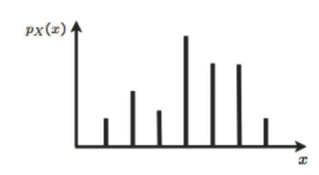
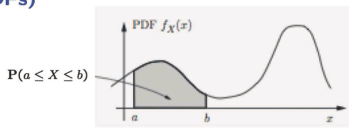
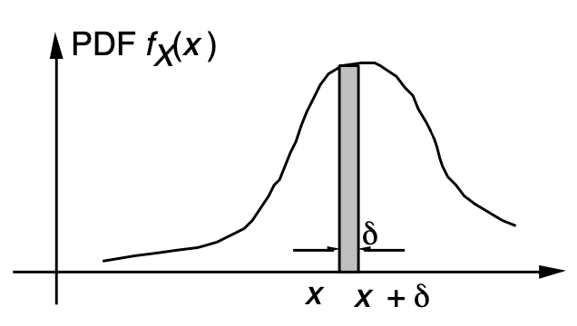
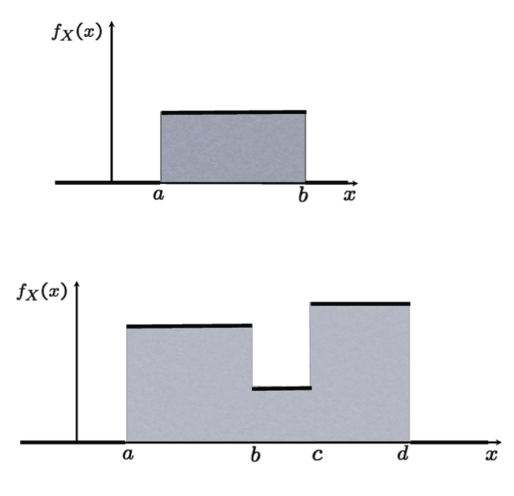
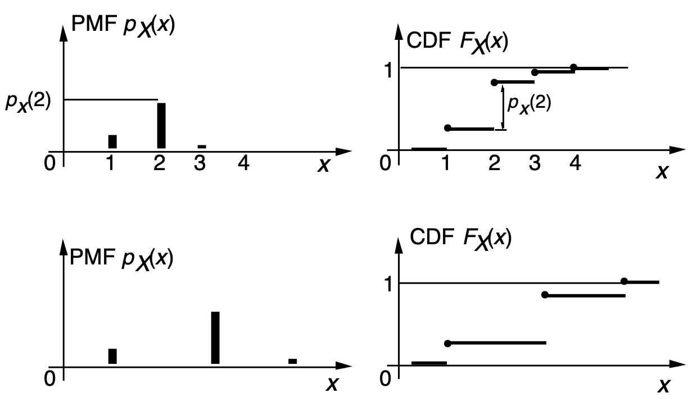
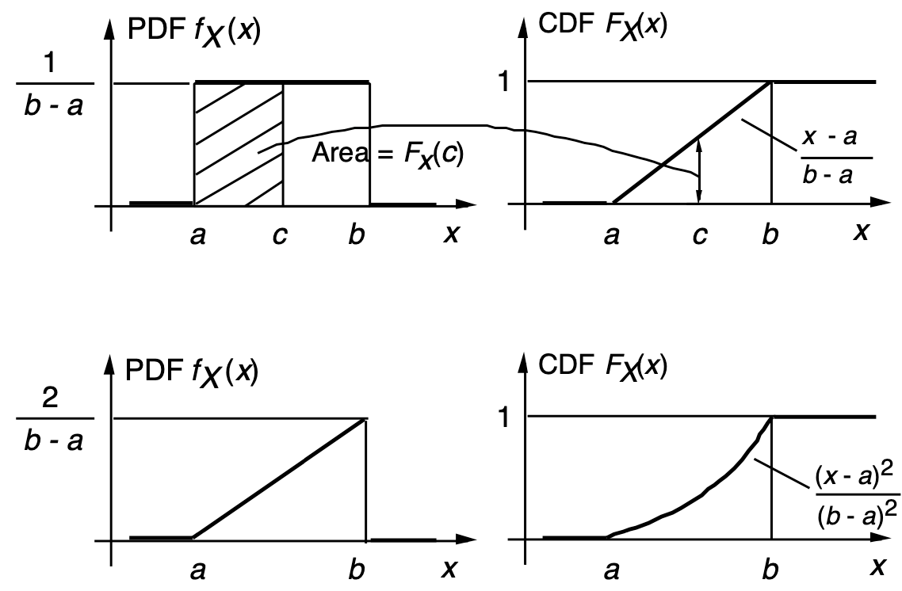
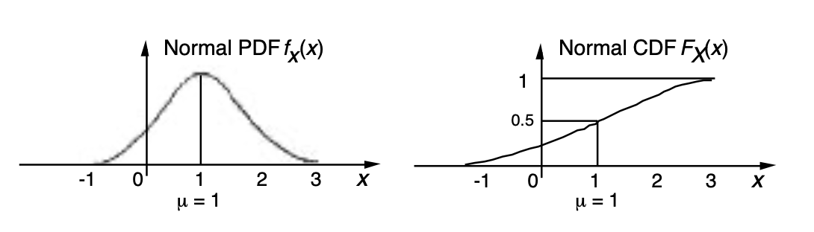
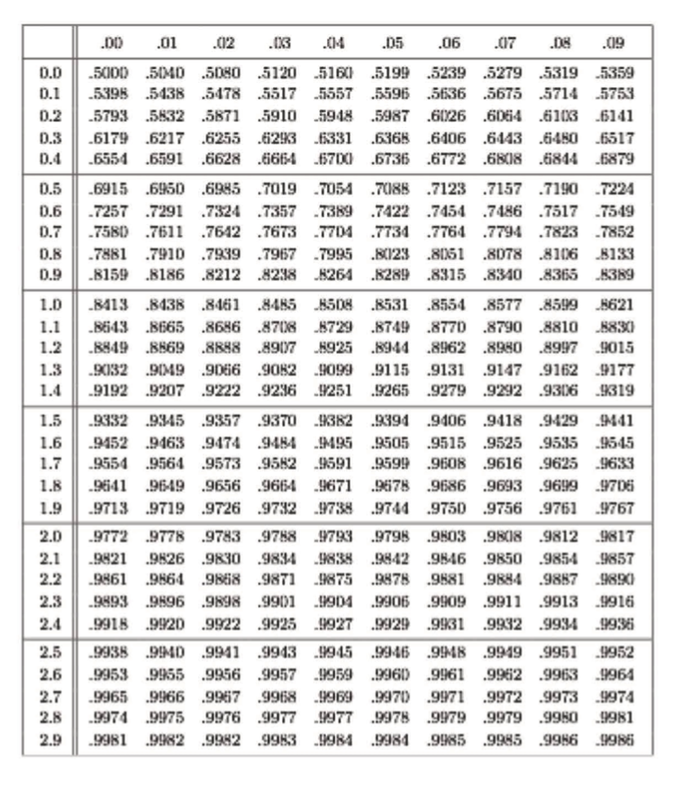
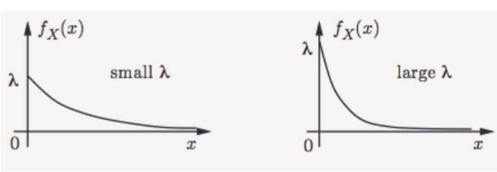
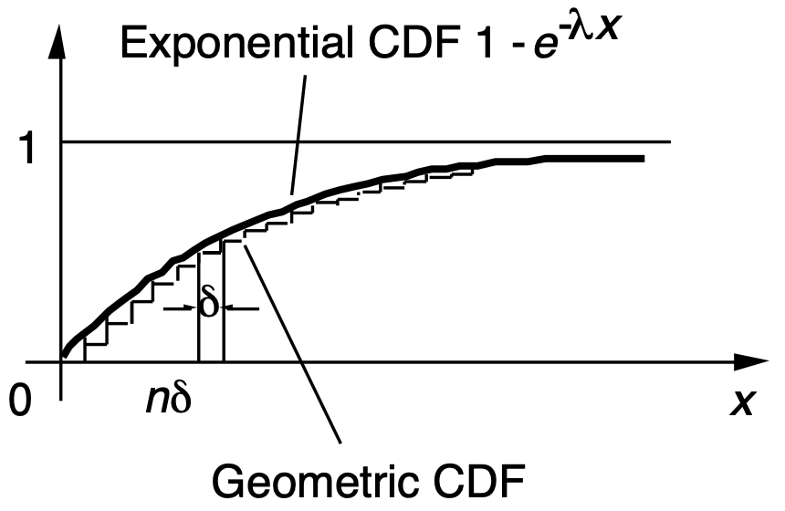

```{css, echo=FALSE}
.bluebox {
  padding: 1em;
  background: SteelBlue;
  color: white;
  border: 2px solid orange;
  border-radius: 10px;
}
.center {
  text-align: center;
}
```

<div style="display:none">
  $
\def\dist{\sim\xspace}
\newcommand{\mat}[1]{\boldsymbol{#1}}
\newcommand{\rv}[1]{\underline{#1}} 
\newcommand{\Exp}[1]{\exp\left\{#1\right\}}
\newcommand{\Log}[1]{\log\left\{#1\right\}}
\newcommand{\eqv}{\;\Longleftrightarrow\;}
\newcommand{\E}[2][]{E_{#1}\left[#2\right]}
\newcommand{\V}[2][]{V_{#1}\left[#2\right]}
\newcommand{\cov}[2][]{\mathrm{Cov}_{#1}\left[#2\right]}
\newcommand{\corr}[2][]{\rho_{#1}\left[#2\right]}
  \newcommand{\norm}{N\left(\mu,\sigma^2\right)}
  \newcommand{\bexpect}[1]{\mathbb{E}\Bl[ #1 \Br]}
  \def\giv{\,|\,}
\newcommand{\fx}{f_X(x)}
\newcommand{\Fx}{F_X(x)}
\newcommand{\fy}{f_Y(y)}
\newcommand{\Fy}{F_Y(y)}
\newcommand{\fz}{f_Z(z)}
\newcommand{\Fz}{F_Z(z)}
\newcommand{\fxA}{f_{X|A}(x)}
\newcommand{\fyA}{f_{Y|A}(y)}
\newcommand{\fzA}{f_{Z|A}(z)}
\newcommand{\fxy}{f_{X,Y}(x,y)}
\newcommand{\Fxy}{F_{X,Y}(x,y)}
\newcommand{\fxcy}{f_{X|Y}(x|y)}
\newcommand{\fycx}{f_{Y|X}(y|x)}
  \newcommand{\px}{p_X(x)}
\newcommand{\py}{p_Y(y)}
\newcommand{\pz}{p_Z(z)}
\newcommand{\pth}{p_{\Theta}(\theta)}
\newcommand{\pxA}{p_{X|A}(x)}
\newcommand{\pyA}{p_{Y|A}(y)}
\newcommand{\pzA}{p_{Z|A}(z)}
\newcommand{\pxy}{p_{X,Y}(x,y)}
\newcommand{\pxcy}{p_{X|Y}(x|y)}
\newcommand{\pycx}{p_{Y|X}(y|x)}
\newcommand{\cprob}[1]{\mathbb{P}( #1 )}
\newcommand{\cbprob}[1]{\mathbb{P}\left( #1 \right)}
\newcommand{\aleq}[1]{\begin{align*}#1\end{align*}}
\newcommand{\real}{{\mathbb R}}
\newcommand{\set}[1]{\{#1\}}
\newcommand{\Set}{\text}
\newcommand{\qed}{\blacksquare}
\newcommand{\comp}{\overline}
%%% definition
\newcommand{\eqdef}{\triangleq}
%%% imply
\newcommand{\imp}{\Longrightarrow}
\newcommand{\indep}{\perp \!\!\! \perp}
%normal colored text
\newcommand{\redf}[1]{{\color{red} #1}}
\newcommand{\yellowf}[1]{{\color{yellow} #1}}
\newcommand{\bluef}[1]{{\color{blue} #1}}
\newcommand{\grayf}[1]{{\color{gray} #1}}
\newcommand{\magenf}[1]{{\color{magenta} #1}}
\newcommand{\greenf}[1]{{\color{green} #1}}
\newcommand{\cyanf}[1]{{\color{cyan} #1}}
\newcommand{\orangef}[1]{{\color{orange} #1}}
\newcommand{\expect}[1]{\mathbb{E}[ #1 ]}
\newcommand{\bin}[1]{\textrm{Bin}\left(n,p\right)}
\newcommand{\dbin}[1]{\binom{n}{x}p^x\left(1-p\right)^{n-x}}
%%%% indicator
\newcommand{\indi}[1]{\mathbf{1}_{ #1 }}
% Bernoulli
\newcommandx\bern[1][1=p]{\textrm{Bern}\left({#1}\right)}
\newcommandx\dbern[2][1=x,2=p]{#2^{#1} \left(1-#2\right)^{1-#1}}
\newcommandx\pbern[2][1=x,2=p]{\left(1-#2\right)^{1-#1}}
% Binomial

% Multinomial
\newcommandx\mult[1][1={n,p}]{\textrm{Mult}\left(#1\right)}
\newcommandx\dmult[3][1=x,2=n,3=p]{\frac{#2!}{#1_1!\ldots#1_k!}#3_1^{#1_1}\cdots#3_k^{#1_k}}
% Hypergeometric
\newcommandx\hyper[1][1={N,m,n}]{\textrm{Hyp}\left({#1}\right)}
\newcommandx\dhyper[4][1=x,2=N,3=m,4=n]{\frac{\binom{#3}{#1}\binom{#2-#3}{#4-#1}}{\binom{#2}{#4}}}
% Negative Binomial
\newcommandx\nbin[1][1={r,p}]{\textrm{NBin}\left({#1}\right)}
\newcommandx\dnbin[3][1=x,2=r,3=p]{\binom{#1+#2-1}{#2-1}#3^#2(1-#3)^#1}
\newcommandx\pnbin[3][1=x,2=r,3=p]{I_#3(#2,#1+1)}

% Poisson
\newcommandx\pois[1][1=\lambda]{\textrm{Po}\left({#1}\right)}
\newcommandx\dpois[2][1=x,2=\lambda]{\frac{#2^#1 e^{-#2}}{#1!}}
\newcommandx\ppois[2][1=x,2=\lambda]{e^{-#2}\sum_{i=0}^#1\frac{#2^i}{i!}}
%%%% variance
\newcommand{\var}[1]{\text{var}[ #1 ]}
\newcommand{\bvar}[1]{\text{var}\Bl[ #1 \Br]}
\newcommand{\cvar}[1]{\text{var}( #1 )}
\newcommand{\cbvar}[1]{\text{var}\Bl( #1 \Br)}
  $
</div>


```{r setup, include=FALSE}
knitr::opts_chunk$set(echo = TRUE,message=FALSE,fig.align="center",fig.width=7,fig.height=4.5,out.width = "65%")
pacman::p_load(
         car
       , cubature
       , learnr
       , extraDistr
       , ggplot2
       , ggExtra
       , reshape2
       , corrplot
       , purrr
       , RColorBrewer
       , lubridate
       , mnormt
       , mvtnorm
       , MCMCpack
      )
```


```{r,echo=FALSE}
# Global parameter
show_code <- TRUE
```

```{r ,include=FALSE}
line_width = 1.3
point_size = 4
theme_set(theme_bw(base_size=20))
theme_update(legend.background=element_rect(fill=alpha("white", 0)),
             legend.key=element_rect(colour="white"),
             legend.key.width=unit(3, "lines"),
             plot.margin=unit(rep(0, 4), "lines"))

# FIXME: is it possible to move this statement into theme_update?
scale_color_discrete = function(...) scale_color_brewer(..., palette="Dark2")


make.dist.fn <- function(mode, dist) {
  if (mode == "cdf")
    eval(parse(text=paste("p", dist, sep="")))
  else if (mode == "pdf" || mode == "pmf")
    eval(parse(text=paste("d", dist, sep="")))
  else
    stop("invalid mode: must be 'cdf' or 'pdf/pmf'")
}

make.data <- function(mode, dist, theta, xseq) {
  dist.fn <- make.dist.fn(mode, dist)
  unary <- function(...) function(x) dist.fn(x, ...)
  data.fns <- apply(theta, 1, function(x) do.call(unary, as.list(t(x))))
  values <- data.frame(sapply(data.fns, function(f) f(xseq)))
  cbind(x=xseq, values)
}

plot.dist <- function(xseq, theta, dist, mode, title, lab.fn) {
  values <- make.data(mode, dist, theta, xseq)
  molten <- melt(values, 1)
  labels <- apply(theta, 1, function(x) do.call(lab.fn, as.list(t(x))))
  p <- ggplot(molten, aes(x=x, y=value, color=variable, linetype=variable)) +
       ggtitle(title) +
       ylab(toupper(mode)) +
       scale_color_discrete(labels=labels) +
       scale_linetype_discrete(labels=labels)

  # We position the legend for CDFs bottom-right and for P[MD]Fs top-right.
  if (mode == "cdf")
    p <- p + theme(legend.title=element_blank(),
                   legend.justification=c(1, 0),
                   legend.position=c(1, 0))
  else
    p <- p + theme(legend.title=element_blank(),
                   legend.justification=c(1, 1),
                   legend.position=c(1, 1))
  p
}

plot.discrete <- function(from, to, ...) {
  xseq <- seq(from, to)
  plot.dist(xseq, ...) +
    geom_line(size=line_width) +
    geom_point(size=point_size)
}

plot.continuous <- function(from, to, ...) {
  xseq <- seq(from, to, by=0.01)
  plot.dist(xseq, ...) +
    geom_line(size=line_width)
}

```   
## Introduction

### Roadmap

Module  |  Topic                                          | What you should know                             |
--------|-------------------------------------------------|--------------------------------------------------|
  M1    | Why Probability? What is Probability?           | Probability Is Essential For Logic               |
M2      | Conditioning, Bayes Rule, and Independence.     | Understand why you can learn by conditioning.    |
M3      | Counting and Simulation                         | Learn how to count probability by simulation     |
M4      | RV and Discrete Distributions                   | Learn the d,p,q,r functions of probability       |
**M5**  | Continuous Distributions and Multiple RVs.      | Know how to work with Normal distribution        |
M6      | Joint, Marginal, Conditional, Independence      | Can manipulate joint distribution                |
M7      | Summarizing Random Variables.                   | Able to Calculate Expectation and Variance       |
M8      | Simulation (multiple RV) and Limit Theorems     | Understand Sampling distribution and CLT         |
M9      | Point Estimation                                | Maximum likelihood and Method of Moment          |
M10     | Classical Inference and Bootstrap               | Bootstrap, P-value, Confidence Interval, etc     |
M11     | Bayesian Inference                              | Use Stan to do Bayesian Inference                |

### Overview of module 3

-  Random variable: Idea and formal definition

-  Popular discrete random variables

-  (Functions of) multiple random variables 


-  Summarizing random variables: Expectation and Variance

-  Conditioning for random variables

-  Independence for random variables 


## Continuous PDF and CDF

The discrete probability distributions where defined for outcomes that take discrete values.  But many numerical quantity we are interested in takes non-integer values.  
For such continuous outcomes, continuous probability distributions are defined.
Examples include things like speed of a car, the weight of a person or time until something happens.  

The idea of discrete random variables are intuitive and easy.  Everything is about looking up table of the possibilities.  So why complicate the problem by introducing something different?  If we were to measure the weight, can't we round them to the nearest integer so that they are measured in discrete unit?  That way we can still use the discrete probability models. One could also argue that due to the precision in how we measure, there is no truly continuous outcome.

The short answer to this question is that it actually makes things easier in practice to define a continuous probability distribution, despite the mathematics needed to understand them initially.　Going forward, our recommendation is to keep the image of the discrete probability and not get lost in the integral.  Everything you learned for a discrete probability applies to continuous probability.

### Continuous Random Variable and PDF (Probability Density Function)

Why can't we keep making the interval of the possible outcomes finer and finer in a discrete probability model to deal with a continuous outcome?  You need to remember that all the probabilities will need to sum to 1.  Casually speaking, if we were to allocate any probability to many many outcomes, at some point, the probability mass on any specific value will need be 0 as the possible outcomes grow to infinity.

$$p_X(x)=0 \forall x\in \real$$

If you remember the integration in calculus, we had similar problem.  We for some function $f(x)$, you learned how to estimate the area under a curve. The way you approached this was you approximated the function using blocks that over shot the function or undershot the function and by making the width of the bars smaller and smaller until it was so narrow that the top and the bottom met when you reached a limit.  At the limit, each bar will have no width but you are able to get the area under the function.
$$F(x)=\int_{-\infty}^{\infty}f(x)dx$$
```{r,echo=FALSE}
fx=function(x){dnorm(x)}
ggplot(data.frame(x=c(-5:5))) +  stat_function(fun = fx, aes(x, y=fx(c(-5:5)))) + 
    geom_hline(yintercept = 0) +
    scale_x_continuous(expand = c(0,0)) +
    ylab("") + xlab("")+
    geom_area(data = data.frame(xs = seq(1, 2, length.out = 100) ), aes(x = xs, y = fx(xs), alpha = .5))+ theme(legend.position="none")
```

So, we replace summation with integration.  Doing so, rather than thinking about a probability that a rv takes a specific value, we can generalize it probability to take some range of values more like CDF.

:::: {.bluebox data-latex=""}
::: {.center data-latex=""}
**Continuous Random Variable**
:::
A rv $X$ is continuous if $\exists$ a function $f_X,$ called **probability density function (PDF)**, s.t.
 $$\cprob{X \in B} = \int_B \fx dx, \qquad \text{every subset }B \in \real$$
::::
All of the concepts and methods (expectation, PMFs, and conditioning) for discrete rvs have continuous counterparts

:::: {style="display: flex;"}
::: {.column width="50%"}
For discrete RV
```{r , echo=FALSE, out.width = '60%',fig.align="center"}

#\mypic{0.55}{L4_pmf_ex.png}
```

$\cprob{a \le X \le b} = \sum_{x: a\le x \le b} \px$

$\px \geq 0,$ and $\sum_{x} \px = 1$$

:::
::: {.column width="50%"}
For continuous RV
```{r , echo=FALSE, out.width = '60%',fig.align="center"}

#\mypic{0.65}{L4_pdf_ex.png}
```

-  $\cprob{a \le X \le b} = \int_{a}^b \fx dx$

-  $\fx \geq 0,$ and $\int_{-\infty}^{\infty} \fx dx= 1$

:::
::::


### PDF and Examples


```{r , echo=FALSE, out.width = '60%',fig.align="center"}

#\includegraphics[width=0.65\textwidth]{L4_pdf_delta.png}
```

You can think of the pdf as the hight of the rectangle with width $\delta$.
$$\cprob{a \le X \le a + \delta} \approx f_X(a) \cdot \delta$$
By taking $\delta$ to 0 we see that the area on any specific value is 0.
$$\cprob{X = a} = 0$$

<!-- ```{r , echo=FALSE, out.width = '60%',fig.align="center"} -->
<!--  -->
<!-- #\includegraphics[width=0.8\textwidth]{L4_pdf_uniform_ex.png} -->
<!-- ``` -->

### Cumulative Distribution Function (CDF)

The concept of CDF is similar for Discrete: PMF, Continuous: PDF
- Can we describe all rvs with a single mathematical concept?
$$\Fx = \cprob{X \le x} = 
\begin{cases}
\sum_{k \le x} p_X(k), & \text{discrete}\\
\int_{-\infty}^x f_X(t) dt, & \text{continuous}
\end{cases}$$

- always well defined, because we can always compute the probability for the event $\{X \le x \}$

- CCDF (Complementary CDF): $\cprob{X > x }$

The relationship between PMF and CDF.

```{r , echo=FALSE, out.width = '80%',fig.align="center"}

#\includegraphics[width=0.8\textwidth]{L4_cdf_ex1.png}
```

The relationship between PDF and CDF.

```{r , echo=FALSE, out.width = '80%',fig.align="center"}

#\includegraphics[width=0.8\textwidth]{L4_cdf_ex2.png}
```

#### Properties of CDF

Since PDF is positive, it's integral CDF $F_X(x)$ is always Non-decreasing.
$F_X(x)$ tends to 1, as $x \rightarrow \infty$ and $F_X(x)$ tends to 0, as $x \rightarrow -\infty$

:::: {style="display: flex;"}
::: {.column width="50%"}

- If $X$ is discrete,
  - $\Fx$ is a piecewise constant function of $x.$
  - $p_X(k) = F_X(k) - F_X(k-1)$
  
:::
::: {.column width="50%"}

- If $X$ is continuous
  -  $\Fx$ is a continuous function of $x.$
  -  $\displaystyle \Fx = \int_{-\infty}^x f_X(t) dt$ and $\displaystyle \fx = \frac{dF_X}{dx}(x)$
  
:::
::::


#### R functions for continuous distributions   

|          Distribution          | Functions |           |           |           |
|:------------------------------:|:---------:|:---------:|:---------:|:---------:|
| Beta                           | pbeta     | qbeta     | dbeta     | rbeta     |
| Cauchy                         | pcauchy   | qcauchy   | dcauchy   | rcauchy   |
| Chi-Square                     | pchisq    | qchisq    | dchisq    | rchisq    |
| Exponential                    | pexp      | qexp      | dexp      | rexp      |
| F                              | pf        | qf        | df        | rf        |
| Gamma                          | pgamma    | qgamma    | dgamma    | rgamma    |
| Logistic                       | plogis    | qlogis    | dlogis    | rlogis    |
| Log Normal                     | plnorm    | qlnorm    | dlnorm    | rlnorm    |
| Normal                         | pnorm     | qnorm     | dnorm     | rnorm     |
| Student t                      | pt        | qt        | dt        | rt        |
| Studentized Range              | ptukey    | qtukey    | dtukey    | rtukey    |
| Uniform                        | punif     | qunif     | dunif     | runif     |
| Weibull                        | pweibull  | qweibull  | dweibull  | rweibull  |
| Wilcoxon Rank Sum Statistic    | pwilcox   | qwilcox   | dwilcox   | rwilcox   |
| Wilcoxon Signed Rank Statistic | psignrank | qsignrank | dsignrank | rsignrank |


  

#### Example: Maximum of Random Variables

Imagine a class where you take a test three times, and your final score will be the maximum of test scores.  Assume that each score is between 1 to 10.

-  $X = \max\{X_1, X_2, X_3 \},$ and $X_i \in \{1, 2, \cdots, 10 \}$ uniformly at random
-  \question $\px$?

-  Approach 1: $\cprob{\max\{X_1, X_2, X_3 \} = x}$?
-  Approach 2

\begin{eqnarray}
\Fx &= \cprob{\max\{X_1, X_2, X_3 \} \le x} = \cprob{X_1 \le x, X_2 \le x, X_3 \le x} \\
&= \cprob{X_1 \le x} \cdot \cprob{X_2 \le x} \cdot \cprob{X_3 \le x} = \left( \frac{x}{10}\right)^3
\end{eqnarray} 

Thus,
\begin{eqnarray}
\px = \left( \frac{x}{10}\right)^3 - \left( \frac{x-1}{10}\right)^3, \quad x = 1, 2, \cdots, 10
\end{eqnarray} 


## Continuous Probability Models

### Normal RV $X$ with parameters $\mu$ and $\sigma^2$

Normal distribution or the Gaussian distribution is the most used probability distribution of all time.  When $X$ is Normally distributed we denote it as 
$$X\sim N(\mu, \sigma^2)$$
The normal distribution has symmetric shape with two parameters.  The $\mu$ parameter governs the location of the center of the distribution and $\sigma^2$ governs the amount of spread. 


The PDF, which you will memorize by the time you graduate, is
\begin{eqnarray}
\fx & = \frac{1}{\sigma\sqrt{2\pi}} e^{-(x-\mu)^2/2\sigma^2}
\end{eqnarray} 
  <!-- - $\expect{X} = \mu$ -->
  <!-- - $\var{X} = \sigma^2$ -->


We often differentiate general Gaussian $N(\mu, \sigma^2)$ from a standard Normal $N(0,1)$.

- The PDF of standard normal is
\begin{eqnarray}
\fx & = \frac{1}{\sqrt{2\pi}} e^{-x^2/2}
\end{eqnarray} 
  <!-- - $\expect{X} = 0$ -->
  <!-- - $\var{X} = 1$ -->
The PDF looks like 
```{r,echo=FALSE}
fx=function(x){dnorm(x)}
ggplot(data.frame(x=c(-5:5))) +  stat_function(fun = fx, aes(x, y=fx(c(-5:5)))) + 
    geom_hline(yintercept = 0) +
    scale_x_continuous(expand = c(0,0)) +
    ylab("") + xlab("")+ theme(legend.position="none")
```


```{r , eval=FALSE, echo=FALSE, out.width = '90%',fig.align="center"}

#\mypic{0.8}{L4_normal_ex.png}
```


<!-- -  PDF's normalization property:  -->
<!-- $$\displaystyle \frac{1}{\sigma\sqrt{2\pi}} \int_{-\infty}^\infty e^{-(x-\mu)^2/2\sigma^2} dx = 1$$ -->

<!-- - Expectation -->
<!--   -  $\fx$ is symmetric in terms of $x = \mu.$ Thus, we should have $\cexpect{X} = \mu$. -->

<!-- - Variance -->

<!-- \begin{eqnarray} -->
<!-- \cvar{X} &=& \frac{1}{\sigma\sqrt{2\pi}} \int_{-\infty}^\infty (x - \mu)^2 e^{-(x-\mu)^2/2\sigma^2} dx -->
<!--  \stackrel{\bluef{y=\frac{x-\mu}{\sigma}}}{=} \frac{\sigma^2}{\sqrt{2\pi}} \int_{-\infty}^\infty y^2 e^{-y^2/2} dy \\ -->
<!-- &=& \frac{\sigma^2}{\sqrt{2\pi}}(-y e^{-y^2/2})\biggr \rvert_{-\infty}^\infty + \frac{\sigma^2}{\sqrt{2\pi}} \int_{-\infty}^\infty e^{-y^2/2} dy = \frac{\sigma^2}{\sqrt{2\pi}}\int_{-\infty}^\infty e^{-y^2/2} dy = \sigma^2 -->
<!-- \end{eqnarray}  -->


- CDF of a Standard Normal is special in probability.  So special that they have a dedicated character $\Phi(x)$ associated with them.  When $X\sim N(0,1)$,
$$F_X(x)=\Phi(x)=\displaystyle\int_{-\infty}^x\phi(t)\,dt$$
where $\phi(x)$ is the PDF of a standard normal
$\phi(x)=\frac{1}{\sqrt{2\pi}}exp\left(-\frac{x^2}{2 }\right)$

The CDF looks like
```{r,echo=FALSE}
fx=function(x){pnorm(x)}
ggplot(data.frame(x=c(-5:5))) +  stat_function(fun = fx, aes(x, y=fx(c(-5:5)))) + 
    geom_hline(yintercept = 0) +
    scale_x_continuous(expand = c(0,0)) +
    ylab("") + xlab("")+ theme(legend.position="none")
```

<!-- - Expectation:                 $\mu$  -->
<!-- - Variance:                    $\sigma^2$  -->
<!-- - Moment Generating Functions: $Exp(mu s + (sigma^2s^2)/2)$  -->
 

<!-- > $\int u dv = u v - \int v du$:$u=y$ and $dv = y e^{-y^2/2}$ $\rightarrow$ $du = dy$ and $v = -e^{-y^2/2}$ -->

General normal and standard normal are not just distant relatives.  In fact all normal distribution can be converted into a standard normal using linear transformation.  We call this process "standardization".   If $X \sim  N(\mu, \sigma^2)$, then 
$$Z = \frac{X-\mu}{\sigma} \sim N(0,1)$$
In fact, any linear transformation preserves normality.  That means, 
If $X\sim N(\mu,\sigma^2)$, then for $a\neq 0$ and $b,$ 
$$Y = aX +b \sim N(a\mu +b,a^2 \sigma^2).$$
We will come back to the transformation of RV later.  So it's OK not to fully understand why this is true.

### In R

We have the usual 4 functions.
```{r,eval=FALSE}
dnorm(x, mean = 0, sd = 1, log = FALSE)
pnorm(q, mean = 0, sd = 1, lower.tail = TRUE, log.p = FALSE)
qnorm(p, mean = 0, sd = 1, lower.tail = TRUE, log.p = FALSE)
rnorm(n, mean = 0, sd = 1)
```


### Computation of Normal probabilty

It is trivial to do the calculation for Normal distribution using computers now.  But before computers were available,
people make tables that recorded the following CDF values:

\begin{eqnarray}
\Phi(y) = \cprob{Y \le y} = \cprob{Y < y} = \frac{1}{\sqrt{2\pi}} \int_{-\infty}^y e^{-t^2/2} dt
\end{eqnarray} 

```{r , echo=FALSE, out.width = '80%',fig.align="center"}

#\includegraphics[width=0.8\textwidth]{L4_normal_table.png}
```

Here is an example of how you would use the table to do the calculation.

#### Example: snowfall

Annual snowfall $X$ is modeled as $N(60,20^2)$. What is the probability that this year's snowfall is at least 80 inches?

- You should see that $X\sim N(60,20^2)$.

- Using linear transformation $Z = \frac{X-60}{20}$, $Z$ is a standard normal distributed.

\begin{eqnarray}
\cprob{X \geq 80} &=& \cprob{Z \geq \frac{80-60}{20}} \\
&=& \cprob{Z \geq 1} = 1 -
\Phi(1) \\
\end{eqnarray} 
Where $\Phi(x)$ is the CDF for a standard normal.  Why are we doing this?  The problem is that the table is the CDF and not CCDF therefore, you need to use the fact that $\cprob{Z \geq 1}=1-\cprob{Z \leq 1}$, which is a function of CDF.

```{r,fig.height=5, fig.width=8.09,fig.align='center',out.width="60%"}
ggplot(NULL, aes(c(-3,3))) +
  geom_area(stat = "function", fun = dnorm, fill = "grey80", xlim = c(-3, 1)) +
  geom_area(stat = "function", fun = dnorm, fill = "#00998a", xlim = c(1, 3)) +xlab("x")+ylab("Density")
```

Now you look up the row for 1.0 then go side ways and look up .00 column that says 0.8413.  This corresponds to the gray area in the above figure.  So you plug in the number and you get your answer.
$$1- 0.8413 = 0.1587$$

We don't use these anymore.  But it's good to know why old textbooks have such rediculous looking table.

All you need to do now is 

```{r}
pnorm(q=1,mean=0,sd=1,lower.tail = FALSE)
```


### Why is Normal RVs Important?

Normal RV is like any other RV.  But they are treated exceptionally in classical statistics due to the Central limit theorem (CLT).  CLT is considered one of the most remarkable findings in the probability theory.  There are variety of ways to prove it but in a nutshell it says that the sum of **any** random variables $\approx$ Normal random variable.  Therefore, in much of classical statistics the theorem is abused.

-  Modeling aggregate noise with many small, independent noise terms
-  Convenient analytical properties, allowing closed forms in many cases
-  Highly popular in communication and machine learning areas


### Uniform RV (Continuous) $X$ with parameters $a$ and $b$

Discrete uniform RV was defined on integer value withing a range $[a,b]$.  When we allow the RV to take all real values within an interval we have a continuous uniform RV. 
We call an RV $X$ a (continuous) uniform RV defined in $[a,b]$ when the PDF has a form
$$f_X(x)=\frac{I(a<x<b)}{b-a},X\in \real$$
```{r,echo=FALSE,fig.width=5,fig.height=4}
fx=function(x){dunif(x)}
ggplot(data.frame(x=c(0:1))) +  stat_function(fun = fx, aes(x, y=fx(c(0:1)))) + 
    geom_hline(yintercept = 0) +
    scale_x_continuous(expand = c(0,0.1)) +geom_area(data = data.frame(xs = seq(0, 1, length.out = 100) ), aes(x = xs, y = fx(xs)), alpha = .2)+
    ylab("") + xlab("")+ theme(legend.position="none")
```

we express it as
$$X\sim \textrm{Unif}\left(a,b\right), X\in \real$$ 
In general, the discrete uniform and continuous uniform are confusing and you need to be aware of what value the RV is defined on.

The CDF of a uniform is a linear function                      
$$
\begin{cases} 
    0 & x < a \\ 
    \frac{x-a}{b-a} & a < x < b \\ 
     1 & x > b\\
\end{cases}
$$

<!-- - Expectation:                 $(a+b)/2$ -->
<!-- - Variance:                    $(b-a)^2/12$  -->
<!-- - Moment Generating Functions: $(e^{(sb)}-e^{(sa)})/(s(b-a))$  -->
 
 
### Exponential RV with parameter $\lambda >0$

Exponential distribution is often used to model continuous waiting time.  
A rv $X$ is called exponential with $\lambda$, if the PDF has the following form

:::: {.bluebox data-latex=""}
::: {.center data-latex=""}
**PDF of an Exponential Distribution**
:::
\begin{eqnarray}
\fx =
 \begin{cases}
 \lambda e^{-\lambda x}, & x \geq 0 \\
 0, & x <0
 \end{cases}
\end{eqnarray} 
::::

```{r , echo=FALSE, out.width = '80%',fig.align="center"}

#\myinlinepic{2cm}{L4_exp_pdf.png}}
```

The CDF of exponential is
$$\Fx = \int_{0}^x  \lambda e^{-\lambda s}ds = 1- e^{-\lambda x}$$
The CCDF 
$$\cprob{X > x} = e^{-\lambda x}$$

                                
```{r,echo=FALSE,fig.width=5,fig.height=4}
fx=function(x){pexp(x)}
ggplot(data.frame(x=c(0:10))) +  
  stat_function(fun = fx, aes(x, y=fx(c(0:10)))) + 
    geom_hline(yintercept = 0) +
    scale_x_continuous(expand = c(0,0.1)) +
    ylab("") + xlab("")+ theme(legend.position="none")+ggtitle("CDF of exp(1)")
```

<!-- - $\expect{X} = 1/\lambda$,  -->
<!-- - $\expect{X^2} = 2/\lambda^2$,  -->
<!-- - $\var{X} = 1/\lambda^2$ -->

<!-- -  Mean: $\cexpect{X} = 1/\lambda.$ </br> -->
<!-- Use integration by parts:$\displaystyle \int u dv = uv - \int v du$ -->
<!-- \begin{eqnarray} -->
<!-- \int_{0}^\infty x\lambda e^{-\lambda x} dx = (-xe^{-\lambda x})\biggr \rvert_{0}^\infty + \int_{0}^\infty e^{-\lambda x} dx = 0 - \frac{e^{-\lambda x}}{\lambda}\biggr \rvert_{0}^\infty = \frac{1}{\lambda} -->
<!-- \end{eqnarray}  -->

<!-- -  Variance: $\cvar{X} = \frac{1}{\lambda^2}$ </br> -->
<!-- We can use $\cvar{X} = \cexpect{X^2} - (\cexpect{X})^2$.  Since $\cexpect{X^2}$ is  -->
<!-- \begin{eqnarray} -->
<!--  \int_{0}^\infty x^2 \lambda e^{-\lambda x} dx = (-x^2 e^{-\lambda x}) \biggr \rvert_{0}^\infty + \int_{0}^\infty 2x e^{-\lambda x} dx = 0 + \frac{2}{\lambda} \cexpect{X} = \frac{2}{\lambda^2} -->
<!-- \end{eqnarray}  -->
<!-- $\cvar{X} = \cexpect{X^2} - (\cexpect{X})^2=\frac{2}{\lambda^2}-(1/\lambda)^2=\frac{1}{\lambda^2}$ -->


#### Model of Continuous Waiting Time

Using CCDF, $\cprob{X > x} = e^{-\lambda x}$, we can use it to appropriate the waiting time until an incident of interest takes place. The probability $\cprob{X > x}$ decays exponentially.

-  message arriving at a computer, some equipment breaking down, a light bulb burning out, etc


What is the discrete rv which models a waiting time? Geometric

- What is the relationship between exponential rv and geometric rv? We will see this relationship soon, but let's look at an example first.


### Example: meteorite

-  A very small meteorite first lands anywhere in USA. 
```{r , echo=FALSE, out.width = '80%',fig.align="center"}

#\hspace{4.5cm} \myinlinepic{1.5cm}{meteorite.jpeg}
```
- Time of landing is modeled as an exponential rv with $\lambda = \frac{1}{10}$ (mean 10 days).

- The current time is midnight. What is the probability that a meteorite first lands some time between 6 a.m. and 6 p.m. of the first day? 

(Solution)
<!-- - $\cexpect{X} = 1/\lambda = 10.$ Thus, $\lambda = \frac{1}{10}.$ -->
- 6 a.m. from midnight = 1/4 day, 6 p.m. from midnight = 3/4 day

\begin{eqnarray}
\cprob{1/4 \le X \le 3/4} = \cprob{X \geq 1/4} - \cprob{X \geq 3/4} = e^{-1/40} - e^{-3/40} = 0.0476
\end{eqnarray} 


### Geometric vs. Exponential (1)

% - A discrete twin for modeling waiting times is geometric rvs.

- Models a system evolution over time: Continuous time vs. Discrete time.

- \exam Customer arrivals at my shop
- \magenf{Modeling 1:} Every 30 minute I record the number of customers for each 30-min window
- \magenf{Modeling 2:} I record the exact time of each customer's arrival
- In modeling 1, every 10 minute? every 1 minute? every 1 sec? every 0.0000001 sec?


- In many cases, continuous case is some type of \bluef{limit} of its corresponding discrete case.


- Can we mathematically describe how geometric and exponential rvs meet each other in the limit?


-  `slot' is one unit time, e.g., 1 hour, 30 mins, 1 min, 10 sec, etc.

- Continuous system = Discrete system with

-  infinitely many slots whose duration is infinitely small.
-  success probability $p$ over one slot decreases to 0 in the limit


- Given $X^{exp} \sim \exp(\lambda)$, let us construct a geometric RV $X^{geo}_\delta$


- Set the length of a slot to be $\delta,$ which is a parameter.
- Set the success probability $p_\delta$ over a slot to be $p_\delta = 1 - e^{-\lambda \delta}$ (this looks magical, whose secrete will be uncovered soon)
- $\cprob{X^{geo}_\delta \leq n} = 1-(1-p_\delta)^n = 1- e^{-\lambda \delta n}$


```{r , echo=FALSE, out.width = '80%',fig.align="center"}

#\mypic{0.3}{L4_exp_geo.png}
```


- Note that $\cprob{X^{exp} \leq x} = 1- e^{-\lambda x}.$ Then, when $x = n\delta,$ $n=1, 2, \ldots$
$$\cprob{X^{exp} \leq x} = 1- e^{-\lambda \delta n} = \cprob{X^{geo}_\delta \leq n} $$

- If we choose sufficiently small $\delta$, the slot length $\downarrow$ and $p_\delta$ $\downarrow$
> $\cprob{X^{geo}_\delta \leq n}  \xrightarrow{\delta \rightarrow 0} \cprob{X^{exp} \leq x},$ $x = n \delta$


<!-- %  -->
<!-- % ### Modeling Waiting Time? A Discrete Twin (3) -->
<!-- % -->
<!-- % \myvartwocols{0.7}{0.65}{0.33} -->
<!-- % { -->
<!-- % For a given $x>0,$ -->
<!-- % -->
<!-- % \plitemsep 0.05in -->
<!-- %  -->
<!-- % - Define $\delta = \frac{x}{n}$ (a slot length in the $n$-th system) -->
<!-- % -->
<!-- % - Remember -->
<!-- % \begin{eqnarray} -->
<!-- % F_{exp}(x) &= 1- e^{-\lambda x} \\ -->
<!-- % F^n_{geo}(n) &= 1- (1-p_n)^n -->
<!-- % \end{eqnarray}  -->

<!-- % - Choose $p_n = 1-e^{-\lambda \delta} = 1-e^{-\lambda \frac{x}{n}}.$ -->
<!-- % -->
<!-- % - As $n \rightarrow \infty,$ the slot length $\delta \rightarrow 0$ thus $p_n \rightarrow 0$ -->
<!-- % -->
<!-- % - The CDF values of exponential and $n$-th geometric rvs become equal whenever $x =\delta, 2\delta, 3\delta, \ldots,$ i.e., -->
<!-- % \begin{eqnarray} -->
<!-- % F_{exp}(n\delta) = F^n_{geo}(n), \quad n=1, 2, \ldots -->
<!-- % \end{eqnarray}  -->

<!-- % -->
<!-- %  -->
<!-- % } -->
<!-- % { -->
<!-- % % \raggedleft -->
<!-- % \includegraphics[width=0.95\textwidth]{L4_exp_geo.png} -->
<!-- % \small -->
<!-- %  -->
<!-- % - As $n$ grows, the number of slots grows, but the success probability over one slot decreases, so that everything is balanced up. -->
<!-- % - As $n$ grows, $F^n_{geo}(n)$ approaches $F_{exp}(n\delta).$ -->
<!-- %  -->
<!-- % } -->
<!-- %  -->


### Log-Normal $X$ with parameters $\mu$ and $\sigma$
- Notation:                    $X\sim ln\norm$
- CDF:                         $(1/2)+(1/2) erf[(\ln x-\mu)/\sqrt(2\sigma^2)]$ 
- PDF:                         $\frac{1}{x\sqrt{2\pi\sigma^2}} exp\left[-\frac{(\ln x - \mu)^2}{2\sigma^2}\right]$
<!-- - Expectation:                 $e^{\mu+\sigma^2/2}$  -->
<!-- - Variance:                    $(e^{\sigma^2}-1) e^{2\mu+\sigma^2}$  -->
<!-- - Moment Generating Functions:  -->
 Where $erf$ is the [error function](https://en.wikipedia.org/wiki/Error_function)

### Student's $t$ RV $X$ with parameter $\nu$
- Notation:                    $X\sim Student(\nu)$ 
- CDF:                         $I_x( \frac{\nu}{2},\frac{\nu}{2} )$ 
- PDF:                         $\frac{\Gamma(\frac{\nu+1}{2})}{\sqrt{\nu\pi}\Gamma(\frac{\nu}{2})}(1+\frac{x^2}{\nu})^{-(\frac{\nu+1}{2})}$
<!-- - Expectation:                 $0\quad\nu>1$ -->
<!-- - Variance:                    $\begin{cases}\frac{\nu}{\nu-2} & \nu > 2 \\ \infty & 1 < \nu \le 2\end{cases}$  -->
<!-- - Moment Generating Functions:   -->
 
```{r,fig.height=5, fig.width=8.09,fig.align='center',out.width="60%"}
ggplot(NULL, aes(c(-5,5))) +
  geom_area(stat = "function", fun = function (x)dt(x,5), fill = "grey80", xlim = c(-5, 5))  +xlab("x")+ylab("Density")
```

### Chi-square with parameter $k$ 
- Notation:                    $X\sim \chi_{k}^2$
- CDF:                         $\frac{1}{\Gamma(k/2)} \gamma(\frac{k}{2}, \frac{x}{2})$
- PDF:                         $frac{1}{2^(k/2) \Gamma(k/2)} x^{k/2-1} e^{-x/2}$
<!-- - Expectation:                 $k$ -->
<!-- - Variance:                    $2k$  -->
<!-- - Moment Generating Functions: $(1-2s)^(-k/2) \; s<1/2$  -->
 
```{r,fig.height=5, fig.width=8.09,fig.align='center',out.width="60%"}
ggplot(NULL, aes(c(0,20))) +
  geom_area(stat = "function", fun = function (x) dchisq(x,5), fill = "grey80", xlim = c(0, 20)) +xlab("x")+ylab("Density")
```

### F RV X with parameters $d_1$ and $d_2$

F-distribution, F-ratio, Snedecor's F distribution or the Fisher–Snedecor distributio is used frequently as the null distribution of a test statistic such as the analysis of variance (ANOVA) and other F-tests.

- Notation:                   $X\sim F(d_1,d_2)$ 
- CDF:                        $I_{\frac{d_1x}{d_1x+d_2}}(\frac{d_1}{2},\frac{d_2}{2})$

- PDF:                        $\frac{\sqrt{\frac{(d_1x)^{d_1} d_2^{d_2}}{(d_1x+d_2)^{d_1+d_2}}}}{x B\left(\frac{d_1}{2},\frac{d_1}{2}\right)}$
<!-- - Expectation:                $\frac{d_2}{d_2-2} %\; d_2 > 2$ -->
<!-- - Variance:                    $\frac{2d_2^2(d_1+d_2-2)}{d_1(d_2-2)^2(d_2-4)}$ -->
<!-- - Moment Generating Functions: -->

```{r,fig.height=5, fig.width=8.09,fig.align='center',out.width="60%"}
ggplot(NULL, aes(c(0,15))) +
  geom_area(stat = "function", fun = function (x) df(x,5,5), fill = "grey80", xlim = c(0, 15)) +xlab("x")+ylab("Density")
```


<!--   Uniform & \unif & \punif & \dunif & -->
<!--   \frac{a+b}{2} & \frac{(b-a)^2}{12} & -->
<!--   \frac{e^{sb}-e^{sa}}{s(b-a)} \\[3ex] -->

<!--   Normal & \norm & -->
<!--   \Phi(x)=\displaystyle\int_{-\infty}^x \phi(t)\,dt & -->
<!--   \phi(x)=\dnorm & -->
<!--   \mu & \sigma^2 & -->
<!--   \Exp{\mu s + \frac{\sigma^2s^2}{2}}\\[3ex] -->

<!--   Log-Normal & \ln\norm& -->
<!--   \frac{1}{2}+\frac{1}{2} \erf\left[\frac{\ln x-\mu}{\sqrt{2\sigma^2}}\right] & -->
<!--   \frac{1}{x\sqrt{2\pi\sigma^2}} \Exp{-\frac{(\ln x - \mu)^2}{2\sigma^2}} & -->
<!--   e^{\mu+\sigma^2/2} & -->
<!--   (e^{\sigma^2}-1) e^{2\mu+\sigma^2} & -->
<!--   \\[3ex] -->

<!--   Multivariate Normal & \mvn & & -->
<!--   (2\pi)^{-k/2} |\Sigma|^{-1/2} e^{-\frac{1}{2}(x-\mu)^T \Sigma^{-1}(x-\mu)} & -->
<!--   \mu & \Sigma & -->
<!--   \Exp{\mu^T s + \frac{1}{2} s^T \Sigma s}\\[3ex] -->

<!--   Student's $t$ & \text{Student}(\nu) -->
<!--   & I_x\left( \frac{\nu}{2},\frac{\nu}{2} \right) -->
<!--   & \frac{\Gamma\left(\frac{\nu+1}{2}\right)} -->
<!--     {\sqrt{\nu\pi}\Gamma\left(\frac{\nu}{2}\right)} -->
<!--     \left(1+\frac{x^2}{\nu}\right)^{-(\nu+1)/2} -->
<!--   & 0 \quad \nu  > 1 -->
<!--   & \begin{cases} -->
<!--       \displaystyle\frac{\nu}{\nu-2} & \nu > 2 \\ -->
<!--       \infty & 1 < \nu \le 2 -->
<!--     \end{cases} -->
<!--   & \\[3ex] -->

<!--   Chi-square & \chisq & -->
<!--   \frac{1}{\Gamma(k/2)} \gamma\left(\frac{k}{2}, \frac{x}{2}\right) & -->
<!--   \frac{1}{2^{k/2} \Gamma(k/2)} x^{k/2-1} e^{-x/2}& -->
<!--   k & 2k & -->
<!--   (1-2s)^{-k/2} \; s<1/2\\[3ex] -->

<!--   F & \text{F}(d_1,d_2) & -->
<!--   I_\frac{d_1x}{d_1x+d_2}\left(\frac{d_1}{2},\frac{d_2}{2}\right) & -->
<!--   \frac{\sqrt{\frac{(d_1x)^{d_1} d_2^{d_2}}{(d_1x+d_2)^{d_1+d_2}}}} -->
<!--     {x\mathrm{B}\left(\frac{d_1}{2},\frac{d_1}{2}\right)} & -->
<!--   \frac{d_2}{d_2-2} %\; d_2 > 2 -->
<!--   & \frac{2d_2^2(d_1+d_2-2)}{d_1(d_2-2)^2(d_2-4)} %\; d_2 > 4 -->
<!--   & \\[3ex] -->

### Exponential RV $X$ with parameter $\beta$

- Notation:                    $X\sim \textrm{Exp}\left(\beta\right)$
- CDF:                         $1-e^{-x/\beta}$
- PDF:                         $\frac{1}{\beta}e^{-x/\beta}$
<!-- - Expectation:                 $\beta$ -->
<!-- - Variance:                    $\beta^2$ -->
<!-- - Moment Generating Functions: $\frac{1}{1-\frac{s}{\beta}} \left(s<\beta\right)$ -->

We use the \emph{rate} parameterization where
  $\beta=\frac{1}{\lambda}$. Some textbooks use $\beta$ as \emph{scale}
  parameter instead~\cite{Wasserman03}.
  
```{r,fig.height=5, fig.width=8.09,fig.align='center',out.width="60%"}
ggplot(NULL, aes(c(0,5))) +
  geom_area(stat = "function", fun = function (x) dexp(x,5), fill = "grey80", xlim = c(0, 5)) +xlab("x")+ylab("Density")
```

### Gamma  RV $X$ with parameters $\alpha$ and $\beta$

- Notation:                     $\textrm{Gamma}\left({\alpha,\beta}\right)$
- CDF:                          $\frac{\gamma(\alpha,\beta x)}{\Gamma(\alpha)}$
- PDF:                          $\frac{\beta^{\alpha}}{\Gamma\left( \alpha\right)} x^{\alpha-1}e^{-\beta x}$
<!-- - Expectation:                  $\frac{\alpha}{\beta}$ -->
<!-- - Variance:                     $\frac{\alpha}{\beta^2}$ -->
<!-- - Moment Generating Functions:  $\left(\frac{1}{1-\frac{s}{\beta}} \right)^\alpha \left(s<\beta\right)$ -->

We use the \emph{rate} parameterization where
  $\beta=\frac{1}{\lambda}$. Some textbooks use $\beta$ as \emph{scale}
  parameter instead~\cite{Wasserman03}.
  
### Inverse Gamma  RV $X$ with parameters $\alpha$ and $\beta$

- Notation:                    $\textrm{InvGamma}\left({\alpha,\beta}\right)$
- CDF:                         $\frac{\Gamma\left(\alpha,\frac{\beta}{x}\right)}{\Gamma\left(\alpha\right)}$
- PDF:                         $\frac{\beta^{\alpha}}{\Gamma\left(\alpha\right)}x^{-\alpha-1}e^{-\beta/x}$
<!-- - Expectation:                 $\frac{\beta}{\alpha-1} \; \alpha>1$ -->
<!-- - Variance:                    $\frac{\beta^2}{(\alpha-1)^2(\alpha-2)} \; \alpha > 2$ -->
<!-- - Moment Generating Functions: $\frac{2(-\beta s)^{\alpha/2}}{\Gamma(\alpha)}K_\alpha\left( \sqrt{-4\beta s} \right)$ -->

### Beta  RV $X$ with parameters $\alpha$ and $\beta$
- Notation:                    $\textrm{Beta}\left(\alpha,\beta\right)$
- CDF:                         $I_x(\alpha,\beta)$
- PDF:                         $\frac{\Gamma\left(\alpha+\beta\right)}{\Gamma\left(\alpha\right)\Gamma\left(\beta\right)}x^{\alpha-1}\left(1-x\right)^{\beta-1}$
<!-- - Expectation:                 $\frac{\alpha}{\alpha+\beta}$ -->
<!-- - Variance:                    $\frac{\alpha\beta}{(\alpha+\beta)^2(\alpha+\beta+1)}$ -->
<!-- - Moment Generating Functions: $1+\sum_{k=1}^{\infty} \left( \prod_{r=0}^{k-1}\frac{\alpha+r}{\alpha+\beta+r} \right) \frac{s^k}{k!}$ -->

### Weibull RV $X$ with parameters $\lambda$ and $k$

Used often in the survival analysis.
- Notation:                    $\mathrm{Weibull}(\lambda, k)$
- CDF:                         $1 - e^{-(x/\lambda)^k}$
- PDF:                         $\frac{k}{\lambda}\left(\frac{x}{\lambda}\right)^{k-1} e^{-(x/\lambda)^k}$
<!-- - Expectation:                 $\lambda \Gamma\left(1 + \frac{1}{k} \right)$ -->
<!-- - Variance:                    $\lambda^2 \Gamma\left(1 + \frac{2}{k}\right) - \mu^2$ -->
<!-- - Moment Generating Functions: $\sum_{n=0}^\infty \frac{s^n \lambda^n}{n!} \Gamma\left(1+\frac{n}{k}\right)$ -->

### Pareto RV $X$ with parameter $\alpha$ 

- Notation:                    $\mathrm{Pareto}(x_m, \alpha)$
- CDF:                         $1 - \left(\frac{x_m}{x} \right)^\alpha \; x\ge x_m$
- PDF:                         $\alpha\frac{x_m^\alpha}{x^{\alpha+1}} \quad x\ge x_m$
<!-- - Expectation:                 $\frac{\alpha x_m}{\alpha-1} \; \alpha>1$ -->
<!-- - Variance:                    $\frac{x_m^2\alpha}{(\alpha-1)^2(\alpha-2)} \; \alpha>2$ -->
<!-- - Moment Generating Functions: $\alpha(-x_m s)^\alpha \Gamma(-\alpha,-x_m s) \; s<0$ -->


## Transformation

The interval X in minutes between calls to a 911 center is exponentially distributed with mean 2 min, 
so the pdf is
$$f_X(x)=0.5e^{-0.5 x}$$
What is the pdf of interval $Y=60X$ in seconds? There are various ways to solve this problem.
One approache is to use the transformation theorem.


:::: {.bluebox data-latex=""}
::: {.center data-latex=""}
**Transformation Theorem**
:::
Let X have pdf $f_X(x)$ and let $Y = g(X)$, where $g$ is monotonic (either strictly increasing or strictly decreasing) on the set of all possible values of $X$, so it has an inverse function $X=h(y)$. Assume that $h$ has a derivative $h'(y)$. Then

$$f_Y(y)=f_X(h(y))\left|h'(y)\right|$$  
::::

Using the transformation theorem, the above question can be solved as
$$f_Y(y)=(1/120)e^{-(1/120) y}$$

There are times one would like to have a closed form pdf of an RV.  
But if you are doing simulation, transformation is trivial.
All you need to do is to transform the simulated values and you have a sample from the transformed distribution.

Using the previous example.  If we want to simulate from 
$$f_X(x)=0.5e^{-0.5 x}$$
we can use `rexp(n,0.5)`.
The histogram of the simulated values and the theoretical pdf is in red.
```{r}
x<-rexp(1000,0.5)
hist(x,probability = TRUE)
curve(dexp(x,0.5),add=T,col="red")
```

The histogram of the simulated values transformed to be $60x$ and the theoretical pdf is in red.
```{r}
hist(60*x,probability = TRUE)
curve(dexp(x,1/120),add=T,col="red")
```

```{r}
x<-rnorm(1000,0,1)
hist(x^2,probability = TRUE)
curve(dchisq(x,1),add=T,col="red")
```


## Probabilistic Simulation

### INVERSE CDF METHOD for Simulation of continuous probability models

For a PDF $f_X(x)$ it's easy to simulate from the distribution if we can get the CDF $F_X(x)$. 
Let $F_X(x)$ be the corresponding cdf for $f_X(x)$. 

Repeat n times:
1. Use a uniform random-number generator (RNG) to produce a value, $u_i$, from [0, 1).
2. Assign $x_i = F^{-1}_X(u_i)$.
The resulting values $x_1,\dots , x_n$ form a simulation of a random variable with the original pdf, $f(x)$.

Here is an example.
```{r}
u<-runif(1000)
x<-qnorm(u,10,2)
hist(x,probability = TRUE)
curve(dnorm(x,10,2),add=T,col="red")
```
The red line indicates the TRUE distribution.

### ACCEPT–REJECT METHOD

The accept-reject method is another simulation method that is useful when you want to simulate from $f_X(x)$ but you don't have a inverse CDF.  However, you can generate from a distribution $g(x)$, where $f_X(x)/g(x) \leq c$ for all x (ratio $f/g$ is bounded)

The algorithm proceed as follows:
1. Generate a candidate $y_i$, from the distribution $g$.
2. Generate a standard uniform variate, $u_i$.
3. If $u_i \cdot c \cdot  g( y_i)\leq f ( y_i)$, then accept the candidate and assign $x_i = y_i$ 
  b. Otherwise, reject $y_i$ and return to step 1.
Repeat the steps until $n$ candidate values have been accepted. 
The resulting accepted values $x_1,\dots, x_n$ form a simulation from $f_X(x)$.

Here is an example of generating from 
$$f(x) = (4 - x^2)/9,-1\leq x\leq 2$$
The function looks like this
```{r}
f<-function(x) {(4 - x^2)/9}
curve(f,-1,2)
```

We can use a uniform distribution for the proposal ditribution $g$
```{r}
g<-function(x) {rep(1/3,length(x))}
curve(g,-1,2)
```

Using 4/3 as c we can simulate as follows.
```{r}
n<- 1000
x <- rep(NA,n)
i <- 0
while (i<n){
  y <- -1+3*runif(1)
  u <- runif(1)
  if (u*4/3*1/3<=(4-y^2)/9){
    i <- i+1
    x[i] <- y
  }
}
```

The simulate result is fairly close to the true density function.
```{r}
hist(x,probability = TRUE)
curve(f,add=T,col="red")
```

### Simulating complex process

The true value of simulation shines when we need to simulate a complex process.
Take a look at the following example.

#### express mail shipping \\

The number of customers shipping express mail packages at a certain store during any particular hour of the day is a Poisson rv with mean 𝜇=5. Each such customer has 1, 2, 3, or 4 packages with probabilities .4, .3, .2, and .1, respectively. Let’s carry out a simulation to estimate the probability that at most 10 packages are shipped during any particular hour. Define an event A = {at most 10 packages shipped in an hour}. 
Write a simulation to estimate P(A).

We can solove the problem using the following simulation.

0. Set a counter for the number of times A occurs to zero.
Repeat n times:
1. Simulate the number of customers in an hour, C, which is Poisson with $\mu=5$.
2. For each of the C customers, simulate the number of packages shipped according to the pmf above.
3. If the total number of packages shipped is at most 10, add 1 to the counter for A.

```{r}
A <- 0
for (i in 1:10000){
  c<-rpois(1,5)
  packages <- sample(c(1,2,3,4),c,
  TRUE,c(.4,.3,.2,.1))
  if (sum(packages)<=10){
  	A<-A+1
  }
}

A/10000
```

#### Example: Elevator overweight

Suppose 10 adults selected at random steps onto an elevator with a capacity of 1750 pounds.  What is the probability that the elevator cable breaks?  ( you can assume that a total weight over 1750 pounds results in the cable breaking )


- This is not easy to solve using other methods.  But it's not too bad using simulation.
- First of all, we need to do some research to ballpark the necessary information.
    - According to Wikipedia the ratio between men and women in the US is about 0.49:0.51.
    - In the United States, logarithms of weights (in pounds) of men are approximately normally distributed with a mean of 5.13 and a standard deviation of 0.17; 
    - For women, it is distributed as a mean of  4.96 and a standard deviation of 0.20. 

- Here is a potential solution
```{r}
n_sim<-1000
total_weight<- rep(NA,n_sim)
for(i in 1:n_sim){  
	male<- rbinom(10,1,0.49)  
	male_weight<-rnorm(sum(male),5.13,0.17)  
	nfem <- 10-sum(male);  
	if(nfem>0){ 
		female_weight<-rnorm(nfem,4.96,0.2)
	}
	else { 
		female_weight<-0
	}  
	total_weight[i]<-sum(c(exp(male_weight),exp(female_weight)))
}
hist(total_weight)
mean(total_weight>1750)
```

- What this code does is, first draws the number of males and the number of females in the elevator. Then, it determines the weights of each individual according to the weight distribution to get the total weight.  It's easy once you see the solution, no?

#### Adding the dollor amount

We can think of adding more layers to answer more complex questions.  Let’s say that an elevator gets 3000 rides a month, with every 100 rides that go over the capacity they need to send someone to the site to replace some parts. Each visit will cost $5000.  What's the yearly expected cost of setting the limit at 1750 pounds?

Here is a simulation

```{r}
n_samp<-100
rep<-rep(NA,n_samp)
for(j in 1:n_samp){
  total_weight<- rep(NA,36000)
  for(i in 1:36000){
    male<- rbinom(10,1,0.49) # number of males in a sample
    male_weight<-rnorm(sum(male),5.13,0.17) # sample of male weights
    nfem <- 10-sum(male); # number of females in a sample
    if(nfem>0){
      female_weight<-rnorm(nfem,4.96,0.2) # sample of female weights
    }else {     female_weight<-0 # No female no weights
    }
    total_weight[i]<-sum(c(exp(male_weight),exp(female_weight)))}
  rep[j]<-sum(total_weight>1750)/100*5000
}
```

Here is the result.
```{r}
hist(rep)
summary(rep)
```
this is useful because we are looking at the actual dollar amount that will be needed instead of some abstract probability.

## Numerical Integration with R

It is sometimes hard to do the integration calculation by hand.
R provides functions that makes the calculation simple.
Here is an example.  I define a function that is the PDF of a standard normal.
```{r}
f <- function(x) {1/sqrt(2*pi)*exp(-x^2/2)}
```

Then I can compute the integral
$$\int_{-1.96}^{1.96}f_X(x) dx$$
```{r}
integrate(f, lower = -1.96, upper = 1.96)
```
which you can veryif using pnorm function in R.
```{r}
pnorm(1.96) - pnorm(-1.96)
```

You can use `cubature` function for multiple integrals.
For example, if I have multivariate Gaussian that I want to calculate a certain integral, I can say 

```{r}
library(cubature) # load the package "cubature"
f<- function(x){dmvnorm(x,c(0,0,0),diag(3))}
adaptIntegrate(f, lowerLimit = c(-1.96, -1.96, -1.96), upperLimit = c(1.96, 1.96, 1.96))
```


## Review Questions

-  What is a random variable? Why is it useful?

-  What is PMF (Probability Mass Function)?

-  Explain Bernoulli, Binomial, Geometric RVs.
  When are they useful and what are their PMFs?

-  Explain the memoryless property.   

-  What are joint and marginal PMFs?

-  Describe and explain the total probability/expectation theorem
  for random variables? When is it useful to use total probability/expectation theorem?

-  Explain the definition and the meaning of expectation and
  variance. Why do we need them?

-  What is the difference between independence/conditional
  independence for events and those for random variables?

## Reference

This tutorial is modification of slides that were originally created by

https://ocw.mit.edu/courses/res-6-012-introduction-to-probability-spring-2018/

I have used many problems from this text book.
Carlton, Matthew A., and Jay L. Devore. Probability with applications in engineering, science, and technology. Berlin: Springer, 2017.

For the list of R functions I thank 
https://www.stat.umn.edu/geyer/old/5101/rlook.html

https://sebastiansauer.github.io/simple-shading/

