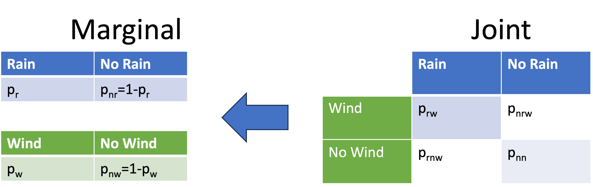
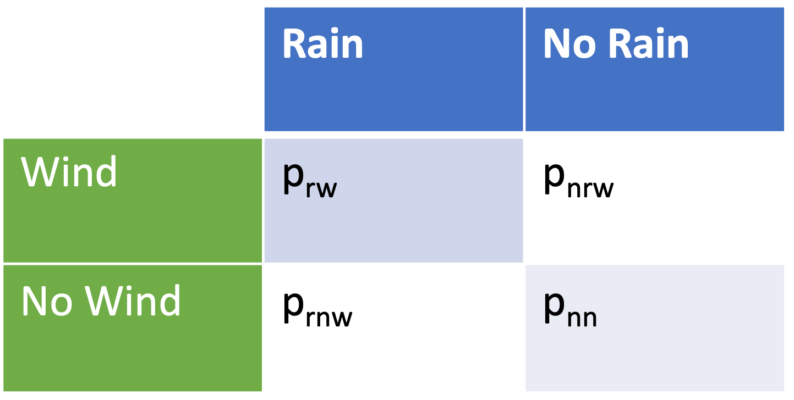
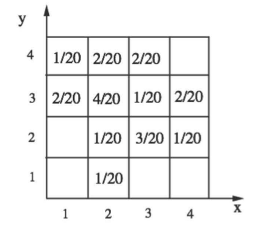
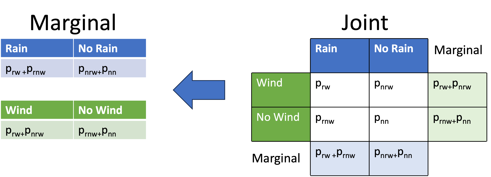
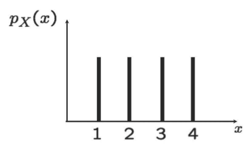
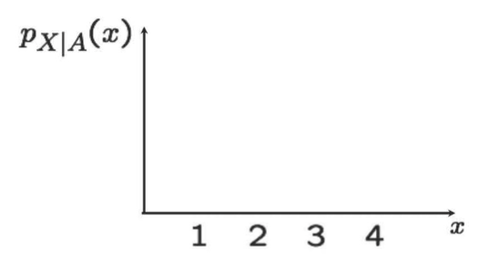
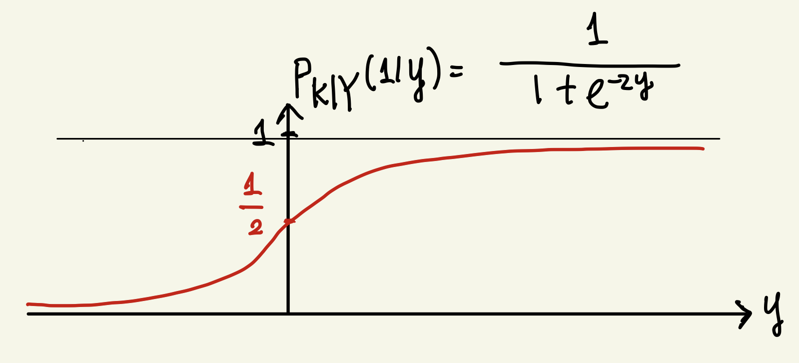
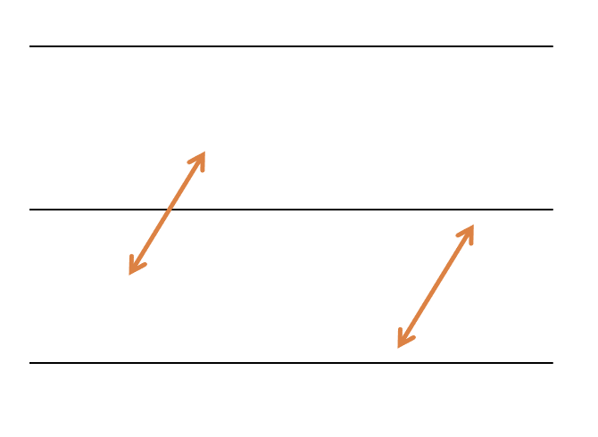
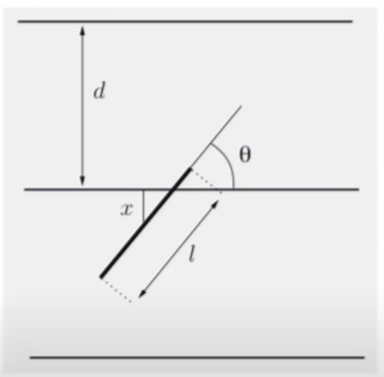

```{css, echo=FALSE}
.bluebox {
  padding: 1em;
  background: SteelBlue;
  color: white;
  border: 2px solid orange;
  border-radius: 10px;
}
.center {
  text-align: center;
}
```

<div style="display:none">
  $
\def\dist{\sim\xspace}
\newcommand{\mat}[1]{\boldsymbol{#1}}
\newcommand{\rv}[1]{\underline{#1}} 
\newcommand{\Exp}[1]{\exp\left\{#1\right\}}
\newcommand{\Log}[1]{\log\left\{#1\right\}}
\newcommand{\eqv}{\;\Longleftrightarrow\;}
\newcommand{\E}[2][]{E_{#1}\left[#2\right]}
\newcommand{\V}[2][]{V_{#1}\left[#2\right]}
\newcommand{\cov}[2][]{\mathrm{Cov}_{#1}\left[#2\right]}
\newcommand{\corr}[2][]{\rho_{#1}\left[#2\right]}
  \newcommand{\norm}{N\left(\mu,\sigma^2\right)}
  \newcommand{\bexpect}[1]{\mathbb{E}\Bl[ #1 \Br]}
  \def\giv{\,|\,}
\newcommand{\fx}{f_X(x)}
\newcommand{\Fx}{F_X(x)}
\newcommand{\fy}{f_Y(y)}
\newcommand{\Fy}{F_Y(y)}
\newcommand{\fz}{f_Z(z)}
\newcommand{\Fz}{F_Z(z)}
\newcommand{\fxA}{f_{X|A}(x)}
\newcommand{\fyA}{f_{Y|A}(y)}
\newcommand{\fzA}{f_{Z|A}(z)}
\newcommand{\fxy}{f_{X,Y}(x,y)}
\newcommand{\Fxy}{F_{X,Y}(x,y)}
\newcommand{\fxcy}{f_{X|Y}(x|y)}
\newcommand{\fycx}{f_{Y|X}(y|x)}
  \newcommand{\px}{p_X(x)}
\newcommand{\py}{p_Y(y)}
\newcommand{\pz}{p_Z(z)}
\newcommand{\pth}{p_{\Theta}(\theta)}
\newcommand{\pxA}{p_{X|A}(x)}
\newcommand{\pyA}{p_{Y|A}(y)}
\newcommand{\pzA}{p_{Z|A}(z)}
\newcommand{\pxy}{p_{X,Y}(x,y)}
\newcommand{\pxcy}{p_{X|Y}(x|y)}
\newcommand{\pycx}{p_{Y|X}(y|x)}
\newcommand{\cprob}[1]{\mathbb{P}( #1 )}
\newcommand{\cbprob}[1]{\mathbb{P}\left( #1 \right)}
\newcommand{\aleq}[1]{\begin{align*}#1\end{align*}}
\newcommand{\real}{{\mathbb R}}
\newcommand{\set}[1]{\{#1\}}
\newcommand{\Set}{\text}
\newcommand{\qed}{\blacksquare}
\newcommand{\comp}{\overline}
%%% definition
\newcommand{\eqdef}{\triangleq}
%%% imply
\newcommand{\imp}{\Longrightarrow}
\newcommand{\indep}{\perp \!\!\! \perp}
%normal colored text
\newcommand{\redf}[1]{{\color{red} #1}}
\newcommand{\yellowf}[1]{{\color{yellow} #1}}
\newcommand{\bluef}[1]{{\color{blue} #1}}
\newcommand{\grayf}[1]{{\color{gray} #1}}
\newcommand{\magenf}[1]{{\color{magenta} #1}}
\newcommand{\greenf}[1]{{\color{green} #1}}
\newcommand{\cyanf}[1]{{\color{cyan} #1}}
\newcommand{\orangef}[1]{{\color{orange} #1}}
\newcommand{\expect}[1]{\mathbb{E}[ #1 ]}
\newcommand{\bin}[1]{\textrm{Bin}\left(n,p\right)}
\newcommand{\dbin}[1]{\binom{n}{x}p^x\left(1-p\right)^{n-x}}
%%%% indicator
\newcommand{\indi}[1]{\mathbf{1}_{ #1 }}
% Bernoulli
\newcommandx\bern[1][1=p]{\textrm{Bern}\left({#1}\right)}
\newcommandx\dbern[2][1=x,2=p]{#2^{#1} \left(1-#2\right)^{1-#1}}
\newcommandx\pbern[2][1=x,2=p]{\left(1-#2\right)^{1-#1}}
% Binomial

% Multinomial
\newcommandx\mult[1][1={n,p}]{\textrm{Mult}\left(#1\right)}
\newcommandx\dmult[3][1=x,2=n,3=p]{\frac{#2!}{#1_1!\ldots#1_k!}#3_1^{#1_1}\cdots#3_k^{#1_k}}
% Hypergeometric
\newcommandx\hyper[1][1={N,m,n}]{\textrm{Hyp}\left({#1}\right)}
\newcommandx\dhyper[4][1=x,2=N,3=m,4=n]{\frac{\binom{#3}{#1}\binom{#2-#3}{#4-#1}}{\binom{#2}{#4}}}
% Negative Binomial
\newcommandx\nbin[1][1={r,p}]{\textrm{NBin}\left({#1}\right)}
\newcommandx\dnbin[3][1=x,2=r,3=p]{\binom{#1+#2-1}{#2-1}#3^#2(1-#3)^#1}
\newcommandx\pnbin[3][1=x,2=r,3=p]{I_#3(#2,#1+1)}

% Poisson
\newcommandx\pois[1][1=\lambda]{\textrm{Po}\left({#1}\right)}
\newcommandx\dpois[2][1=x,2=\lambda]{\frac{#2^#1 e^{-#2}}{#1!}}
\newcommandx\ppois[2][1=x,2=\lambda]{e^{-#2}\sum_{i=0}^#1\frac{#2^i}{i!}}
%%%% variance
\newcommand{\var}[1]{\text{var}[ #1 ]}
\newcommand{\bvar}[1]{\text{var}\Bl[ #1 \Br]}
\newcommand{\cvar}[1]{\text{var}( #1 )}
\newcommand{\cbvar}[1]{\text{var}\Bl( #1 \Br)}

  $
</div>


```{r setup, include=FALSE}
knitr::opts_chunk$set(echo = TRUE,message=FALSE,fig.align="center",fig.width=7,fig.height=4.5,out.width = "65%")
pacman::p_load(
         car
       , cubature
       , learnr
       , extraDistr
       , ggplot2
       , ggExtra
       , reshape2
       , corrplot
       , purrr
       , RColorBrewer
       , lubridate
       , mnormt
       , mvtnorm
       , MCMCpack
      )
```


```{r,echo=FALSE}
# Global parameter
show_code <- TRUE
```

```{r ,include=FALSE}
line_width = 1.3
point_size = 4
theme_set(theme_bw(base_size=20))
theme_update(legend.background=element_rect(fill=alpha("white", 0)),
             legend.key=element_rect(colour="white"),
             legend.key.width=unit(3, "lines"),
             plot.margin=unit(rep(0, 4), "lines"))

# FIXME: is it possible to move this statement into theme_update?
scale_color_discrete = function(...) scale_color_brewer(..., palette="Dark2")


make.dist.fn <- function(mode, dist) {
  if (mode == "cdf")
    eval(parse(text=paste("p", dist, sep="")))
  else if (mode == "pdf" || mode == "pmf")
    eval(parse(text=paste("d", dist, sep="")))
  else
    stop("invalid mode: must be 'cdf' or 'pdf/pmf'")
}

make.data <- function(mode, dist, theta, xseq) {
  dist.fn <- make.dist.fn(mode, dist)
  unary <- function(...) function(x) dist.fn(x, ...)
  data.fns <- apply(theta, 1, function(x) do.call(unary, as.list(t(x))))
  values <- data.frame(sapply(data.fns, function(f) f(xseq)))
  cbind(x=xseq, values)
}

plot.dist <- function(xseq, theta, dist, mode, title, lab.fn) {
  values <- make.data(mode, dist, theta, xseq)
  molten <- melt(values, 1)
  labels <- apply(theta, 1, function(x) do.call(lab.fn, as.list(t(x))))
  p <- ggplot(molten, aes(x=x, y=value, color=variable, linetype=variable)) +
       ggtitle(title) +
       ylab(toupper(mode)) +
       scale_color_discrete(labels=labels) +
       scale_linetype_discrete(labels=labels)

  # We position the legend for CDFs bottom-right and for P[MD]Fs top-right.
  if (mode == "cdf")
    p <- p + theme(legend.title=element_blank(),
                   legend.justification=c(1, 0),
                   legend.position=c(1, 0))
  else
    p <- p + theme(legend.title=element_blank(),
                   legend.justification=c(1, 1),
                   legend.position=c(1, 1))
  p
}

plot.discrete <- function(from, to, ...) {
  xseq <- seq(from, to)
  plot.dist(xseq, ...) +
    geom_line(size=line_width) +
    geom_point(size=point_size)
}

plot.continuous <- function(from, to, ...) {
  xseq <- seq(from, to, by=0.01)
  plot.dist(xseq, ...) +
    geom_line(size=line_width)
}

```   
## Introduction


### Roadmap

Module  |  Topic                                          | What you should know                             |
--------|-------------------------------------------------|--------------------------------------------------|
  M1    | Why Probability? What is Probability?           | Probability Is Essential For Logic               |
M2      | Conditioning, Bayes Rule, and Independence.     | Understand why you can learn by conditioning.    |
M3      | Counting and Simulation                         | Learn how to count probability by simulation     |
M4      | RV and Discrete Distributions                   | Learn the d,p,q,r functions of probability       |
M5      | Continuous Distributions and Multiple RVs.      | Know how to work with Normal distribution        |
**M6**  | Joint, Marginal, Conditional, Independence      | Can manipulate joint distribution                |
M7      | Summarizing Random Variables.                   | Able to Calculate Expectation and Variance       |
M8      | Simulation (multiple RV) and Limit Theorems     | Understand Sampling distribution and CLT         |
M9      | Point Estimation                                | Maximum likelihood and Method of Moment          |
M10     | Classical Inference and Bootstrap               | Bootstrap, P-value, Confidence Interval, etc     |
M11     | Bayesian Inference                              | Use Stan to do Bayesian Inference                |


## Discrete RV

### Joint Distribution

For two random variables $X,Y,$ consider a pair of outcomes $\{X = x \}$ and $\{Y = y \}$. $X$ might be the rain/no rain and $Y$ might be high wind/no wind.  When we want to know how the two events might occur together (or not), we need a probability model that can account for such information.  
```{r , echo=FALSE, out.width = '90%',fig.align="center"}

```


#### Joint PMF for Discrete Distribution

For discrete probability distributions joint distribution is just a multiway table. If RV $X$ takes $k$ values and $Y$ takes h values, the joint distribution of $X$ and $Y$ will be a $k$ by $h$ table of values.  Probability (PMF) defined on $X$ and $Y$ is called the joint PMF and expressed as

:::: {.bluebox data-latex=""}
::: {.center data-latex=""}
**Joint PMF (Discrete RV)**
:::
$$\pxy \ \eqdef \ \Pr(\{X = x \} \cap \{Y = y \})$$
::::

Joint distribution is a probability defined on both $X$ and $Y$.  If $X$ is rain/no rain and $Y$ is  wind/no wind the joint distribution might look like a table.
```{r , echo=FALSE, out.width = '60%',fig.align="center"}

```

For $\pxy$ to be a proper probability, it needs to satisfy the axioms. Therefore, 

- A1: Nonnegativity: $p_{X,Y}(x,y)\geq 0$ 
- A2: Normalization: If we sum across all possbile value of $X$ and $Y$ it occupies $\Omega$ hence,
$$\sum_{x\in \Omega} \sum_{y\in \Omega} p_{X,Y}(x,y) = 1$$
- A3: Countable additivity: 
If we let $A$ be any set consisting of pairs of $(x, y)$ values, such as $\{(x, y): (x,y)\in A\}$ then we can sum all the relevant values of the joint PMF that satisfy the condition to get the probability of $A$ as
$$\Pr((X,Y)\in A)=\underset{(x,y)\in A}{\sum\sum}p_{X,Y}(x,y)$$

##### Example: Toy 2 way table

Here is a toy example of a joint distribution.
```{r , echo=FALSE, out.width = '60%',fig.align="center"}

#\includegraphics[width=0.5\textwidth]{L3_joint_ex.png}
```
Note that the each box contains a probability to a combination of $(x, y)$ values.  Empty cells are 0 probability and all the values are positive.  If you sum all the values you get 1.  
What is $p_{X,Y}(1,3)$?  That is the probability of $x=1$ and $y=3$.  You can look up the table and that is $2/20$. So
$p_{X,Y}(1,3)=2/20$

If we define a set $A=\{(x, y): x + y \leq 3\}$ then what is $\Pr((X,Y)\in A)$?
What you need to do is you need to figure out what values of $x$ and $y$ falls in $A$.
They are $\{(1,1),(1,2),(2,1)\}$ therefore you sum up the probability and you get
$$\Pr((X,Y)\in A)=0+0+1/20=1/20$$ 
What if we want to know the probability that $X=Y$?
We would need to define a set $A=\{(x, y): x = y\}$ and ask what is $\Pr((X,Y)\in A)$?
They are $\{(1,1),(2,2),(3,3),(4,4)\}$ therefore you sum up the probability and you get
- $\Pr(X=Y)=0+1/20 + 1/20 + 0 = 2/20$


### Marginal Distribution


When you marginal out variables from the joint distribution, the resulting distribution is called the marginal distribution.  It is easier to understand for the discrete but the idea is the same for the continuous.

#### Marginal PMF
Marginal PMF for a joint distribution of two RVs is just the row or column sum of the two way table.  
```{r , echo=FALSE, out.width = '90%',fig.align="center"}

```

:::: {.bluebox data-latex=""}
::: {.center data-latex=""}
**Marginal PMF**
:::
For a $\pxy$ defined on $X$ and $Y$ we can marginal out $Y$ to get the marginal distribution of $X$
$$p_X(x) = \sum_{y} p_{X,Y}(x,y)$$
Or, we can marginal out $X$ to get the marginal distribution of $Y$
$$p_Y(y) = \sum_{x} \pxy$$
::::

#### Example: Toy 2 way table

Here is the toy example again for a joint distribution of $X$ and $Y$
```{r , echo=FALSE, out.width = '60%',fig.align="center"}

#\includegraphics[width=0.5\textwidth]{L3_joint_ex.png}
```

What are the marginal distributions?

| $x$ |   1        |   2      |     3    |   4      |
|:---:|:----------:|:--------:|:--------:|:--------:|
|     | 3/20       | 8/20.    | 6/20     |  3/20    |

| $y$ |   1        |   2      |     3    |   4      |
|:---:|:----------:|:--------:|:--------:|:--------:|
|     | 1/20       | 5/20.    | 8/20     |  5/20    |


So what is $p_{X}(4)$?

$$p_{X}(4) =2/20 + 1/20 = 3/20$$


### Conditional Distribution

Conditional distribution of a joint distribution is like slicing the joint distribution.  The idea is no different from the conditional probability.  

#### Conditional PMF: Conditioning on an event

Remember two probability laws: $\cprob{\cdot}$ and $\cprob{\cdot | A}$ for an event $A.$

- $p_X(x) \eqdef \cprob{X=x}$

<!-- @@@- $\expect{X} = \sum_x x p_X(x)$ -->

<!-- - $\expect{g(X)} = \sum_x g(x) p_X(x)$ -->

<!-- - $\var{X} = \expect{X^2} - (\expect{X})^2$ -->
`

- $p_{X|A}(x) \ \eqdef \ \cprob{X=x | A}$ 

<!-- - $\expect{X | A} \ \eqdef \ \sum_x x p_{X|A}(x)$ -->

<!-- - $\expect{g(X) | A}\ \eqdef \ \sum_x g(x) p_{X|A}(x)$ -->

<!-- - $\var{X | A} \ \eqdef \ \expect{X^2 |A } - (\expect{X|A})^2$ -->

<!-- - (Note) $p_{X|A}(x),$ $\expect{X | A}$, $\expect{g(X) | A},$ and $\var{X |A}$ are all just notations!  -->


### Example: Conditional PMF

\hfill $A = \{X \geq 2 \}$

```{r , echo=FALSE, out.width = '60%',fig.align="center"}

#\includegraphics[width=0.55\textwidth]{L3_cond_pmf_ex1.png}
```


<!-- \begin{eqnarray}  -->
<!-- \expect{X} = \frac{1}{4} \left( 1+2+3+4 \right) = 2.5 -->
<!-- \end{eqnarray}  -->
<!-- \begin{eqnarray}  -->
<!-- \var{X} &=& \expect{X^2} - (\expect{X})^2 \\ -->
<!--         &=&\frac{1}{4}(1+2^2 +3^2+4^2) - 2.5^2 -->
<!-- \end{eqnarray}  -->


```{r , echo=FALSE, out.width = '60%',fig.align="center"}

#\includegraphics[width=0.55\textwidth]{L3_cond_pmf_ex2.png}
```

<!-- \begin{eqnarray}  -->
<!-- \expect{X | A} = \frac{1}{3}(2+3+4) = 3 -->
<!-- \end{eqnarray}  -->
<!-- \begin{eqnarray}  -->
<!-- \var{X |A} &=& \expect{X^2|A}-(\expect{X|A})^2\\ -->
<!-- &=& \frac{1}{3}(2^2 + 3^2 + 4^2) - 3^2 = 2/3\\ -->
<!-- \end{eqnarray}  -->


### Conditional PMF: Conditioning on a RV 

What do we mean by ``conditioning on a rv"? Consider $A = \{Y = y\}$ for a rv $Y.$


- $p_{X|A}(x) \ \eqdef \ \cprob{X=x | A}$ 

<!-- - $\expect{X | A} \ \eqdef \ \sum_x x p_{X|A}(x)$ -->

<!-- - $\expect{g(X) | A} \ \eqdef \ \sum_x g(x) p_{X|A}(x)$ -->

<!-- - $\var{X | A} \ \eqdef \ \expect{X^2 |A } - (\expect{X|A})^2$ -->

- $\pxcy \ \eqdef \ \cprob{X=x |{Y = y }}$ 

<!-- - $\redf{\expect{X | Y=y}} \ \eqdef \ \sum_x x \pxcy$ -->

<!-- - $\redf{\expect{g(X) | Y=y}} \ \eqdef \ \sum_x g(x) \pxcy$ -->

<!-- - $\redf{\var{X | Y=y}} \ \eqdef$ \\ $\expect{X^2 |Y=y } - (\expect{X|Y=y})^2$ -->


### Conditional PMF

-  Conditional PMF

$$\pxcy \ \eqdef \ \cprob{X=x |{Y = y }} = \frac{\pxy}{p_Y(y)}$$ 
for $y$ such that $p_Y(y) >0.$

- $\sum_{x} \pxcy = 1$

-  Multiplication rule
\begin{eqnarray} 
\pxy &=& p_Y(y) \pxcy\\    
     &=& p_X(x) \pycx
\end{eqnarray} 

-  $p_{X,Y,Z}(x,y,z) = p_X(x) \pycx p_{Z|X,Y}(z | x,y)$


```{r , echo=FALSE, out.width = '60%',fig.align="center"}

#\mypic{0.5}{L3_joint_ex.png}
```


$p_{X|Y}(2|2) =\frac{1}{1+3+1}:$


$p_{X|Y}(3|2)= \frac{3}{1+3+1}:$

<!-- $ \expect{X | Y = 3} = 1(2/9)+ 2(4/9)+3(1/9)+4(2/9) $ -->


### Memoryless Property 

Probability distribution is said to be Memoryless when shifting of the value does not change the distribution.
Example often used is the waiting time for a bus. Suppose that $X$ is the time of waiting for a bus and $X$ is memoryless. 
At the bus stop, I have waited for the bus for 10 mins. 
Then, the time until the bus arrival does not depend on how much I have waited for a bus.No memory.
Some random variables such as Poisson or Geometric does not have memory.

:::: {.bluebox data-latex=""}
::: {.center data-latex=""}
**Memoryless Property**
:::
A random variable $X$ is called memoryless if, for any $n,m \ge 0,$ 
$$\cprob{X > n+m | X > m} = \cprob{X > n}$$
:::: 

Conditioned on $X > m,$ $X-m$'s distribution is the same as the original $X.$
$$\cprob{X -m > n | X > m} = \cprob{X > n}$$

#### Memoryless Property of Geometric RVs

Any  geometric random variable is memoryless.  Let $X$ be a geometric rv with parameter $p$.
The PMF is

$$
\cprob{X = k} = (1-p)^{k-1} p
$$
Since CDF $\cprob{X \leq k}$ is $1-(1-p)^k$, the CCDF $\cprob{X > k}$ is
$$
\cprob{X > k} = \sum_{i=k+1}^\infty (1-p)^{i-1} p = (1-p)^k
$$

Show that $X$ is memory less.

Proof:
\begin{eqnarray} 
\cprob{X > n+m | X > m} &=& \frac{\cprob{X > n+m \text{ and } X > m}}{\cprob{X > m}} 
 = \frac{\cprob{X > n+m}}{\cprob{X > m}}\\
&=& \frac{(1-p)^{n+m}}{(1-p)^m} = (1-p)^n = \cprob{X >n}
\end{eqnarray} 

Surprisingly, conditioned on $X > m,$ $X-m$ is geometric with the same parameter. 


## Independence, Conditional Independence

We discussed the independence of two events
\begin{eqnarray} 
\cprob{A \cap B} &=& \cprob{A} \cdot \cprob{B} \\
\cprob{A \cap B | C} &=& \cprob{A |C} \cdot \cprob{B |C}
\end{eqnarray} 

It's not hard to extend this to independence of RV and an event.
\begin{eqnarray} 
\cprob{ \{X = x \} \cap B} &=& \cprob{X=x} \cdot \cprob{B}, \quad \text{for all $x$} \\
\cprob{ \{X = x \} \cap B | C } &=& \cprob{X=x | C}\cdot \cprob{B| C}, \quad \text{for all $x$}
\end{eqnarray} 

It turns out that this same rule applies to RVs as well.

:::: {.bluebox data-latex=""}
::: {.center data-latex=""}
**Independence of RVs**
:::
Two discrete random variables $X$ and $Y$ are said to be independent if for every pair of $x$ and $y$ values,
\begin{eqnarray} 
\cprob{ \{X = x \} \cap \{Y=y \}} &=& \cprob{X=x} \cdot \cprob{Y=y}, \quad \text{for all $x,y$}\\
\pxy&=& p_X(x) \cdot p_Y(y)
\end{eqnarray} 
When this is not satisfied for all $(x, y)$, then $X$ and $Y$ are said to be **dependent**.
::::

Similarly for conditional independece.

:::: {.bluebox data-latex=""}
::: {.center data-latex=""}
**Conditional Independence of RVs**
:::
The conditional independence of two RVs $X$ and $Y$ conditioned on another RV $Z$
\begin{eqnarray} 
\cprob{ \{X = x\} \cap \{Y=y \}|{Z=z}} &=& \cprob{X=x|{Z=z}} \cdot \cprob{Y=y|{Z=z}}, \quad \text{for all $x,y$}\\
p_{X,Y|Z}(x,y|z)&=&p_{X|Z}(x|z)
  \cdot p_{Y|Z}(y|z) 
\end{eqnarray} 
::::

```{r,echo=FALSE, eval=FALSE}
library(dagitty)
g1 <- dagitty( "dag {
 X -- Z -- Y
}")
plot(graphLayout(g1))
```

### Example

Going back to this example
```{r , echo=FALSE, out.width = '60%',fig.align="center"}

#\includegraphics[width=0.6\textwidth]{L3_joint_ex.png}
```

Is $X \indep Y$?  

The asnwer is clearly no.  
\begin{eqnarray} 
p_{X,Y}(1,1) &=& 0 \\
p_X(1) &=& 3/20\\
p_Y(1) &=& 1/20
\end{eqnarray} 

How about $X \indep Y | \{X \leq 2\text{ and } Y \ge 3\}$? 

Conditioned on $\{X \leq 2\text{ and } Y \ge 3\}$

|                  |  $X=1$      (1/3)| $X=2$   (2/3)    |
|------------------|------------------|------------------|
| $Y=4$      (1/3) |       1/9        |       2/9        |
| $Y=3$      (2/3) |       2/9        |       4/9        |

$$Pr(X\cap Y)= Pr(X)Pr(Y)$$
So the answer is yes.

## Continuous RV


#### Joint PDF for Continuous Distribution

Two continuous rvs are jointly continuous if a non-negative function $\fxy$ (called joint PDF) satisfies: 

:::: {.bluebox data-latex=""}
::: {.center data-latex=""}
**Joint probabiilty for Continuous RV**
:::
For every subset $B$ of the two dimensional plane,
$$\cprob{(X,Y) \in B} = \iint_{(x,y) \in B} \fxy dx dy,$$
::::

For a continuous distribution, PDF $\fxy$ is always 0 at any specific value of $x$ and $y$.  Although the integral may seem intimidating, the easy way to understand this is to think of it in similar way as a discrete values.  $\fxy$ defines a table entry that is very finely spaced.  For example, if you look at below the red region has the relatively high $\fxy$ values.  When you integrate a region $B$ what you are doing is summing up the probability within that region defined by $B$ where $B = \{(x,y) \mid a \le x \le b, c \le y \le d \}$

```{r,fig.height=7, fig.width=7,out.width="60%",echo=FALSE}
r=.5

S=matrix(c(1,r,r,1),2,2)
f=function(x,y) dmnorm(cbind(x,y),varcov=S)
vx=seq(-3,3,length=201)
vy=seq(-3,3,length=201)
z=outer(vx,vy,f)
set.seed(1)
X=rmnorm(1500,varcov=S)
xhist <- hist(X[,1], plot=FALSE)
yhist <- hist(X[,2], plot=FALSE)
top <- max(c(xhist$density, yhist$density,dnorm(0)))
#nf <- layout(matrix(c(2,0,1,3),2,2,byrow=TRUE), c(3,1), c(1,3), TRUE)
par(mar=c(3,3,1,1))
image(vx,vy,z,col=rev(heat.colors(101)))
contour(vx,vy,z,col="blue",add=TRUE)
#points(X,cex=.2)
#par(mar=c(0,3,1,1))
#barplot(xhist$density, axes=FALSE, ylim=c(0, top), space=0,col="light green")
#lines((density(X[,1])$x-xhist$breaks[1])/diff(xhist$breaks)[1],
#dnorm(density(X[,1])$x),col="red")
#par(mar=c(3,0,1,1))
#barplot(yhist$density, axes=FALSE, xlim=c(0, top), space=0, horiz=TRUE,col="light green")
#lines(dnorm(density(X[,2])$x),(density(X[,2])$x-yhist$breaks[1])/
#diff(yhist$breaks)[1],col="red")
```

- The joint CDF is defined by $\Fxy = \cprob{X \le x, Y \le y},$ and determines the joint PDF as:
$$
\fxy = \frac{\partial^2 F_{x,y}}{\partial x \partial y} (x,y)
$$

### Marginal Distribution


When you marginal out variables from the joint distribution, the resulting distribution is called the marginal distribution.  It is easier to understand for the discrete but the idea is the same for the continuous.

### Marginal PDF (continuous)

The definition of the marginal PDF is the same as the discrete case for the continuous case.  However, the only difference is that we use integral instead of sums.  

:::: {.bluebox data-latex=""}
::: {.center data-latex=""}
**Marginal PDFs**
:::
The marginal PDFs of $X$ and $Y$ are from the joint PDF as:
$$
\fx = \int_{-\infty}^\infty \fxy dy, \quad \fy = \int_{-\infty}^\infty \fxy dx
$$
::::

```{r,fig.height=7, fig.width=7,out.width="60%",echo=FALSE}
r=.5
library(mnormt)
S=matrix(c(1,r,r,1),2,2)
f=function(x,y) dmnorm(cbind(x,y),varcov=S)
vx=seq(-3,3,length=201)
vy=seq(-3,3,length=201)
z=outer(vx,vy,f)
set.seed(1)
X=rmnorm(1500,varcov=S)
xhist <- hist(X[,1], plot=FALSE)
yhist <- hist(X[,2], plot=FALSE)
top <- max(c(xhist$density, yhist$density,dnorm(0)))
nf <- layout(matrix(c(2,0,1,3),2,2,byrow=TRUE), c(3,1), c(1,3), TRUE)
par(mar=c(3,3,1,1))
image(vx,vy,z,col=rev(heat.colors(101)))
contour(vx,vy,z,col="blue",add=TRUE)
#points(X,cex=.2)
par(mar=c(0,3,1,1))
barplot(xhist$density, axes=FALSE, ylim=c(0, top), space=0,col="light green")
lines((density(X[,1])$x-xhist$breaks[1])/diff(xhist$breaks)[1],
dnorm(density(X[,1])$x),col="red")
par(mar=c(3,0,1,1))
barplot(yhist$density, axes=FALSE, xlim=c(0, top), space=0, 
horiz=TRUE,col="light green")
lines(dnorm(density(X[,2])$x),(density(X[,2])$x-yhist$breaks[1])/
diff(yhist$breaks)[1],col="red")
```


<!-- - A function $g(X,Y)$ of $X$ and $Y$ defines a new random variable, and -->
<!-- $$ -->
<!-- \expect{g(X,Y)} = \int_{-\infty}^\infty \int_{-\infty}^\infty g(x,y) \fxy dx dy -->
<!-- $$ -->


### Functions of Multiple RVs

- Consider a rv $Z = g(X,Y).$ (Ex) $X+Y,$ $X^2 + Y^2.$  Then, PMF of $Z$ is:
$$
\pz = \cprob{g(X,Y) = z} = \sum_{(x,y): g(x,y) = z} \pxy
$$

### Conditional Distribution

Conditional distribution of a joint distribution is like slicing the joint distribution.  The idea is no different from the conditional probability.  


### Conditional PDF given an event


* Conditional PDF, given an event $A$

- $\fx \cdot \delta \approx \cprob{x \le X \le x+\delta}$
$\fxA \cdot \delta \approx \cprob{x \le X \le x+\delta | A}$

- $\cprob{X \in B} = \int_B \fx dx$
$\cprob{X \in B | A} = \int_B \fxA dx$

- $\int \fxA dx= 1$


* Conditional PDF, given $\{X \in C \}$

\begin{eqnarray}
f_{X|\{X \in C\}}(x) \cdot \delta \approx \cprob{x \le X \le x+ \delta | X \in C}
\end{eqnarray} 

\begin{eqnarray}
f_{X|\{X \in C\}}(x) =
\begin{cases}
0, & \text{if} \quad x \notin C \\
\frac{\fx}{\cprob{X \in C}}, &\text{if} \quad x \in C
\end{cases}
\end{eqnarray} 


(Q) In the discrete, we consider the event $\{X = x\}$, not $\{X \in B\}.$ Why?


Notation: $A$ is an event, but $B$ and $C$ is a subset that includes the possible values which can be taken by the rv $X.$ Sorry for the confusion, if any.


#### Example: Memoryless property of Exponential 

A random variable $X$ is called memoryless if, for any $n,m \geq 0,$
$$\cprob{X > n+m | X > m} = \cprob{X > n}$$
Exponential rv is a continuous counterpart of geometric rv.  

Thus, expected to be memoryless. 

Proof: Note that the exponential rv's CCDF $\cprob{X > x} = e^{-\lambda x}.$ Then,

\begin{eqnarray}
\cprob{X > n+m | X > m} = \frac{\cprob{X > n+m}}{\cprob{X > m}} = \frac{e^{-\lambda(n+m)}}{e^{-\lambda m}} = e^{-\lambda n} = \cprob{X > n}
\end{eqnarray} 


<!-- ## Independence, Conditional Independence -->

<!-- We discussed the independence of two events -->
<!-- \begin{eqnarray}  -->
<!-- \cprob{A \cap B} &=& \cprob{A} \cdot \cprob{B} \\ -->
<!-- \cprob{A \cap B | C} &=& \cprob{A |C} \cdot \cprob{B |C} -->
<!-- \end{eqnarray}  -->

<!-- Independence of RV and an event -->
<!-- \begin{eqnarray}  -->
<!-- \cprob{ \{X = x \} \cap B} &=& \cprob{X=x} \cdot \cprob{B}, \quad \text{for all $x$} \\ -->
<!-- \cprob{ \{X = x \} \cap B | C } &=& \cprob{X=x\| C}\cdot \cprob{B| C}, \quad \text{for all $x$} -->
<!-- \end{eqnarray}  -->

<!-- The independence of two RVs -->
<!-- \begin{eqnarray}  -->
<!-- \cprob{ \{X = x \} \cap \{Y=y \}} &=& \cprob{X=x} \cdot \cprob{Y=y}, \quad \text{for all $x,y$}\\ -->
<!-- \pxy&=& p_X(x) \cdot p_Y(y) -->
<!-- \end{eqnarray}  -->

<!-- \begin{eqnarray}  -->
<!-- \cprob{ \{X = x \} \cap \{Y=y \}|{Z=z}} &=& \cprob{X=x|{Z=z}} \cdot \cprob{Y=y|{Z=z}}, \quad \text{for all $x,y$}\\ -->
<!-- p_{X,Y|Z}(x,y|z)&=&p_{X|Z}(x|z) -->
<!--   \cdot p_{Y|Z}(y|z)  -->
<!-- \end{eqnarray}  -->


<!-- ### Example -->

<!-- Going back to this example -->
<!-- ```{r , echo=FALSE, out.width = '60%',fig.align="center"} -->
<!--  -->
<!-- #\includegraphics[width=0.6\textwidth]{L3_joint_ex.png} -->
<!-- ``` -->

<!-- Is $X \indep Y$?   -->

<!-- The asnwer is clearly no.   -->
<!-- \begin{eqnarray}  -->
<!-- p_{X,Y}(1,1) &=& 0 \\ -->
<!-- p_X(1) &=& 3/20\\ -->
<!-- p_Y(1) &=& 1/20 -->
<!-- \end{eqnarray}  -->

<!-- How about $X \indep Y | \{X \leq 2\text{ and } Y \ge 3\}$?  -->

<!-- Conditioned on $\{X \leq 2\text{ and } Y \ge 3\}$ -->

<!-- |                  |  $X=1$      (1/3)| $X=2$   (2/3)    | -->
<!-- |------------------|------------------|------------------| -->
<!-- | $Y=4$      (1/3) |       1/9        |       2/9        | -->
<!-- | $Y=3$      (2/3) |       2/9        |       4/9        | -->

<!-- $$Pr(X\cap Y)= Pr(X)Pr(Y)$$ -->
<!-- So the answer is yes. -->

## Multivariate Distributions


### [Multinomial Distribution](https://en.wikipedia.org/wiki/Multinomial_distribution) (Discrete)

Multinomial distribution is generalization of binomial distribution. Where the binomial distribution is often conceptualized as flipping of a coin with two outcomes (head or tail), multinomial distribution can be though of as rolling of a dice that can end up in any of the number of the faces it has.  Each of the faces will have a certain probability of coming up and when you add up the probabilities they sum up to one.

Multinomial distribution is becoming one of the most important distribution in many applied areas of data science since much of the data that we get are often proportional.  We will learn what that means later in the semester but let's try to get a glimpse of what this distribution is about.

#### Definition

- Let $\mathbf{y}$ be a vector of random variables of length $k$  $$\mathbf{y}=(y_1, \cdots, y_k)^{T}$$ where each $y_j \in\{0,1,2,\dots\}$ is a count.  

- If we define a vector of probability $\mathbf{p}$ corresponding to the probability that we will see each of the $k$ different possibilities, 
$$\mathbf{p}=(p_1, \cdots, p_k)^{T}$$
, with a constrained such that $p_1+ \cdots +p_k=1$.  

- If the conditional distribution has the following functional form
$$f(\mathbf{y}|\mathbf{p})=\frac{n!}{y_1!y_2!\dots y_k!}p_{1}^{y_1}p_{2}^{y_2}\dots p_{k}^{y_k}$$
 Then $\mathbf{y}$ is said to be distributed as multinomial and expressed as
$$\mathbf{y}\sim Multinomial_k (n, \mathbf{p})$$.

- Think of it as drawing $n$ balls out of an urn that has $k$ different colors with proportion $\mathbf{p}$.  In this case $y_j$ would corresponds to number of $j$th color ball in $n$.  

- The special case of this is when $k=2$, which is a binomial distribution.

#### Properties

- For 
$$\mathbf{y}\sim Multinomial_k (n, \mathbf{p})\mbox{     where     }\mathbf{p} = \left(
\begin{array}{c}
 p_1\\
\vdots\\
 p_k
\end{array}
\right),$$
where $p_1+ \cdots +p_k=1$

<!-- - Expectation is  -->
<!-- $$E(\mathbf{y})= \left( -->
<!-- \begin{array}{c} -->
<!-- n p_1\\ -->
<!-- \vdots\\ -->
<!-- n p_k -->
<!-- \end{array} -->
<!-- \right),$$ -->
<!-- which is similar to the expectation of the binomial distribution.  The intuition here is that the expected number of times you will see any of the outcome after $n$ trials is proportional to the probability of seeing each outcome. -->

<!-- - Covariance matrix is -->
<!-- $$Var(\mathbf{y}) -->
<!-- = -->
<!-- \left( -->
<!-- \begin{array}{ccc} -->
<!-- Var\left(\underline{y_{1}}\right) & \dots & Cov\left(\underline{y_{1}},\underline{y_{k}}\right)\\ -->
<!-- \vdots & \ddots & \vdots\\ -->
<!-- Cov\left(\underline{y_{k}},\underline{y_{1}}\right)& \dots & Var\left(\underline{y_{k}}\right)\\ -->
<!-- \end{array} -->
<!-- \right) -->
<!-- = -->
<!-- \left( -->
<!-- \begin{array}{ccc} -->
<!-- np_1(1-p_1) & \dots & -np_1p_k\\ -->
<!-- \vdots & \ddots & \vdots\\ -->
<!-- -np_1p_k& \dots & np_k(1-p_k)\\ -->
<!-- \end{array} -->
<!-- \right)$$ -->
<!-- Note that all covariances are negative because for fixed $n$, an increase in one component of a multinomial vector requires a decrease in another component. -->

#### In R:

```{r,eval=FALSE,echo=TRUE}
rmultinom(n, size, prob)
dmultinom(x, size, prob)
```


#### Examples of multinomial distribution using R

- Multinomial distribution can be thought of as the distribution for $k$ faced dice.  Under this framework the parameters of a multinomial distribution is probability of each face appearing and the number of dice you are rolling.

- A sample from rolling a 6 faced dice can be generated as
```{r,eval=TRUE,echo=TRUE}
set.seed(1234567)
rmultinom(n=1, size=1, c(1/6,1/6,1/6,1/6,1/6,1/6))
```
  The result indicates that the roll came up as 3.

- We can roll a dice 10 times
```{r,eval=TRUE,echo=TRUE}
set.seed(1234567)
rmultinom(n=10, size=1, c(1/6,1/6,1/6,1/6,1/6,1/6))
```
- Or 3 dies (with same probability) 5 times
```{r,eval=TRUE,echo=TRUE}
set.seed(1234)
rmultinom(n=5, size=3, c(1/6,1/6,1/6,1/6,1/6,1/6))
```


#### Standard Bivariate Normal

Let $X,Y\dist\norm[0,1] \wedge X\indep Z$ where
$Y = \rho X + \sqrt{1-\rho^2}Z$\\

Joint density
\[
f(x,y) = \frac{1}{2 \pi \sqrt{1-\rho^2}}
\Exp{-\frac{x^2 + y^2 - 2\rho x y}{2 (1-\rho^2)}}
\]

Conditionals
\[
(Y\giv X=x) \dist \norm[\rho x,1-\rho^2] \qquad\text{and}\qquad
(X\giv Y=y) \dist \norm[\rho y,1-\rho^2]
\]

Independence
\[X \indep Y \eqv \rho = 0\]

#### [Bivariate Normal](http://mathworld.wolfram.com/BivariateNormalDistribution.html)

Let $X\dist\norm[\mu_x,\sigma_x^2]$
  and $Y\dist\norm[\mu_y,\sigma_y^2]$.
\[f(x,y) = \frac{1}{2 \pi \sigma_x \sigma_y \sqrt{1-\rho^2}}
\Exp{-\frac{ \left[
  \left(\frac{x-\mu_x}{\sigma_x}\right)^2
    + \left(\frac{y-\mu_y}{\sigma_y}\right)^2
    - 2\rho\left(\frac{x-\mu_x}{\sigma_x}\right)
      \left(\frac{y-\mu_y}{\sigma_y}\right)
  \right]}{2 (1-\rho^2)}}\]

<!-- Conditional mean and variance -->
<!-- \[\E{X\giv Y} = \E{X} + \rho\frac{\sigma_X}{\sigma_Y}(Y-\E{Y})\] -->
<!-- \[\V{X\giv Y} = \sigma_X \sqrt{1-\rho^2}\] -->

#### [Multivariate Normal Distribution](https://en.wikipedia.org/wiki/Multivariate_normal_distribution)

When a vector RV $\mathbf{X}$ of lentgh $k$ follow a $k$ dimensional Multivariate Normal Distribution we denote it as
$$\mathbf{X}\sim \mathrm{MVN}\left(\boldsymbol{\mu},\boldsymbol{\Sigma}\right)$$
or
$$\mathbf{X}\sim \mathrm{N}_k \left(\boldsymbol{\mu},\boldsymbol{\Sigma}\right)$$
The covariance matrix $\Sigma$ (Precision matrix $\Sigma^{-1}$) is a $k\times k$ matrix where 
\[\Sigma =
  \begin{pmatrix}
  \V{X_1} & \cdots & \cov{X_1,X_k} \\
  \vdots & \ddots & \vdots \\
  \cov{X_k,X_1} & \cdots & \V{X_k}
  \end{pmatrix}\]

If $X \dist \norm[\mu,\Sigma]$,
\[f_X(x) = (2\pi)^{-n/2} \left|\Sigma\right|^{-1/2}
\Exp{-\frac{1}{2}(x-\mu)^T\Sigma^{-1}(x-\mu)} \]

Properties

  - $Z \dist \norm[0,1] \wedge X = \mu+\Sigma^{1/2}Z \imp X \dist \norm[\mu,\Sigma]$
  - $X \dist \norm[\mu,\Sigma] \imp \Sigma^{-1/2}(X-\mu) \dist \norm[0,1]$
  - $X \dist \norm[\mu,\Sigma] \imp AX \dist \norm[A\mu, A\Sigma A^T]$
  - $X \dist \norm[\mu,\Sigma] \wedge \|a\| = k \imp a^TX \dist \norm[a^T\mu, a^T\Sigma a]$


### Multivariate Normal 

<!-- - Expectation:                 $\boldsymbol{\Sigma}$ -->
<!-- - Variance:                    $Exp(\boldsymbol{\mu}^T s + (1/2) s^T \boldsymbol{\Sigma} s)$  -->
<!-- - Moment Generating Functions:   -->

#### MVN in R

- In R MVN functions are defined in several packages. `mvtnorm` is one such package that has both the density and the random number generator.
```{r,eval=FALSE,echo=TRUE}
library(mvtnorm)
dmvnorm(x,mean,sigma )
rmvnorm(n,mean,sigma)
```

```{r,fig.width=6,fig.height=5}
library(mvtnorm)
x <- y <- seq(-3, 3, length= 50)
xy<-expand.grid(x,y)
z <- apply(xy,1,mvtnorm::dmvnorm)
ggplot(data.frame(xy,z))+geom_tile()+aes(x=Var1,y=Var2, fill=z)+
  scale_fill_gradient(low="white",high="red")
```


### Dirichlet Distributed RV $X$ with parameters $\boldsymbol{\alpha}=(\alpha_1,\dots\alpha_k)$ 

Dirichlet distribution is the multivariate cousin of beta distribution, which is a probability defined on $[0,1]$.  How you can think of binomial as a coin flip probability and beta as probability of the biased coin.  If multinomial distribution as a probability of dice rolls, the Dirichlet distribution is the probability of biased dies.   Dirichlet distribution has become extremely popular over the last decades as the result of the popularity of the multinomial distribution. We'll come back to this distribution in MA679.

#### Definition

- Let $\mat{\theta}=(\theta_1, \cdots, \theta_k)^{T}$ where  $\sum_j \theta_j=1$.  
$$f(\mat{\theta}|\mat{\alpha})=\frac{1}{B(\mat{\alpha})}\theta_{1}^{\alpha_1}\theta_{2}^{\alpha_2}\dots \theta_{k}^{\alpha_k}$$
where the normalizing constant is the multivariate Beta function, which can be expressed in terms of the gamma function:
$$B(\mat{\alpha})=\frac{\prod_j (\Gamma(\alpha_j))}{\Gamma(\sum_j \alpha_j)}$$
- Then $\mat{\theta}$ follows a Dirichlet distribution 
$$\mat{\theta}\sim Dirichlet(\mat{\alpha})$$
<!-- - The expected value of an element of Dirichlet distribution is $$E(\theta_i)=\frac{\alpha_i}{\sum_j^k \alpha_j}$$ -->

<!-- - The variance  -->
<!-- $$V(\boldsymbol{\theta})= -->
<!-- \left( -->
<!-- \begin{array}{ccc} -->
<!-- Var\left(\underline{\theta_{1}}\right) & \dots & Cov\left(\underline{\theta_{1}},\underline{\theta_{k}}\right)\\ -->
<!-- \vdots & \ddots & \vdots\\ -->
<!-- Cov\left(\underline{\theta_{k}},\underline{\theta_{1}}\right)& \dots & Var\left(\underline{\theta_{k}}\right)\\ -->
<!-- \end{array} -->
<!-- \right) -->
<!-- = -->
<!-- \left( -->
<!-- \begin{array}{ccc} -->
<!-- \frac{\alpha_1(\alpha_0-\alpha_1)}{\alpha_0^2(\alpha_0+1)} & \dots & \frac{-\alpha_1(\alpha_k)}{\alpha_0^2(\alpha_0+1)} \\ -->
<!-- \vdots & \ddots & \vdots\\ -->
<!-- \frac{-\alpha_k(\alpha_1)}{\alpha_0^2(\alpha_0+1)}& \dots & \frac{\alpha_k(\alpha_0-\alpha_k)}{\alpha_0^2(\alpha_0+1)}\\ -->
<!-- \end{array} -->
<!-- \right)$$ -->
<!-- where $\alpha_0=\sum_j^k \alpha_j$. -->

<!-- - Notation:                    $\textrm{Dir}\left(\alpha\right)$ -->
<!-- - CDF:                          -->
<!-- - PDF:                         $\frac{\Gamma\left(\sum_{i=1}^k\alpha_i\right)}{\prod_{i=1}^k\Gamma\left(\alpha_i\right)}\prod_{i=1}^k x_i^{\alpha_i-1}$ -->
<!-- - Expectation:                 $\frac{\alpha_i}{\sum_{i=1}^k \alpha_i}$ -->
<!-- - Variance:                    $\frac{\E{X_i}(1-\E{X_i})}{\sum_{i=1}^k\alpha_i + 1}$ -->
<!-- - Moment Generating Functions:  -->

#### In R:

The base R does not have an implementation of Dirichlet distribution functions.  There are several implementations of them including one in `MCMCpack` package.
```{r, eval=FALSE, echo=TRUE}
library(MCMCpack)
ddirichlet(x, alpha)
rdirichlet(n, alpha)
```


### Example of Dirichlet Distribution in R

- The Dirichlet Distribution is a distribution for random dice.
A sample from a Dirichlet distribution will generate a vector of numbers that will sum to 1.
```{r, eval=TRUE, echo=TRUE}
dice<-MCMCpack::rdirichlet(1, c(1,1,1,1,1,1))
round(dice,3)
```

- When is this useful?  Imagine a situation where you want to simulate a behavior of groups of individuals.  Each person will choose among $k$ different behaviors and you expect some commonalities but you also expect some variability depending on the individual.  In such situation, you could create a probability vector and simulate from a multinomial distribution.

```{r, eval=FALSE, echo=TRUE}
vec_prob<- # manually create probability vector
for(i in 1:10) rmultinom(1, vec_prob[i])
```

Alternative is to generate a random vector from Dirichlet distribution. 
```{r, eval=TRUE, echo=TRUE}
for(i in 1:10) {
  prob=MCMCpack::rdirichlet(1, c(1,1,1,1,1,1))
  print(rmultinom(1,1,prob))
}
```

<!-- ## Memoryless Property -->

<!-- ### Background: Memoryless Property -->

<!-- Probability distribution is said to be Memoryless when shifting of the value does not change the distribution. -->
<!-- Example often used is the waiting time for a bus. Suppose that $X$ is the time of waiting for a bus and $X$ is memoryless.  -->
<!-- At the bus stop, I have waited for the bus for 10 mins.  -->
<!-- Then, the time until the bus arrival does not depend on how much I have waited for a bus.No memory. -->
<!-- Some random variables such as Poisson or Geometric does not have memory. -->

<!-- Definition. -->
<!-- A random variable $X$ is called memoryless if, for any $n,m \ge 0,$  -->
<!-- $$\cprob{X > n+m | X > m} = \cprob{X > n}$$ -->
<!-- - Meaning. Conditioned on $X > m,$ $X-m$'s distribution is the same as the original $X.$ -->
<!-- $$\cprob{X -m > n | X > m} = \cprob{X > n}$$ -->

<!-- ### Memoryless Property of Geometric RVs -->

<!-- Theorem. Any  geometric random variable is memoryless. -->
<!-- Geometric rv $X$ with parameter $p$ -->
<!-- $$ -->
<!-- Pr(X = k)= (1-p)^{k-1} p, \quad Pr(X > k)= \sum_{i=k+1}^\infty (1-p)^{i-1} p = (1-p)^k -->
<!-- $$ -->
<!-- Proof:  -->
<!-- \begin{eqnarray} -->
<!-- \cprob{X > n+m | X > m} &=& \frac{\cprob{X > n+m \text{ and } X > m}}{\cprob{X > m}} \\ -->
<!--  &=& \frac{\cprob{X > n+m}}{\cprob{X > m}}\\ -->
<!-- & = &\frac{(1-p)^{n+m}}{(1-p)^m} = (1-p)^n = \cprob{X >n} -->
<!-- \end{eqnarray} -->

<!-- - Meaning. Conditioned on $X > m,$ $X-m$ is geometric with the same parameter.  -->

## Numerical Integration with R

It is sometimes hard to do the integration calculation by hand.
R provides functions that makes the calculation simple.
Here is an example.  I define a function that is the PDF of a standard normal.
```{r}
f <- function(x) {1/sqrt(2*pi)*exp(-x^2/2)}
```

Then I can compute the integral
$$\int_{-1.96}^{1.96}f_X(x) dx$$
```{r}
integrate(f, lower = -1.96, upper = 1.96)
```
which you can veryif using pnorm function in R.
```{r}
pnorm(1.96) - pnorm(-1.96)
```

You can use `cubature` function for multiple integrals.
For example, if I have multivariate Gaussian that I want to calculate a certain integral, I can say 

```{r}
library(cubature) # load the package "cubature"
f<- function(x){dmvnorm(x,c(0,0,0),diag(3))}
adaptIntegrate(f, lowerLimit = c(-1.96, -1.96, -1.96), upperLimit = c(1.96, 1.96, 1.96))
```


## Bayes' rule

### Bayes Rule for Continuous RV

> - $X$: state/cause/original value $\rightarrow$ $Y$: result/resulting action/noisy measurement
> - Given: $\cprob{X}$ and $\cprob{Y | X}$ (cause $\rightarrow$ result)
> - Inference: $\cprob{X | Y}$?

:::: {style="display: flex;"}
::: {.column width="50%"}
- Discrete</br>
Since 
\begin{eqnarray}
\pxy &=& \px \pycx\\
&=& \py \pxcy 
\end{eqnarray} 
Bayes Rule:
\begin{eqnarray}
\pxcy = \frac{\pxy}{\py}= \frac{\px \pycx}{\py}\\
\end{eqnarray} 
where $$\py = \sum_{x'} p_X(x')p_{Y|X}(y|x')$$
:::
::: {.column width="50%"}
- Continuous</br>
Since 
\begin{eqnarray}
\fxy &=& \fx \fycx \\
     &=& \fy \fxcy \\
\end{eqnarray} 
Bayes Rule:
\begin{eqnarray}
\fxcy = \frac{\fxy}{\fy}= \frac{\fx \fycx}{\fy}
\end{eqnarray} 
where $$\fy = \int f_X(x')f_{Y|X}(y|x') dx'$$
:::
::::


### Example


A light bulb has a lifetime defined by a random variable $$Y \sim \exp(\lambda).$$ 
However, there are some quality control problems.
So, the parameter $\lambda$ of $Y$ is a random variable, denoted by $\Lambda$, which is $$\Lambda \sim U[1,3/2].$$ We test a light bulb and record its lifetime.

- \question What can we say about the underlying paramter $\lambda$? In other words, what is $f_{\Lambda | Y}(\lambda|y)$?

- $f_{\Lambda}(\lambda) = 2$ for $1 \leq \lambda \leq 3/2$ and $f_{Y | \Lambda}  (y | \lambda) = $ pdf of $\exp(\lambda).$ Then, the inference about the parameter given the lifetime of a light bulb is:

$$
f_{\Lambda | Y}(\lambda|y) = \frac{f_\Lambda(\lambda)f_{Y | \Lambda}  (y | \lambda) }{\int_{-\infty}^\infty f_\Lambda(t) f_{Y | \Lambda}(y | t) dt}
$$


### Using Bayes Rule for Parameter Learning


> - $X$:  parameter $\rightarrow$ $Y$: result of my model
> - Given: $\cprob{X}$ and $\cprob{Y | X}$ (parameter $\rightarrow$ model)
> - Inference: $\cprob{X | Y}$? Probabilistic feature of the parameter given the result of the model?


- Light bulb's lifetime $Y \sim \exp(\lambda).$ Given the lifetime $y$, the modified belief about $\lambda$?

- Romeo and Juliet start dating, but Romeo will be late by a random variable $Y \sim U[0,\theta].$ Given the time of being late $y$, the modified belief about $\theta$?


### Bayes Rule for Mixed Case

$K$: discrete, $Y$: continuous

- Inference of $K$ given $Y$
\begin{eqnarray}
p_{K|Y}(k|y) &=& \frac{p_{K}(k) f_{Y|K}(y|k)}{\fy}\\
\fy &=& \sum_{k'} p_{K}(k')f_{Y|K}(y|k')
\end{eqnarray} 

- $f_{Y|K}(y|k) = f_{Y | A}(y),$ where $A = \{K=k\}$


- Inference of $Y$ given $K$

\begin{eqnarray}
f_{Y|K}(y|k) &=& \frac{\fy p_{K|Y}(k|y)}{p_{K}(k)} \\
p_{K}(k) &=& \int f_{Y}(y')p_{K|Y}(k|y') dy'
\end{eqnarray} 


- Wait! $p_{K|Y}(k|y)$? Well-defined?
$$
p_{K|Y}(k|y) = \frac{\cprob{K=k, Y=y}}{\cprob{Y=y}} = \frac{0}{0}
$$


### $p_{K|Y}(k|y)$?


-  For small $\delta$ (in other words, taking the limit as $\delta \rightarrow 0$).

Let $A = \{K=k\}.$

\begin{eqnarray}
p_{K|Y}(k|y) & \approx& \cprob{ A | y \leq Y \leq y+ \delta}\\
&=& \frac{\cprob{A} \cprob{y \leq Y \leq y+ \delta | A}}{\cprob{y \leq Y \leq y+ \delta}}\\
&\approx& \frac{\cprob{A} f_{Y|A}(y)\delta}{\fy \delta}\\
&=& \frac{\cprob{A} f_{Y|A}(y)}{\fy }
\end{eqnarray} 


#### Example: Signal Detection (1)


Inference of discrete $K$ given continuous $Y$:

\begin{eqnarray}
p_{K|Y}(k|y) = \frac{p_{K}(k) f_{Y|K}(y|k)}{\fy}, \quad \fy &= \sum_{k'} p_{K}(k') f_{Y|K}(y|k')
\end{eqnarray} 


- $K$: -1, +1, original signal, equally likely. $p_{K}(1) = 1/2, p_{K}(-1) = 1/2.$
- $Y$: measured signal with Gaussian noise, $Y= K+W,$ $W \sim N(0,1)$


- Your received signal = 0.7. What's your guess about the original signal? +1
- Your received signal = -0.2. What's your guess about the original signal? -1


- Your intuition: If positive received signal, +1. If negative received signal, -1. How can we mathematically verify this?


- $Y|\{K=1\} \sim N(1,1)$ and $Y|\{K=-1\} \sim N(-1,1).$ \\
(Remind: linear transformation preserves normality.)

\begin{eqnarray}
f_{Y|K}(y|k) &= \frac{1}{\sqrt{2 \pi}} e^{-\frac{1}{2}(y-k)^2}, \quad k=1, -1 \\
\fy &= \frac{1}{2} \frac{1}{\sqrt{2 \pi}} e^{-\frac{1}{2}(y+1)^2} +
\frac{1}{2} \frac{1}{\sqrt{2 \pi}} e^{-\frac{1}{2}(y-1)^2} \qquad \qquad \text{(from TPT)}
\end{eqnarray} 


- Probability that $K=1$, given $Y=y$? After some algebra,

$$p_{K|Y}(1|y) = \frac{1}{1+ e^{-2y}}$$

-  If $y >0,$ the inference probability for $K=1$ exceeds $\frac{1}{2}$. So, original signal = 1.
-  Similarly, compute $p_{K|Y}(-1|y)$ and then do the inference


```{r , echo=FALSE, out.width = '80%',fig.align="center"}

#\mypic{0.8}{L4_sig_detection.png}
```


#### Example: Buffon's Needle

- A surface is ruled with parallel lines with distance $d$ from each other.
- We throw a needle of length $l$ on the surface at random.
- What is the probability that the needle will intersect one of the lines?
  - Assume $l <d$. The needle intersects two lines (x).
  - When does and does not the needle intersect?
  - What are the random quantities to model? 
    
  - [R1.] How far is the needle from the nearest parallel line?
    $X$: vertical distance from the midpoint of the needle to the nearest of the parallel lines

  - [R2.] How does the needle meet the nearest parallel line?
    $\Theta$: acute angle formed by the axis of the needle and the parallel lines
      
```{r , echo=FALSE, out.width = '80%',fig.align="center"}


#    \only<2-7>{\mypic{0.75}{L4_buffon_needle0.png}}
# \onslide<8->{\mypic{0.75}{L4_buffon_needle.png}}
```

  - A random vector $(X,\Theta)$ with a uniform joint PDF over
    $\{(x,\theta)| 0 \leq x \leq d/2, \ 0 \leq \theta \leq \pi/2 \}$ with
    
    $$
      f_{X,\Theta}(x,\theta)=
      \begin{cases}
        4/(\pi d), & \text{if } x \in [0,d/2] \text{ and } \theta \in [0,\pi/2], \\
        0, & \text{otherwise}
      \end{cases}
    $$

  - When does the needle intersect a line? $X \leq \frac{l}{2} \sin \Theta$
    
  - The probability of intersection  
  
    \begin{eqnarray}
      \cprob{X \leq \frac{l}{2} \sin
    \Theta} = \iint_{x \leq (l/2) \sin \theta} f_{X,\Theta}(x,\theta) \dx \ d\theta
    \end{eqnarray} 

    
```{r , echo=FALSE, out.width = '80%',fig.align="center"}

# \mypic{0.9}{L4_buffon_needle.png}
```


\begin{eqnarray}
&=& \frac{4}{\pi d}\int_{0}^{\pi/2} \int_{0}^{(l/2) \sin \theta} dx
d\theta = \frac{4}{\pi d} \int_{0}^{\pi/2} \frac{l}{2} \sin \theta
d\theta = \frac{2l}{\pi d}(-\cos \theta) \Bigg|_{0}^{\pi/2} 
=\frac{2l}{\pi d}
\end{eqnarray} 


- In history, a method for the experimental evaluation of $\pi.$

## Functions of Multiple RVs

- Consider a rv $Z = g(X,Y).$ (Ex) $X+Y,$ $X^2 + Y^2.$  Then, PMF of $Z$ is:
$$
\pz = \cprob{g(X,Y) = z} = \sum_{(x,y): g(x,y) = z} \pxy
$$


## Review Questions

-  What is a random variable? Why is it useful?

-  What is PMF (Probability Mass Function)?

-  Explain Bernoulli, Binomial, Geometric RVs.
  When are they useful and what are their PMFs?

-  Explain the memoryless property.   

-  What are joint and marginal PMFs?

-  Describe and explain the total probability/expectation theorem
  for random variables? When is it useful to use total probability/expectation theorem?

-  Explain the definition and the meaning of expectation and
  variance. Why do we need them?

-  What is the difference between independence/conditional
  independence for events and those for random variables?

## Reference

This tutorial is modification of slides that were originally created by

https://ocw.mit.edu/courses/res-6-012-introduction-to-probability-spring-2018/

I have used many problems from this text book.
Carlton, Matthew A., and Jay L. Devore. Probability with applications in engineering, science, and technology. Berlin: Springer, 2017.

For the list of R functions I thank 
https://www.stat.umn.edu/geyer/old/5101/rlook.html

https://sebastiansauer.github.io/simple-shading/

