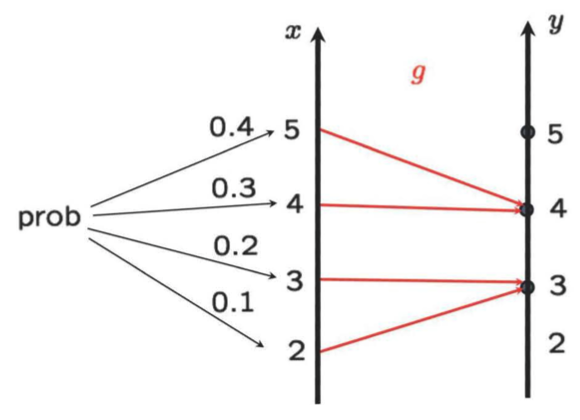
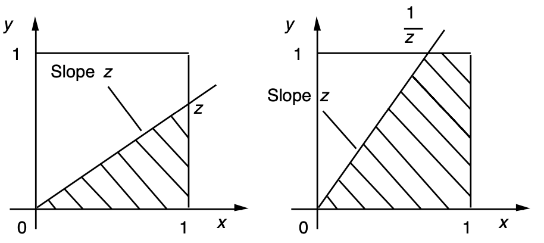
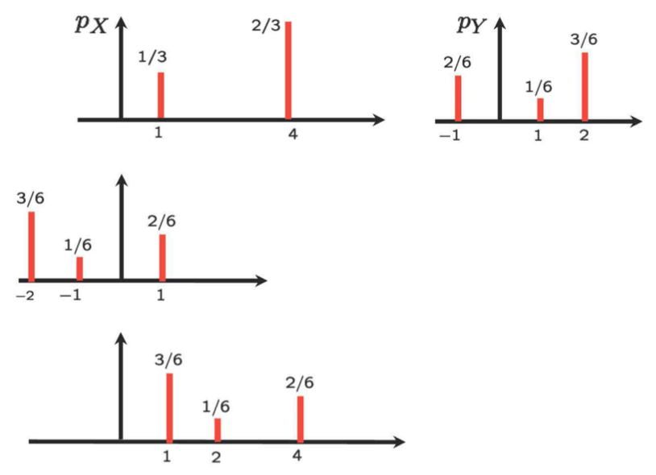
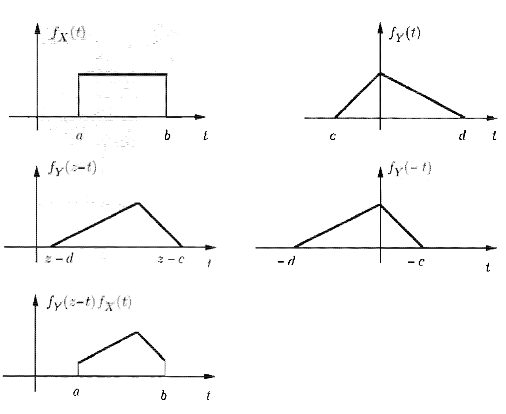
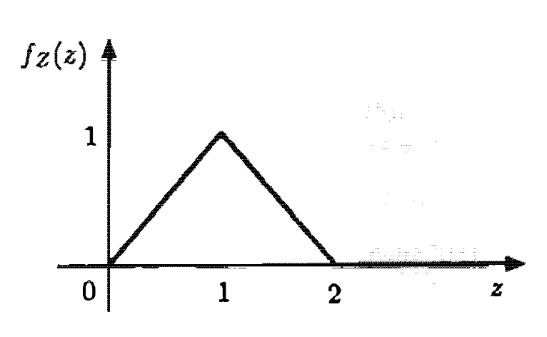
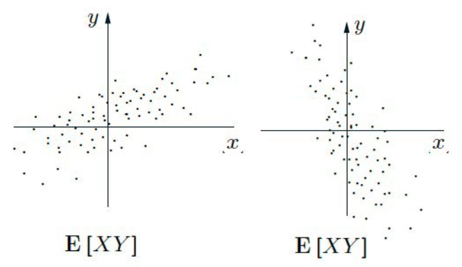
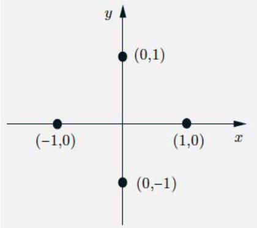

```{css, echo=FALSE}
.bluebox {
  padding: 1em;
  background: SteelBlue;
  color: white;
  border: 2px solid orange;
  border-radius: 10px;
}
.center {
  text-align: center;
}
```

<script type="text/x-mathjax-config">
MathJax.Hub.Config({
  TeX: { equationNumbers: { autoNumber: "AMS" } }
});
</script> 

<div style="display:none">
  $
\def\dist{\sim\xspace}
\newcommand{\mat}[1]{\boldsymbol{#1}}
\newcommand{\rv}[1]{\underline{#1}} 
\newcommand{\Exp}[1]{\exp\left\{#1\right\}}
\newcommand{\Log}[1]{\log\left\{#1\right\}}
\newcommand{\eqv}{\;\Longleftrightarrow\;}
\newcommand{\bbexpect}[1]{\mathbb{E}\left[ #1 \right]}
\newcommand{\cexpect}[1]{\mathbb{E}( #1 )}
\newcommand{\E}[2][]{E_{#1}\left[#2\right]}
\newcommand{\V}[2][]{V_{#1}\left[#2\right]}
\newcommand{\cov}[2][]{\mathrm{Cov}_{#1}\left[#2\right]}
\newcommand{\corr}[2][]{\rho_{#1}\left[#2\right]}
  \newcommand{\norm}{N\left(\mu,\sigma^2\right)}
  \newcommand{\bexpect}[1]{\mathbb{E}\Bigl[ #1 \Bigr]}
\newcommand{\fx}{f_X(x)}
\newcommand{\Fx}{F_X(x)}
\newcommand{\fy}{f_Y(y)}
\newcommand{\Fy}{F_Y(y)}
\newcommand{\fz}{f_Z(z)}
\newcommand{\Fz}{F_Z(z)}
\newcommand{\fxA}{f_{X|A}(x)}
\newcommand{\fyA}{f_{Y|A}(y)}
\newcommand{\fzA}{f_{Z|A}(z)}
\newcommand{\fxy}{f_{X,Y}(x,y)}
\newcommand{\Fxy}{F_{X,Y}(x,y)}
\newcommand{\fxcy}{f_{X|Y}(x|y)}
\newcommand{\fycx}{f_{Y|X}(y|x)}
  \newcommand{\px}{p_X(x)}
\newcommand{\py}{p_Y(y)}
\newcommand{\pz}{p_Z(z)}
\newcommand{\pth}{p_{\Theta}(\theta)}
\newcommand{\pxA}{p_{X|A}(x)}
\newcommand{\pyA}{p_{Y|A}(y)}
\newcommand{\pzA}{p_{Z|A}(z)}
\newcommand{\pxy}{p_{X,Y}(x,y)}
\newcommand{\pxcy}{p_{X|Y}(x|y)}
\newcommand{\pycx}{p_{Y|X}(y|x)}
\newcommand{\cprob}[1]{\mathbb{P}( #1 )}
\newcommand{\cbprob}[1]{\mathbb{P}\left( #1 \right)}
\newcommand{\aleq}[1]{\begin{align*}#1\end{align*}}
\newcommand{\real}{{\mathbb R}}
\newcommand{\set}[1]{\{#1\}}
\newcommand{\Set}{\text}
\newcommand{\qed}{\blacksquare}
\newcommand{\comp}{\overline}
%%% definition
\newcommand{\eqdef}{\triangleq}
%%% imply
\newcommand{\imp}{\Longrightarrow}
\newcommand{\indep}{\perp \!\!\! \perp}
%normal colored text

\newcommand{\yellowf}[1]{{\color{yellow} #1}}
\newcommand{\bluef}[1]{{\color{blue} #1}}

\newcommand{\magenf}[1]{{\color{magenta} #1}}
\newcommand{\greenf}[1]{{\color{green} #1}}
\newcommand{\cyanf}[1]{{\color{cyan} #1}}
\newcommand{\orangef}[1]{{\color{orange} #1}}
\newcommand{\expect}[1]{\mathbb{E}[ #1 ]}
\newcommand{\bin}[1]{\textrm{Bin}\left(n,p\right)}
\newcommand{\dbin}[1]{\binom{n}{x}p^x\left(1-p\right)^{n-x}}
%%%% indicator
\newcommand{\indi}[1]{\mathbf{1}_{ #1 }}
% Bernoulli
\newcommandx\bern[1][1=p]{\textrm{Bern}\left({#1}\right)}
\newcommandx\dbern[2][1=x,2=p]{#2^{#1} \left(1-#2\right)^{1-#1}}
\newcommandx\pbern[2][1=x,2=p]{\left(1-#2\right)^{1-#1}}
% Binomial

% Multinomial
\newcommandx\mult[1][1={n,p}]{\textrm{Mult}\left(#1\right)}
\newcommandx\dmult[3][1=x,2=n,3=p]{\frac{#2!}{#1_1!\ldots#1_k!}#3_1^{#1_1}\cdots#3_k^{#1_k}}
% Hypergeometric
\newcommandx\hyper[1][1={N,m,n}]{\textrm{Hyp}\left({#1}\right)}
\newcommandx\dhyper[4][1=x,2=N,3=m,4=n]{\frac{\binom{#3}{#1}\binom{#2-#3}{#4-#1}}{\binom{#2}{#4}}}
% Negative Binomial
\newcommandx\nbin[1][1={r,p}]{\textrm{NBin}\left({#1}\right)}
\newcommandx\dnbin[3][1=x,2=r,3=p]{\binom{#1+#2-1}{#2-1}#3^#2(1-#3)^#1}
\newcommandx\pnbin[3][1=x,2=r,3=p]{I_#3(#2,#1+1)}

% Poisson
\newcommandx\pois[1][1=\lambda]{\textrm{Po}\left({#1}\right)}
\newcommandx\dpois[2][1=x,2=\lambda]{\frac{#2^#1 e^{-#2}}{#1!}}
\newcommandx\ppois[2][1=x,2=\lambda]{e^{-#2}\sum_{i=0}^#1\frac{#2^i}{i!}}
%%%% variance
\newcommand{\var}[1]{\text{var}[ #1 ]}
\newcommand{\bvar}[1]{\text{var}\Bigl[ #1 \Bigr]}
\newcommand{\cvar}[1]{\text{var}( #1 )}
\newcommand{\cbvar}[1]{\text{var}\Bigl( #1 \Bigr)}
  $
</div>


```{r setup, include=FALSE}
knitr::opts_chunk$set(echo = TRUE,message=FALSE,fig.align="center",fig.width=7,fig.height=2.5,out.width = "65%")
pacman::p_load(
       car
       , learnr
       , extraDistr
      , ggplot2
      , ggExtra
      , reshape2
      , corrplot
      , purrr
      , RColorBrewer
      , lubridate
      , mnormt
      , mvtnorm
      , MCMCpack
      )
```


```{r,echo=FALSE}
# Global parameter
show_code <- TRUE
```

```{r ,include=FALSE}
line_width = 1.3
point_size = 4
theme_set(theme_bw(base_size=20))
theme_update(legend.background=element_rect(fill=alpha("white", 0)),
             legend.key=element_rect(colour="white"),
             legend.key.width=unit(3, "lines"),
             plot.margin=unit(rep(0, 4), "lines"))

# FIXME: is it possible to move this statement into theme_update?
scale_color_discrete = function(...) scale_color_brewer(..., palette="Dark2")


make.dist.fn <- function(mode, dist) {
  if (mode == "cdf")
    eval(parse(text=paste("p", dist, sep="")))
  else if (mode == "pdf" || mode == "pmf")
    eval(parse(text=paste("d", dist, sep="")))
  else
    stop("invalid mode: must be 'cdf' or 'pdf/pmf'")
}

make.data <- function(mode, dist, theta, xseq) {
  dist.fn <- make.dist.fn(mode, dist)
  unary <- function(...) function(x) dist.fn(x, ...)
  data.fns <- apply(theta, 1, function(x) do.call(unary, as.list(t(x))))
  values <- data.frame(sapply(data.fns, function(f) f(xseq)))
  cbind(x=xseq, values)
}

plot.dist <- function(xseq, theta, dist, mode, title, lab.fn) {
  values <- make.data(mode, dist, theta, xseq)
  molten <- melt(values, 1)
  labels <- apply(theta, 1, function(x) do.call(lab.fn, as.list(t(x))))
  p <- ggplot(molten, aes(x=x, y=value, color=variable, linetype=variable)) +
       ggtitle(title) +
       ylab(toupper(mode)) +
       scale_color_discrete(labels=labels) +
       scale_linetype_discrete(labels=labels)

  # We position the legend for CDFs bottom-right and for P[MD]Fs top-right.
  if (mode == "cdf")
    p <- p + theme(legend.title=element_blank(),
                   legend.justification=c(1, 0),
                   legend.position=c(1, 0))
  else
    p <- p + theme(legend.title=element_blank(),
                   legend.justification=c(1, 1),
                   legend.position=c(1, 1))
  p
}

plot.discrete <- function(from, to, ...) {
  xseq <- seq(from, to)
  plot.dist(xseq, ...) +
    geom_line(size=line_width) +
    geom_point(size=point_size)
}

plot.continuous <- function(from, to, ...) {
  xseq <- seq(from, to, by=0.01)
  plot.dist(xseq, ...) +
    geom_line(size=line_width)
}

```   
## Introduction

### Roadmap

Module  |  Topic                                          | What you should know                             |
--------|-------------------------------------------------|--------------------------------------------------|
  M1    | Why Probability? What is Probability?           | Probability Is Essential For Logic               |
M2      | Conditioning, Bayes Rule, and Independence.     | Understand why you can learn by conditioning.    |
M3      | Counting and Simulation                         | Learn how to count probability by simulation     |
M4      | RV and Discrete Distributions                   | Learn the d,p,q,r functions of probability       |
**M5**  | Continuous Distributions and Multiple RVs.      | Know how to work with Normal distribution        |
M6      | Joint, Marginal, Conditional, Independence      | Can manipulate joint distribution                |
**M7**      | **Summarizing Random Variables.   **                | **Able to Calculate Expectation and Variance **       |
M8      | Simulation (multiple RV) and Limit Theorems     | Understand Sampling distribution and CLT         |
M9      | Point Estimation                                | Maximum likelihood and Method of Moment          |
M10     | Classical Inference and Bootstrap               | Bootstrap, P-value, Confidence Interval, etc     |
M11     | Bayesian Inference                              | Use Stan to do Bayesian Inference                |
     |

### Overview of module 7


- Derived distribution of $Y=g(X)$ or $Z=g(X,Y)$

- Derived distribution of $Z=X+Y$

- Covariance: Degree of dependence between two rvs.

- Correlation coefficient

- Conditional expectation and law of iterative expectations

- Conditional variance and law of total variance

- Random number of sum of random variables


### Derived Distribution: $Y=g(X)$


1. Given the PDF of $X,$ What is the PDF of $Y=g(X)$?

2. Wait! Didn't we cover this topic? No. We covered just $\expect{g(X)}.$

3. Examples: $Y=X,$ $Y=X+1,$ $Y=X^2,$ etc.

4. What are easy or difficult cases?

5. Easy cases


- Discrete

- Linear: $Y=aX +b$


### Discrete Case


1. Take all values of $x$ such that $g(x) = y,$ i.e.,
\begin{eqnarray} 
\py &=& \cprob{g(X) = y}\\
&=& \sum_{x:g(x)=y} \px
\end{eqnarray} 

\item[]
\mytwocols{0.4}
{
\begin{eqnarray} 
p_Y(3) &=& p_X(2) + p_X(3) = 0.1 + 0.2 = 0.3\\
p_Y(4) &=& p_X(4) + p_X(5) = 0.3+0.4 = 0.7
\end{eqnarray} 

}
{


```{r , echo=FALSE, out.width = '80%',fig.align="center"}

#\mypic{0.8}{L5_derived_disc.png}
```


### Linear: $Y = aX +b,$ $a \neq 0$, $X$: Continuous}

\begin{eqnarray} 
1.{\text{If $a > 0,$}}&
2.{\quad \Fy = \cprob{aX+b \leq y} = \cprob{X \le \frac{y-b}{a}} = F_X(\frac{y-b}{a})}\\
& 3.{\rightarrow \fy = \frac{1}{a} f_X \left (\frac{y-b}{a} \right )}\\
1.{\text{If $a <0,$}}&
4.{\quad \Fy = \cprob{aX+b \leq y} = \cprob{X \ge \frac{y-b}{a}}
 = 1- F_X(\frac{y-b}{a})}\\
& 5.{\rightarrow \fy = -\frac{1}{a} f_X \left (\frac{y-b}{a} \right )}\\
\end{eqnarray} 

\vspace{-0.5in}
6. Therefore,
\mycolorbox{
$
\displaystyle \fy = \frac{1}{|a|} f_X\left(\frac{y-b}{a}\right)
$
}


### Linear: $Y = aX +b,$ when $X$ is exponential


$$
\fx = \begin{cases}
\lambda \elambdax, & \text{if} \quad x \ge 0 \\
0, & \text{otherwise}
\end{cases}
$$

$$
\fy= \begin{cases}
\frac{\lambda}{|a|}e^{-\lambda(y-b)/a}, & \text{if} \quad (y-b)/a \ge 0 \\
0, & \text{otherwise}
\end{cases}
$$

- If $b = 0$ and $a>0,$ $Y$ is exponential with parameter $\frac{\lambda}{a}$, but generally not.


### Linear: $Y = aX +b,$ when $X$ is normal


- Remember? Linear transformation preserves normality. Time to prove.

\mycolorbox
{
If $X \sim  N(\mu, \sigma^2) $, then for $a \neq 0$ and $b,$ $Y = aX +b \sim N(a\mu +b,a^2 \sigma^2).$
}

2. \proff
$$
\fx = \frac{1}{\sqrt{2\pi}} e^{-(x-\mu)^2/2 \sigma^2}
$$
\begin{eqnarray} 
\fy &=& \frac{1}{|a|} f_X\left(\frac{y-b}{a}\right) = \frac{1}{|a|}\frac{1}{\sqrt{2\pi}}
\exp\left \{ -\left(\frac{y-b}{a}-\mu\right)^2/2 \sigma^2 \right \} \\
&=& \frac{1}{\sqrt{2\pi}|a| \sigma} \exp\left \{ - \frac{(y-b-a\mu)^2}{2 a^2 \sigma^2}   \right \}}
\end{eqnarray} 


### Generally, $Y=g(X)$, $X$: Continuous

\mytwocols{0.75}
{

\medskip
\plitemsep 0.2in

\bce
2.[Step 1.] Find the CDF of $Y$: $\Fy = \cprob{Y\leq y} = \cprob{g(X) \leq y}$
2.[Step 2.] Differentiate: $\fy = \frac{dF_Y}{dy}(y)$


\medskip

\small

3.{{Ex1.} $Y = X^2.$
\begin{eqnarray} 
\Fy &=& \cprob{X^2 \le y} = \cprob{-\sqrt{y} \le X \le \sqrt{y}} \\
& = F_X(\sqrt{y}) - F_X(-\sqrt{y})\\
\fy &=& \frac{1}{2\sqrt{y}} f_X(\sqrt{y}) +\\
& \frac{1}{2\sqrt{y}} f_X(-\sqrt{y}), \quad y \ge 0
\end{eqnarray} 

}
{
\small

4.{{Ex2.} $X \sim \set{U}[0,1].$ $Y = \sqrt{X}.$
\begin{eqnarray} 
\Fy &=& \cprob{\sqrt{X} \le y} = \cprob{X \le y^2} = y^2 \\
\fy &=& 2y, \quad 0\le y \le 1
\end{eqnarray} 
}

5.{
{Ex3.} $X \sim \set{U}[0,2].$ $Y = X^3.$
\begin{eqnarray} 
\Fy &=& \cprob{X^3 \le y} = \cprob{X \le \sqrt[3]{y}} = \frac{1}{2} y^{1/3}\\
\fy &=& \frac{1}{6}y^{-2/3}, \quad 0\le y \le 8
}
\end{eqnarray} 

6.{When $Y=g(X)$ is monotonic, a {general formula} can be drawn (see the textbook at pp 207)}

}


### Functions of multiple rvs: $Z=g(X,Y)$ (1)

1.{\noindent Basically, follow two-step approach: (i) CDF and (ii) differentiate. }

\medskip

\small
2.{{Ex1.} $X,Y \sim \set{U}[0,1],$ and $X \indep Y.$ $Z = \max(X,Y).$

\medskip
* $\cprob{X \le z} = \cprob{Y \le z} = z,\ z \in [0,1].$
}
\begin{eqnarray} 
3.{
F_Z(z) &=& \cprob{\max(X,Y) \le z} = \cprob{X \le z, Y \le z}\\
&=& \cprob{X \le z} \cprob{Y \le z} = z^2 \qquad \qquad \text{(from $X \indep Y$)}}\\
& \\
4.{
\fz& = \begin{cases}
2z, & \text{if $0 \le z \le 1$}\\
0, & \text{otherwise}
\end{cases}
}
\end{eqnarray} 


### Functions of multiple rvs: $Z=g(X,Y)$ (2)

\noindent Basically, follow two step approach: (i) CDF and (ii) differentiate.

\medskip

\mytwocols{0.6}
{
\small

2.{
{Ex2.}
$X,Y \sim \set{U}[0,1],$ and $X \indep Y.$
$Z = Y/X.$}

\hfill \only<2>{\lecturemark{VIDEO PAUSE}}


\begin{eqnarray} 
3.{\Fz &=& \cprob{Y/X \le z}} \\
5.{ &=&
 \begin{cases}
 z/2, & 0 \le z \le 1\\
 1-1/2z, & z >1 \\
 0,& \text{otherwise}
 \end{cases}
 }
\end{eqnarray} 
\vspace{-0.5cm}
\begin{eqnarray} 
6.{
\fz &=&
 \begin{cases}
 1/2, & 0 \le z \le 1\\
 1/(2z^2), & z >1 \\
 0,& \text{otherwise}
 \end{cases}
}
}
\end{eqnarray} 
{

\small

4.{
- Depending on the value of $z,$ two cases need to be considered separately.


```{r , echo=FALSE, out.width = '80%',fig.align="center"}

#\mypic{0.95}{L5_pdf_tworvs.png}
```

%- Where do we use $X \indep Y$?
}

\medskip
7.{{(Note)} Sometimes, the problem is tricky, which requires careful case-by-case handing. :-)}

}


### Functions of multiple rvs: $Z=X+Y,$ $X\indep Y$ (1)

- Sum of two independent rvs
2. A very basic case with many applications
2. Assume that $X,Y \in \integer$
\begin{eqnarray} 
\pz &=& \cprob{X+Y = z} = \sum_{\{(x,y): x+y=z \}}\cprob{X=x,Y=y}= \sum_{x}\cprob{X=x,Y=z-x}\\
 &=& \sum_{x}\cprob{X=x} \cprob{Y=z-x} = \sum_{x}\px p_Y(z-x)
\end{eqnarray} 

4. $\pz$ is called {convolution} of the PMFs of $X$ and $Y.$


### Functions of multiple rvs: $Z=X+Y,$ $X\indep Y$ (2)

\mytwocols{0.6}
{
\small
\plitemsep 0.15in

- Convolution: $\pz = \sum_{x} \px p_Y(z-x)$
- Interpretation for a given $z$:
\bce[(i)]
- Flip (horizontally) the PMF of Y ($p_{Y}(-x)$)
- Put it underneath the PMF of X
- Right-shift the flipped PMF by $z$ ($p_{Y}(-x+z)$)


}
{
\exam $z=3$

}
```{r , echo=FALSE, out.width = '80%',fig.align="center"}

#\mypic{0.95}{L5_conv_ex.png}
```


### $Y=X+Y,$ $X\indep Y$: Continuous

\mytwocols{0.7}
{

\plitemsep 0.07in


1. Same logic as the discrete case

$$
\fz = \int_{-\infty}^\infty \fx f_{Y}(z-x) dx
$$


3. Youtube animation for convolution:
\url{https://www.youtube.com/watch?v=C1N55M1VD2o}


}
{
For a fixed $z,$

2.
}
```{r , echo=FALSE, out.width = '80%',fig.align="center"}

#{\mypic{0.95}{L5_convolution_cont_ex.png}}
```


### Example

\plitemsep 0.1in


- \exam $X,Y \sim \set{U}[0,1]$ and $X \indep Y.$ What is the PDF of $Z = X+Y$?
Draw the PDF of $Z$.


```{r , echo=FALSE, out.width = '80%',fig.align="center"}

#{\mypic{0.5}{L5_convolution_ex.png}}
```


### Convolution in Image Processing

\vspace{2cm}

{\large \url{https://www.youtube.com/watch?v=MQm6ZP1F6ms}}


### $Y=X+Y,$ $X\indep Y,$ Normal (1)


\plitemsep 0.1in


1. Very special, but useful case


- $X$ and $Y$ are \bluef{normal.}


:::: {.bluebox data-latex=""}
::: {.center data-latex=""}
**Sum of two independent normal rvs**
:::
$X \sim N(\mu_x, \sigma_x^2)$ and  $Y \sim N(\mu_x, \sigma_x^2)$
Then, $X+Y \sim N(\mu_x + \mu_y, \sigma_x^2 + \sigma_y^2)$
::::

4.  Why normal rvs are used to model the \orangef{sum of random noises}.

4. {Extension.} The sum of {finitely many} independent normals is also normal.


### $Y=X+Y,$ $X\indep Y$, Normal (2)

\plitemsep 0.2in
[]

\begin{eqnarray} 
\fz &=& \int_{-\infty}^\infty \fx f_{Y}(z-x) dx \\
&=&\int_{-\infty}^\infty \frac{1}{\sqrt{2\pi} \sigma_x} \exp\left\{ - \frac{(x-\mu_x)^2}{2 \sigma_x^2} \right\} \frac{1}{\sqrt{2\pi} \sigma_y} \exp\left\{ - \frac{(z-x-\mu_y)^2}{2 \sigma_y^2} \right\} dx
\end{eqnarray} 
\item[$\bullet$] The details of integration is a little bit tedious. :-)
\begin{eqnarray} 
\fz = \frac{1}{\sqrt{2\pi(\sigma_x^2 + \sigma_y^2)} } \exp\left\{ - \frac{(z-\mu_x-\mu_y)^2}{2(\sigma_x^2 + \sigma_y^2)} \right\}
\end{eqnarray} 


% 
% ### Dependence Degree: Motivating Example
%
% \plitemsep 0.1in
%
% 
%
% - covariance의 필요성을 이야기해주는 example을 찾아서 먼저 이야기를 해준다.
%
% 
%
% 

## Covariance

### Making a Metric of Dependence Degree


1. Goal: Given two rvs $X$ and $Y$, assign some number that quantifies the degree of their dependence.

2. feeling/weather, university ranking/annual salary,


3. Requirements
  - R1 Increases (resp. decreases) as they become more (resp. less) dependent. 0 when they are independent.
  - R2 Shows the `direction' of dependence by + and -
  - R3 Always bounded by some numbers (i.e., dimensionless metric). For example, $[-1,1]$


7. Good engineers: Good at making good metrics

\smallskip

- Metric of how our society is economically polarized
%- A lot of metrics in our professional sports leagues (baseball, basketball, etc)
- Cybermetrics in MLB (Major League Baseball): \url{http://m.mlb.com/glossary/advanced-stats}


### OK. Let's Design!


1. Simple case: $\expect{X} =\mu_x = 0$ and $\expect{Y}=\mu_Y = 0$
2. Dependent: Positive (If $X \uparrow$, $Y \uparrow$) or Negative (If $X \uparrow,$ $Y \downarrow$)

3. What about $\expect{XY}$? Seems good.


4. $\expect{XY} = \expect{X}\expect{Y}=0$ when $X \indep Y$
5. More data points (thus increases) when $xy >0$ (both positive or negative)
6. $|\expect{XY}|$ also quantifies the \orangef{amount of spread}.


\mytwocols{0.35}
{
\vspace{-0.3cm}
5.
}

```{r , echo=FALSE, out.width = '80%',fig.align="center"}

#{\mypic{0.8}{L5_cov_ex.png}}
```

{
\bigskip
6.{{(Q)} What about $\expect{X+Y}$?}

7. When they are positively dependent, but have negative values?

}


But what if $\mu_X \neq 0, \mu_Y \neq 0$?

Solution: Centering. $X \rightarrow X - \mu_X$ and $Y \rightarrow Y-\mu_Y$

:::: {.bluebox data-latex=""}
::: {.center data-latex=""}
**Covariance**
:::
$\cov{X,Y} = \bexpect{(X- \expect{X})\cdot (Y-\expect{Y})}$
::::

After some algebra, $\cov{X,Y} = \expect{XY} - \expect{X}\expect{Y}$

$X \indep Y$ $\imp$ $\cov{X,Y}=0$

$\cov{X,Y}=0$ $\imp$ $X \indep Y$? NO.

When $\cov{X,Y}=0,$ we say that $X$ and $Y$ are uncorrelated.


#### Example: $\cov{X,Y}=0,$ but not independent


- $p_{X,Y}(1,0) = p_{X,Y}(0,1) = p_{X,Y}(-1,0) = p_{X,Y}(0,-1) = 1/4.$

2. $\expect{X} = \expect{Y}=0,$ and $\expect{XY}=0.$ So, $\cov{X,Y}=0$

3. Are they independent? No, because if $X=1$, then we should have $Y=0.$


```{r , echo=FALSE, out.width = '80%',fig.align="center"}

#\mypic{0.3}{L5_cov_notind.png}
```


### Some Properties


$$
\cov{X,X}=\cvar{X}
$$

$$
\cov{aX +b, Y} =\expect{(aX+b)Y} - \expect{aX+b}\expect{Y} = a\cdot \cov{X,Y}
$$

$$
\cov{X,Y+Z} = \expect{X(Y+Z)} - \expect{X}\expect{Y+Z}= \cov{X,Y} + \cov{X,Z}
$$

$$
\var{X+Y} = \expect{(X+Y)^2} - (\expect{X+Y})^2 = \var{X} + \var{Y} + 2\cov{X,Y}
$$ 

$$
\bvar{\sum X_i} -= \sum {\var{X_i}} + \sum_{i\neq j} \cov{X_i,X_j}
$$


### Example: The hat problem 

There are $n$ people throw their hats in a box and then pick one at random

- Let $X$ be the number of people with their own hat

- (Q) What is $\var{X}$

- Key step 1. Define a rv $X_i=1$ if $i$ selects own hat and $0$ otherwise. Then, $X = \sum_{i=1}^n X_i.$

- Key step 2. Are $X_i$s are independent?

\medskip
2. $X_i \sim \text{Bern}(1/n).$ Thus, $\expect{X_i} = 1/n$ and $\var{X_i} = \frac{1}{n}(1-\frac{1}{n})$


- For $i \neq j,$
\begin{eqnarray} 
\cov{X_i,X_j} &=& \expect{X_i X_j} - \expect{X_i} \expect{X_j}\\
&=&\cprob{X_i =1 \text{ and } X_j=1} - \frac{1}{n^2} \\
&=&\cprob{X_i=1} \cprob{X_j=1 | X_i=1} - \frac{1}{n^2} \\
&=&\frac{1}{n} \frac{1}{n-1} - \frac{1}{n^2} = \frac{1}{n^2(n-1)}
\end{eqnarray} 

\begin{eqnarray} 
\var{X}&=& \bvar{\sum X_i}\\
&=& \sum {\var{X_i}} + \sum_{i\neq j} \cov{X_i,X_j}\\
&=& n \frac{1}{n}(1-\frac{1}{n}) + n(n-1)\frac{1}{n^2(n-1)}=1\\
\end{eqnarray} 


}


## Correlation


### Bounding the metric: Correlation Coefficient


1. Reqs. **R1** and **R2**  are satisfied.

2. **R3.** Always bounded by some numbers (dimensionless metric)


3. How? {Normalization,} but by what?

:::: {.bluebox data-latex=""}
::: {.center data-latex=""}
**Correlation Coefficient**
:::
$$
\rho(X,Y) = \bbexpect{\frac{(X - \mu_X)}{\sigma_X} \cdot \frac{(Y-\mu_Y)}{\sigma_Y}} = \frac{\cov{X,Y}}{\sqrt{\var{X}\var{Y}}}
$$
::::

The correlation coefficient $\rho$ is bounded
$$-1 \le \rho \le 1$$ 
It's easy to show using the Cauchy-Schwarz inequality (CSI)

Proof of $-1 \le \rho \le 1$:
Let $\tilde{X} = X - \cexpect{X}$ and $\tilde{Y} = Y - \cexpect{Y}.$ Then, using CSI
$$
\rho(X,Y)^2 = \frac{\big(\expect{\tilde{X}\tilde{Y}} \big)^2}{\cexpect{\tilde{X}^2} \cexpect{\tilde{Y}^2}} \le 1
$$

$|\rho|=1$ $\Leftrightarrow$ $X-\mu_X = c(Y-\mu_Y)$ for some constant $c$ ($c>0$ when $\rho=1$ and $c<0$ when $\rho=-1$). In other words, linear relation, meaning VERY related.


- Cauchy-Schwarz inequality (CSI). For any rvs $X$ and $Y,$ $$\cexpect{XY}^2 \le \cexpect{X^2} \cexpect{Y^2}$$

Proof of CSI: For any constant $a,$
\begin{eqnarray} 
0 &\le \bbexpect{\left(X - a Y\right)^2} =
\bbexpect{X^2 -2 a XY + a^2Y^2 }= \cexpect{X^2} -2 a \cexpect{XY} + a^2\cexpect{Y^2}
\end{eqnarray} 
Now, choose $a = \frac{\cexpect{XY}}{\cexpect{Y^2}}.$ Then,
\begin{eqnarray} 
\cexpect{X^2} -2 \frac{\cexpect{XY}}{\cexpect{Y^2}} \cexpect{XY} + \frac{(\expect{XY})^2}{(\expect{Y^2})^2}\cexpect{Y^2} = \cexpect{X^2} - \frac{(\expect{XY})^2}{\cexpect{Y^2}} \ge 0
\end{eqnarray} 


### 2. $|\rho|=1$ $\Leftrightarrow$ $X-\mu_X = c(Y-\mu_Y)$

\newcommand{\tX}{\tilde{X}}
\newcommand{\tY}{\tilde{Y}}

\plitemsep 0.1in


\item[($\Rightarrow$)] Suppose that $|\rho|=1$. In the proof of CSI,
$$
\bbexpect{\left(\tX - \frac{\cexpect{\tX\tY}}{\cexpect{\tY^2}} \tY\right)^2} = \cexpect{\tX^2} - \frac{(\expect{\tX\tY})^2}{\cexpect{\tY^2}} = \cexpect{\tX^2}(1-\rho^2) = 0
$$
$$
\tX - \frac{\cexpect{\tX\tY}}{\cexpect{\tY^2}} Y = 0 \leftrightarrow \tX = \frac{\cexpect{\tX\tY}}{\cexpect{\tY^2}} \tY
= \rho \sqrt{\frac{\cexpect{\tX^2}}{\cexpect{\tY^2}}} \tY
$$

\item[($\Leftarrow$)] If $\tY = c\tX,$ then
$$
\rho(X,Y) = \frac{\cexpect{\tX c \tX}}{\sqrt{\expect{\tX^2} \expect{(c \tX)^2}}} = \frac{c}{|c|}
$$


## Conditional expectation


### A Special Random Variable

\mytwocols{0.6}
{
\plitemsep 0.1in

\abovedisplayskip=5pt
\belowdisplayskip=5pt


1. Consider a rv $Y$, such that
$$
Y = \begin{cases}
0,& \text{w.p.  } 1/4 \\
1,& \text{w.p.  } 1/4 \\
2,& \text{w.p.  } 1/2
\end{cases}
$$

2. If $h(y) = y^2,$ then a new rv $h(Y)$ is:
$$
h(Y) = \begin{cases}
0,& \text{w.p.  } 1/4 \\
1,& \text{w.p.  } 1/4 \\
4,& \text{w.p.  } 1/2
\end{cases}
$$

}
{
\plitemsep 0.05in
\abovedisplayskip=5pt
\belowdisplayskip=5pt


3. Consider other rv $X$, which, we assume, has:
$$
4.{{g(y)}= } \expect{X|Y=y}=\begin{cases}
3,& \text{if $y=0$}\\
8,& \text{if $y=1$}\\
9,& \text{if $y=2$}
\end{cases}
$$

5. Then, a rv ${g(Y)}$ is:
$$
g(Y) = \begin{cases}
3,& \text{w.p.  } 1/4 \\
8,& \text{w.p.  } 1/4 \\
9,& \text{w.p.  } 1/2
\end{cases}
$$


- The rv $g(Y)$ looks special, so let's give a fancy notation to it.

- What about? $X_{exp}(Y)$, $\expect{X_Y}$, $\expecti{X}{Y}$?


### Conditional Expectation $\expect{X|Y}$


:::: {.bluebox data-latex=""}
::: {.center data-latex=""}
**Conditional Expectation**
:::

A random variable $g(Y) =\expect{X|Y}$, called conditional expectation of $X$ given $Y$, takes the value $g(y) = \expect{X|Y=y},$ if $Y$ happens to take the value $y.$

::::

- $\expect{X|Y}$ is a function of $Y$
- It is a random variable.
- Thus, having a distribution, expectation, variance, all the things that a random variable has.
- Often confusing because of the notation.


### Expectation of $\expect{X|Y}$

:::: {.bluebox data-latex=""}
::: {.center data-latex=""}
**Expectation of Conditional Expectation**
:::

$$
\bexpect{\expect{X|Y}} = \expect{X}, \quad \text{Law of iterated expectations}
$$

::::

Proof:

$$
\bexpect{\expect{X|Y}} = \sum_{y} \expect{X | Y=y} \py = \expect{X}
$$


### Examples and Meaning

Imagine you have stick of length $l$.
- Uniformly break at point $Y,$ and break what is left uniformly at point $X.$

- $\expect{X | Y=y} = y/2$

- $\expect{X | Y} = Y/2$

- $\expect{X} = \expect{\expect{X|Y}} = \expect{Y/2}=\frac{1}{2}\frac{l}{2} = l/4$


5. Forecasts on sales: calculating expected value, given any available information

6. $X:$ February sales

6. Forecast in the beg. of the year: $\expect{X}$

7. End of Jan. new information $Y=y$ (Jan. sales)

Revised forecast: $\expect{X|Y=y}$

Revised forecast $\neq$ $\expect{X}$

8. Law of iterated expectations
$\expect{\text{revised forecast}} = \text{original one}$


### Example: Averaging Quiz Scores by Section

\mytwocols{0.7}
{
\small
\plitemsep 0.05in

% \abovedisplayskip=5pt
% \belowdisplayskip=5pt


- A class: $n$ students, student $i$'s quiz score: $x_i$
2. Average quiz score: $m = \frac{1}{n} \sum_{i=1}^n x_i$
3. Students: partitioned into sections $A_1,$ \ldots, $A_k$ and $n_s$: number of students in section $s$
4. average score in section $s$ = $m_s = \frac{1}{n_s}\sum_{i \in A_s} x_i$

\medskip
5. whole average: (i) taking the average $m_s$ of each section and
(ii) forming a weighted average
$$
\sum_{s=1}^k \frac{n_s}{n} m_s = \sum_{s=1}^k\frac{n_s}{n} \frac{1}{n_s}\sum_{i \in A_s} x_i = \frac{1}{n} \sum_{i=1}^n x_i = m
$$

}
{
\plitemsep 0.05in

% \abovedisplayskip=5pt
% \belowdisplayskip=5pt
\small


6. Understanding from $\bexpect{\expect{X|Y}} = \expect{X}$

7. $X$: score of a randomly chosen student, $Y$: section of a student ($\in \{1, \ldots, k\}$)

\begin{eqnarray} 
m &=& \cexpect{X} = \bexpect{\expect{X|Y}}\\
&=&\sum_{s=1}^k \cexpect{X | Y=s} \cprob{Y=s} \\
&=& 8.{\sum_{s=1}^k \left(\frac{1}{n_s} \sum_{i \in A_s} x_i \right)\frac{n_s}{n} = \sum_{s=1}^k m_s \frac{n_s}{n}}
\end{eqnarray} 


}


## Conditional variance

### Conditional Variance $\var{X|Y}$

Recall the definition of variance
$$\var{X} = \expect{(X-\expect{X})^2}$$

2.$g(y) = \var{X{|Y=y}} = \expect{(X-\expect{X{|Y=y}})^2 | {Y=y}}$

3.$g(Y) = \var{X{|Y}} = \expect{(X-\expect{X{|Y}})^2 | {Y}}$

:::: {.bluebox data-latex=""}
::: {.center data-latex=""}
**Conditional Variance**
:::

The conditional variance of $X$ given $Y$ is a random variable
 $$g(Y) =\var{X|Y}$$  
it takes the value $g(y) = \var{X|Y=y},$ if $Y$ happens to take the value $y.$

::::

Conditional Variance is 

- A function of $Y$
- A random variable
- Thus, having a distribution, expectation, variance, all the things that a random variable has.


### Expectation and Variance of $\expect{X|Y}$ and $\var{X|Y}$


<!-- \begin{tabular}{@{}l|l|l@{}} \toprule -->
<!--  & $\expect{X|Y}$ & $\var{X|Y}$ \\ \midrule \midrule -->
<!-- Expectation& $\bexpect{\cexpect{X|Y}}$& $\bexpect{\cvar{X|Y}}$ \\  \midrule -->
<!-- Variance& $\bvar{\cexpect{X|Y}}$& $\bvar{\cvar{X|Y}}$ \\ \bottomrule -->
<!-- \end{tabular} -->

|             | $\expect{X|Y}$            | $\var{X|Y}$            |
|-------------|---------------------------|------------------------|
| Expectation | $\bexpect{\cexpect{X|Y}}$ | $\bexpect{\cvar{X|Y}}$ |
| Variance    | $\bvar{\cexpect{X|Y}}$    | $\bvar{\cvar{X|Y}}$    |


### Law of Total Variance

:::: {.bluebox data-latex=""}
::: {.center data-latex=""}
**Law of total variance (LTV)**
:::
$$
\var{X} = \bexpect{\cvar{X|Y}} + \var{\cexpect{X|Y}}
$$
::::


Proof.
\begin{eqnarray}
\cvar{X|Y} &=& \expect{X^2 |Y} - (\expect{X|Y})^2 \nonumber \\
\bexpect{\cvar{X|Y} &=& \expect{X^2} - \bexpect{(\expect{X|Y})^2} \label{eq:1}}\\
\bvar{\cexpect{X|Y} &=& \bexpect{(\expect{X|Y})^2} - (\bexpect{\cexpect{X|Y}})^2 = \bexpect{(\expect{X|Y})^2} - (\expect{X})^2 \label{eq:2}}
\end{eqnarray}

\eqref{eq:1} + \eqref{eq:2} = $\expect{X^2}$ + $(\expect{X})^2$ = $\var{X}$


### Example: Averarging Quiz Scores by Section


- Same setting as that in page 36

- $X$: score of a randomly chosen student, $Y$: section of a student ($\in \{1, \ldots, k\}$)

2. Let's intuitively understand: $\var{X} = \bexpect{\cvar{X|Y}} + \var{\cexpect{X|Y}}$

3. $\expect{\cvar{X|Y}} = \sum_{k=1}^s \cprob{Y=s}\cvar{X | Y=s} = \sum_{k=1}^s \frac{n_s}{n} \cvar{X | Y=s}$

- Weighted average of the section variances
5. {average score variability within individual sections}


4. $\var{\cexpect{X|Y}}$: variability of the average of the differenct sections

- $\cexpect{X | Y=s}$: average score in section $s$
5. {variability between sections}


### Example: Stick-breaking

Imagine a stick of length $l$.  Uniformly break at point $Y,$ and break what is left uniformly at point $X.$
What is $\cvar{X}$?

Recall LTV: $$\var{X} = \bexpect{\cvar{X|Y}} + \var{\cexpect{X|Y}}$$

3. {Fact.} If a rv $X \sim \set{U}[0,\theta]$, then $\cvar{X} = \frac{\theta^2}{12}$

4. Since $X \sim \set{U}[0,Y],$ $\cvar{X | Y} = \frac{Y^2}{12}$ $\rightarrow$ $\expect{\var{X | Y}} = \frac{1}{12} \int_0^l \frac{1}{l} y^2 dy = \frac{l^2}{36}$

5. $\cexpect{X |Y} = Y/2$ $\rightarrow$ $\cvar{\expect{X |Y}} = \frac{1}{4} \var{Y} = \frac{1}{4} \frac{l^2}{12} = \frac{l^2}{48}$

$$\cvar{X} = \frac{l^2}{36} + \frac{l^2}{48} = \frac{7l^2}{144}$$


## Sum of random variables

### Sum of a random number of rvs


Let $N=$ number of stores visited (random) and $X_i=$ money spent in store $i,$ independent of other $X_j$ and $N,$ $X_i$s are identically distributed with $\expect{X_i} = \mu$.
Define $Y = X_1 + X_2 + \ldots X_N.$ What are $\expect{Y}$ and $\var{Y}$?

$$\expect{Y} = \expect{\expect{Y|N}} = \expect{N\expect{X_i}} = \expect{N}\expect{X_i} = \mu \expect{N}$$

$$\var{Y} = \bexpect{\cvar{Y|N}} + \var{\cexpect{Y|N}}=\expect{N}\var{X_i} + \mu^2 \var{N}$$

\begin{eqnarray} 
\cvar{\expect{Y|N}} &=& \cvar{N\mu} = \mu^2 \var{N}\\
\var{Y|N} &=& N \var{X_i}\\
\expect{\cvar{Y|N}} &=& \expect{N \var{X_i}} = \expect{N}\var{X_i}
\end{eqnarray} 


## Review Questions

- What are the key steps to get the derived distributions of
  $Y=g(X)$ or $Z=g(X,Y)$?

- How does CDF help in computing the derived distributions?

- How can we compute the distribution of $Z+X+Y$ when $X$ and $Y$ are independent?

- What are covariance and correlation coefficient? Why do we need
  those concepts?

- Explain the concepts of conditional expectation and
  conditional variance.

- Explain law of iterative expectations and law of total variance
  
- How can we apply the above two law to handle a case of random
  number of sum of random variables?

  


