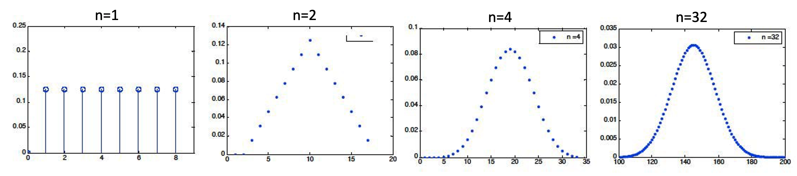
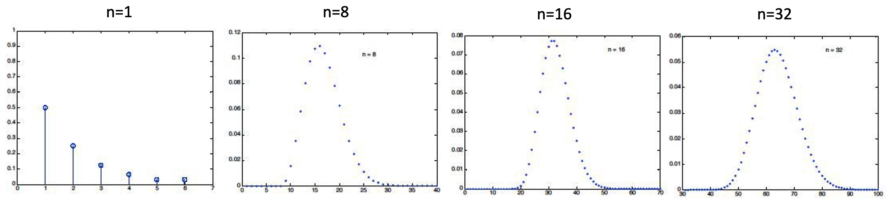

```{css, echo=FALSE}
.bluebox {
  padding: 1em;
  background: SteelBlue;
  color: white;
  border: 2px solid orange;
  border-radius: 10px;
}
.center {
  text-align: center;
}

.infobox {
  padding: 1em 1em 1em 4em;
  margin-bottom: 10px;
  border: 2px solid orange;
  border-radius: 10px;
  background: #f5f5f5 5px center/3em no-repeat;
}

.question {
  background-image: url("images/question.png");
}
.info {
  background-image: url("images/info.png");
}
```

<div style="display:none">
  $
\def\dist{\sim\xspace}
\newcommand{\mat}[1]{\boldsymbol{#1}}
\newcommand{\rv}[1]{\underline{#1}} 
\newcommand{\Exp}[1]{\exp\left\{#1\right\}}
\newcommand{\Log}[1]{\log\left\{#1\right\}}
\newcommand{\eqv}{\;\Longleftrightarrow\;}
\newcommand{\E}[2][]{E_{#1}\left[#2\right]}
\newcommand{\V}[2][]{V_{#1}\left[#2\right]}
\newcommand{\cov}[2][]{\mathrm{Cov}_{#1}\left[#2\right]}
\newcommand{\corr}[2][]{\rho_{#1}\left[#2\right]}
  \newcommand{\norm}{N\left(\mu,\sigma^2\right)}
  \newcommand{\bexpect}[1]{\mathbb{E}\Bl[ #1 \Br]}
  \def\giv{\,|\,}
\newcommand{\fx}{f_X(x)}
\newcommand{\Fx}{F_X(x)}
\newcommand{\fy}{f_Y(y)}
\newcommand{\Fy}{F_Y(y)}
\newcommand{\fz}{f_Z(z)}
\newcommand{\Fz}{F_Z(z)}
\newcommand{\fxA}{f_{X|A}(x)}
\newcommand{\fyA}{f_{Y|A}(y)}
\newcommand{\fzA}{f_{Z|A}(z)}
\newcommand{\fxy}{f_{X,Y}(x,y)}
\newcommand{\Fxy}{F_{X,Y}(x,y)}
\newcommand{\fxcy}{f_{X|Y}(x|y)}
\newcommand{\fycx}{f_{Y|X}(y|x)}
  \newcommand{\px}{p_X(x)}
\newcommand{\py}{p_Y(y)}
\newcommand{\pz}{p_Z(z)}
\newcommand{\pth}{p_{\Theta}(\theta)}
\newcommand{\pxA}{p_{X|A}(x)}
\newcommand{\pyA}{p_{Y|A}(y)}
\newcommand{\pzA}{p_{Z|A}(z)}
\newcommand{\pxy}{p_{X,Y}(x,y)}
\newcommand{\pxcy}{p_{X|Y}(x|y)}
\newcommand{\pycx}{p_{Y|X}(y|x)}
\newcommand{\cprob}[1]{\mathbb{P}( #1 )}
\newcommand{\cbprob}[1]{\mathbb{P}\left( #1 \right)}
\newcommand{\aleq}[1]{\begin{align*}#1\end{align*}}
\newcommand{\real}{{\mathbb R}}
\newcommand{\set}[1]{\{#1\}}
\newcommand{\Set}{\text}
\newcommand{\qed}{\blacksquare}
\newcommand{\comp}{\overline}
%%% definition
\newcommand{\eqdef}{\triangleq}
%%% imply
\newcommand{\imp}{\Longrightarrow}
\newcommand{\indep}{\perp \!\!\! \perp}
%normal colored text
\newcommand{\redf}[1]{{\color{red} #1}}
\newcommand{\yellowf}[1]{{\color{yellow} #1}}
\newcommand{\bluef}[1]{{\color{blue} #1}}
\newcommand{\grayf}[1]{{\color{gray} #1}}
\newcommand{\magenf}[1]{{\color{magenta} #1}}
\newcommand{\greenf}[1]{{\color{green} #1}}
\newcommand{\cyanf}[1]{{\color{cyan} #1}}
\newcommand{\orangef}[1]{{\color{orange} #1}}
\newcommand{\expect}[1]{\mathbb{E}[ #1 ]}
\newcommand{\bin}[1]{\textrm{Bin}\left(n,p\right)}
\newcommand{\dbin}[1]{\binom{n}{x}p^x\left(1-p\right)^{n-x}}
%%%% indicator
\newcommand{\indi}[1]{\mathbf{1}_{ #1 }}
% Bernoulli
\newcommandx\bern[1][1=p]{\textrm{Bern}\left({#1}\right)}
\newcommandx\dbern[2][1=x,2=p]{#2^{#1} \left(1-#2\right)^{1-#1}}
\newcommandx\pbern[2][1=x,2=p]{\left(1-#2\right)^{1-#1}}
% Binomial

% Multinomial
\newcommandx\mult[1][1={n,p}]{\textrm{Mult}\left(#1\right)}
\newcommandx\dmult[3][1=x,2=n,3=p]{\frac{#2!}{#1_1!\ldots#1_k!}#3_1^{#1_1}\cdots#3_k^{#1_k}}
% Hypergeometric
\newcommandx\hyper[1][1={N,m,n}]{\textrm{Hyp}\left({#1}\right)}
\newcommandx\dhyper[4][1=x,2=N,3=m,4=n]{\frac{\binom{#3}{#1}\binom{#2-#3}{#4-#1}}{\binom{#2}{#4}}}
% Negative Binomial
\newcommandx\nbin[1][1={r,p}]{\textrm{NBin}\left({#1}\right)}
\newcommandx\dnbin[3][1=x,2=r,3=p]{\binom{#1+#2-1}{#2-1}#3^#2(1-#3)^#1}
\newcommandx\pnbin[3][1=x,2=r,3=p]{I_#3(#2,#1+1)}

% Poisson
\newcommandx\pois[1][1=\lambda]{\textrm{Po}\left({#1}\right)}
\newcommandx\dpois[2][1=x,2=\lambda]{\frac{#2^#1 e^{-#2}}{#1!}}
\newcommandx\ppois[2][1=x,2=\lambda]{e^{-#2}\sum_{i=0}^#1\frac{#2^i}{i!}}
%%%% variance
\newcommand{\var}[1]{\text{var}[ #1 ]}
\newcommand{\bvar}[1]{\text{var}\Bl[ #1 \Br]}
\newcommand{\cvar}[1]{\text{var}( #1 )}
\newcommand{\cbvar}[1]{\text{var}\Bl( #1 \Br)}
\newcommand{\cexpect}[1]{\mathbb{E}( #1 )}
  $
</div>


```{r setup, include=FALSE}
knitr::opts_chunk$set(echo = TRUE,message=FALSE,fig.align="center",fig.width=7,fig.height=2.5,out.width = "65%")
pacman::p_load(
       car
       , learnr
       , extraDistr
      , ggplot2
      , ggExtra
      , reshape2
      , corrplot
      , purrr
      , RColorBrewer
      , lubridate
      , mnormt
      , mvtnorm
      , MCMCpack
      )
```


```{r,echo=FALSE}
# Global parameter
show_code <- TRUE
```

```{r ,include=FALSE}
line_width = 1.3
point_size = 4
theme_set(theme_bw(base_size=20))
theme_update(legend.background=element_rect(fill=alpha("white", 0)),
             legend.key=element_rect(colour="white"),
             legend.key.width=unit(3, "lines"),
             plot.margin=unit(rep(0, 4), "lines"))

# FIXME: is it possible to move this statement into theme_update?
scale_color_discrete = function(...) scale_color_brewer(..., palette="Dark2")


make.dist.fn <- function(mode, dist) {
  if (mode == "cdf")
    eval(parse(text=paste("p", dist, sep="")))
  else if (mode == "pdf" || mode == "pmf")
    eval(parse(text=paste("d", dist, sep="")))
  else
    stop("invalid mode: must be 'cdf' or 'pdf/pmf'")
}

make.data <- function(mode, dist, theta, xseq) {
  dist.fn <- make.dist.fn(mode, dist)
  unary <- function(...) function(x) dist.fn(x, ...)
  data.fns <- apply(theta, 1, function(x) do.call(unary, as.list(t(x))))
  values <- data.frame(sapply(data.fns, function(f) f(xseq)))
  cbind(x=xseq, values)
}

plot.dist <- function(xseq, theta, dist, mode, title, lab.fn) {
  values <- make.data(mode, dist, theta, xseq)
  molten <- melt(values, 1)
  labels <- apply(theta, 1, function(x) do.call(lab.fn, as.list(t(x))))
  p <- ggplot(molten, aes(x=x, y=value, color=variable, linetype=variable)) +
       ggtitle(title) +
       ylab(toupper(mode)) +
       scale_color_discrete(labels=labels) +
       scale_linetype_discrete(labels=labels)

  # We position the legend for CDFs bottom-right and for P[MD]Fs top-right.
  if (mode == "cdf")
    p <- p + theme(legend.title=element_blank(),
                   legend.justification=c(1, 0),
                   legend.position=c(1, 0))
  else
    p <- p + theme(legend.title=element_blank(),
                   legend.justification=c(1, 1),
                   legend.position=c(1, 1))
  p
}

plot.discrete <- function(from, to, ...) {
  xseq <- seq(from, to)
  plot.dist(xseq, ...) +
    geom_line(size=line_width) +
    geom_point(size=point_size)
}

plot.continuous <- function(from, to, ...) {
  xseq <- seq(from, to, by=0.01)
  plot.dist(xseq, ...) +
    geom_line(size=line_width)
}

```   
## Introduction

### Roadmap

Module  |  Topic                                          | What you should know                             |
--------|-------------------------------------------------|--------------------------------------------------|
  M1    | Why Probability? What is Probability?           | Probability Is Essential For Logic               |
M2      | Conditioning, Bayes Rule, and Independence.     | Understand why you can learn by conditioning.    |
M3      | Counting and Simulation                         | Learn how to count probability by simulation     |
M4      | RV and Discrete Distributions                   | Learn the d,p,q,r functions of probability       |
M5      | Continuous Distributions and Multiple RVs.      | Know how to work with Normal distribution        |
M6      | Joint, Marginal, Conditional, Independence      | Can manipulate joint distribution                |
M7      | Summarizing Random Variables.                   | Able to Calculate Expectation and Variance       |
**M8**  | Simulation (multiple RV) and Limit Theorems     | Understand Sampling distribution and CLT         |
M9      | Point Estimation                                | Maximum likelihood and Method of Moment          |
M10     | Classical Inference and Bootstrap               | Bootstrap, P-value, Confidence Interval, etc     |
M11     | Bayesian Inference                              | Use Stan to do Bayesian Inference                |
### Overview of module 7

- Weak Law of Large Numbers: Result and Meaning
- Central Limit Theorem: Result and Meaning
- Weak Law of Large Numbers: Proof

- Inequalities: Markov and Chebyshev

- Central Limit Theorem: Proof

- Moment Generating Function (MGF)

%- Strong Law of Large Numbers

Two most remarkable findings in probability theory

## Weak Law of Large Numbers

### independent and identically distributed

A set of random variable are said to be independent and identically distributed. If

- They are independent of one another.
- They are "random" realization of same probability distribution. 

When we look at what we do in statistics, our interest are often related in some ways to Sum of such Random Variables.

- Example 1. $n$ students who decides their presence, depending on their feeling. Each student is happy or sad at random, and only happy students will show their presence. How many students will show their presence?

- Example 2. I am hearing some sound. There are $n$ noisy sources from outside.


Let $X_1, X_2, \ldots, X_n$: i.i.d (independent and identically distributed) random variables

- $\expect{X_i} = \mu,$ 
- $\var{X_i} = \sigma^2$

What is the characteristic of the sum?

$$S_n = X_1 + X_2 + \ldots + X_n$$

<!-- %  -->
<!-- % - Challenging if we intend to approach directly. For $Z=X+Y,$ finding the distribution requires the complex convolution. -->
<!-- % \begin{eqnarray} -->
<!-- % \pz = \cprob{X+Y = z} = \sum_{x}\px p_Y(z-x) -->
<!-- % } -->
<!-- %  -->


TO figure out the distribution of $S_n$ turns out to be very challenging. 
Even just for $Z=X+Y,$ finding the distribution, for example, requires the complex convolution.
$$
\pz = \cprob{X+Y = z} = \sum_{x}\px p_Y(z-x)
$$

Easy case is when RVs are Normal.  Sum of normal rvs = a normal rv, however, generally very challenging.
That does not stop us from trying.  A Possible apporach might be to apply certain scaling with respect to $n$ that corresponds to a new glass, and investigate the system for large $n$  (i.e., $n \rightarrow \infty$ mathematically).


### Sample Mean

1. Consider the sample mean, and try to understand how $S_n$ behaves:

$$\displaystyle M_n = \frac{S_n}{n} = \frac{X_1 + X_2+ \ldots X_n}{n}$$

<!-- % 2. \redf{Example.} $n$ coin tossing. $X_i=1$ if head, and 0 otherwise. $S_n$: total number of heads. -->

$\cexpect{M_n} = \mu,$ $\cvar{M_n} = \sigma^2/n$

For large $n$, the variance $\cvar{M_n}$ decays. We expect that, for large $n,$ $M_n$ looses its randomness and concentrates around $\mu.$

We call this law of large numbers (LLN).


### Let's Establish Mathematically

$M_n = \frac{S_n}{n} = \frac{X_1 + X_2+ \ldots X_n}{n}$


What about this? 
$$
M_n \xrightarrow{n \rightarrow \infty} \mu
$$
What's wrong?

Ordinary convergence for the sequence of real numbers: $a_n \rightarrow L$
 For every $\epsilon >0,$ there exists $N = N(\epsilon),$ such that for every $n \geq N,$ $|a_n-L| \le \epsilon.$

<!-- 5.{\url{https://www.youtube.com/watch?v=4nBmsRA6eVw}} -->

However, $M_n$ is a random variable, which is a function from $\Omega$ to $\real.$
We need to build up the new concept of convergence for the sequence of rvs.


### Convergence in Probability (1)


1. What we want: a sequence of rvs $(Y_n)_{n=1, 2, \ldots}$ converges to a rv $Y$ in some sense

2. For any given $\epsilon >0,$ consider the sequence of events $A_n = \{|Y_n -Y| \geq \epsilon \},$ and compute its sequence of probabilities $a_n = \cprob{A_n} = \cprob{|Y_n -Y| \geq \epsilon}.$

3. Now, $\{a_n\}$ are just the real numbers, and show that $a_n \rightarrow 0$ as $n \rightarrow \infty.$

4. To show that $a_n \rightarrow 0$ as $n \rightarrow \infty,$ which is just the ordinary convergence, we show:

5. For any $\delta >0,$ there exists $N = N(\delta),$ such that for all $n \geq N,$ $|a_n - 0 | \leq \delta$


:::: {.bluebox data-latex=""}
::: {.center data-latex=""}
**Convergence in probability:** $Y_n \xrightarrow{\text{in prob.}} Y$
:::
For any $\epsilon >0$ and for any $\delta >0,$ there exists $N = N(\delta),$ such that for all $n \geq N,$ $\cprob{|Y_n-Y| \geq \epsilon } \leq \delta.$
For any $\epsilon >0,$ $\cbprob{\{|Y_n -Y| \geq \epsilon\}} \xrightarrow{n \rightarrow \infty} 0.$
::::


- For any $\epsilon >0,$ $\cbprob{\{|Y_n -\redf{Y}| \geq \epsilon\}} \xrightarrow{n \rightarrow \infty} 0.$

- For any $\epsilon >0,$ $\cbprob{\{|Y_n -\redf{a}| \geq \epsilon\}} \xrightarrow{n \rightarrow \infty} 0.$


- A special case: when $Y=a$ for some constant $a$: $Y_n \xrightarrow{\text{in prob.}} a$

<!-- - \url{https://youtu.be/Ajar_6MAOLw?t=248} -->


### Example 1: Convergence in Probability

- For any $\epsilon >0,$ $\cbprob{\{|Y_n -\redf{a}| \geq \epsilon\}} \xrightarrow{n \rightarrow \infty} 0.$


2. A sequence of iid rvs $X_n \sim U[0,1]$, and let
$$
Y_n = \min\{X_1, X_2, \ldots, X_n \}
$$

Our intuition: $Y_n$ converges to 0, as $n \rightarrow 0.$ Why?

4. \proff For any $\epsilon >0,$
\begin{eqnarray}
\cprob{|Y_n - 0| \geq \epsilon} &=& \cprob{X_1 \geq \epsilon, \ldots, X_n \geq \epsilon}
= \cprob{X_1 \geq \epsilon} \times \cdots \times \cprob{X_n \geq \epsilon} \\
& =& (1-\epsilon)^n \xrightarrow{n \rightarrow \infty} 0
\end{eqnarray} 


### Example 2: Convergence in Probability

\mycolorbox{

- For any $\epsilon >0,$ $\cbprob{\{|Y_n -a| \geq \epsilon\}} \xrightarrow{n \rightarrow \infty} 0.$

}


2. $Y$: exponential rv with the parameter $\lambda =1$ (Remind: $\cprob{Y > y } = e^{-\lambda y}$)

2. a sequence of rvs $Y_n = Y/n$ (note that these are dependent)

3. Our intuition: $Y_n$ converges to 0

4. \proff For any $\epsilon >0,$

$$
\cprob{|Y_n - 0| \geq \epsilon} = \cprob{Y \geq n\epsilon} = e^{-n\epsilon} \xrightarrow{n \rightarrow \infty} 0
$$


### Example 3: Convergence in Probability

\mycolorbox{

- For any $\epsilon >0,$ $\cbprob{\{|Y_n -\redf{a}| \geq \epsilon\}} \xrightarrow{n \rightarrow \infty} 0.$

}


2. Consider a sequence of rvs $Y_n$ with the following distribution:

$$
\cprob{Y_n =y} = \begin{cases}
1 - \frac{1}{n}, & \text{for $y=0$} \\
\frac{1}{n}, & \text{for $y = n^2$} \\
0, & \text{otherwise}
\end{cases}
$$

For any $\epsilon >0$,

$$
\cprob{|Y_n| \geq \epsilon} = \frac{1}{n} \xrightarrow{n \rightarrow \infty} 0
$$

Thus, $Y_n$ converges to 0 in probability.


### Weak Law of Large Numbers (WLLN)

$$
\displaystyle M_n = \frac{S_n}{n} = \frac{X_1 + X_2+ \ldots X_n}{n}
$$

- Roughly, $M_n$ concetrates around $\mu$

:::: {.bluebox data-latex=""}
::: {.center data-latex=""}
**Weak law of large numbers**
:::

$M_n$ converges to $\mu$ in probability, i.e., $M_n \xrightarrow{\text{in prob.}} \mu$
::::

Why "Weak"? There exists a stronger version, which we call "strong" law of large numbers. 
We will not cover the strong law of large numbers in this class.

The proof requires some knowledge about useful inequalities, which we will cover later.
 
Why is  WLLN Useful?

$$
\displaystyle M_n = \frac{S_n}{n} = \frac{X_1 + X_2+ \ldots X_n}{n}
$$

 
2. If we take the scaling of $S_n$ by $1/n,$ it behaves like a deterministic number. This significantly simplifies how we understand the world.

3. For example, assume that a large number of identically distributed noises come to you. Then, you can roughly approximate it as $(n \times \text{average noise)}$

4. Provides an interpretation of expectations (as well as probabilities) in terms of a long sequence of identical independent experiments. For example, what is the probability of head of a coin? Toss 1000 times, and count the number of heads.


### WLLN Proof 

:::: {.bluebox data-latex=""}
::: {.center data-latex=""}
**Weak law of large numbers**
:::
Let 
$$
M_n = \frac{S_n}{n} = \frac{X_1 + X_2+ \ldots X_n}{n}
$$

WLLN statest that $M_n$ converges to $\mu$ in probability.

::::

Proof. For any given $\epsilon >0,$

$$
\cbprob{|M_n - \mu| \ge \epsilon} \le \frac{\cvar{M_n}}{\epsilon^2} = \frac{\sigma^2}{n \epsilon^2} \xrightarrow{n \rightarrow \infty} 0
$$


## Central Limit Theorem

### Result and Meaning

Central Limit Theorem: Start with Scaling (1)

<!-- % $$ -->
<!-- % M_n = \frac{S_n}{n} = \frac{X_1 + X_2+ \ldots X_n}{n} -->
<!-- % $$ -->
<!-- % \myblock{Weak law of large numbers} -->
<!-- % { -->
<!-- % $M_n$ converges to $\mu$ in probability. -->
<!-- % } -->


 1. Loosely speaking, WLLG says:
$$
(M_n - \mu) \xrightarrow{n \rightarrow \infty} 0
$$

However, we don't know how $M_n -\mu$ converges to 0. For example, what's the speed of convergence?
Question. What should be ``something"? Something should blow up for large $n$.

\begin{eqnarray} 
\text{(something)} && \times (M_n - \mu) \xrightarrow{n \rightarrow \infty} \text{meaningful thing}\\
n^\alpha &&\times (M_n - \mu) \xrightarrow{n \rightarrow \infty} \text{meaningful thing}
\end{eqnarray} 
 What's $\alpha$ for our magic?

The answer is $\frac{1}{2}$


- Reshaping the equation:

$$
\frac{\sqrt{n}}{\sigma} \times (M_n - \mu) = \sqrt{n}\left(\frac{S_n - n\mu}{\sigma n}\right) = \frac{S_n - n\mu}{\sigma\sqrt{n}}.
$$

3. Let $Z_n = \frac{S_n - n\mu}{sigma \sqrt{n}}.$ Then, $\expect{Z_n} = 0$ and $\cvar{Z_n} = 1.$

4. $Z_n$ is well-centered with a variance irrespective of $n.$

5. We expect that $Z_n$ converges to something meaningful as $n \rightarrow \infty$, but what?

6. Some deterministic number just like WLLG?

7. Interestingly, it converges to some **well-known random variable**.

8. Need a new concept of convergence: ``convergence in distribution''


### Convergence in Distribution

- Consider a sequence of rvs $(Y_n)_{n=1,2, \ldots}$ and a rv $Y.$

:::: {.bluebox data-latex=""}
::: {.center data-latex=""}
**Convergence in Distribution: $Y_n \xrightarrow{\text{in dist.}} Y$**
:::
For every $y,$
$$
\cprob{Y_n \le y} \xrightarrow{n \rightarrow \infty} \cprob{Y \le y}
$$
::::

Another type of convergence of rvs

- Comparison with convergence in probability?

- Convergence in probability $\implies$ Convergence in distribution, but the reverse is not true.
The proof is beyond what this class covers, but it will be interesting to find an example that shows convergence in distribution, which is not convergence in probability.


### Example: in Distribution, but not in Probability

1. $X_n \sim \text{Bernoulli}(1/2),$ for all $n \ge 1.$

2. $X = 1-X_n.$

3. Note that $X \sim \text{Bernoulli}(1/2).$ It means that the distributions of $X_n$ and $X$ are equal. It is trivial that $X_n$ converges to $X$ in distribution.

4. What about convergence in probability?

\begin{eqnarray}
\cprob{|X_n - X| \geq \epsilon} &=& \cprob{|X_n - 1 + X_n| \geq \epsilon} =\cprob{|2X_n -1| \geq \epsilon} \\
&=& \cprob{1 \geq \epsilon} \qquad (\text{because $|2X_n-1| =1$})
\end{eqnarray} 

5. We can find $\epsilon$ small enough so that the above does not go to zero.


### Central Limit Theorem: Formalism

For any random variable $X_i$, if we define $S_n$ as the sum of the $X_i$s.
$$S_n = X_1 + X_2 + \cdots + X_n,$$
Define a random variable $Z_n$ such that 
$$Z_n = \frac{S_n - n\mu}{\sigma \sqrt{n}}$$
Then $Z_n$ converges to $Z\sim N(0,1)$ in distribution.

<!-- % \myblock{Central Limit Theorem} -->
<!-- % { -->
<!-- % For every $z,$ -->
<!-- % $$ -->
<!-- % \cprob{Z_n \le z} \xrightarrow{n \rightarrow \infty} \cprob{Z \le z}, -->
<!-- % $$ -->
<!-- % where $Z \sim N(0,1).$ -->
<!-- % } -->


:::: {.bluebox data-latex=""}
::: {.center data-latex=""}
**Central Limit Theorem**
:::
$Z_n$ convergens to $Z$ in distribution,
where $Z \sim N(0,1).$
::::

Very surprising!

Irrespective of the distribution of $X_i,$ $Z$ is normal.


### LLG vs. CLT: Different Scaling Glasses


- For simplicity, assume that $\cexpect{X_i}=0$ and $\cvar{X_i} =1,$ $i=1, 2, \ldots, n$

2. Law of Large Numbers

:::: {.infobox .info data-latex="info"}
 Scaling $S_n$ by $1/n,$ you go to a deterministic world.
::::

3. Central Limit Theorem

:::: {.infobox .info data-latex="info"}
Scaling $S_n$ by $1/\sqrt{n}$, you still stay at the \bluef{random} world, but not an arbitrary random world. That's the \bluef{normal} random world, not depending on the distribution of each $X_i.$
::::


### Practical Use of CLT

$Z_n = \dfrac{S_n - n\mu}{\sigma \sqrt{n}},$ \hspace{1cm} $\cprob{Z_n \le z} \xrightarrow{n \rightarrow \infty} \cprob{Z \le z}, \ Z \sim N(0,1)$

2. Can approximate $Z_n$ with a standard normal rv
4. Can approximate $S_n$ with a normal rv $\sim  (n\mu, n\sigma^2)$

- $S_n = n \mu + Z_n\sigma\sqrt{n}$
5. How large should $n$ be?

6. A moderate $n$ (20 or 30) usually works, which is the power of CLT.

7. If $X_i$ resembles a normal rv more, smaller $n$ works: symmetry and unimodality\footnotemark
\footnotetext{Only unique mode. A single maximum or minimum.}


### CLT: Examples of Required $n$

```{r , echo=FALSE, out.width = '80%',fig.align="center"}

#\mypic{0.92}{L7_CTL_ex1.png}
```


```{r , echo=FALSE, out.width = '80%',fig.align="center"}

#\mypic{0.9}{L7_CTL_ex2.png}
```


### Examples of CLT (1)

\mycolorbox{
\centering
$\cprob{S_\redf{n} \le \redf{a}} \approx \bluef{b}$: Given two parameters, find the third
}

\plitemsep 0.1in

- Package weights $X_i$: iid exponential $\lambda=1/2$ ($\mu = 1/\lambda = 2$ and $\sigma^2 = 1/\lambda^2 = 4$ )

2. Load container with $n = 100$ packages

\begin{eqnarray}
\cprob{S_{100} \geq 210} &=& \bprob{\frac{S_{100} - 100\cdot 2}{2\sqrt{100}} \ge \frac{210-200}{20}} = \cprob{Z_{100} \geq 0.5} \\
&
3.{\approx \cprob{Z \ge 0.5} = 1- \cprob{Z \leq 0.5} = 1 - \Phi(0.5)}
\end{eqnarray} 


### Examples of CLT (2)

\mycolorbox{
\centering
$\cprob{S_\redf{n} \le \bluef{a}} \approx \redf{b}$: Given two parameters, find the third
}


- Package weights $X_i$: iid exponential $\lambda=1/2$ ($\mu = 1/\lambda = 2$ and $\sigma^2 = 1/\lambda^2 = 4$ )

2. $n = 100$ packages, and choose the ``capacity" $a$, so that $\cprob{S_n \geq a} \approx 0.05$
\begin{eqnarray}
\cprob{S_{100} \geq a} &=& \bprob{\frac{S_{100} - 100\cdot 2}{2\sqrt{100}} \ge \frac{a-200}{20}} = \cprob{Z_{100} \geq \frac{a-200}{20}} \\
& 3.{\approx \cprob{Z \ge \frac{a-200}{20}} = 1- \cprob{Z \leq \frac{a-200}{20}} = 1 - \Phi(\frac{a-200}{20}) = 0.05}


4. The value of $a$ such that $\Phi(\frac{a-200}{20}) = 0.95$? $\frac{a-200}{20} = 1.645$ and $a = 232.9$


### Examples of CLT (3)

\mycolorbox{
\centering
$\cprob{S_\bluef{n} \le \redf{a}} \approx \redf{b}$: Given two parameters, find the third
}

\plitemsep 0.1in

- Package weights $X_i$: iid exponential $\lambda=1/2$ ($\mu = 1/\lambda = 2$ and $\sigma^2 = 1/\lambda^2 = 4$ )

2. How large $n$, so that $\cprob{S_n \geq 210} \approx 0.05$?
\begin{eqnarray}
\cprob{S_n \geq 210} &=& \bprob{\frac{S_n - 2n}{2\sqrt{n}} \ge \frac{210-2n}{2\sqrt{n}}} 3.{\approx 1 - \Phi(\frac{210-2n}{2\sqrt{n}}) = 0.05}


4. The value of $n$ such that $\frac{210-2n}{2\sqrt{n}} = 1.645$? $n = 89$


### Back to CLT Proof


1.  Without loss of generality, assume $\cexpect{X_i}=0$ and $\cvar{X_i} = 1$

2.  $\displaystyle Z_n = \frac{S_n}{\sqrt{n}} = \frac{X_1 + X_2 + \ldots X_n}{\sqrt{n}}$

3.  We will show: MGF of $Z_n$ converges to MFG of $N(0,1)$ (using inversion property)

4. \proff

\begin{eqnarray}
\bexpect{e^{s S_n/\sqrt{n}}} &=& \bexpect{e^{s X_1/\sqrt{n}}}\times \cdots \times\bexpect{e^{s X_n/\sqrt{n}}}\\
&=&\lf ( \bexpect{e^{s X_1/\sqrt{n}}} \ri )^n =
\lf( M_{X_1}\Bl(\frac{s}{\sqrt{n}}\Bl) \ri)^n
\end{eqnarray} 

7. For simplicity, let $M(\cdot) = M_{X_1}(\cdot)$


- 1.{ $M(0) = 1$, $M'(0) = 0,$ $M''(0) = 1$}

- 2.{$\lf( M\Bl(\frac{s}{\sqrt{n}}\Bl) \ri)^n \xrightarrow{n\rightarrow \infty} \text{what???}$}

- 3.{Taking log, $n \log M\Bl(\frac{s}{\sqrt{n}}\Bl)  \xrightarrow{n\rightarrow \infty} \text{what???}$}
- 4.{For convenience, do the change of variable $y = \frac{1}{\sqrt{n}}.$ Then,
$
\displaystyle \lim_{y\rightarrow 0}\frac{\log M (ys)}{y^2}
$
}

- If we apply l'hopital's rule twice (please check), we get
$$
\lim_{y\rightarrow 0}\frac{\log M (ys)}{y^2} = \frac{s^2}{2}
$$


## Comparison: WLLN vs. CLT 

We ask the same question, and try to answer it, using WLLN or CLT.
See how the answers become different.

### Example: Polling using WLLN


- $p$: fraction of voters who support ``a candidate".

2. Interview $n$ randomly selected voters and record the result in $M_n = \frac{X_1+ \ldots + X_n}{n}$ which is an estimate of $p,$ where the Bernoulli rv $X_i=1$ if $i$-th interviewee answers ``yes'', and 0 otherwise.

3. $\cprob{|M_n - p| \geq \epsilon} \leq \frac{\sigma^2}{n\epsilon^2} = \frac{p(1-p)}{n \epsilon^2} \leq \frac{1}{4 n \epsilon^2}$ (because $p(1-p) \leq 1/4$)

4. \question What is $n$ so that the probability that our estimate is incorrect by more than 0.1 is no larger than 0.25?

5. $\epsilon = 0.1$ and $\frac{1}{4 n \epsilon^2} \le 0.25$ $\implies$ $n \geq 100$


6. \question What is $n$ so that the probability that our estimate is incorrect by more than 0.01 is no larger than 0.05?

7. $\epsilon = 0.01$ and $\frac{1}{4 n \epsilon^2} \le 0.05$ $\implies$ $n \geq 50000$


### Example: Polling using CLT


\begin{eqnarray}
&\cprob{|M_n - p| \geq \epsilon} = 2.{\bprob{\left|\frac{S_n - np}{n}\right| \geq \epsilon}} = \bprob{\left|\frac{S_n - np}{\sigma\sqrt{n}}\right| \geq \frac{\epsilon\sqrt{n}}{\sigma}} \\
&\leq 4.{\bprob{\left|\frac{S_n - np}{\sigma\sqrt{n}}\right| \geq 2\epsilon\sqrt{n}}}
 = \magenf{2\Big(1 - \Phi(2\epsilon \sqrt{n}) \Big)}
\ ( \text{because} \ \sigma = \sqrt{p(1-p)} \leq 1/2)
\end{eqnarray} 


6. \question What is $n$ so that the probability that our estimate is incorrect by more than 0.01 is no larger than 0.05?

7. $\epsilon = 0.01$ and $2\Big(1 - \Phi(2\epsilon \sqrt{n}) \Big) = 0.05$, i.e.,  $\Phi(2\epsilon \sqrt{n}) = 0.975$ $\implies$ $2\times 0.01 \times \sqrt{n}= 1.96$ and thus $n=9604$


8. Compare: 50,000 from LLN vs. 9604 from CLT


## Strong Law of Large Numbers


### Almost Sure Convergence


1. What we want: \bluef{a sequence of rvs $(Y_n)_{n=1, 2, \ldots}$ converges to a rv $Y$} in some sense, different from \magenf{convergence in probability} and \magenf{convergence in distribution}.

2. \orangef{Almost Sure Convergence}: $Y_n \xrightarrow{\text{a.s.}} Y$
\mycolorbox{
\centering
$\bprob{\big \{\omega \in \Omega \mid \lim_{n \rightarrow \infty} Y_n(\omega) = Y(\omega) \big\}} = 1$
}

\bce
3. Take a random outcome $\omega \in \Omega.$
4. Then, the sequence $(Y_n(\omega))_{n=1,2, \ldots}$ and $Y(\omega)$ are all just real numbers.

5. Then, check whether the ordinary convergence $Y_n(\omega) \xrightarrow{n \rightarrow \infty} Y(\omega)$ holds or not. If yes, accept such $\omega$ and put it in $\Omega'$.

6. Repeat the above until we check all $\omega \in \Omega.$

7.[$\circ$] If $\cprob{\Omega'} =1$, we achieve almost-sure convergence.


### Convergence in Probability (2)

\mycolorbox{

- $\bprob{\big \{\omega \in \Omega \mid \lim_{n \rightarrow \infty} Y_n(\omega) = \redf{Y(\omega)} \big\}} = 1$

- $\bprob{\big \{\omega \in \Omega \mid \lim_{n \rightarrow \infty} Y_n(\omega) = \redf{a} \big\}} = 1$


}

\plitemsep 0.03in


- A special case: when $Y=a$ for some constant $a$: $Y_n \xrightarrow{\text{a.s.}} a$

- A sequence of iid rvs $X_n \sim \set{U}[0,1]$, and let
$
Y_n = \min\{X_1, X_2, \ldots, X_n \}
$

- We proved that $Y_n \xrightarrow{\text{in prob.}} 0.$ $Y_n \xrightarrow{\text{a.s.}} 0$?


## Inequalities


### Markov Inequality

Knowing $\cexpect{X},$ can we say something about the distribution of $X$?

Intuition: small $\cexpect{X}$ $\imp$ small $\cprob{X \ge a}$
:::: {.bluebox data-latex=""}
::: {.center data-latex=""}
**Markov Inequality**
:::
If $X \geq 0$ and $a >0,$ then $\cprob{X \geq a} \le \frac{\cexpect{X}}{a}.$
::::

\mytwocols{0.4}
{

\redf{Proof.} For any $a>0,$ define $Y_a$ as:
\begin{eqnarray}
Y_a &\eqdef \begin{cases}
0, & \text{if} \ X < a,\\
a,& \text{if} \ X \ge a
\end{cases}
\end{eqnarray} 

5.{Then, using non-negativity of $X,$ $Y_a \le X,$ which leads to $\expect{Y_a} \leq \expect{X}.$ }
}
{
6.{Note that we have:
$$\expect{Y_a} = a \cprob{Y_a = a} = a \cprob{X \ge a}.$$
}
7.{Thus, $a \cdot \cprob{X \ge a} \leq \expect{X}.$} \qed

% \medskip
% - \redf{(Q)} Why do we need $X >0$?
}


### Chebyshev Inequality

Knowing both $\cexpect{X}$ and $\cvar{X},$ can we say something about the distribution of $X$?

Intuition: small $\cvar{X}$ $\imp$ $X$ is unlikely to be too far away from its mean.

$\cexpect{X} = \mu,$ $\cvar{X} = \sigma^2.$
:::: {.bluebox data-latex=""}
::: {.center data-latex=""}
**Chebyshev Inequality**
:::
$$
\cbprob{|X-\mu| \geq c} \leq \frac{\sigma^2}{c^2}, \quad \text{for all $c >0$}
$$
::::

#### Proof
$$
\cbprob{|X-\mu| \geq c} = \cbprob{(X-\mu)^2 \geq c^2} \leq \frac{\bexpect{(X-\mu)^2}}{c^2} = \frac{\cvar{X}}{c^2}
$$


### Example: MI vs. CI

- $X \sim \exp(1).$ Then, $\expect{X} = 1/\lambda = 1$ and $\var{X} = 1/\lambda^2 = 1.$

- Exact CCDF: $\cprob{X \ge a} = e^{-a}$

:::: {style="display: flex;"}
::: {.column width="50%"}

Markov inequality

$$
\cprob{X \ge a} \le \frac{\expect{X}}{a} = \frac{1}{a}
$$

:::
::: {.column width="50%"}

Chebyshev inequality

\begin{eqnarray}
\cprob{X \ge a} &=& \cprob{X-1 \ge a-1} \\
&&\le \cprob{|X-1| \ge a-1} \le \frac{1}{(a-1)^2}
\end{eqnarray} 

:::
::::

- For reasonably large $a,$ CI provides much better bound. 
- Knowing the variance helps
- Both bounds are the ones that bound the probability of rare events.


## Moment Generating Function

Moment generating function (MGF) provides a convenient way of generating moments. That's why it is called moment generating function.  For a rv $X,$ it is a transformation

:::: {.bluebox data-latex=""}
::: {.center data-latex=""}
**moment generating function (MGF)**
:::
The MGF $M_X(s)$ of a rv $X$ is a function of a scalar parameter $s$, defined by:
$$
M_X(s) = \expect{e^{sX}}
$$
::::


\begin{eqnarray}
M(s) &=& \sum_x e^{sx} \px \quad \text{(discrete)}\\
M(s) &=& \int e^{sx} \fx dx \quad \text{(continuous)}\\
\end{eqnarray} 

If the context is clear, we omit $X$ and use just $M(s).$


### Examples

\mytwocols{0.75}
{
\small
\plitemsep 0.1in

1.[Ex1)] Let $\px$ is given as:
$$
\px = \begin{cases}
1/2, & \text{if} \ x=2 \\
1/6, & \text{if} \ x=3 \\
1/3, & \text{if} \ x=5
\end{cases}
$$
$M(s) = \cexpect{e^{sX}} = \frac{1}{2} e^{2s} + \frac{1}{6} e^{3s} + \frac{1}{3} e^{5s}$

2.[Ex2)] $X \sim \exp(\lambda),$ $\fx = \lambda \elambdax, x\ge 0$
\begin{eqnarray}
M(s) &=& \lambda \int_{0}^\infty e^{sx} \elambdax dx \\
&=& \lambda \frac{e^{(s-\lambda)x}}{s-\lambda} \Bigg |_0^\infty \quad (\text{if  } s <\lambda) = \frac{\lambda}{\lambda - s}
\end{eqnarray} 


{
\small
\plitemsep 0.1in


3.[Ex3)] Let a rv $Y = aX +b.$
\begin{eqnarray}
M_Y(s) &=& \cexpect{e^{sY}} = \cexpect{e^{s(aX +b)}} \\
&=& e^{sb}\cexpect{e^{saX}} = e^{sb} M_X(sa)
\end{eqnarray} 

4.[Ex4)] $X \sim N(0,1)$

\begin{eqnarray} 
M(s) &=& \int_{-\infty}^\infty \frac{1}{\sqrt{2\pi}} e^{-\frac{y^2}{2}} e^{sy} dy +
\frac{1}{\sqrt{2\pi}} \int_{-\infty}^\infty e^{-\frac{y^2}{2} + sy} dy \\
&=& e^{\frac{s^2}{2}}\frac{1}{\sqrt{2\pi}}\int_{-\infty}^\infty  e^{-\frac{(y-s)^2}{2}} dy\\
&=&e^{s^2/2} \ (\text{because it is the pdf of $N(s,1)$})
\end{eqnarray} 

5. \question MGF of $N(\mu,\sigma^2)$?

}


### Useful Properties of MGF

1. $M'(0) = \expect{X}$

\begin{eqnarray} 
\frac{d}{ds} M(s) &=&\frac{d}{ds} \int_{-\infty}^\infty e^{sx} \fx dx = \int_{-\infty}^\infty \frac{d}{ds} e^{sx} \fx dx = \int_{-\infty}^\infty x e^{sx} \fx dx \\
&=& \frac{d}{ds} M(s) \Bigg |_{s=0} = \expect{X}
\end{eqnarray} 

2. Similarly, $M''(0) = \expect{X^2}$

3. $\frac{d^n}{ds^n} M(s) \Bigg |_{s=0} = \expect{X^n}$


### Example


1. Exponential rv with parameter $\lambda.$ We know that $\cexpect{X} = 1/\lambda$ and
$\cvar{X} = 1/\lambda^2,$ which we will compute using the MGF.

2. Remind: $M(s) = \frac{\lambda}{\lambda -s}$

3. The first and the second moments are:

\begin{eqnarray} 
M'(s) &=& \frac{\lambda}{(\lambda -s)^2}  \quad \rightarrow \quad \cexpect{X} = M'(0) = 1/\lambda \\
M''(s) &=& \frac{2\lambda}{(\lambda -s)^3} \quad \rightarrow \quad \cexpect{X^2} = M''(0) = 2/\lambda^2
\end{eqnarray} 

4. Thus, $\cvar{X} = 2/\lambda^2 - 1/\lambda^2 = 1/\lambda^2$


### Inversion Property


:::: {.bluebox data-latex=""}
::: {.center data-latex=""}
**Inversion Property**
:::
The transform \magenf{$M_X(s)$} associated with a random variable $X$ uniquely determines
the \magenf{CDF of $X$}, assuming that $M_X(s)$ is finite for all $s$ in some interval $[-a,a],$ where $a$ is a positive number.
::::

\plitemsep 0.1in

- In easy words, we can recover the distribution if we know the MGF.

- Thus, each rv has its own unique MGF.


### Example 1


- Given the following MGF of rv $X$, what is the distribution of $X$?
$$
M(s) = \frac{1}{4}e^{-s} + \frac{1}{2} + \frac{1}{8} e^{4s} + \frac{1}{8}e^{5s}
$$
2. Note that $M(s) = \sum_x e^{sx} \px$

3. We can see that
$$
p_X(-1) = \frac{1}{4},  \ p_X(0) = \frac{1}{2}, \ p_X(4) = \frac{1}{8}, \ p_X(5) = \frac{1}{8}
$$


### Example 2


\plitemsep 0.1in

- Given the following MGF of rv $X$, what is the distribution of $X$?
$$
M(s) = \frac{pe^s}{1-(1-p)e^s}
$$
2. Note that $M(s) = \sum_x e^{sx} \px$

3. $M(s)$ can be reexpressed as the following geometric sum: when $(1-p)e^s <1,$
$$
M(s) = pe^s \big(1 + (1-p)e^s + (1-p)^2 e^{2s} + (1-p)^3 e^{3s} + \cdots \big)
$$

4. $p_X(k)$: coefficient of the term $e^{ks}$, which means:
$$
p_X(1) = p, \ p_X(2) = p(1-p), \ p_X(3) = p(1-p)^2, \ p_X(4) = p(1-p)^3, \ldots
$$

5. $X$ is a geometric rv with parameter $p$


## Simulation

### Law of large number
https://rpubs.com/dolinger_nscc/lolnums

```{r}
N <- 10000  
n <- 10   
x <- sample(0:1, N, replace = T)
s <- cumsum(x)    
r.avg <- s/(1:N)
r.stats <- round(cbind(x,s,r.avg), 3)[1:n,]
print(r.stats)
n <- 1000
p <- 0.4
#dataframe
df <- data.frame(bi = rbinom(n, 1, p)  ,count = 0, mean = 0)
ifelse(df$bi[1] == 1, df[1, 2:3] <- 1, 0)
for (i in 2 : n){
  df$count[i] <- ifelse(df$bi[i] == 1, df$count[i]<-df$count[i - 1]+1, df$count[i - 1])
  df$mean[i] <- df$count[i] / i
}
#graph
plot(df$mean, type='l',
      main = "Simulation of the Low of Large Numbers",
      xlab="Numbers", ylab="Sample mean")
abline(h=0.4,lty=3)
```

### Central Limit Theorem


```{r}
sdm.sim <- function(n,sim.dist=rnorm,...) {
   r <- 10000  # Number of replications/samples - DO NOT ADJUST
   plist<-list(...)
   if(length(plist)==2){
    my.samples <- matrix(sim.dist(n*r,plist[[1]],plist[[2]]),r)
   }else{
    my.samples <- matrix(sim.dist(n*r,plist[[1]]),r)
   }
   all.sample.sums  <- apply(my.samples,1,sum)
   all.sample.means <- apply(my.samples,1,mean)   
   all.sample.vars  <- apply(my.samples,1,var) 
   all.sample.median  <- apply(my.samples,1,median) 
   par(mfrow=c(2,2))
   hist(my.samples[1,],col="gray",main="Distribution of One Sample")
   hist(all.sample.sums,col="gray",main="Sampling Distributionn of
    the Sum")
   hist(all.sample.means,col="gray",main="Sampling Distributionn of the Mean")
   #hist(all.sample.vars,col="gray",main="Sampling Distributionn of the Variance")
   hist(all.sample.median ,col="gray",main="Sampling Distributionnof
    the Median")
}
#sdm.sim(100, sim.dist=rnorm, 12,5)

```

```{r,fig.width=20, fig.height=20, out.width="90%"}
sdm.sim(100, sim.dist=rbinom, 10,0.4)
sdm.sim(1000, sim.dist=rexp, 10)
```


## Review Questions

\bce[1)]

- Explain the meaning of Markov inequality and Chebyshev
  inequality.
  
- What are the practical values of LLN and CLT?

- Explain LLN and CLT from the {\em scaling} perspective.

- Why do we need different concepts of convergence for random variables?

- Explain what is convergence in probability.

- Explain what is convergence in distribution.

- Why is MGF (Moment Generating Function) useful?

- Prove CLT using MGF. 


