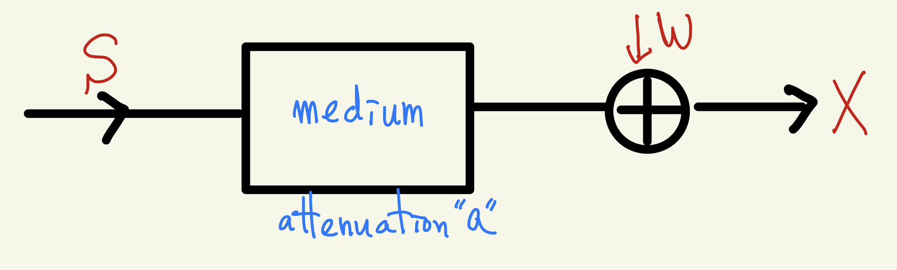
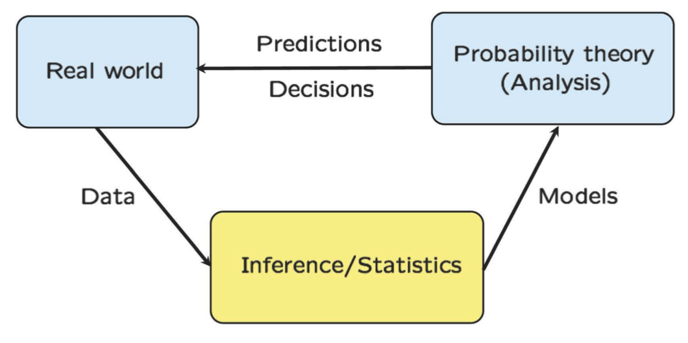
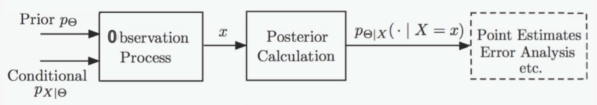
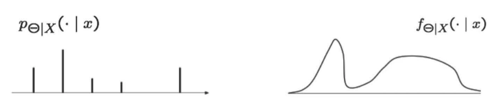
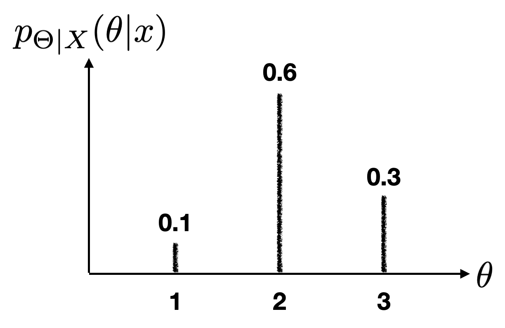
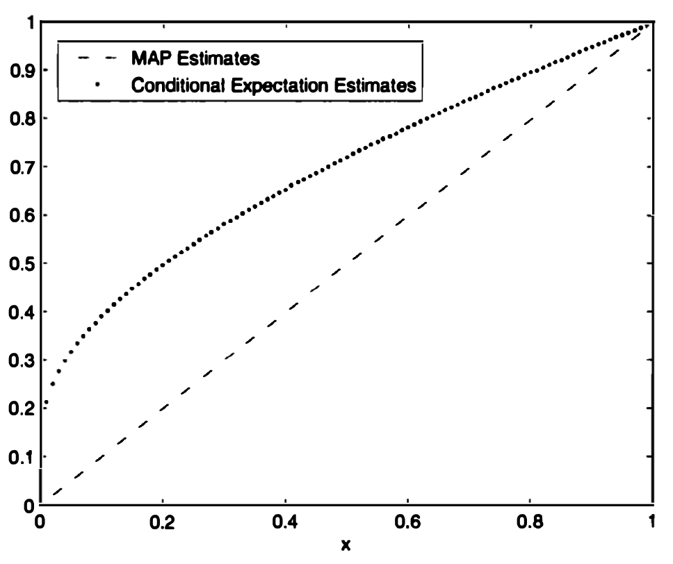
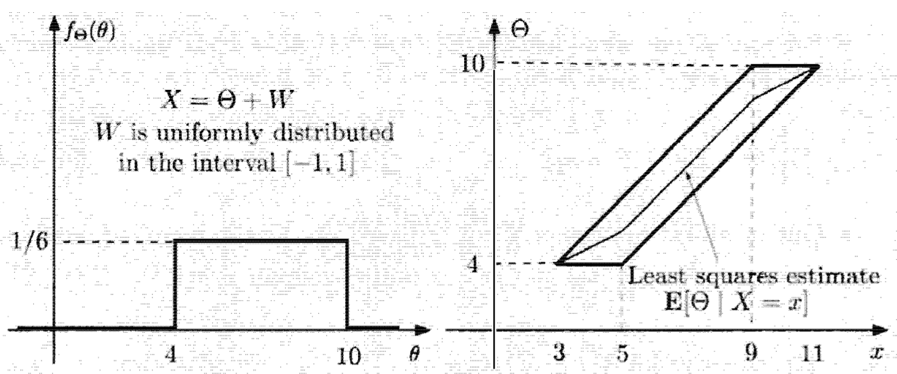
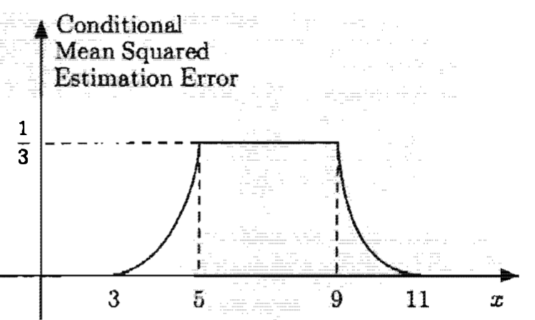
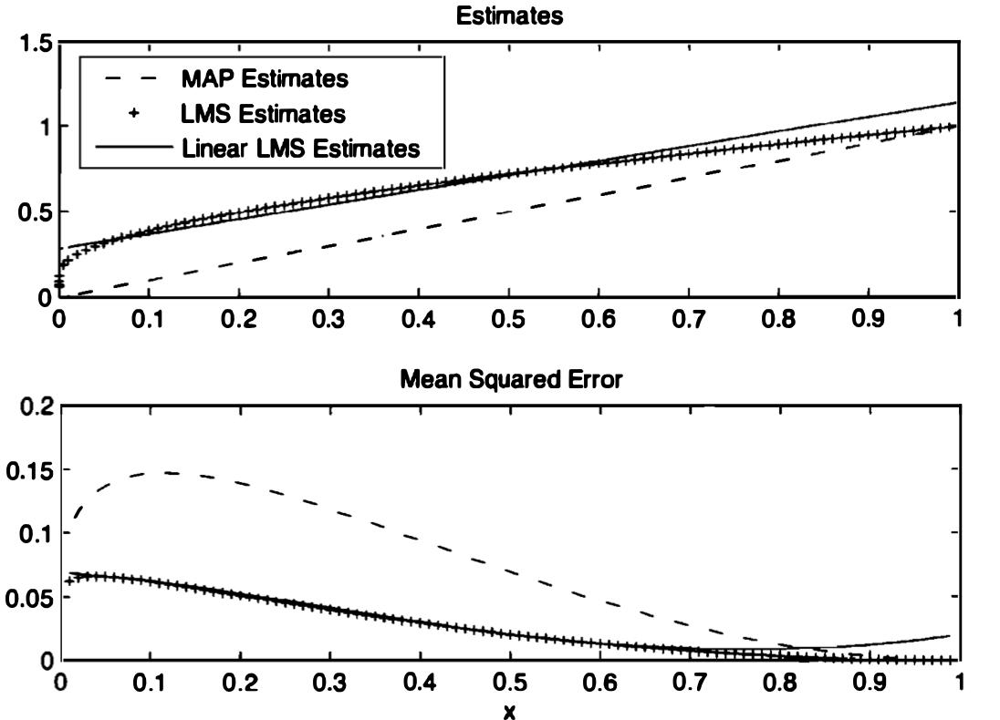
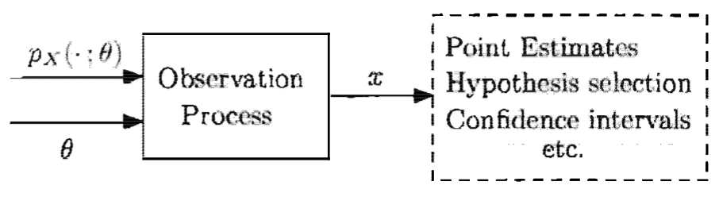

---
title: "Introduction to Statistical Inference"
author: 'Masanao Yajima'
output: learnr::tutorial
runtime: shiny_prerendered
---

```{css, echo=FALSE}
.bluebox {
  padding: 1em;
  background: SteelBlue;
  color: white;
  border: 2px solid orange;
  border-radius: 10px;
}
.center {
  text-align: center;
}

.infobox {
  padding: 1em 1em 1em 4em;
  margin-bottom: 10px;
  border: 2px solid orange;
  border-radius: 10px;
  background: #f5f5f5 5px center/3em no-repeat;
}

.question {
  background-image: url("images/question.png");
}
.info {
  background-image: url("images/info.png");
}
```

<script type="text/x-mathjax-config">
MathJax.Hub.Config({
  TeX: { equationNumbers: { autoNumber: "AMS" } }
});
</script> 

<div style="display:none">
  $
\def\dist{\sim\xspace}
\newcommand{\mat}[1]{\boldsymbol{#1}}
\newcommand{\rv}[1]{\underline{#1}} 
\newcommand{\Exp}[1]{\exp\left\{#1\right\}}
\newcommand{\Log}[1]{\log\left\{#1\right\}}
\newcommand{\eqv}{\;\Longleftrightarrow\;}
\newcommand{\bbexpect}[1]{\mathbb{E}\left[ #1 \right]}
\newcommand{\cexpect}[1]{\mathbb{E}( #1 )}
\newcommand{\E}[2][]{E_{#1}\left[#2\right]}
\newcommand{\V}[2][]{V_{#1}\left[#2\right]}
\newcommand{\cov}[2][]{\mathrm{Cov}_{#1}\left[#2\right]}
\newcommand{\corr}[2][]{\rho_{#1}\left[#2\right]}
  \newcommand{\norm}{N\left(\mu,\sigma^2\right)}
  \newcommand{\bexpect}[1]{\mathbb{E}\Bigl[ #1 \Bigr]}
\newcommand{\fx}{f_X(x)}
\newcommand{\Fx}{F_X(x)}
\newcommand{\fy}{f_Y(y)}
\newcommand{\Fy}{F_Y(y)}
\newcommand{\fz}{f_Z(z)}
\newcommand{\Fz}{F_Z(z)}
\newcommand{\fxA}{f_{X|A}(x)}
\newcommand{\fyA}{f_{Y|A}(y)}
\newcommand{\fzA}{f_{Z|A}(z)}
\newcommand{\fxy}{f_{X,Y}(x,y)}
\newcommand{\Fxy}{F_{X,Y}(x,y)}
\newcommand{\fxcy}{f_{X|Y}(x|y)}
\newcommand{\fycx}{f_{Y|X}(y|x)}
  \newcommand{\px}{p_X(x)}
\newcommand{\py}{p_Y(y)}
\newcommand{\pz}{p_Z(z)}
\newcommand{\pth}{p_{\Theta}(\theta)}
\newcommand{\pxA}{p_{X|A}(x)}
\newcommand{\pyA}{p_{Y|A}(y)}
\newcommand{\pzA}{p_{Z|A}(z)}
\newcommand{\pxy}{p_{X,Y}(x,y)}
\newcommand{\pxcy}{p_{X|Y}(x|y)}
\newcommand{\pycx}{p_{Y|X}(y|x)}
\newcommand{\cprob}[1]{\mathbb{P}( #1 )}
\newcommand{\cbprob}[1]{\mathbb{P}\left( #1 \right)}
\newcommand{\aleq}[1]{\begin{align*}#1\end{align*}}
\newcommand{\real}{{\mathbb R}}
\newcommand{\set}[1]{\{#1\}}
\newcommand{\Set}{\text}
\newcommand{\qed}{\blacksquare}
\newcommand{\comp}{\overline}
%%% definition
\newcommand{\eqdef}{\triangleq}
%%% imply
\newcommand{\imp}{\Longrightarrow}
\newcommand{\indep}{\perp \!\!\! \perp}
%normal colored text

\newcommand{\yellowf}[1]{{\color{yellow} #1}}
\newcommand{}[1]{{\color{blue} #1}}

\newcommand{}[1]{{\color{magenta} #1}}
\newcommand{}[1]{{\color{green} #1}}
\newcommand{\cyanf}[1]{{\color{cyan} #1}}
\newcommand{}[1]{{\color{orange} #1}}
\newcommand{\expect}[1]{\mathbb{E}[ #1 ]}
\newcommand{\bin}[1]{\textrm{Bin}\left(n,p\right)}
\newcommand{\dbin}[1]{\binom{n}{x}p^x\left(1-p\right)^{n-x}}
%%%% indicator
\newcommand{\indi}[1]{\mathbf{1}_{ #1 }}
% Bernoulli
\newcommandx\bern[1][1=p]{\textrm{Bern}\left({#1}\right)}
\newcommandx\dbern[2][1=x,2=p]{#2^{#1} \left(1-#2\right)^{1-#1}}
\newcommandx\pbern[2][1=x,2=p]{\left(1-#2\right)^{1-#1}}
% Binomial

% Multinomial
\newcommandx\mult[1][1={n,p}]{\textrm{Mult}\left(#1\right)}
\newcommandx\dmult[3][1=x,2=n,3=p]{\frac{#2!}{#1_1!\ldots#1_k!}#3_1^{#1_1}\cdots#3_k^{#1_k}}
% Hypergeometric
\newcommandx\hyper[1][1={N,m,n}]{\textrm{Hyp}\left({#1}\right)}
\newcommandx\dhyper[4][1=x,2=N,3=m,4=n]{\frac{\binom{#3}{#1}\binom{#2-#3}{#4-#1}}{\binom{#2}{#4}}}
% Negative Binomial
\newcommandx\nbin[1][1={r,p}]{\textrm{NBin}\left({#1}\right)}
\newcommandx\dnbin[3][1=x,2=r,3=p]{\binom{#1+#2-1}{#2-1}#3^#2(1-#3)^#1}
\newcommandx\pnbin[3][1=x,2=r,3=p]{I_#3(#2,#1+1)}

% Poisson
\newcommandx\pois[1][1=\lambda]{\textrm{Po}\left({#1}\right)}
\newcommandx\dpois[2][1=x,2=\lambda]{\frac{#2^#1 e^{-#2}}{#1!}}
\newcommandx\ppois[2][1=x,2=\lambda]{e^{-#2}\sum_{i=0}^#1\frac{#2^i}{i!}}
%%%% variance
\newcommand{\var}[1]{\text{var}[ #1 ]}
\newcommand{\bvar}[1]{\text{var}\Bigl[ #1 \Bigr]}
\newcommand{\cvar}[1]{\text{var}( #1 )}
\newcommand{\cbvar}[1]{\text{var}\Bigl( #1 \Bigr)}
  $
</div>


```{r setup, include=FALSE}
knitr::opts_chunk$set(echo = TRUE,message=FALSE,fig.align="center",fig.width=7,fig.height=2.5,out.width = "65%")
pacman::p_load(
       car
       , learnr
       , extraDistr
      , ggplot2
      , ggExtra
      , reshape2
      , corrplot
      , purrr
      , RColorBrewer
      , lubridate
      , mnormt
      , mvtnorm
      , MCMCpack
      )
```


```{r,echo=FALSE}
# Global parameter
show_code <- TRUE
```


## Overview on Statistical Inference

### What is Statistical Inference? 


- Examples

- Take 1000 voters uniformly at random, and count the popularity
  of each candidate to infer the true popularity.

- COVID-19 has spread over a collection of people, and we collect a sample of COVID-19
  infectees to infer the true source of infection. 

- When an original signal $S$ is transmitted over the KAIST Wi-Fi
  connection, the received signal $X$ becomes $X = aS + W,$ where $ 0 <
  a < 1  $ and $W \sim \set{N}(0,1).$ If we have 10 samples of $(S,X)$
  values, what is the inferred value of $a$?

 
```{r , echo=FALSE, out.width = '80%',fig.align="center"}

# \mypic{0.3}{L6_comm_ex.png}
```


- Process of extracting information about an {unknown variable} or
  an {unknown model} from {noisy available data}

% - Process of drawing conclusions about {population
%     parameters} based on
%   {noisy samples} taken from the {population}

  

### Statistical Inference: Three Main Ideas

- Samples are likely to be a good represetnation of the unknown

- There exists uncertainty (i.e., noise) as to how well the sample
  represents the unknown

- How to obtain samples has impact on inference (e.g., when we
  need to pay for online surveys)
  


### Inference, Real World, Probability Theory

```{r , echo=FALSE, out.width = '80%',fig.align="center"}

#\mypic{0.5}{L6_bigpicture.png}
```


{\scriptsize Source: Introduction to Probability course by MIT}
\end{center}

\vspace{-0.5cm}


- Inference

- Using data, probabilistic models or parameters for models are determined.

- Why building up models?

- Analysis is possible, so that predictions and decisions are made.

- Recently, deep learning

- Connecting big data and big model building


### What to Infer?: Unknown Model vs. Unknown Variable

```{r , echo=FALSE, out.width = '80%',fig.align="center"}

#\mypic{0.5}{L6_comm_ex.png}
```


- $X = aS + W$

- Model building

- know the original signal $S$, observe $X$
- infer the model parameter $a$


- Variable estimation

- know $a,$ observe $X$
- infer the original signal $S$


- Same mathematical structure, because the parameters in models are variables in many cases


### What Kind?: Hypothesis Testing vs. Estimation


- {Hypothesis testing}


- Unknown: a few possible ones
- Goal: small probability of incorrect decision
- {(Ex)} Something detected on the radar. Is it a bird or an airplane?


- {Estimation}

- Unknown: a value included in  an infinite,  typically continuous set
- Goal: Finding the value close to the true value
- {(Ex)} Biased coin with unknown probability of head $\theta \in [0,1]$. Data of heads and tails. What is $\theta$?
- {(Note)} If you have the candidate values of $\theta = \{1/4, 1/2, 3/4 \},$ then it's a hypothesis testing problem


### Different Views: Bayesian vs. Classical (1)

{- Biased coin with parameter $\theta$ (probability of head). Assume that $\theta \in \{1/4,3/4\}.$}

{- Throw the coin 3 times and get $(H,H,H).$ Goal: infer $\theta,$ $1/4$ or $3/4$?}


:::: {style="display: flex;"}
::: {.column width="50%"}


- Distribution of $\theta$ ({prior}) e.g.,
\aleq{
\cbprob{\theta = {3 \over 4}} = 1/2, \quad \cbprob{\theta = \frac{1}{4}} = 1/2
}
- Use Bayes' rule and find the {posterior}:
\aleq{
\bprob{\theta = \frac{3}{4} \Big | (HHH)}=\frac{27}{28}, \ \bprob{\theta = \frac{1}{4} \Big | (HHH)} = \frac{1}{28}
}
- Choose $\theta$ with larger posterior probability.

Bayesian approach


:::

::: {.column width="50%"}

- Find the probability of $(H,H,H),$ if $\theta=\frac{1}{4}$ or $\frac{3}{4}$ ({likelihood})
\aleq{
\bprob{ (HHH) | \theta=\frac{3}{4}} &= \lf(\frac{3}{4} \ri)^3 \\
\bprob{ (HHH) | \theta=\frac{1}{4}} &= \lf (\frac{1}{4} \ri)^3
}

- Choose $\theta$ with a larger likelihood.

Classical approach


:::
::::

{
{(Note)} There are other inference methods, and here we just show
examples.}


### Different Views: Bayesian vs. Classical (2) 

:::: {style="display: flex;"}
::: {.column width="50%"}
Bayesian approach

- Unknown: {random variable} with some distribution (prior)
- Unknown model as chosen randomly {from a give model class}
- Observed data $x$ gives:

  - posterior distribution $p_{\Theta | X}(\theta | x)$
- Choose $\theta$ with larger posterior probability {{(other methods exist)}}

:::
::: {.column width="50%"}

Classical approach

- Unknown: deterministic value
- Unknown model as one of multiple probabilistic models
- Observed data $x$ gives:

  - likelihood $p(X;\theta)$
- Choose $\theta$ with larger likelihood\\ 
(other methods exist)

:::
::::


### Different Views: Bayesian vs. Classical (3)


- Fundamental difference about the nature of unknown models or variables

- Random variable or deterministic quantity 

- Who is the winner? A century-long debate 
  
- Example of debate: mass of the electron by noisy measurement
  
- Classical: while unknown, it is a constant and there is no
  justification for modeling it as a random variable. 
  
- Bayesian:  Prior distribution reflects our state of knowledge,
  e.g., some range of candidate values from our previous noisy
  measurements. 
  
- Particular prior? too arbitrary vs. every statistical
  procedure's hidden choices  

- Pratical issues: Bayesian approach is often computationally
  intractable (multi-dimensional integrals)


## Bayesian Inference: Framework

### Framework of Bayesian Inference

```{r , echo=FALSE, out.width = '80%',fig.align="center"}

#\mypic{0.65}{L6_BI_framework.png}
```

:::: {style="display: flex;
::: {.column width=""}50%"}


- Unknown $\Theta$


- physical quantity or model parameter
- random variable
- prior distribution $p_{\Theta}$ and $f_{\Theta}$


- Observations or measurements $X$


- observation model $p_{X|\Theta}$ and $f_{X|\Theta}$

- That is, the joint distribution of $X$ and $\Theta$ ($p_{X,\Theta}(x,\theta)$ and $f_{X,\Theta}(x,\theta)$) is given
- Find the posterior distribution $p_{\Theta|X}$ and
  $f_{\Theta|X},$ using Bayes' rule.

  
:::

::: {.column width="50%"}

- The posterior distribution is the complete answer of the
  Bayesian inference.

- However, one may use it for further processing,
  depending on what he/she wants, e.g., point estimation. 
  
- Multiple observations and {multiple} parameters are possible
  
- $X = (X_1, \ldots, X_n)$
- $\Theta = (\Theta_1, \ldots, \Theta_n)$
  
:::
::::


### Remind: Bayes' Rule: 4 Versions 


  - $\Theta$: discrete, $X$: discrete
\aleq{
{\pthcx} & = \frac{\pth \pxcth}{\px}\\
\px &= \sum_{\theta'} p_\Theta(\theta')p_{X|\Theta}(x|\theta')
}
  - $\Theta$: continuous, $X$: continuous
\aleq{
{\fthcx} & = \frac{\fth \fxcth}{\fx}\\
\fx &= \int f_\Theta(\theta')f_{X|\Theta}(x|\theta') d\theta'
}

    
  - $\Theta$: discrete, $X$: continuous
    \aleq{
      {\pthcx} &= \frac{{\pth} {\fxcth}}{{\fx}}\\
      {\fx} &= \sum_{\theta'} {p_{\Theta}(\theta')} {f_{X|\Theta}(x|\theta')}
    }

  - $\Theta$: continuous, $X$: discrete
    \aleq{
      {\fthcx  } &= \frac{{\fth} { \pxcth }  }{{\px}} \\
      {\px} &= \int {f_{\Theta}(\theta')} {p_{X|\Theta}(x|\theta')} d\theta'
    }


## Examples
### Example: Romeo and Juliet, Single Observation


- Romeo and Juliet start dating, where  Romeo is late by $X \sim U[0,\theta].$
- Unknown: $\theta$ modeled by a rv $\Theta \sim U[0,1].$
- Observation: Romeo was late by $x.$
% - \question Given the observation sample $x$, what is $\hat{\theta}_\text{MAP}$? 
% - {Intuition.} As $x$ grows, $\hat{\theta}_\text{MAP}$
%   decreases or increases?  {{Increases. Why?}}

- Prior {and observation model (likelihood)}
  \aleq{
    {\fth =
      \begin{cases}
        1, & 0 \le \theta \le 1 \\
        0, & \text{otherwise}
      \end{cases},}
    \qquad 
    {\fxcth =
      \begin{cases}
        \frac{1}{\theta}, & 0 \le x \le \theta\\
        0, & \text{otherwise}
      \end{cases}}
  }
  
- Posterior
  \aleq{
    
    { \fthcx = \frac{\fth \fxcth}{\int_0^1 f_{\Theta}(\theta')f_{X|\Theta}(x | \theta') d\theta'}
      =}
    {
      \begin{cases}
        \frac{1/\theta}{\int_{x}^1 \frac{1}{\theta'} d\theta'} = \frac{1}{\theta |\log x|},&  x \le \theta \le 1, \\
        0, & \theta < x \text{ or } \theta >1
      \end{cases}
    }
  }
  


### Example: Romeo and Juliet, Multiple Observations

{\large $\circ$ What happens if we have more observation samples?}
  
  


- Romeo was late {$n$ times} by ${\vec{X}=(X_1,X_2, \ldots, X_n)}, \ X_i \sim U[0,\theta].$
- $X_1,\ldots, X_n$ are conditionally independent, given $\Theta = \theta.$
- Unknown: $\theta$ modeled by a rv $\Theta \sim U[0,1].$
- Observation: Romeo was late {$n$ times} by ${\vec{x} = (x_1, x_2, \ldots, x_n)}$
% - \question Given the observation sample $\vec{x}$, what is $\hat{\theta}_\text{MAP}$? 
% - {Intuition.} We will do more accurate inference due to
%   more observation samples. 
- See Example 8.2 at pp. 414 for more detailed treatment.   

  


### Example: Spam Filtering

- E-mail: {spam} (1) or {legitimate} (2), $\Theta  \in \{1,2\},$ with prior $p_{\Theta}(1)$ and  $p_{\Theta}(2).$

- $\{w_1, w_2, \ldots, w_n \}$: a collection of words which suggest ``spam".

- For each $i,$ a Bernoulli $X_i=1$ if $w_i$ appears and 0 otherwise.

- Observation model $p_{X_i|\Theta(x_i|1)}$ and
  $p_{X_i|\Theta(x_i|2)}$ are known.

- Assumption: Conditioned on $\Theta,$ $X_i$ are independent.
- Posterior PMF
 \aleq{
 \bprob{\Theta = m | (x_1,\ldots, x_n)} = \frac{p_{\Theta}(m) \prod_{i=1}^n p_{X_i|\Theta}(x_i|m)  }{
 \sum_{j=1,2} p_{\Theta}(j) \prod_{i=1}^n p_{X_i|\Theta}(x_i|j) 
 }, \quad m=1,2
}
% - MAP rule for this hypothesis testing problem. Decided that the message is {spam} if
% \aleq{
% p_{\Theta}(1) \prod_{i=1}^n p_{X_i|\Theta}(x_i|1) > p_{\Theta}(2) \prod_{i=1}^n p_{X_i|\Theta}(x_i|2)
% }


### Example: Biased Coin with Beta Prior (1) 


- Biased coin with probability of head $\theta$
- Unknown $\theta$: modeled by $\Theta$ with some prior $\fth$
- Observation $X$: number of heads out of $n$ tosses
% - Posterior PDF
% \aleq{
% f_{\Theta | X}(\theta | k) &= c \fth {p_{X|\Theta}(k | \theta)}= c {{n \choose k}} \fth {\theta^k(1-\theta)^{n-k}}, \ \text{$c$ the normalizing constant}
% }

- \question Suppose that you have freedom to choose the form of the prior
  distribution. What prior will you choose? {Requirement of ``good'' priors?}

- We will look at the prior whose distribution is something
  called the {Beta distribution}.


% \mytwocols{0.3}
% {
% \small
% }
% {
% \small
% 
% 

% -
% 
% }


### Background: Beta Distribution

%{If $\Theta \sim \text{Beta}(\alpha,\beta),$ what is $\hth_\MAP$?}

\myblock{Beta distribution}
{

A continuous rv $\Theta$ follows a beta distribution with integer parameters $\alpha,\beta >0,$ if
\aleq{
\fth =
\begin{cases}
\frac{1}{B(\alpha,\beta)} \theta^{\alpha -1}(1-\theta)^{\beta -1}, & 0< \theta < 1, \\
0, & \text{otherwise},
\end{cases}
}
where $B(\alpha,\beta)$, called Beta function, is a
  normalizing constant,given by
\aleq{
{B(\alpha,\beta)} = \int_0^1 \theta^{\alpha -1}(1-\theta)^{\beta -1} d\theta = \frac{(\alpha-1)! (\beta -1)!}{(\alpha + \beta-1)!}
}

}


- See \url{https://youtu.be/8yaRt24qA1M} for
  the integration in the Beta function formula.

- A special case of $\text{Beta}(1,1)$ is $U[0,1]$

  %- If $\Theta \sim Beta(\alpha,\beta),$ then $\Theta|\{X=k\} \sim Beta(k+\alpha,n-k+\beta)$

% - Very useful: Beta prior $\imp$ Beta posterior (homework problem)

% - MAP estimate
% \aleq{
% \hth_\MAP = \arg \max_{\theta} (k \log \theta + (n-k) \log (1-\theta))
% = \frac{k}{n}
% }

% - Conditional expectation estimate = $\frac{k+1}{n+2}$ (homework problem)


### Example: Biased Coin with Beta Prior (2)

\mycolorbox{

- If $\Theta \sim \text{Beta}(\alpha,\beta),$ then $\Theta|\{X=k\} \sim \text{Beta}({k}+\alpha,{n-k}+\beta)$
- In other words, Beta prior $\imp$ Beta posterior (why useful?)

}

-   First, the posterior pdf is given by:
$\displaystyle f_{\Theta | X}(\theta | k) = c {\fth} {p_{X|\Theta}(k | \theta)}= c {{n \choose k}} {\fth} {\theta^k(1-\theta)^{n-k}}, \ \text{$c$ the normalizing constant}
$

- Next, for $\displaystyle \text{Beta}(\alpha,\beta)$ prior,
$\displaystyle {\fth} = \frac{1}{B(\alpha,\beta)}\theta^{\alpha-1} (1-\theta)^{\beta
  -1}$.

- 
Then, 
$
\displaystyle \fthck= c {n \choose k} {\fth} \theta^k(1-\theta)^{n-k} = \frac{d}{B(\alpha,\beta)} \cdot {\theta^{\alpha+k-1}(1-\theta)^{\beta + n-k -1}},
$

where $d = c{n \choose k}.$
  


% 
% ### Example 3: Biased Coin with Beta Prior (3)

% \mycolorbox{
% 
% - If $\Theta \sim \text{Beta}(\alpha,\beta),$ then $\Theta|\{X=k\} \sim \text{Beta}({k}+\alpha,{n-k}+\beta)$
% - In other words, Beta prior $\imp$ Beta posterior (why useful?)
% - $\fthck \propto \theta^{\alpha+k-1}(1-\theta)^{\beta + n-k -1}$
% 
% }

% 
% 

% - MAP estimate: Taking the logarithm,
% \aleq{
% {\hth_\MAP &= \arg \max_{\theta} \Bl [(\alpha+k-1) \log \theta + (\beta + n-k+1) \log(1-\theta) \Bl ]
% &=\frac{\alpha + k -1}{\alpha + \beta -2 + n}}
% }

% - When $\alpha=\beta =1$ (i.e., $U[0,1]$ prior), {$\hth_\MAP = \frac{k}{n}$}


% 

% 


### Example: Parameter Inference with Normal Prior (1)

Inference of a parameter $\theta$

:::: {style="display: flex;"}
::: {.column width="50%"}

    
  - {Single} observation

  - $X$: noisy observation of $\theta$, modeled as:

    {$X = \theta + W$, where $W \sim \set{N}(0,\sigma^2)$}

  - Model $\theta$ with a rv $\Theta \sim \set{N}(x_0,\sigma_0^2)$
    (normal prior)
  - $\Theta$ and $W$ are indendent
    
  - \question Given an observation $x,$ what is the posterior $\fthcx$?
      
:::

::: {.column width="50%"}

    
  - {Multiple} $n$ observations

  - $n$ observations of $\theta$: $W_i \sim \set{N}(0,\sigma_i^2)$
{ 
    \aleq{
    X_1 &= \theta + W_1, \quad W_1 \sim \set{N}(0,\sigma_1^2)\\
       \vdots & \\
      X_n &= \theta + W_n, \quad  W_n \sim \set{N}(0,\sigma_n^2)
    }
}    

- Model $\theta$ with $\Theta \sim \set{N}(x_0,\sigma_0^2)$
  - $\Theta, W_1, \ldots, W_n$ are indendent
    
  - \question Given an observation $x,$ what is
    the posterior $\fthcx$? 

    - $X = (X_1, \ldots, X_n)$ and $x=(x_1, \ldots, x_n),$      
:::
::::


### Background: The PDF Form of Gaussian
{
  \mycolorbox{
  {Lemma.} Up to recaling, the pdf of the form
  $\displaystyle e^{-\frac{1}{2}(ax^2 -2bx +c)}$ is $\set{N}(\frac{b}{a},\frac{1}{a}).$  
}
}


- {(Rough) Proof.} Note that the pdf of $\set{N}(\mu,\sigma^2)$: $\displaystyle \fx =
  e^{-(x-\mu)^2/2\sigma^2}$ up to rescaling. Then,

  
- $\displaystyle - \frac{1}{2 \sigma^2} ( x^2 - 2\mu x + \mu^2) = -\frac{1}{2}(ax^2 -2bx +c)$
  
- Thus, $\sigma^2 = \dfrac{1}{a}$ and $\dfrac{\mu}{\sigma^2} = b
  \implies \mu = b \sigma^2 = \dfrac{b}{a}  $

  
  
  


### Background: Product of Two Gaussian Densities
\mycolorbox{
  \thm The product of two Gaussian pdfs $\set{N}(\mu_0,\nu_0)$ and
  $\set{N}(\mu_1,\nu_1)$ is $\displaystyle \set{N}\left(\frac{\nu_1\mu_0 + \nu_0\mu_1}{\nu_0 + \nu_1}, \frac{\nu_0\nu_1}{\nu_0+\nu_1} \right).$
}


 

-[{Proof.}] Using the Lemma in the previous slide, i.e.,
up to recaling, the pdf of the form $\displaystyle e^{-\frac{1}{2}(ax^2 -2bx +c)}$ is $\set{N}(\frac{b}{a},\frac{1}{a}),$  
\aleq{
&{\exp \left(-(x-\mu_0)^2/2\nu_0 \right) \times \exp\left(-(x-\mu_1)^2/2\nu_1\right)} \\
& {=\exp\left[-\frac{1}{2}\left(\Bl(\frac{1}{\nu_0} + \frac{1}{\nu_1}\Br)x^2 -2 \Bl(\frac{\mu_0}{\nu_0} + \frac{\mu_1}{\nu_1}\Br)x + c \right) \right ]} \\
& {\implies \set{N}\left(
\nu \left(\frac{\mu_0}{\nu_0} + \frac{\mu_1}{\nu_1}\right),
  \overbrace{\frac{1}{\nu_0^{-1} + \nu_1^{-1}}}^{= \nu}
\right)
= \set{N}\left(\frac{\nu_1\mu_0 + \nu_0\mu_1}{\nu_0 + \nu_1}, \frac{\nu_0\nu_1}{\nu_0+\nu_1} \right)}
}


### Background: Product of $n+1$ Gaussian Densities
\mycolorbox{
  \thm The product of $n+1$ Gaussian pdfs $\set{N}(\mu_0,\nu_0),$
  $\set{N}(\mu_1,\nu_1), \ldots,$ $\set{N}(\mu_n,\nu_n),$
  is $\displaystyle \set{N}(\mu,\nu),$ where
$$
{  \mu = \frac
    {\sum_{i=0}^n \frac{\mu_i}{\nu_i}}
    {\sum_{i=0}^n \frac{1}{\nu_i}},} \qquad
  {\nu =
    \frac{1}{\sum_{i=0}^n \frac{1}{\nu_i^2}}}
$$
}


### Example: Parameter Inference with Normal Prior (2)

    
    
  - $n$ observations of $\theta$: $W_i \sim
    \set{N}(0,\sigma_i^2),$ and $\theta$ with the normal prior $\Theta \sim \set{N}(x_0,\sigma_0^2)$
    \mycolorbox{
\centering
      $X_i = \theta + W_i, \quad W_i \sim \set{N}(0,\sigma_i^2),$ 
    $\quad i=1, \ldots, n$
    }

  - $\Theta, W_1, \ldots, W_n$ are indendent and
    let  $X = (X_1, \ldots, X_n),$ $x=(x_1, \ldots, x_n).$      

  - Our interest. The {poterior pdf} $\fthcx.$ 


    \medskip
  - {Prior.} $\displaystyle \fth = c_1\cdot \exp\left\{ -
        \frac{(\theta - x_0)^2}{2 \sigma_0^2}  \right\}$
- {Observation model.} Noting that $X_1, X_2, \ldots, X_n$
  are indpendent, 
  \aleq
  {
    \fxcth = c_2 \cdot \exp \left\{ -
        \frac{(\theta - x_1)^2}{2 \sigma_1^2} \right\}\cdots \exp \left\{ -
        \frac{(\theta - x_n)^2}{2 \sigma_n^2}\right\}
    }


### Example: Parameter Inference with Normal Prior (3) 

  \begin{textblock*}{\textwidth}(9cm,0.8\textheight)
    \mysizebox{0.44}{
       $\fthcx  = \frac{\fth \fxcth}{        \int f_\Theta(\theta')f_{X|\Theta}(x|\theta') d\theta' }$
     }
  \end{textblock*}


  
  
- {Numerator:} $\fth \fxcth = c_1c_2\cdot \exp \left\{ -
    \sum_{i=0}^n \frac{(x_i - \theta)^2}{2 \sigma_i^2}  \right\}$,
  which can be reexpressed as the following, using the {product of
  $n+1$ Gaussians}:
  \aleq{
c_1c_2\cdot \exp \left\{ -
  \sum_{i=0}^n \frac{(x_i - \theta)^2}{2 \sigma_i^2}  \right\} =
d\cdot 
\exp \left\{ -
    \frac{(\theta-m)^2}{2 v}  \right\},
  }
  where
$
\displaystyle
    m = \frac
    {\sum_{i=0}^n \frac{x_i}{\sigma_i^2}}
    {\sum_{i=0}^n \frac{1}{\sigma_i^2}}, \qquad v =
    \frac{1}{\sum_{i=0}^n \frac{1}{\sigma_i^2}}
$
  

- {Denominator:} just a constant, not a function of $\theta$
% - Thus, the posterior pdf $\displaystyle \fthcx = a \cdot \exp \left\{ -
%     \frac{(\theta=m)^2}{2 v}  \right\}$

  


### Example: Parameter Inference with Normal Prior (4) 
  % \begin{textblock*}{\textwidth}(9cm,0.75\textheight)
  %   \mysizebox{0.44}{
  %      $\fthcx  = \frac{\fth \fxcth}{        \int f_\Theta(\theta')f_{X|\Theta}(x|\theta') d\theta' }$
  %    }
  % \end{textblock*}

  
  
- Thus, the posterior pdf $\displaystyle \fthcx$ =
{
  $a \cdot \exp \left\{ -
    \frac{(\theta - m)^2}{2 v}  \right\},$ where
  $$
  m = \frac
  {\sum_{i=0}^n \frac{x_i}{\sigma_i^2}}
  {\sum_{i=0}^n \frac{1}{\sigma_i^2}}, \qquad v =
  \frac{1}{\sum_{i=0}^n \frac{1}{\sigma_i^2}}
  $$
 }
- {Prior: Normal, Posterior: Normal}

- Special case when ${\sigma^2} = \sigma_0^2= \sigma_1^2=
  \cdots = \sigma_n^2.$ Then,  
  $$
  m = \frac{x_0 + x_1 + \ldots x_n}{n+1}, \qquad v = \frac{\sigma^2}{n+1}
  $$
  
- the prior mean $x_0$ acts just as {another observation}.
- the standard deviation of the posterior goes to 0, at the
  rough rate of $1/\sqrt{n}.$
  

  


### Why Prior == Posteror is Useful?

  % \begin{textblock*}{\textwidth}(9cm,0.75\textheight)
  %   \mysizebox{0.44}{
  %      $\fthcx  = \frac{\fth \fxcth}{        \int f_\Theta(\theta')f_{X|\Theta}(x|\theta') d\theta' }$
  %    }
  % \end{textblock*}

  
  
  
- {Recursive inference} is possible.
  
- Suppose that after $X_1, \ldots, X_n$ are observed, an
  additional observation $X_{n+1}$ is observed.

- Instead of solving the inference problem from scratch, we can
  {view $f_{\Theta | X_1, \ldots, X_n}$ as our prior}, use the new
  observation to obtain the new posterior  $f_{\Theta | X_1, \ldots, X_n,X_{n+1}}$

- In the example of parameter inference with the Normal prior,
  with the new observation $x_{n+1} \sim \set{N}(x_{n+1},
  \sigma^2_{n+1})$, the posterior pdf is nothing but the Normal pdf of:
  \aleq
  {
{
    \text{{mean}} = \frac{(m/v) + (x_{n+1}/\sigma^2_{n+1})}{(1/v) +
      (1/\sigma^2_{n+1})}, \qquad
    \text{{variance}} = \frac{1}{(1/v) +
      (1/\sigma^2_{n+1})}
}
  }
  


## MAP (Maximum A Posteriori) Estimator

### Point Estimation 

```{r , echo=FALSE, out.width = '80%',fig.align="center"}

#\mypic{0.55}{L6_BI_framework.png}
```

```{r , echo=FALSE, out.width = '80%',fig.align="center"}

#\mypic{0.5}{L6_posterior.png}
```

- Point Estimate

-   Given observation $x$, which {single} value $\theta$ are you
  going to choose as your inference result? People often want just the
  summary and a simple answer. 

- Very often, $\theta$, our inference target, is by nature a
  single value, i.e., mass of the electron. 
  
% - Using the posterior distribution, apply one of the
%   {inferernce methods}
%   of estimating the final $\hat{\theta}.$ 

% - {Multiple} observations and {multiple} parameters are possible
%   
% -   Vectors: $X = (X_1, \ldots, X_n),$ $\Theta = (\Theta_1, \ldots, \Theta_n)$
%   

  


### Two Natural Point Estimates


```{r , echo=FALSE, out.width = '80%',fig.align="center"}

#\mypic{0.6}{L6_posterior.png}
```


% - Given observation $x$, which single value $\theta$ are you
%   going to choose as your inference result?

-[M1.] Choose the {largest}: Maximum a posteriori probability (MAP) rule

\begin{center}
$
\hat{\theta}_{\text{MAP}} =  \arg \max_{\theta} p_{\Theta | X}(\theta | x), \quad \hat{\theta}_{\text{MAP}} =  \arg \max_{\theta} f_{\Theta | X}(\theta | x)
$
\end{center}

-[M2.] Choose the {mean}: Conditional expectation, aka LMS (Least Mean Square)

\begin{center}

$\hat{\theta}_{\text{LMS}} = \expect{\Theta | X=x}$

\end{center}

- Why MAP and LMS are good? Not mathematically clear yet (We
  will discuss later)

- Notation: The community uses $\hat{\theta}$ to mean the
  estiamted value, i.e., {hat} for estimated value.   

  % - Estimate as a number: $\hat{\theta} = g(x)$

% - Estimator as a random variable number: $\hat{\Theta} = g(X)$

% - Any theoretical support for optimality of MAP and LMS in some sense?

% - discuss later


### Estimator as a Function


- Random observation: $X$ 

- Observation instance: $x$

- {Estimate} as a mapping from $x$ to a number
$$\hth = g(x),\quad \hth_\MAP = g_\MAP(x),\quad \hth_\LMS = g_\LMS(x)$$

- {Estimator} as a mapping from $X$ to a random variable
$$\hTH = g(X), \quad \hTH_\MAP = g_\MAP(X), \quad \hTH_\LMS = g_\LMS(X)$$

% - Any theoretical support for optimality of MAP and LMS in some sense?

% - discuss later


###{}

  {\Large From now on we focus on the MAP estimate, mainly based on the
  examples that we've discussed in the previous section.} 


### Example: Romeo and Juliet 


- Romeo and Juliet start dating, where 
Romeo is late by $X \sim U[0,\theta].$
- Unknown: $\theta$ modeled by a rv $\Theta \sim U[0,1].$
- Observation: Romeo was late by $x.$
- \question Given the observation sample $x$, what is $\hat{\theta}_\text{MAP}$? 
- {Intuition.} As $x$ grows, $\hat{\theta}_\text{MAP}$
  decreases or increases?  {Increases. Why?}

% - Prior and observation model (likelihood)
%   \aleq{
%     {\fth =
%       \begin{cases}
%         1, & 0 \le \theta \le 1 \\
%         0, & \text{otherwise}
%       \end{cases},}
%     \qquad 
%     {\fxcth =
%       \begin{cases}
%         \frac{1}{\theta}, & 0 \le x \le \theta\\
%         0, & \text{otherwise}
%       \end{cases}}
%   }
  
- Posterior:    $
    \displaystyle
     \fthcx = 
      \begin{cases}
        \frac{1}{\theta |\log x|},&  x \le \theta \le 1, \\
        0, & \theta < x \text{ or } \theta >1
      \end{cases}
      $

    - Given $x,$ $\fthcx$ is decreasing in $\theta$ over $[x,1].$
$\implies $ {$\hat{\theta}_{\text{MAP}} = x.$}


% 
% ### Example 1: Romeo and Juliet (2) 
% 
% 

% - MAP estimate

%   
% - Given $x,$ $\fthcx$ is decreasing in $\theta$ over $[x,1].$
% $\implies $ {$\hat{\theta}_{\text{MAP}} = x.$}
%   
  
% - Conditional expectation estimate
%   
% -[]
% \vspace{-0.5cm}
%   \aleq{
% {\hat{\theta}_{\text{LMS}}} = \expect{\theta | X=x} = \int_{x}^1 \theta \frac{1}{\theta |\log x|} d\theta  = {(1-x)/|\log x|}
% }
%   


% {\mypic{0.3}{L6_romeo_juliet.png}}
% 


% 

% 
% ### Example 1: Romeo and Juliet (3)

% {\large $\circ$ What happens if we have more observation samples?}
  
  

% 
% 
% - Romeo was late {$n$ times} by ${\vec{X}=(X_1,X_2, \ldots, X_n)}, \ X_i \sim U[0,\theta].$
% - $X_1,\ldots, X_n$ are conditionally independent, given $\Theta = \theta.$
% - Unknown: $\theta$ modeled by a rv $\Theta \sim U[0,1].$
% - Observation: Romeo was late {$n$ times} by ${\vec{x} = (x_1, x_2, \ldots, x_n)}$
% - \question Given the observation sample $\vec{x}$, what is $\hat{\theta}_\text{MAP}$? 
% - {Intuition.} We will do more accurate inference due to
%   more observation samples. 
% - Refer to the answers in Example 8.2 at pp. 414.  

%   

% 


### Example: Spam Filtering

\hfill \lecturemark{Slide 18 for more details}
  

- E-mail: {spam} (1) or {legitimate} (2), $\Theta  \in \{1,2\},$ with prior $p_{\Theta}(1)$ and  $p_{\Theta}(2).$

- $\{w_1, w_2, \ldots, w_n \}$: a collection of words which suggest ``spam".

- For each $i,$ a Bernoulli $X_i=1$ if $w_i$ appears and 0 otherwise.

- Assumption: Conditioned on $\Theta,$ $X_i$ are independent.

- Posterior PMF
 \aleq{
 \bprob{\Theta = m | (x_1,\ldots, x_n)} = \frac{p_{\Theta}(m) \prod_{i=1}^n p_{X_i|\Theta}(x_i|m)  }{
 \sum_{j=1,2} p_{\Theta}(j) \prod_{i=1}^n p_{X_i|\Theta}(x_i|j) 
 }, \quad m=1,2
}
- MAP rule for this hypothesis testing problem. Decided that the message is {spam} if
\aleq{
p_{\Theta}(1) \prod_{i=1}^n p_{X_i|\Theta}(x_i|1) > p_{\Theta}(2) \prod_{i=1}^n p_{X_i|\Theta}(x_i|2)
}


### Example: Biased Coin with Beta Prior

\hfill \lecturemark{Slide 21 for more details}

  


- Biased coin with probability of head $\theta$
- Unknown $\theta$: modeled by $\Theta$ with some prior $\fth$
- Observation $X$: number of heads out of $n$ tosses
\mycolorbox{

- If $\Theta \sim \text{Beta}(\alpha,\beta),$ then $\Theta|\{X=k\} \sim \text{Beta}({k}+\alpha,{n-k}+\beta)$
- $\fthck \propto \theta^{\alpha+k-1}(1-\theta)^{\beta + n-k -1}$
  
}
- MAP estimate: Taking the logarithm,
\aleq{
\hth_\MAP &= \arg \max_{\theta} \Bl [(\alpha+k-1) \log \theta + (\beta + n-k+1) \log(1-\theta) \Bl ]
&={\frac{\alpha + k -1}{\alpha + \beta -2 + n}}
}

- When $\alpha=\beta =1$ (i.e., $U[0,1]$ prior), {$\hth_\MAP = \frac{k}{n}$}


### Example: Parameter Inference with Normal Prior 

\hfill \lecturemark{Slide 27 for more details}


- The posterior pdf $\displaystyle \fthcx = a \cdot \exp \left\{ -
    \frac{(\theta - m)^2}{2 v}  \right\},$ where
  $$
  m = \frac
  {\sum_{i=0}^n \frac{x_i}{\sigma_i^2}}
  {\sum_{i=0}^n \frac{1}{\sigma_i^2}}, \qquad v =
  \frac{1}{\sum_{i=0}^n \frac{1}{\sigma_i^2}}
  $$


- The pdf is normal, so it is maximized when $\theta =
  \text{mean}.$

- Thus, {$\hat{\theta}_\map = m$}.

  


% 
% ###Example 3: Biased Coin with Beta Prior (3)

% \mycolorbox{
% 
% - If $\Theta \sim \text{Beta}(\alpha,\beta),$ then $\Theta|\{X=k\} \sim \text{Beta}({k}+\alpha,{n-k}+\beta)$
% - In other words, Beta prior $\imp$ Beta posterior (why useful?)
% - $\fthck \propto \theta^{\alpha+k-1}(1-\theta)^{\beta + n-k -1}$
% 
% }

% 
% 

% - MAP estimate: Taking the logarithm,
% \aleq{
% {\hth_\MAP &= \arg \max_{\theta} \Bl [(\alpha+k-1) \log \theta + (\beta + n-k+1) \log(1-\theta) \Bl ]
% &=\frac{\alpha + k -1}{\alpha + \beta -2 + n}}
% }

% - When $\alpha=\beta =1$ (i.e., $U[0,1]$ prior), {$\hth_\MAP = \frac{k}{n}$}


% % - MAP estimate
% % \aleq{
% % \hth_\MAP = \arg \max_{\theta} (k \log \theta + (n-k) \log (1-\theta))
% % = \frac{k}{n}
% % }

% % - Conditional expectation estimate = $\frac{k+1}{n+2}$ (homework problem)

% 

% 


### Why MAP Is Good? (1)


- MAP estimate is intuitive, but we need more mathematical
  evidence for its performance guarantee. We would trust its quality
  if it is {optimal in some sense}. 

  \mytwocols{0.65}
  {
    
    
```{r , echo=FALSE, out.width = '80%',fig.align="center"}

#\mypic{0.7}{L6_map_ex.png}
```

    
- MAP: $\hat{\theta}_\map = 2$
    
  }
  {
    \small
    
    
  - Given $X=x,$ $\theta$ that minimizes the probability of
    incorrect decision?
    $$
    \hth_\map = \arg \min_{\hat{\theta} = 1, 2, 3} \cprob{\hth \neq \Theta| X=x}
    $$

  - Average probability of incorrect decision
    \aleq{
     \cprob{\hat{\Theta} \neq \Theta} &= \sum_{x}\cprob{\hat{\Theta} \neq
        \Theta| X=x} \px \\
      &= \sum_{x}\cprob{\hat{\theta} \neq
        \Theta| X=x} \px\\
      & {\ge} \sum_{x}\cprob{{\hth_\map} \neq
        \Theta| X=x} \px
    }
    
    
  }

  


### Why MAP Is Good? (2)

\mycolorbox{


- {Claim 1.} {For a given $x,$} the MAP rule minimizes the probability of an incorrect decision.

- {Claim 2.} The MAP rule minimizes the overall probability of an incorrect decision, {averaged over $x.$ }

}


% - MAP estimate is intuitive, but we need more mathematical
%   evidence for its good inference quality. 


- {Proof.}
Let $I$ and $I_\map$ be the indicator rv, representing
  the correct decision by any general estimator and the MAP estimator, respectively.
\aleq{
\expect{I | X=x}=
\bprob{g(X) = \Theta | X=x} \le 
\bprob{g_\map (X) = \Theta | X=x} =
\expect{I_\map|X=x}
}
Thus, Claim 1 holds. We now take the expectation of the above equations, the law of iterated expectations leads to Claim 2.


## LMS (Least Mean Squares) Estimator
 
### Other Estimate than MAP?
  

  
- MAP: the estimate which maximizes the posterior pdf,
  which solves the following optimization problem (minimizing the prob. of incorrect decision):
  \mycolorbox{
    \centering   
    $\displaystyle \min_{\hat{\theta}} \bprob{\Theta \neq \hth | X = x}$
  }
  
-  What about applying other objective function? Like the
  following one (mean squared error)?

  \mycolorbox{
    \centering   
$\displaystyle \min_{\hat{\theta}} \bexpect{(\Theta - \hat{\theta})^2 | X=x}$
  }


- Least Mean Square (LMS) Estimate 

  


### What's the Form?: LMS Estimator (1)


- Unknown: $\theta$ modeled by $\Theta$ with prior
  $f_{\Theta}(\cdot).$ Assume $\Theta \sim  U[4,10].$

- Assume that {no observations} available

- MAP estimate

  - Any value $\hat{\theta}_{\map} \in [4,10]$ (why? posterior = prior), not very useful

- What is the other choice?

- Expectation: {$\hat{\theta} = \expect{\Theta} = 7$}

- looks reasonable, but why?

- First, it makes sense, but, second, it also minimizes the mean squared error (MSE)
\small
\aleq{
\min_{\hat{\theta}} \bexpect{(\Theta - \hat{\theta})^2} = \min_{\hat{\theta}}
\lf ( \cvar{\Theta - \hat{\theta}} + \Bl(\expect{\Theta - \hat{\theta}}\Bl)^2 \ri )=  \min_{\hat{\theta}} \lf ( \cvar{\Theta} + \Bl(\expect{\Theta - \hat{\theta}}\Bl)^2 \ri )
}

- minimized when $\hat{\theta} = \expect{\Theta}.$

%- Why this conditional expectation estimate is also called LMS (Least Mean Squares) estimator


### What's the Form?: LMS Estimator (2)

- Unknown: $\theta$ modeled by $\Theta$ with prior $f_{\Theta}(\cdot).$

- Observation $X=x$ with model $f_{X|\Theta}(x|\theta)$

- Minimizing conditional mean squared error

$$
\min_{\hat{\theta}} \bexpect{(\Theta - \hat{\theta})^2 | X=x}
$$


- minimized when $\hat{\theta} = \expect{\Theta | X=x}.$
-  LMS estimator $\hat{\Theta} = \expect{\Theta | X}$

- What is the mean squared error of the LMS estimate?

- When $X=x$, $\bexpect{\big(\Theta - {\expect{\Theta | X=x}} \big)^2 | X=x} = \cbvar{\Theta | X=x}$
- Averaged over $X$: $\bexpect{(\Theta - \expect{\Theta | X}
    )^2} =  \bexpect{\cvar{\Theta | X}}$


### Example: Romeo and Juliet

- Romeo and Juliet start dating, where 
Romeo is late by $X \sim U[0,\theta].$
- Unknown: $\theta$ modeled by a rv $\Theta \sim U[0,1].$
- Observation: Romeo was late by $x.$
  
- Posterior:    $
    \displaystyle
     \fthcx = 
      \begin{cases}
        \frac{1}{\theta |\log x|},&  x \le \theta \le 1, \\
        0, & \theta < x \text{ or } \theta >1
      \end{cases}
      $

      \mytwocols{0.4}
      {
        \small
        
        
        
      - $\hat{\theta}_{\text{MAP}} = x.$
        
      - {LMS estimator:}


        $\displaystyle \hat{\theta}_{\text{LMS}} = \expect{\theta | X=x} = \int_{x}^1 \theta \frac{1}{\theta |\log x|} d\theta        = {(1-x)/|\log x|}$
        
      }

```{r , echo=FALSE, out.width = '80%',fig.align="center"}

#{\mypic{0.55}{L6_romeo_juliet.png}}
```


### Example: Biased Coin with Beta Prior


- Biased coin with prob. of head $\theta.$ Unknown $\theta$ modeled by $\Theta$ with prior $\fth.$
- Observation $X$: number of heads out of $n$ tosses
- If $\Theta \sim \text{Beta}(\alpha,\beta),$ then $\Theta|\{X=k\} \sim \text{Beta}({k}+\alpha,{n-k}+\beta)$

\medskip
  \myvartwocols{0.5}{0.3}{0.6}
  {

  - MAP estimate

    \medskip
    $\displaystyle {\hth_\MAP} = {\frac{\alpha + k -1}{\alpha + \beta -2 + n}}$
    
  - For $\alpha=\beta =1$

    ($U[0,1]$ prior),

    \medskip
    {$\displaystyle \hth_\MAP = \frac{k}{n}$}
    
  }
  {
    \small
    
  - {Fact.} If $\Theta \sim \text{Beta}(\alpha,\beta),$
    \aleq{
      \expect{\Theta} &= \frac{1}{B(\alpha,\beta)} \int_0^1 \theta \theta^{\alpha-1}(1-\theta)^{\beta-1} d\theta = \frac{B(\alpha+1,\beta)}{B(\alpha,\beta)} = \frac{\alpha}{\alpha+\beta}
    }
    
  - LMS estimate:     $\displaystyle {\expect{\Theta|
        X=k}} = \frac{k+\alpha}{k+\alpha + n -k +\beta} =
    {\frac{k+\alpha}{\alpha + \beta + n}}$

  - For $\alpha=\beta =1$ ($U[0,1]$ prior):   $\displaystyle {\expect{\Theta| X=k} = \frac{k+1}{n+2}}$
    
    
  }


% 
% ### Example: Biased Coin with Beta Prior (2)

% 
% 

% %- {Remind.} If $\Theta \sim Beta(\alpha,\beta),$ then $\Theta|\{X=k\} \sim Beta(k+\alpha,n-k+\beta)$

% - {Fact.} If $\Theta \sim \text{Beta}(\alpha,\beta),$
% \aleq{
% \expect{\Theta} &= \frac{1}{B(\alpha,\beta)} \int_0^1 \theta \theta^{\alpha-1}(1-\theta)^{\beta-1} d\theta = \frac{B(\alpha+1,\beta)}{B(\alpha,\beta)} = \frac{\alpha}{\alpha+\beta}
% }
% - Using the above fact,
% \aleq{
% \expect{\Theta| X=k} = \frac{k+\alpha}{k+\alpha + n -k +\beta} = \frac{k+\alpha}{\alpha + \beta + n}
% }
% - For $\alpha=\beta=1$ ($\Theta = Uniform[0,1]$),
% \aleq{
% \expect{\Theta| X=k} = \frac{k+1}{n+2}
% }


% % \aleq{
% % \fthck&= d \cdot \theta^{\alpha+k-1}(1-\theta)^{\beta + n-k -1}
% % }

% % - Using, $\int_0^1 \theta^{\alpha -1}(1-\theta)^{\beta -1} d\theta = \frac{(\alpha-1)! (\beta -1)!}{(\alpha + \beta-1)!}$
% % \aleq{
% % \expect{\Theta | X=k} &= \int_{0}^1 \theta \fthck d\theta = d\cdot \int_{0}^1
% % \theta^{\alpha+k}(1-\theta)^{\beta + n-k -1} d\theta \\
% % &=
% % }

% % - MAP estimate
% % \aleq{
% % \hth_\MAP = \arg \max_{\theta} (k \log \theta + (n-k) \log (1-\theta))
% % = \frac{k}{n}
% % }

% % - Conditional expectation estimate = $\frac{k+1}{n+2}$ (homework problem)

% 

% 


### Example: Parameter Inference with Normal Prior

- The posterior pdf $\displaystyle \fthcx = a \cdot \exp \left\{ -
    \frac{(\theta - m)^2}{2 v}  \right\},$ where
  $$
  m = \frac
  {\sum_{i=0}^n \frac{x_i}{\sigma_i^2}}
  {\sum_{i=0}^n \frac{1}{\sigma_i^2}}, \qquad v =
  \frac{1}{\sum_{i=0}^n \frac{1}{\sigma_i^2}}
  $$


- The pdf is normal, so it is maximized when $\theta =
  \text{mean}.$

- Thus, {$\hat{\theta}_\map = m$}.

- What is the LMS esitmate?  
  $$
  {\hat{\theta}_{\lms} = \expect{\Theta | X = x} = m}
  $$

  


### Example: Signal Recovery from Noisy Measurement (1)


- Send signal $\theta$ with the uniform noise $W \sim
  U[-1,1].$ Observe $X$

- $X = \Theta + W,$ where model $\theta$ with $\Theta \sim U[4,10]$

% $$
% X = \Theta + W
% $$
- Given $\Theta = \theta,$ $X = \theta + W \sim U[\theta-1, \theta+1].$
\aleq{
f_{\Theta, X}(\theta,x) = \fth \fxcth =
\begin{cases}
\frac{1}{6} \cdot \frac{1}{2} = \frac{1}{12}, & \text{if } 4\le \theta \le 10, \ \theta -1 \le x \le \theta +1, \\
0, & \text{otherwise}
\end{cases}
}

\myvartwocols{0.35}{0.4}{0.57}
{
\bigskip
$\hth_\LMS = \expect{\Theta | X=x}$:  {midpoint} of the corresponding vertical section}
{


```{r , echo=FALSE, out.width = '80%',fig.align="center"}

#{\mypic{0.9}{L6_lms_ex1.png}}
```


### Example: Signal Recovery from Noisy Measurement (2)


- What is conditional MSE? $\bexpect{(\Theta - \expect{\Theta | X=x})^2 | X=x}$

- Given $X=3,$ it's the variance of $U[4,4]$ = 0

- Given $X=5,$ it's the variance of $U[4,6]$ = $(6-4)^2/12 = 1/3$

 - The rising pattern between $X=3$ and $X=5$ is quadratic. This is
   because the expectation increases linearly, where the variance
   increases in a quadratic manner.  

```{r , echo=FALSE, out.width = '80%',fig.align="center"}

#\mypic{0.35}{L6_lms_ex2.png}
```


% 
% ### Example 2


% - Unknown: $\Theta \sim Uniform[4,10]$

% - Observe $\Theta$ with random error $W$ as $X.$ $W \sim Uniform[-1,1]$
% $$
% X = \Theta + W
% $$
% - Given $\Theta = \theta,$ $X = \theta + W \sim Uniform[\theta-1, \theta+1].$
% \aleq{
% f_{\Theta, X}(\theta,x) = \fth \fxcth =
% \begin{cases}
% \frac{1}{6} \cdot \frac{1}{2} = \frac{1}{12}, & \text{if } 4\le \theta \le 10, \ \theta -1 \le x \le \theta +1, \\
% 0, & \text{otherwise}
% \end{cases}
% }

% \mypic{0.5}{L6_lms_ex1.png}
% \mypic{0.35}{L6_lms_ex2.png}

% $$
% \min_{\hat{\theta}} \bexpect{(\Theta - \hat{\theta})^2 | X=x}
% $$

% 
% - minimized when $\hat{\theta} = \expect{\Theta | X=x}.$
% -  LMS estimator $\hat{\Theta} = \expect{\Theta | X}$
% 

% - Performance (MSE: Mean Squared Error)
% 
% - When $X=x$, $\bexpect{(\Theta - \expect{\Theta | X=x} )^2 | X=x} = \cbvar{\Theta | X=x}$
% - Averaged over $X$: $\bexpect{(\Theta - \expect{\Theta | X} )^2} = \bexpect{\cvar{\Theta | X=x}}$
% 

% 

% 


### Hardness of LMS Estimation

\aleq
{
\fthcx &= \frac{\fth \fxcth}{ \fx}\\
\fx &= \int f_{\Theta}(\theta') f_{X | \Theta}(x | \theta') d\theta'
}


- Observation model $\fxcth$ may not be always available

- Finding the posterior distribution is hard for multi-dimensional $\Theta$

- $\Theta$ is very often high-dimensional, especially in the era of big data and deep learning

- {\small AlexNet in image recognition: {61M} parameters}

- {\small GPT-3 in natural language processing: {175B} parameters}


- Any alternative to LMS estimator?


## LLMS (Linear LMS) Estimator
  
### Linear LMS (LLMS) Estimator: Approach


- Give up optimality, but choose a simple, but good one.

- General estimators $\hat{\Theta} = g(X)$, LMS estimator $\hat{\Theta}_{LMS} = \expect{\Theta | X}$

- We consider a restricted class of $g(X)$

  
- Estimator: $\hat{\Theta} =aX +b$.
- Estimate: Given $X = x,$ $\hat{\theta} =ax +b$.
  


- Our goal is to try our best within this restricted class:
  $$
\min_{a,b} \bexpect{(\Theta - aX -b)^2| X=x}, \qquad \min_{a,b} \bexpect{(\Theta - aX -b)^2}
$$

- Linear models are always the first choice for a simple design in engineering.


### LLMS Estimator: Result and Interpretation

{
\myblock{LLMS}
{
\aleq
{
\hat{\Theta}_{L} =\cexpect{\Theta} + \frac{\cov{\Theta,X}}{\cvar{X}}\Bl(X - \cexpect{X}\Bl)
=\cexpect{\Theta} + \rho \frac{\sigma_{\Theta}}{\sigma_{X}}\Bl(X - \cexpect{X}\Bl),
}
where the correlation coefficient $\rho =
\frac{\cov{\Theta,X}}{\sigma_\Theta \sigma_X}.$
}
}


- {No need of distributions} on $\Theta$ and $X$: only means, variances, and covariances


\mytwocols{0.25}
{


  
- If $\rho >0:$


- Baseline ($\expect{\Theta}$) + correction term

- If $X > \expect{X}$ $\imp$ $\hat{\Theta}_L > \expect{\Theta}$

- If $X < \expect{X}$ $\imp$ $\hat{\Theta}_L < \expect{\Theta}$

}
{


- If $\rho =0$ (uncorrelated):

- Just baseline ($\expect{\Theta}$)

- $\hat{\Theta}_L = \expect{\Theta}$

- No use of data $X$


}


### LLMS Estimator: Mean Squared Error

 \begin{textblock*}{\textwidth}(9cm,0.8\textheight)
    \mysizebox{0.44}{
       $\hat{\Theta}_{L} = \cexpect{\Theta} + \rho \frac{\sigma_{\Theta}}{\sigma_{X}}\Bl(X - \cexpect{X}\Bl)$
     }
  \end{textblock*}
  

  
- MSE $\expect{(\hat{\Theta}_L - \Theta)^2}$?
  
  
  - Assume   $\expect{\Theta} = \expect{X}=0$ (for
    simplicity). Then, MSE = $\bexpect{(\Theta - \rho \frac{\sigma_\Theta}{\sigma_X} X)^2}$
  - Note that $\var{\Theta} = \sigma^2_\Theta =
    \cexpect{\Theta^2}$ and  $\var{X} = \sigma^2_X =
    \cexpect{X^2}$

    \aleq{
      \bexpect{(\Theta -
          \rho\frac{\sigma_\Theta}{\sigma_X} X)^2} &= \cvar{\Theta -
          \rho\frac{\sigma_\Theta}{\sigma_X} X} \\
      &=
      \cvar{\Theta} + \Big(\rho\frac{\sigma_\Theta}{\sigma_X} \Big)^2 \cvar{X}
      - 2\Big(\rho\frac{\sigma_\Theta}{\sigma_X}\Big) \cov{\Theta,X}}
      = (1-\rho^2) \var{\Theta}
    
  % - $\cov{\Theta,X} = \cexpect{\Theta X}$ and $\cvar{\Theta} = \cexpect{\Theta^2}$


% - $\bexpect{(\hat{\Theta}_{\text{L}} - \Theta)^2} = \bexpect{(\Theta - \rho \frac{\sigma_\Theta}{\sigma_X} X)^2} =
%   (1-\rho^2) \var{\Theta} $

- Uncertainty about $\Theta$ after observation {decreases} by the factor of {$1-\rho^2$}


- What happens if $|\rho|=1$ or $\rho=0$?


  

%\medskip


### Linear LMS (LLMS) Estimator: Proof

  \small
  \begin{align}
    \hat{\Theta}_{L} &= \cexpect{\Theta} + \frac{\cov{\Theta,X}}{\cvar{X}}\Bl(X - \cexpect{X}\Bl)\label{eq:1} \\
&= \cexpect{\Theta} + \rho \frac{\sigma_{\Theta}}{\sigma_{X}}\Bl(X - \cexpect{X}\Bl) \label{eq:2}
\end{align}

\vspace{-0.2cm}
\mytwocols{0.6}
{
\small

\aleq{
\min_{a,b} \text{ERR}(a,b) = \min_{a,b} \bexpect{(\Theta - aX -b)^2}
}

- Assume $a$ was found.
\aleq
{
\bexpect{(Y -b)^2}, \quad Y= \Theta - aX
}

\vspace{-0.3cm}
- Minimized when $b = \cexpect{Y} = \cexpect{\Theta} - a
  \cexpect{X}.$ \hfill \lecturemark{\scriptsize Slide pp. 43}
\begin{align}
&\text{ERR}(a,b) = \expect{(Y - \expect{Y})^2} = \cvar{Y} \nonumber \\
&=\var{\Theta} + a^2 \var{X} -2a \cov{\Theta, X} \label{eq:3}
\end{align}
}
{
\small

- \eqref{eq:3} is minimized when $a = \frac{\cov{\Theta,X}}{\var{X}}.$
Then,
\aleq{
\hat{\Theta}_{L} &= aX + b = aX + \cexpect{\Theta} - a \cexpect{X}\\
& = \cexpect{\Theta} +a(X  -  \cexpect{X}) = \text{\eqref{eq:1}}
}

- Using $\rho = \frac{\cov{\Theta,X}}{\sigma_\Theta \sigma_X},$ we get:
\aleq{
a = \frac{\rho \sigma_\Theta \sigma_X}{\sigma_X^2} = \frac{\rho \sigma_\Theta}{\sigma_X}
}
- Then, we have \eqref{eq:2}.


}


### Example: Romeo and Juliet (1)


- Romeo and Juliet start dating, where 
Romeo is late by $X \sim U[0,\theta].$
- Unknown: $\theta$ modeled by a rv $\Theta \sim U[0,1].$
- Random observation: $X$
  
- $\hat{\Theta}_{\map} = X,$ and $\hat{\Theta}_{\lms} = (1-X)/|\log X.$

- \question What is the LLMS estimator $\hat{\Theta}_{\text{L}}$?  
  
  


### Example: Romeo and Juliet (2)

:::: {style="display: flex;
::: {.column width=""}50%"}


-[] $\hat{\Theta}_{\text{L}} = \cexpect{\Theta} + \frac{\cov{\Theta,X}}{\cvar{X}}\Bl(X - \cexpect{X}\Bl)$

\medskip

- $\expect{X} = \expect{\expect{X|\Theta}}= \expect{\Theta/2} = 1/4$

-  Using $\expect{\Theta} = 1/2$ and $\expect{\Theta^2} = 1/3,$
\aleq{
\var{X}& = \expect{\var{X|\Theta}} + \var{\expect{X|\Theta}}\\
&= \frac{1}{12}\expect{\Theta^2} + \frac{1}{4}\var{\Theta}= \frac{7}{144}
}

- $\cov{\Theta, X} = \expect{\Theta X} - \expect{\Theta} \expect{X}$
\aleq{
\expect{\Theta X} &= \expect{\expect{\Theta X | \Theta}} = \expect{\Theta \expect{X | \Theta}}\\
&= \expect{\Theta^2/2} = 1/6
}


:::

::: {.column width="50%"}


-[] $\cov{\Theta, X} = 1/6 - 1/2\cdot 1/4 = 1/24$

- $\hat{\Theta}_{\text{L}} = \frac{1}{2} + \frac{1/24}{7/144}(X - \frac{1}{4}) = \frac{6}{7}X + \frac{2}{7}$

}
```{r , echo=FALSE, out.width = '80%',fig.align="center"}

#{\mypic{0.9}{L6_romeo_juliet_llms.png}}
```


:::
::::


% 

% ### Example: Biased Coin with Beta Prior

% \hfill \lecturemark{Slides 21 and 37 for more details}

%   
% 

% - Biased coin with prob. of head $\theta.$ Unknown $\theta$ modeled by $\Theta$ with prior $\fth.$
% - Observation $X$: number of heads out of $n$ tosses
% - If $\Theta \sim \text{Beta}(\alpha,\beta),$ then $\Theta|\{X=k\} \sim \text{Beta}({k}+\alpha,{n-k}+\beta)$


%   \medskip
%   \myvartwocols{0.5}{0.3}{0.6}
%   {

%   - MAP estimate

%     \medskip
%     $\displaystyle \hth_\MAP = {\frac{\alpha + k -1}{\alpha + \beta -2 + n}}$
    
%   - For $\alpha=\beta =1$

%     ($U[0,1]$ prior),

%     \medskip
%     {$\displaystyle \hth_\MAP = \frac{k}{n}$}
%     
%   }
%   {

%     
%   - {Fact.} If $\Theta \sim \text{Beta}(\alpha,\beta),$
%     \aleq{
%       \expect{\Theta} &= \frac{1}{B(\alpha,\beta)} \int_0^1 \theta \theta^{\alpha-1}(1-\theta)^{\beta-1} d\theta = \frac{B(\alpha+1,\beta)}{B(\alpha,\beta)} = \frac{\alpha}{\alpha+\beta}
%     }
    
%   - LMS estimate:     $\displaystyle {\expect{\Theta|
%         X=k}} = \frac{k+\alpha}{k+\alpha + n -k +\beta} =
%     {\frac{k+\alpha}{\alpha + \beta + n}}$

%   - For $\alpha=\beta =1$ ($U[0,1]$ prior):   $\displaystyle {\expect{\Theta| X=k} = \frac{k+1}{n+2}}$
    
%     
%   }


% 

% 


### Example: Biased Coin with Uniform Prior

:::: {style="display: flex;"}
::: {.column width="50%"}

- Biased coin with probability of head $\theta$
- Unknown $\Theta \sim U[0,1],$

- $\expect{\Theta} = 1/2$, $\var{\Theta} = 1/12$
- $n$ tosses, $X$: number of heads.
- $p_{X|\Theta}(k|\theta) \sim \text{Binomial}(n,\theta)$
- $\expect{X} = \expect{\expect{X|\Theta}} = \expect{n\Theta} = n/2$
\aleq{
\cvar{X} &= \expect{\cvar{X | \Theta}} + \cvar{\expect{X | \Theta}}\\
&= \expect{n\Theta(1-\Theta)} + \var{n\Theta} \\
&= \frac{n}{2} - \frac{n}{3} + \frac{n^2}{12} = \frac{n(n+2)}{12}
}

:::

::: {.column width="50%"}

\small
$\cov{\Theta, X} = \expect{\Theta X} - \expect{\Theta} \expect{X} = \expect{\Theta X} - n/4$
\aleq{
\expect{\Theta X} &= \expect{\expect{\Theta X | \Theta}} = \expect{\Theta \expect{X | \Theta}}\\
&= \expect{n\Theta^2} = n/3
}
$\cov{\Theta, X} = \frac{n}{3} - \frac{n}{4} = \frac{12}{n}$

\aleq{
\hat{\Theta}_L = \frac{1}{2} + \frac{n/12}{n(n+2)/12}(X-\frac{n}{2}) = \frac{X+1}{n+2}
}

- $\hat{\Theta}_{\map} = \frac{X}{n}$
- $\hat{\Theta}_{\lms}= \frac{X+1}{n+2}$
- $\hat{\Theta}_{\text{L}} = \hat{\Theta}_{\lms}$! Intuitive?
- Yes, because the LMS esitmator was linear.
  
:::
::::


% ### Example 2: Common Mean of Normal rvs

% \mytwocols{0.8}
% {
% \small
% 
% 
% - Observe a collection $X=(X_1, X_2, \ldots, X_n)$
% - Unknown: common mean $\theta$, modeled by $\Theta \sim N(x_0, \sigma_0^2)$
% - $X_i$ are normal, independent with known variance $\sigma_1^2, \ldots, \sigma_n^2.$
% \aleq{
% X_i = \Theta + W_i, i=1, \ldots, n,
% }
% where $W_i$ are independent and normal.


% - Then,
% 
% }
% {
% \small
% 
% 

% - MAP rule

% - Given $x,$ $\fthcx$ is decreasing in $\theta$ over $[x,1].$

% - $\hat{\theta}_{\text{MAP}} = x.$

% - Conditional expectation estimator
% \vspace{-0.3cm}
% \aleq{
% \hat{\theta}_{\text{LMS}} &= \expect{\theta | X=x} = \int_{x}^1 \theta \frac{1}{\theta |\log x|} d\theta \\
% & = (1-x)/|\log x|
% }
% \vspace{-0.6cm}
% \centering
% \mypic{0.6}{L6_romeo_juliet.png}
% 
% }

% 


## Classical Inference: ML Estimator

### Framework of Classical Inference (1)


```{r , echo=FALSE, out.width = '80%',fig.align="center"}

#\mypic{0.5}{L6_classical_framework.png}
```

- Unknown $\theta$


- deterministic (not random) quantity (thus, no prior distribution)
- No prior, No posterior probabilities


- Observations or measurements $X$


- Random observation $X$'s distribution just depends on $\theta$
- Notation: {$p_X(x;\theta)$} and {$f_X(x;\theta)$}, $\theta$-parameterized distribution of observations


- Choosing one among multiple probabilistic models


- Each $\theta$ corresponds to a probabilistic model


### Framework of Classical Inference (2) 


- Problem types


- Estimation: $\theta$: prob. of head?
- Hypothesis testing: $\theta = 1/2$ or $\theta = 1/4$?
- Significance testing: $\theta = 1/2$ or not?

- Key inference methods

- ML (Maximum Likelihood) estimation
- Linear regression
- Likelihood ratio test
- Significant testing


- Just a taste in this course.


### Maximum Likelihood Estimation


- Random observation $x=(x_1, x_2, \ldots, x_n)$ of $X=(X_1, X_2, \ldots, X_n)$

- Assume a scalar $\theta$ and a vector of multiple observations in this lecture.

- Likelihood $p_X(x_1, x_2, \ldots, x_n;\theta)$


- $p_X(x_1, x_2, \ldots, x_n;\theta)$


  - The probability that { the observed value $x$ arises when the parameter is $\theta.$}

%- NOT the probability that the unknown parameter is equal to $\theta.$


- ML (Maximum Likelihood) estimation

  $$\hat{\theta}_{\ml} = \arg \max_{\theta} p_X(x_1, x_2, \ldots, x_n;\theta)$$


- Very often, $X_i$s are independent. Then, ML equals to maximizing the log-likelihood:
\aleq{
\log p_X(x_1, x_2, \ldots, x_n;\theta) = \log \prod_{i=1}^n p_{X_i}(x_i;\theta) = \sum_{i=1}^n \log p_{X_i}(x_i;\theta)
}


###  ML vs. MAP


- ML and MAP: How are they related?

- MAP in the Bayesian inference
$$
\hat{\theta}_{\map} = \arg \max_{\theta} p_{\Theta | X} (\theta | x)= \arg \max_{\theta} \frac{p_{X| \Theta}(x|\theta) p_\Theta(\theta)}{\px} = \frac{1}{\px}\arg \max_{\theta} {p_{X| \Theta}(x|\theta)} {p_\Theta(\theta)}
$$
- ML in the classical inference
$$
\hat{\theta}_{\ml} = \arg \max_{\theta} {p_X(x;\theta)}
$$

- $p_{X| \Theta}(x|\theta)$ in the Bayesian setting corresponds to $p_X(x;\theta)$ in the classical setting.

- Thus, when $\Theta$ is {uniform} (complete ignorance of $\Theta$) in MAP, MAP == ML


### Example: Romeo and Juliet 

- Romeo and Juliet start dating. Romeo: late by $X \sim U[0,\theta].$
- Unknown: $\theta$ modeled by a rv $\Theta \sim U[0,1].$

- MAP:  $\hat{\theta}_{\text{MAP}} = x$

- LMS: $\hat{\theta}_{\text{LMS}} = (1-x)/|\log x|$

- LLMS: $\hat{\theta}_{\text{L}} = \frac{6}{7}x + \frac{2}{7}$

- ML: {{$\hat{\theta}_{\text{ML}} = \hat{\theta}_{\text{MAP}} = x$}}


### Example: Estimation of Parameter of Exponential rv

- $n$ identical, independent exponential rvs, $X_1, X_2,\ldots, X_n$ with parameter $\theta.$

- Observation $x_1, x_2, \ldots, x_n$

- What is the ML estimate of $\theta$?

- Reminder: $X \sim \exp(\lambda)$
\aleq{
\fx =
 \begin{cases}
 \lambda \elambdax, & x \ge 0 \\
 0, & x <0
 \end{cases}
\quad \expect{X} = 1/\lambda
}

- Any guess? $\hat{\theta}_{\text{ML}} = \frac{n}{x_1 + x_2 \ldots x_n}$

$$
\arg \max_{\theta} f_X(x;\theta) = \arg \max_{\theta} \prod_{i=1}^n \theta e^{-\theta x_i} = \arg \max_{\theta} \Bl(n \log \theta - \theta \sum_{i=1}^n x_i \Bl)
$$


```{r}
a=1
rate<-1/2
gamSample <- rgamma(16, a, rate)
sig =1/rate
eog<- a*sig
vog<- a*sig^2
##Chapter 5 Bootstrap
library(resampledata3)
library(ggplot2)
library(dplyr)

#Draw random sample of size 16 from Gamma(1, 1/2)
#Example 5.2
N <- 10^5
mean.boot <- numeric(N)
for (i in 1:N)
{
  x <- sample(gamSample, 16, replace = TRUE) # draw resample
  mean.boot[i] <- mean(x) # compute mean, store in mean.boot
}

mean(mean.boot)
sd(mean.boot)


ggplot(data.frame(gamSample), aes(gamSample)) +
  geom_histogram(aes(y =..density..),bins = 20, color = "white")+
  stat_function(fun = dgamma, args = list(shape = a, rate=rate),col="green")+xlim(0,10)+
  geom_vline(xintercept = eog,col="orange")

df <- data.frame(mean.boot)
ggplot(df, aes(mean.boot)) +
  geom_histogram(aes(y =..density..),bins = 20, color = "white")+xlim(0,10)+
  stat_function(fun = dnorm, args = list(mean = eog, sd = sqrt(vog/16)),col="red")+
  geom_vline(xintercept = eog,col="orange")+
    geom_vline(xintercept = mean(gamSample),col="lightblue")

df <- data.frame(mean.boot2)
ggplot(df, aes(mean.boot2)) +
  geom_histogram(aes(y =..density..),bins = 20, color = "white")+xlim(0,4)+
  stat_function(fun = dnorm, args = list(mean = eog, sd = sqrt(vog/16)),col="red")+
  geom_vline(xintercept = eog,col="orange")+
    geom_vline(xintercept = mean(gamSample2),col="lightblue")

ggplot(df, aes(mean.boot)) +
     geom_histogram(aes(y =..density..),bins = 20, color = "white")+
     stat_function(fun = dnorm, args = list(mean = eog, sd = sqrt(vog)))
```


ggplot(df, aes(mean.boot)) +
  #geom_histogram(aes(y =..density..),bins = 20, color = "white")+
  xlim(-0.5,4.5)+stat_function(fun = dnorm, args = list(mean = eog, sd = sqrt(vog/16)),col="red")+
  geom_vline(xintercept = eog,col="orange")+xlab("x")+ylab("")
```{r}
Group.1 <- c(102,131,119,109,111)
Group.2 <- c(104,98,110,119,99,88)
Score <- c(Group.1, Group.2)
Group <- c(rep(1,5),rep(0,6))

t.test(Group.1, Group.2, var.equal=TRUE, paired=FALSE)

fit.A <- lm(Score ~ 1)
fit.B <- lm(Score ~ 1 + Group)
anova(fit.A,fit.B)
```
```{r}
#Example 5.4 Skateboarders
testF <- Skateboard %>% filter(Experimenter == "Female") %>%
  pull(Testosterone)
testM <- Skateboard %>% filter(Experimenter == "Male") %>%
  pull(Testosterone)

observed <- mean(testF) - mean(testM)     #observed difference
observed

nf <- length(testF)  #sample size
nm <- length(testM)  #sample size

N <- 10^4
mean.boot <- numeric(N)

for (i in 1:N)
{
  resampleF <- sample(testF, nf, replace = TRUE)
  resampleM <- sample(testM, nm, replace = TRUE)
  mean.boot[i] <- mean(resampleF)-mean(resampleM)
}
ggplot(Skateboard)+geom_histogram()+aes(x=Testosterone,color=Experimenter)+
df <- data.frame(mean.boot)
ggplot(df, aes(mean.boot)) +
  geom_histogram(bins = 15, color = "white") +
  geom_vline(xintercept = observed, color = "green", lty = 2)
ggplot(df, aes(sample = mean.boot)) + geom_qq() + geom_qq_line()

mean(testF) - mean(testM)
mean(mean.boot)
sd(mean.boot)
quantile(mean.boot, c(0.025, 0.975))
mean(mean.boot) - (mean(testF) - mean(testM))  # bias
```

### Review Questions 


- What is statistical inference?

- Draw the building blocks of Bayesian inference and explain how it works.

- What are MAP and LMS estimators and their underlying philosophies?

- What is LLMS estimator and why is it useful?

- Compare the classical and Bayesian inference.

- What is the ML estimator and how is it related to the MAP estimator?

1445 25822 26892 29860 35285 47874 49544 64763 72698 75732 84457 91577 93000 109538 113399


